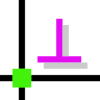

# FreeeCAD, SolveSpace, Blender, LibreCAD, ...vb

## Açık kaynak kodlu çizim programlarına ait Türkçe kaynak oluşturma çalışması.

|  |       |           |                                     |
|:---------------------------------------------------:|:----------------------------------:|:----------------------------------:|:-------------------------------------------------------------:|
| [SolveSpace Eğitimleri](solvespace.html)            | [FreeCAD Eğitimleri](freecad.html) | [Blender Eğitimleri](blender.html) | [LibreCAD Eğitimleri](LibreCAD/LibreCAD_Kisayol_Tuslari.html) |