Title: Blender UVMaping Eğitimi - 1. Bölüm
Date: 2022-06-18 00:00
Category: Blender
Tags: Blender, 3D, CAD, UVMap
Author: Mustafa Halil

## Blender UVMaping Eğitimi - 1. Bölüm

UV Map nedir? Ne işe yarar, UV nasıl açılır, UV Map nasıl  hazırlanır? konularını anlatmak için hazırlamış olduğum Dokümanın 1. bölümünü istifadenize sunuyorum.  
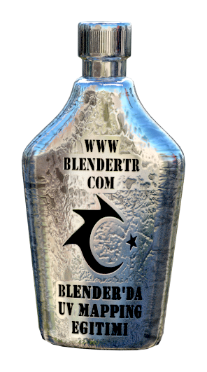

Blender’da UV Mapping Kullanımı isimli anlatımda kullanacağımız Modelimiz, aşağıda gördüğümüz gibi, basit bir Şişe Nesnesidir.  
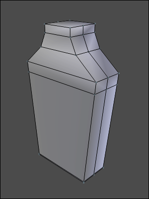  
Öncelikle, Model (Nesne) Gövdesinin UV açılımını  yapmak için, Kenar (Edge) seçim modu ile, kesilecek kenarlarını seçiyoruz.  
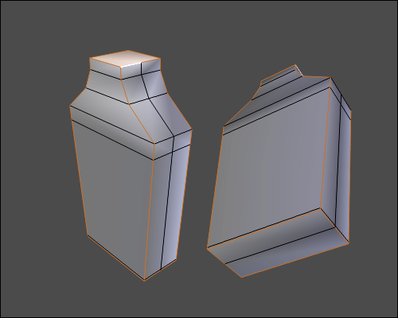  
Seçtiğimiz Kenarların, Kesim Hattı olduğunu belirtmek için **Ctrl+E** ile açılan **Kenarlar (Edges)** isimi menüden **“Mark Seam”** seçeneğini seçin.  
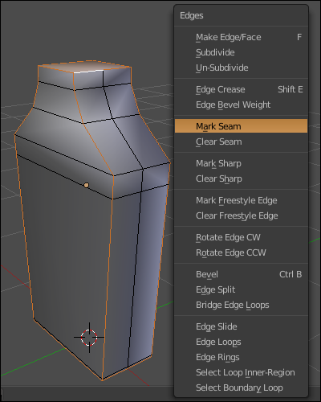  
**A** tuşuna iki kez basarak modelin tüm noktalarının seçildiğinden emin olun. Ardından **U** tuşu ile açılan **UV Mapping** isimli menüden **“Unwrap”** seçeneğini seçerek Modelin UV Açılımını yapıyoruz.  
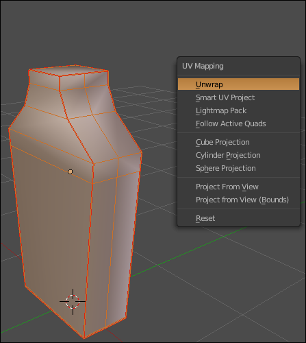  
Açılım dosyasının görüntüsü aşağıdaki gibi olacaktır.  
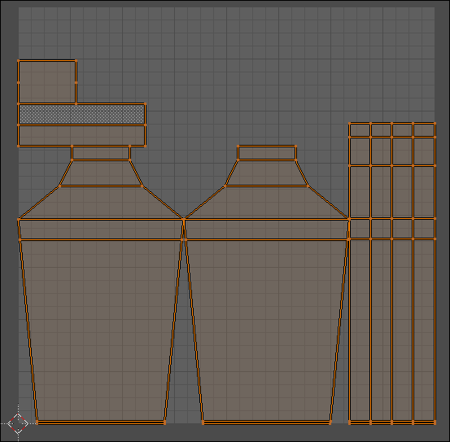  
Sıra geldi UV Image Editor Penceresi içerisinde görüntülenen bu dosyayı düzenlemeye ve istediğimiz hale getirmeye.  
İşleme başlamadan önce, işimizi kolaylaştıracak olan, seçim modu konusunda bir ayrıntıdan bahsetmek istiyorum.  
**3D View** Penceresinde Modelleme yaparken, **Düzenleme (Edit)** Modunda, Seçim modu olarak kullandığımız **Nokta (Vertex), Kenar (Edge)** ve **Yüzey (Face)**'e ilaveten, **UV Image Editor** Penceresi içerisinde **ISLAND (ADA/BLOK)** seçeneği de bulunuyor (**UV Selection and Display Mode** içerisinde). Bu, aslında Modelleme esnasında, nesnenin bir noktası seçilip **CTRL+L** ( ya da sadece **L**) ile bağlantılı tüm noktalarının seçilmesi ile aynı mantık, sadece tuş yerine ilave buton eklenmiş.  
Ayrıca, 3D Penceresi içerisinde Nesnenin Seçili Yüzey, Kenar veya Noktasının, UV Açılımında hangi Yüzey, Kenar veya Noktaya denk geldiğini görmek için, **Keep UV and Edit Mode Mesh Selection in Sync** butonunu kullanabiliriz.  
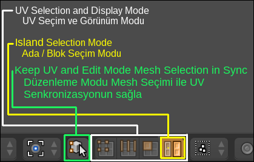  
Bu senkronizasyon butonu sayesinde, açılımı yapılmış UV parçalarının, Nesnenin (Modelin) hangi yüzeyine ait olduğunu görüntüleyerek doğru bir yerleşim yapmamız sağlanacaktır. **3D View** ekranında ya da **UV Image Editor** ekranında bir yüzey seçilirse, seçili yüzey her iki pencerede de seçili hale gelecektir.  
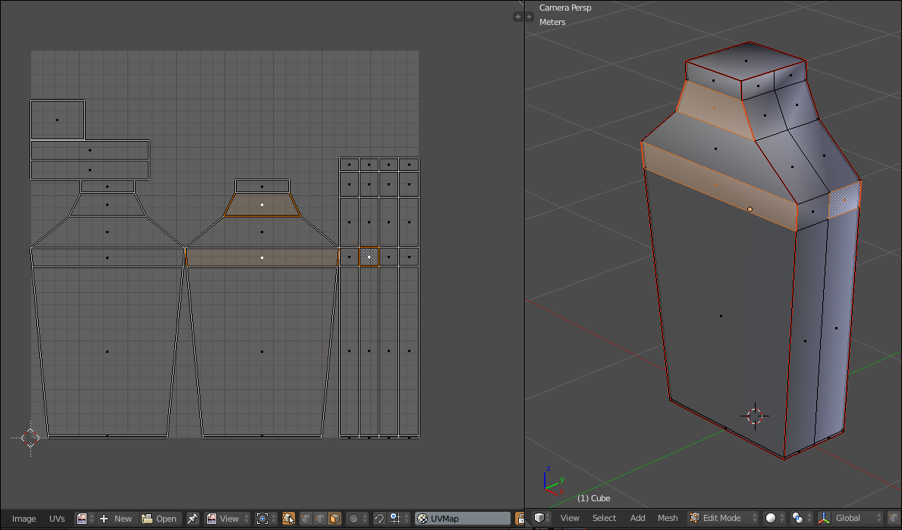  
UV açılımı yapılmış parçaların tümünü bir kenara taşıyalım.  
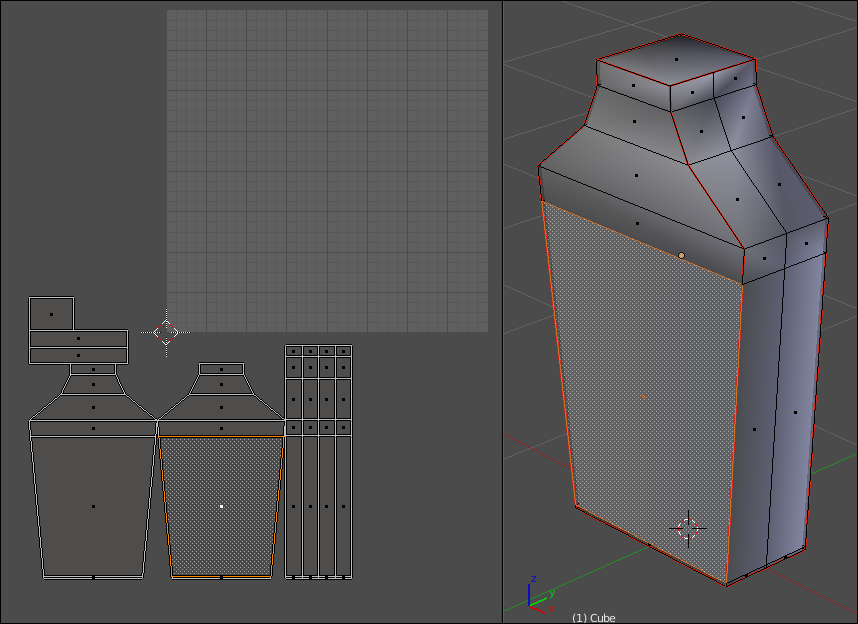  
**3D View** Penceresinde, nesnenin ön kısmındaki yüzeylerden birini seçerek, UV açılımında hangi parçanın Ön Kısma ait olduğunu tespit edip o Ada’yı (Bloğu) ayrı bir yere konumlandıralım.  
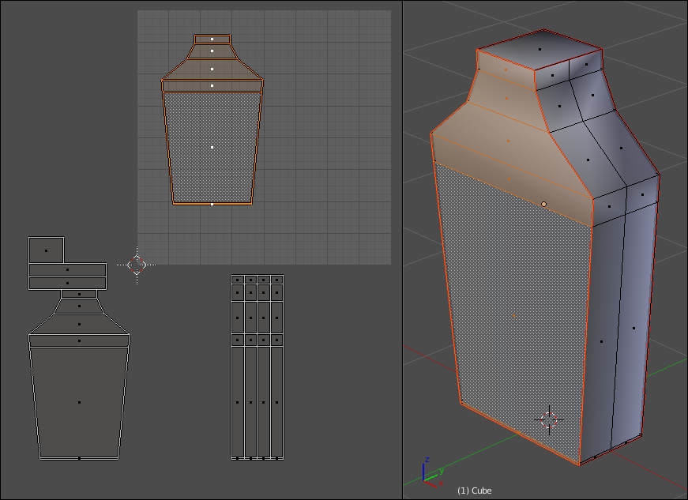  
Bu işlemi her bir UV Parçası/Bloğu doğru yere gelinceye kadar tekrar edelim. Böylece, nesnenin her bir kenarına, doğru yüzeyi denk getirmiş olacağız. UV parçalarının tamamını seçip, Ekranın içine taşıyalım, Ölçek büyük ise **S** tuşu ile, görüntüye sığacak şekilde küçültelim.  
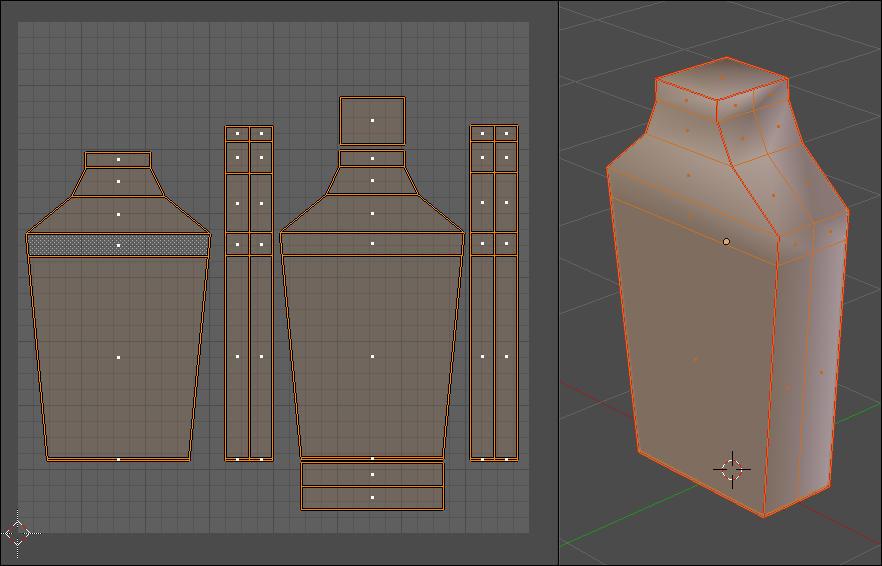  
Şişenin Kapağını da görüntüye getirip aynı işlemleri onun için de uygulayalım.  
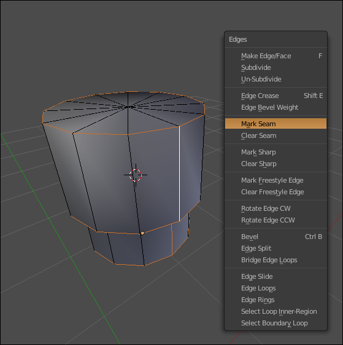  
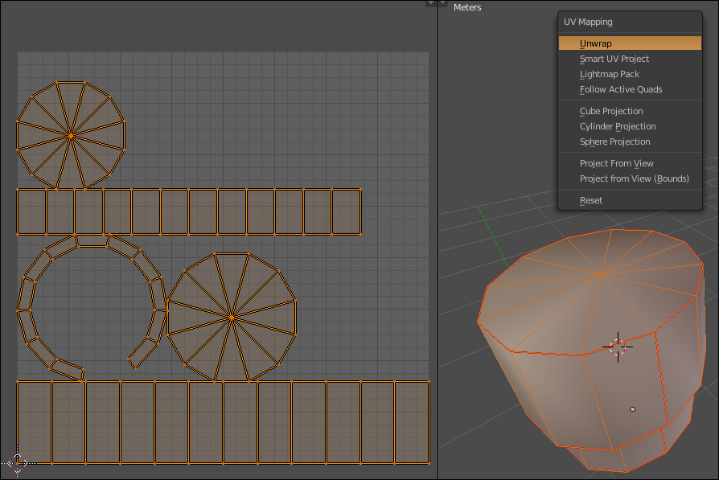  
Şişe ve Kapak Ayrı iki nesne olduğu için, UV açılımları da ayrı ayrı gösteriliyor. Şişe ve Kapak Açılımlarını aynı dosya içerisine taşımak için, nesneleri birleştirmek gerekir. Bunu da, iki nesneyi de seçerek **CTRL+J** tuşlarına basarak (nesneleri ve UV açılımlarını) gerçekleştirebiliriz. Kapağın UV açılımı ile şişenin UV açılımının birbiri içine girip karışması istenmiyorsa, **S** tuşu ile UV açılımı küçültülüp ekranın uygun bir noktasına konumlanabilir.  
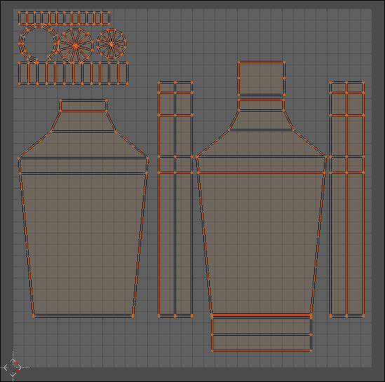  
UV açılımlarını oluşturup birleştirdikten sonra sıra geldi, bu açılım dosyasını bir resim çıktısı olarak dışarı aktarmaya ve **GIMP, Photoshop,...vb** programlar ile renklendirme, yazı yazma, logo oluşturma ya da giydirme,...vb düzenlemeleri yapmaya.  
UV Açılımını, resim formatında dışarı aktarmak için, **3D View** ekranında tüm yüzeylerin seçili olduğundan emin olun ve **UV Image Editor** Pencere başlığındaki **“UVs Menüsünden, Export UV Layout”** Seçeneğini seçin. Uygun bir konum seçip UV açılımını kaydedin ve İstediğiniz bir resim düzenleme programı ile bu dosyayı açın.  
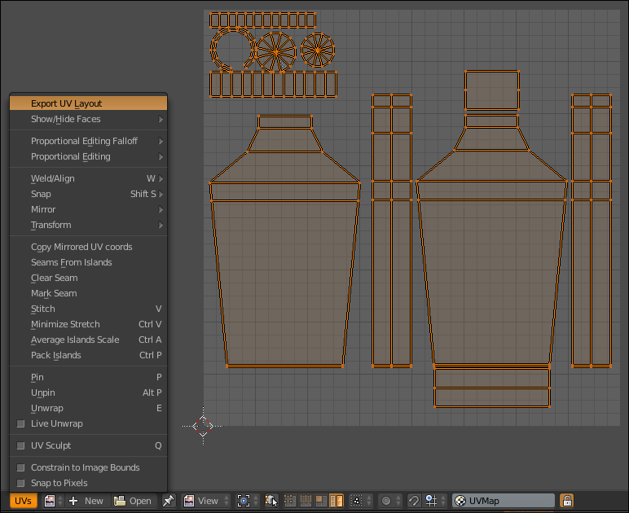  
Dosyanın, içerik olarak telkafes (wire) görünümlü ve şeffaf arkaplanlı, PNG uzantılı olduğunu göreceksiniz.  
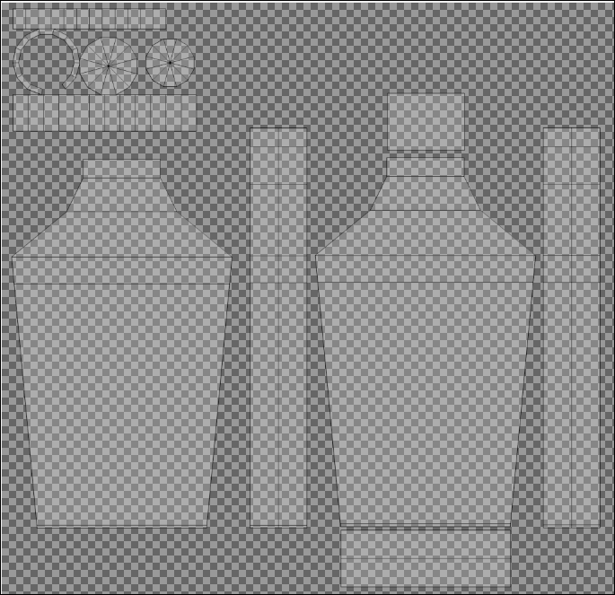  
Bu Telkafes görünüm, oluşturacağımız doku (texture) çalışmasının, modelin (nesnenin) doğru konumuna aktarılmasını sağlamak amacıyla referans oluşturacaktır. Örneğin, Şişenin sağ yan yüzeyine **“BLENDER”** yazmak istiyorsak, UV çıktı dosyasında ilgili 
yere bu yazıyı yazmamız gerekir. Çalışmamız bittikten sonra oluşturduğumuz Doku (Texture) içerisinde referans çizgilerinin görünmesini istemeyeceğimiz için telkafes görünümünün bulunduğu katmanı (layer’ı) silerek ya da gizlenerek çalışmayı kaydetmemiz gerekir, o nedenle ilk yapılacak iş, dosyayı açar açmaz, düzenlemeye başlamadan önce, hemen yeni bir Katman (Layer) oluşturmak olmalıdır.  
Ben, aşağıda gördüğünüz örnek bir çalışma hazırladım. Renk, Yazı ve Simge yerleşimini doğru yaptı isem, bu çalışmayı, Blender'a aktarıp, nesneye giydirdiğimde (atadığımda) Şişe Sarı renkli, Kapak ise Kırmızı renkli görünmeli.  
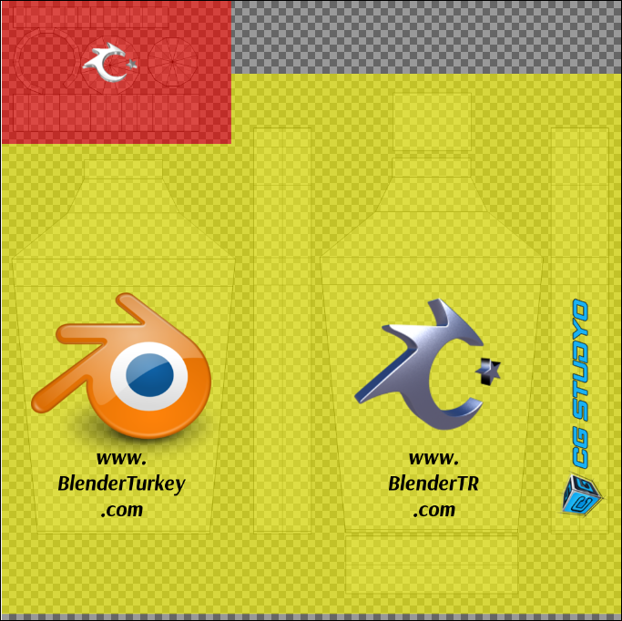  
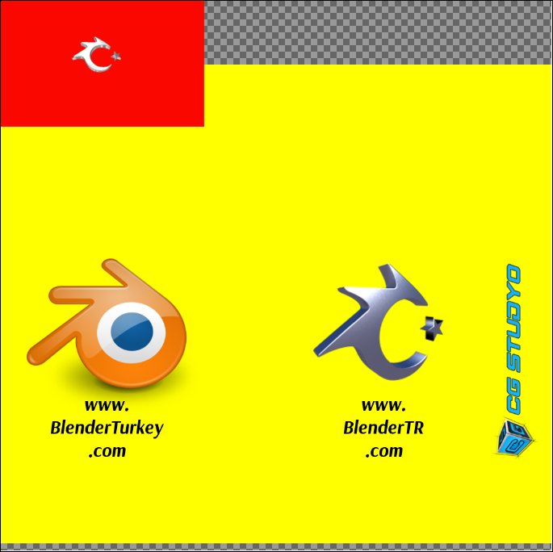  
Şişenin Ön yüzünde BlenderTR Simgesi ve web adresi , sağ yan kenarında CG Studyo Simge ve yazısı, Arka yüzünde Blender Simgesi ve BlenderTurkey web adresi, kapağın üst kısmında, BlenderTR Simgesi görünmeli.  
Blender'a geçip, hazırladığımız resim dosyasını, Modele (Nesneye) giydirelim (atayalım).  
Cycles Render Motoru kullanacağım için ona uygun ayarlamaları yapacağım, benzer ayarları, kullanacağınız render motoruna bağlı olarak kendiniz yapabilirsiniz.  
Aşağıda, Cycles Render moturu için Node Editor'de basitçe yaptığım Doku (texture) giydirme (atama) ayarlarını görebilirsiniz.  
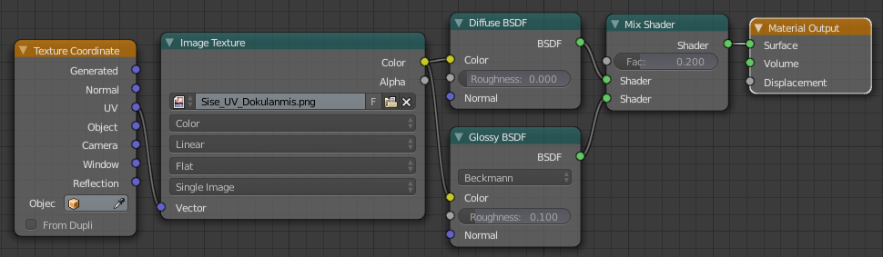  
Modele, Subsufr Modifier uygulayarak daha yumuşak ve güzel bir görüntü kazandırıp Render görüntüsü alalım.  
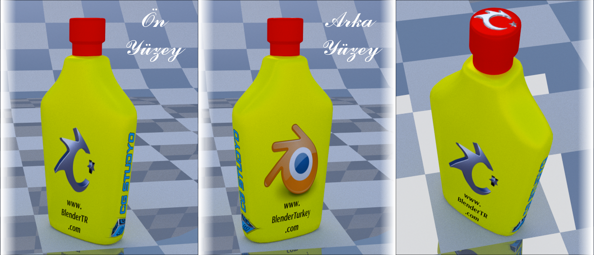  
Bu dersi hazırlarken faydalandığım kaynak ; [Darrin Lile](https://www.youtube.com/watch?v=f2-FfB9kRmE)

[Blender UVMaping Eğitimi - 2. Bölüme Git >](blender-uvmaping-egitimi-2-bolum.html) 
