Title: Blender UVMaping Eğitimi - 2. Bölüm
Date: 2022-06-18 00:00
Category: Blender
Tags: Blender, 3D, CAD, UVMap
Author: Mustafa Halil

## Blender UVMaping Eğitimi - 2. Bölüm

UV Map nedir? Ne işe yarar, UV nasıl açılır, UV Map nasıl  hazırlanır? konularını anlatmak için hazırlamış olduğum Dokümanın 2. bölümünü istifadenize sunuyorum.  
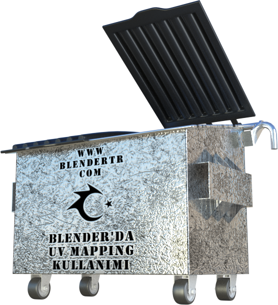  

Bu Dersimizde, Modellemiş olduğum Çöp Konteynerini kullanarak UV Mapping konusuna devam edeceğim.  
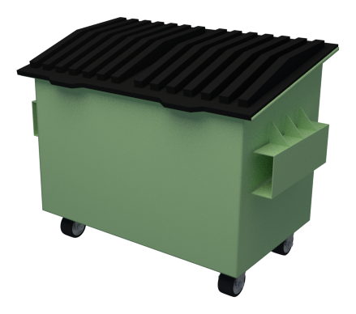  
UV açma işlemine başlamadan önce, bildiğiniz gibi, modelimizi seçiyor ve rahat çalışabilmek adına, seçili model parçasının dışındaki tüm parçaları **“Shift+H”** tuş kombinasyonu ile gizliyoruz. Eğer UV’sini açmak istediğiniz modelin her bir parçası zaten ayrı ayrı ise, bu durumda, seçim sonrası, **Nümerik Tuş Takımında bulunan “/”** tuşunu kullanıyoruz.
 Konteyner gövdesi dışındaki tüm nesneler gizlendiğine göre çalışmaya **“TAB”** tuşuna basıp, **Düzenleme (Edit) Moduna** girerek başlayabiliriz.  
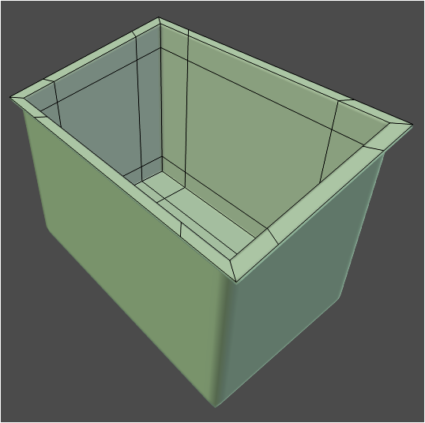  
**Kenar Seçim Moduna** geçerek Modelin, kesmek istediğimiz kenarlarını, **“Shift”** Tuşuna basılı tutarak seçiyoruz. Birbirini takip eden kenar çizgilerini hızlı bir şekilde seçmek için
 **“Alt+Shift”** tuşları basılı iken seçim yapmalıyız.  
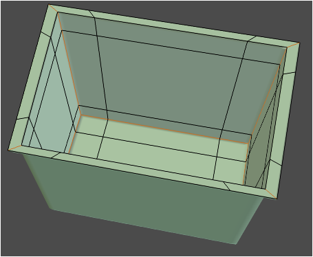  
Alt Taban ve Yan Köşe Noktalarına ait tüm kenarları Seçtikten sonra, seçili kenarların **Kesim Hattı** olduğunu ayarlamak için **“CTRL + E”** ile açılan **“Kenarlar”** (Edges) Menüsünde **“Mark Seam”** seçeneğini seçiyoruz. Bu işlemden sonra işaretlenmiş olan kenarların renginin koyulaştığını göreceksiniz. (bu renk, kullandığınız Temaya göre
 değişebilir)  
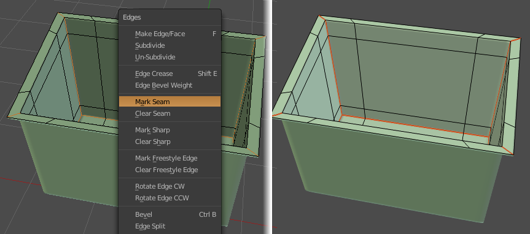  
Sıra geldi modeli UV Açılımını tamamlamaya. **“A”** ile modelin tümünü (nokta, kenar veya yüzeyini) seçin. **“U”** ile açılan **“UV Mapping”** menüsünden **“unwrap”** seçeneğini seçin. Böylece modelin (Çöp Konteynerinin Gövdesinin) UV açılımını tamamladık.  
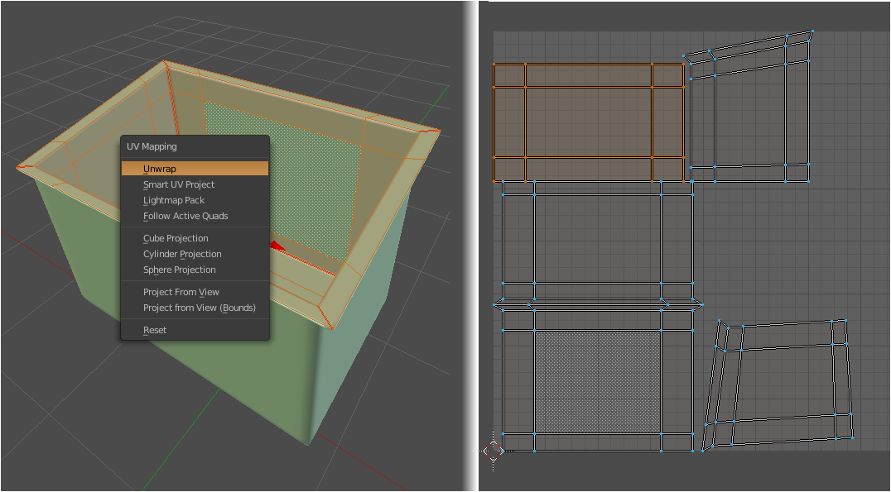  
Gövde ile işim bitti. Sahnedeki diğer modellerin  görünmesini (gizliliklerinin giderilmesini) istediğim için **Nümerik tuş takımından “/”** tuşuna basıyorum.  
Benzer bir işlemi Kapak Modeline de uygulayacağım ancak Kapak kısmı fazla sayıda girinti ve çıkıntıdan oluştuğu için kesilmesini istediğim tüm kenarları tek tek seçip 
işaretlemeyeceğim. Zamandan kazanmak ve Uygun bir UV açılımını benim 
için Blender’ın kendisinin yapmasını sağlamak adına, Kapak modelini seçip **“TAB”** ile **Düzenleme (Edit) Moduna** giriyorum. **“A”** ile modelin tümünü (nokta, kenar veya yüzeyini) seçin. **“U”** ile açılan **“UV Mapping”** menüsünden **“Smart UV Project”** seçeneğini seçin. Böylece modelin (Kapağın) UV açılımını tamamladık.  
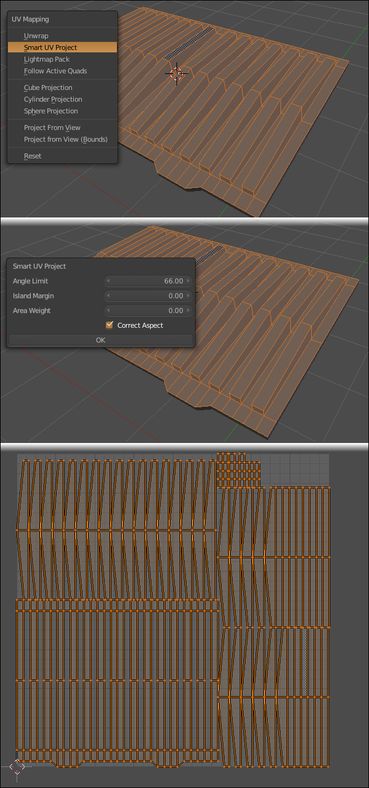  
Model Parçalarına ait UV açılımlarını tamamladığımıza göre, doku giydirme ve ölçekleme ayarlarına başlayabiliriz.  
**“TAB”** ile Düzenleme modundan çıkıp **“/”** ile kapak dışındaki model veya model parçalarının görüntülenmesini sağlıyorum. (Aynı Mesh içerisindeki gizlenmiş kısımları 
görüntüye getirmek için ise **“ALT + H”** kısayol tuşunu kullanmalıyız.) Tekrar Konteyner gövdesini seçip **“TAB”** ile **düzenleme moduna** giriyorum.  
**UV/Image Editor Penceresi** içerisinde, Modelin UV açılımını görüyorum ancak arka planında bir resim dosyası görmüyorum. Arka plana, Blender’ın içerisindeki hazır resimlerden birini atamak için **UV/Image Editor Pencere Başlığındaki “New”** Butonuna tıklıyor, ardından açılan panelden **“Generated Type”** Seçeneğini **“UV Grid”** olarak ayarlıyorum. (oluşacak resmi Materyal atama esnasında kullanacağımız için karışıklık olmaması amacıyla **“Name”** Kısmına bir isim (örneğin “Izgara” ) yazabiliriz. Çözünürlük seçimini, Modelinizi büyüklüğüne ya da Renderda görmek istediğiniz haline göre ayarlayabilirsiniz.)  
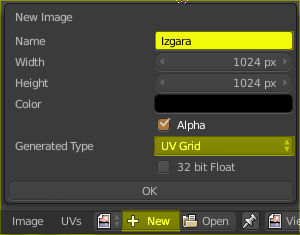  
UV Açılımının arkasına, Blender tarafından aşağıda resimde gördüğünüz gibi bir resim dosyası oluşturulup yerleştirilmiş olmalı.  
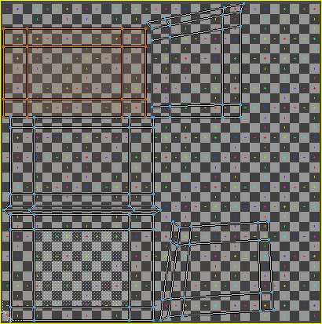  
Oluşan arkaplan resmi ile UV açılımını ( noktaları, kenarları ve yüzeyleri daha net görerek) ayırdetmek ve daha rahat çalışmak için **UV/Image Editor** içerisinde **“N”** ile açılan **“Özellikler”** Panelindeki **“Stretch”** Seçeneğini işaretliyoruz. Böylece, UV açılımına ait parçalar (Adalar) mavi renk ile kaplanıyor.  
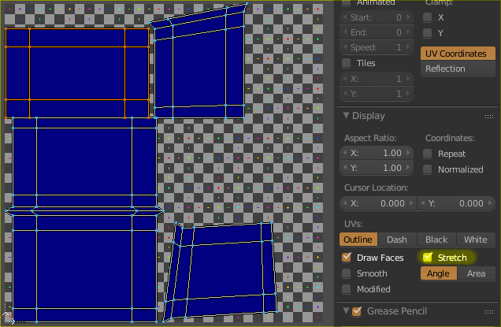  
Arkaplana eklediğimiz resim dosyasını, Konteryer gövdesine giydirmek (atamak) için **Node Editor Penceresine** geçip, yeni bir materyal oluşturuyoruz. Şuan sadece renk bilgisine  sahip bir **“Diffuse Shader”** Mevcut. Materyal üzerinde yapacağımız değişiklikleri anlık olarak görmek için 3D View Pencere başlığındaki **“Viewport Shading”** açılır menüsünden **“Texture”** seçeneğini seçiyoruz. Bunun kısayol tuşu ise **“ALT+Z” dir.**  
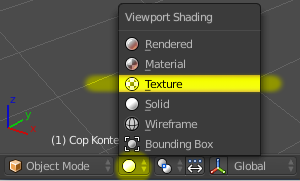  
**Node Editor** Penceresinde, **“SHIFT + A“** ile açılan **“EKLE” (Add)** menüsünden, **“Texture>Image Texture”** yolunu seçerek yeni bir panel ekliyoruz. **Image Texture** Panelindeki açılır menüden, Blender tarafından oluşturulan **Izgara** Resmini seçtiğimiz an, 3D View ekranında Konteynerimize resmin (doku) giydirilmiş olduğunu görüyoruz. Materyal ayarlarının doğru olması, ileride bize sorun oluşturmaması adına **Image Texture Color** Çıkışı ile **Diffuse Sahder Color** Girişini bağlıyoruz.  
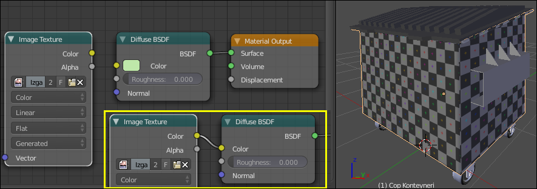  
Blender’ın Oluşturmuş olduğu ve ismini **IZGARA** olarak değiştirdiğimiz resim dosyasına dikkat edersek, tamamen karelerden oluşan (bir Satranç Tahtası ya da Damalı Bayrak deseni)  ve her bir karenin ortasında farklı renkte Artı  işareti (**+**) bulunan bir dosya olduğunu görüyoruz.  
Eğer 3D View ekranında, Konteynere üzerindeki desenin kare değil de dikdörtgen şeklinde olduğunu görüyorsak, bu sıkıntıyı gidermek için, UV açılımına ait parçaları (Island [Ada/Blok]) tek tek ya da sadece bozuk desene ait parçayı seçerek **“S”** tuşu ile ölçeklememiz gerekir.  
Örnek olarak, Konteynerin ön yüzeyine ait parçayı X ekseninde ölçekleyerek bozdum. Eğer UV açılımı buna benzer şekilde karşımıza çıkmış olsaydı nasıl düzeltirdik onu inceleyelim.  
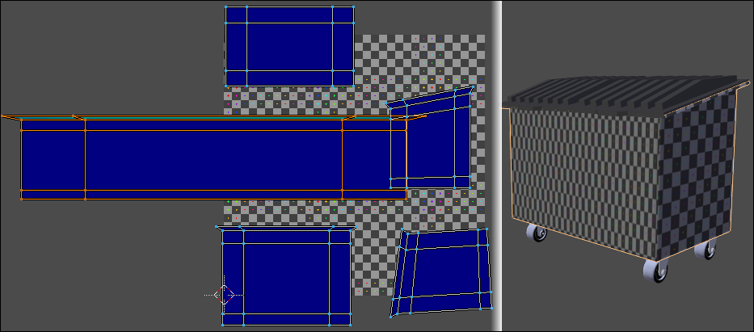  
Bu sorunu gidermek için Ön yüzeye ait parçayı seçerek **X** ekseninde ölçekleyerek (daraltarak) ya da **Y** Ekseninde ölçekleyerek (genişleterek) düzelme yoluna gidiyoruz. Doğru ölçeği bulmak için **3D View ekranında** anlık olarak değişen görüntüden yararlanıyoruz.  
Bozuk görünen parçaları yaklaşık olarak ölçekledikten sonra, tüm UV Açılımlarını aynı **ORTALAMA ADA (BLOK) ÖLÇEĞİNE** getirmek için, **“A”** ile tüm UV Açılım parçaları seçilir ve **“CTRL + A”** ile ya da **“UVs”** menüsünden **“Average Island Scale”** seçeneği seçilerek işlem tamamlanır.  
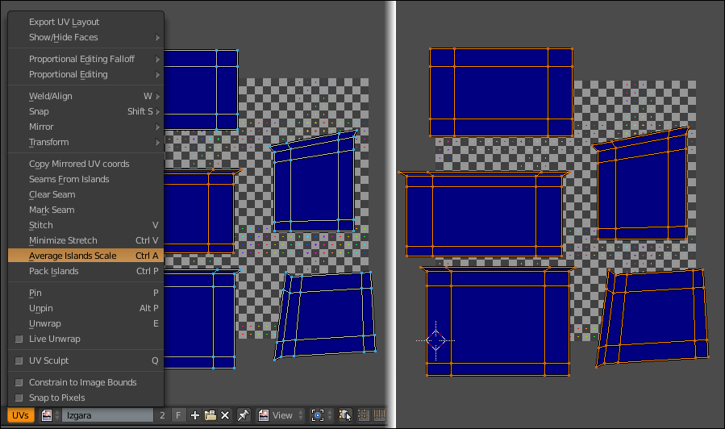  
İşlem sonrası, tüm parçaların ortalama olarak aynı ölçeğe geldiğini görüyoruz ancak parçalar, **IZGARA** resminin dışına taşmış durumda. UV açılımına ait parçaları tek tek 
seçip ölçeğini bozmadan, çevirerek - taşıyarak, Izgara resminin içine uygun noktaya yerleştirebileceğimiz gibi bu işlemi Blender’ın otomatik yapmasını da sağlayabiliriz.  
Tüm parçalar seçili iken, **“CTRL + P”** ile ya da **“UVs”** menüsünden **“Pack Islands”** seçeneği ile, UV parçalarının resmin içine sığdırılması sağlanmış olur.  
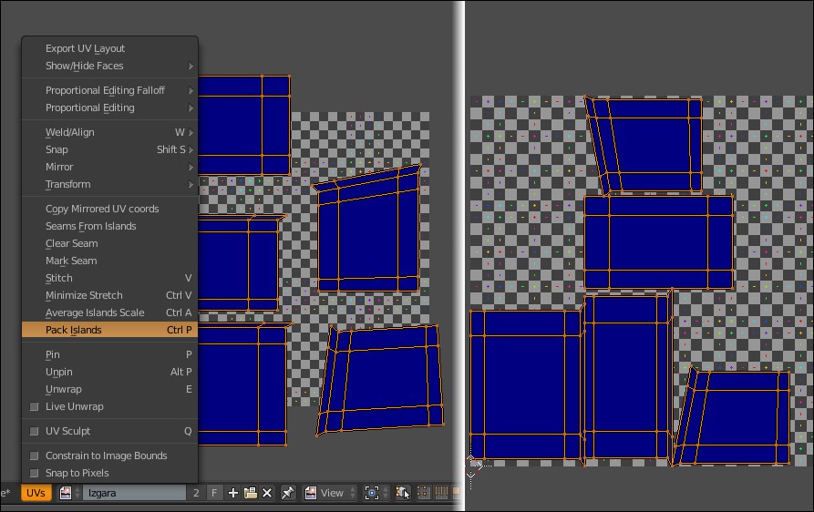  
İşlem sonrası Ekran görüntüsü alırsak aşağıdaki şekle benzer bir çıktı elde ederiz.  
Dikkat edilirse, birbirini takip eden yüzeylerin  ortak kenarlarında, desen düzeni sağlanamamış görünüyor. Bu da, sonucun  gerçekçiliğini negatif yönde etkiliyor.  
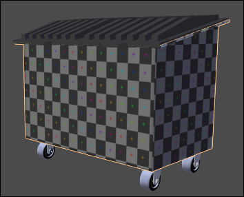  
Bu düzensizliği, UV Image Editörü içerisinde yapacağımız manuel oynamalarla düzeltme yoluna gideceğiz.  
Konteryerın üst kısmındaki dışa kıvrımlı parçanın UV açılımını ayrıca almak istediğim için onun çevre kenarlarını da seçip, **“Mark Seam”** ile bu kenarı da kesim hattı olarak işaretleyerek yeniden **“U > Unwrap”** ile yeni UV Açılımı yapıyorum.  
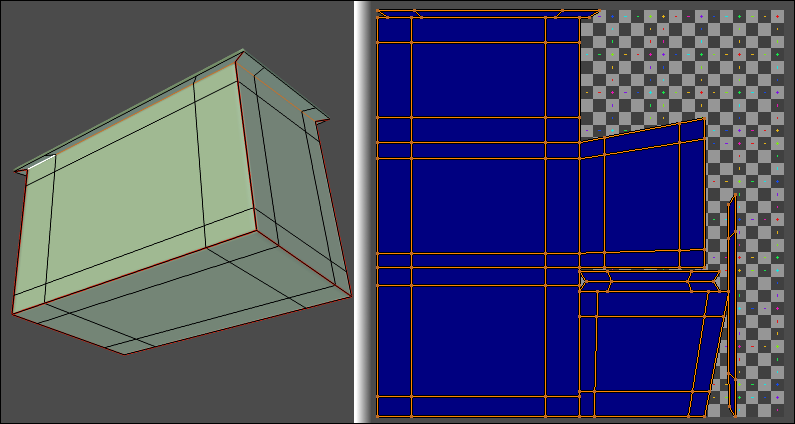  
Bir önceki derste bahsettiğimiz yöntemle (**Keep UV and Edit Mode Mesh Selection in Sync** butonunu kullanarak) açılımı yapılmış UV parçalarının, doğru yerleşimini sağlıyoruz.  
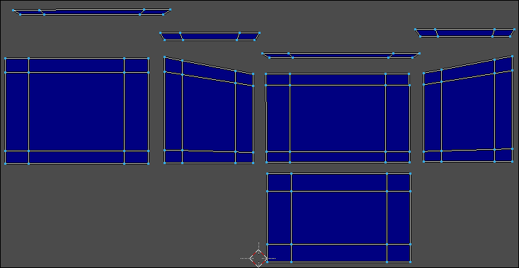  
UV açılımlarında, komşu iki yüzeyin ortak kenarlarını, bir komutla birleştireceğiz. Böylece Desen devamlılığını sağlamış olacağız.  
**Kenar (Edge) Seçim modu** ile, UV açılımındaki parçalardan karşılıklı gelen herhangi bir kenarı seçelim. **Keep UV and Edit Mode Mesh Selection in Sync** butonu aktif ise, bir kenarı seçtiğinizde, aynı kenar, diğer UV parçasında da aktif olacak ve rengi değişecektir.  
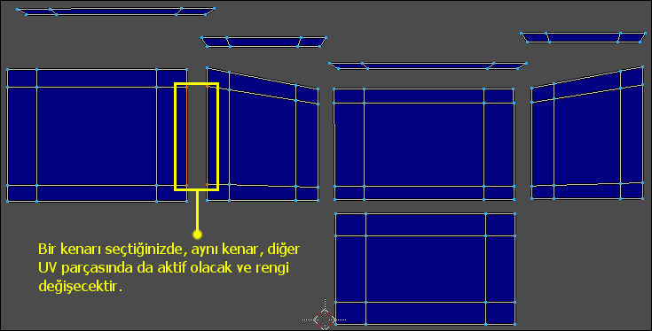  
Eğer Seçtiğiniz kenar, karşısındaki UV parçasının diğer kenarında işaretleniyorsa (Kenar rengi değişiyorsa), UV parçasını çevirerek doğru yöne ayarlayın.  
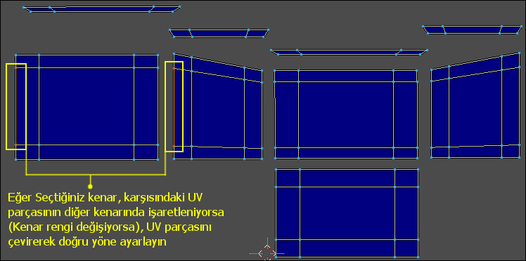  
UV Parçaları doğru yerde ve doğru yönde ise, birleştirmek istediğimiz kenarlardan birini seçerek **“V”** tuşuna basalım ( **“UVs > Stitch”** menü yolunu da kullanabiliriz) ve iki parçanın olası  birleşim önizlemesini görüntüye getirelim.  
Bu durumda, iki parçadan biri yerinde sabit dururken (Mavi renkli), diğer parçanın (telkafes [wire] görünümlü) sabit parçaya doğru hareketlenip yapıştığını görürüz. Hangi parçanın sabit durması, hangisinin hareketlenmesi gerektiği, Limit, Yakalama ayarları, 
Kenar/Nokta Mode Biçimini gibi ayarları, **UV/Image Pencere başlığındaki** Metinleri okuyarak öğrenebiliriz. Birleştirme işlemini, **ENTER** Tuşu ile ya da **Farenin Sol Tuşu** ile onaylayabiliriz.  
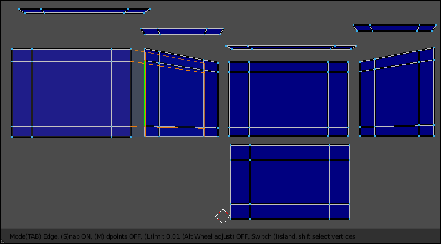  
**TAB** tuşu ile Kenar ya da Nokta Modu arasında geçiş yapılabilir.  
**Mode (TAB) Edge:** Kenar Modu aktifse, seçili kenar, hangi parçada kullanılıyorsa onlar birleştirilir.  
**Mode (TAB) Vertex:** Nokta Modu aktifse, seçili nokta, hangi parçada kullanılıyorsa onlar birleştirilir.  
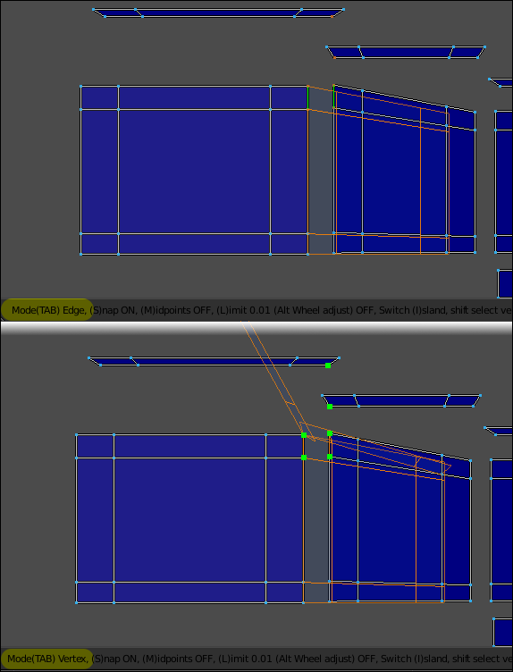  
**S Tuşu ile, [ (S)nap ON / OFF ]** Kenar veya noktaların otomatik yakalanmasının Açık ya da Kapalı olması ayarlanabilir.  
**M Tuşu ile, [ (M)idpoints ON / OFF ]** Birleştirilecek Ada/Blok (Island) parçalarının, Orta noktada birleştirilmesi ayarlanabilir.  
**L Tuşu ile, [ (L)imit 0.01 Alt Wheel Adjust ON / OFF]** Limit mesafesi AÇIK ya da KAPALI olarak ayarlanabilir. Limit mesafesi açıksa, belirtilen değerin altındaki mesafede duran parçalar birleştirilmiyor. **ALT + Fare (Mouse) Tekeri** ile değer değiştirilebilir.  
**I Tuşu ile, [ Switch (I)sland ]** Hangi UV Ada/Blok (Island) parçasının, yerinde sabit kalacağı, hangisinin hareket edeceğini ayarlayabiliriz.  
**Shift Tuşu ile, [ shift select vertices ]** İlave noktaları da seçerek birleştirme işlemine daha fazla parça ekleyebiliriz.  
Şimdi yukarıda anlatılan detaylı bilgilere dikkat ederek UV parçalarını birleştiriyoruz. Tercihen Ön, Arka, Alt ve Yan yüzeylere ait parçaları birleştiriyorum.  
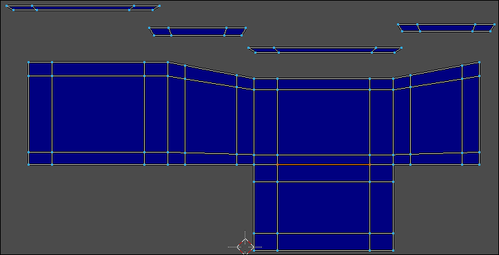  
Ardından, birleştirilmemiş UV parçalarının alt kenarlarını seçerek sıra ile birleştiriyorum. Tüm Parçalar birbiri ile birleştiğine göre bunları **IZGARA** resmini içerisine taşıyabilirim.  
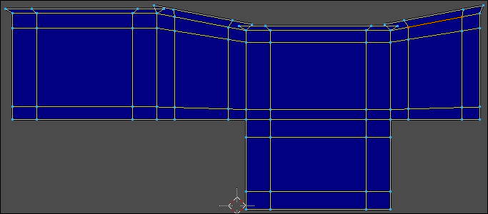  
Taşıma / Döndürme işlemlerini, Blender’a otomatik olarak yaptırmak için **“A”** ile tüm nokta ve kenarları seçiyor ve **“CTRL + P”** tuşuna basıyorum. İşlem tamamlandı.  
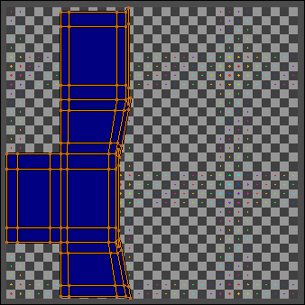  
Modelin Doku (Texture) giydirilmiş görüntüsüne bakacak olursak, Çoğu kenarın ve komşu yüzeylerinin birbirini takip eder şekilde ayarlandığını görebiliriz.  
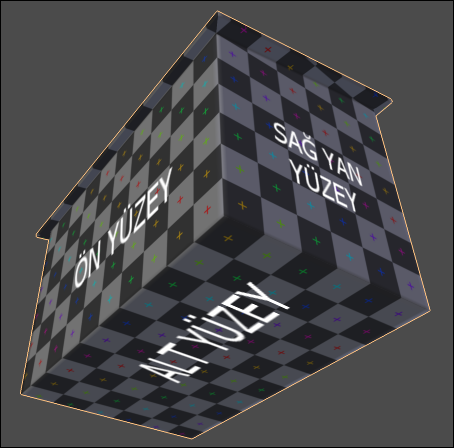  
UV açılımlarını birleştirme işleminde birbirine yapışmış kenarların dışında, birleşmemiş olan ortak kenarlar da mevcut. Bunu, Modeli incelediğimizde de göreceğiz. Bunun temel sebebini, aşağıdaki UV Map açılımını inceleyerek anlayabilirsiniz.  
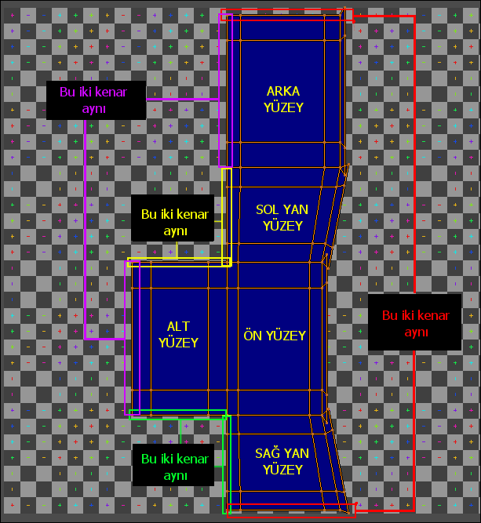  
Bunu düzeltmek için, **UV/Image Editor Penceresi** içerisinde UV açılımlarını (modelin doku giydirilmiş halini **3D View penceresinde** anlık olarak gözlemlerken) uygun konuma taşıyarak ve ölçekleyerek sağlayabiliriz, sanıyorum. Bu ayarı yapmak oldukça zaman kaybetmemizi sağlar. O nedenle, şahsen, Render alacağım Kamera açısına göre, 
görüntüde doku (texture) problemi yoksa, Render’da görünmeyen kısımları düzeltmekle uğraşmıyorum.  
Aşağıdaki Render görüntüsünü incelersek, Ön Yüzeyden Sağ Yan Yüzeye geçişte, kaplamada bir bozulma olmadığını, doğru  bir işlem yaptığımızı görebiliriz.  
  
Umarım Faydalı bir ders olmuştur.  
Dersin hazırlanmasında yararlandığım kaynak; [Darrin Lile](https://www.youtube.com/watch?v=42XCrtxvhyM)

[< Blender UVMaping Eğitimi - 1. Bölüme Git](blender-uvmaping-egitimi-1-bolum)
