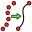

Title: FreeCAD - Curves WB - Curves - 00 - Curves Menü Komutları
Date: 2022-11-08 00:00
Modified: 2025-11-09 22:18
Category: Curves WB - Curves
Tags: FreeCAD, Curves, Workbench, ÇalışmaTezgahı, Curves, Menü
Author: Mustafa Halil

# Curves Workbench - Curves Menü Komutları

## Eğriler Çalışma Tezgahı - EĞRİLER Menüsü Komutları (Curves Workbench - CURVES Menu)

Bu bölümde anlatılacak konular, [wiki.freecadweb.org/Curves_Workbench](https://wiki.freecadweb.org/Curves_Workbench) adresindeki dokümanlar esas alınarak oluşturulacaktır ancak sadece bununla sınırlı kalmayacak. Gerek [FreeCAD Forum sayfasından](https://forum.freecadweb.org/viewtopic.php?f=3&t=22675&sid=cc97e4c6bf97fa86e453c14ddac9d333) gerekse de Youtube'dan öğrendiklerimi sizlere anlatmaya çalışacağım.  
**Curves Workbench (Eğriler Çalışma Tezgahı)**, NURBS eğrileri ve yüzeyleri için bir araç koleksiyonuna dayalı, python tabanlı, harici bir çalışma tezgahıdır.  
Bu bölümde **Eğriler (Curves) menüsü**ne ait komutların detayları incelenmektedir.  
**Not:** Bazı araçlar önceki sürümlerle çalışmayabilir.  

## KOMUTLAR

| ...                                                                                     | ...                                                                                      | ...                                                                                  |
|:---------------------------------------------------------------------------------------:|:----------------------------------------------------------------------------------------:|:------------------------------------------------------------------------------------:|
|  |  |       |
| [Parametric Line]({filename}curves_wb_01_parametric_line.md)                            | [Freehand BSpline]({filename}curves_wb_02_freehand_bspline.md)                           | [Mixed Curve]({filename}curves_wb_03_mixed_curve.md)                                 |
|        |              |       |
| [Curve Extend]({filename}curves_wb_04_curve_extend.md)                                  | [JoinCurve]({filename}curves_wb_05_joincurve.md)                                         | [Split curve]({filename}curves_wb_06_split_curve.md)                                 |
|            |           |       |
| [Discretize]({filename}curves_wb_07_discretize.md)                                      | [Approximate]({filename}curves_wb_08_approximate.md)                                     | [Interpolate]({filename}curves_wb_09_interpolate.md)                                 |
|          |               |  |
| [Blend curve]({filename}curves_wb_10_blend_curve.md)                                    | [Comb plot]({filename}curves_wb_11_comb_plot.md)                                         | [CurveOnSurface]({filename}curves_wb_12_curveonsurface.md)                           |
