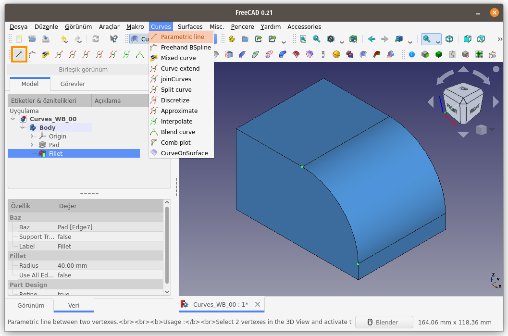
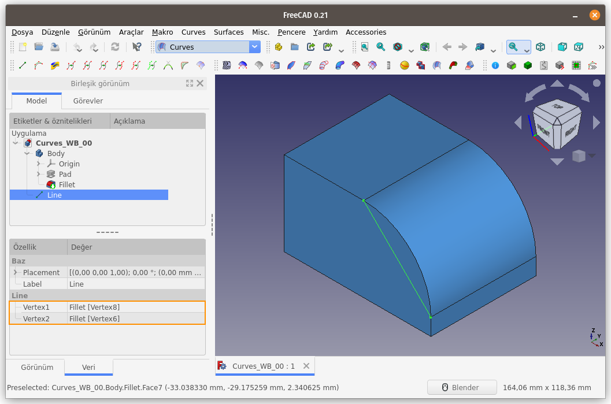
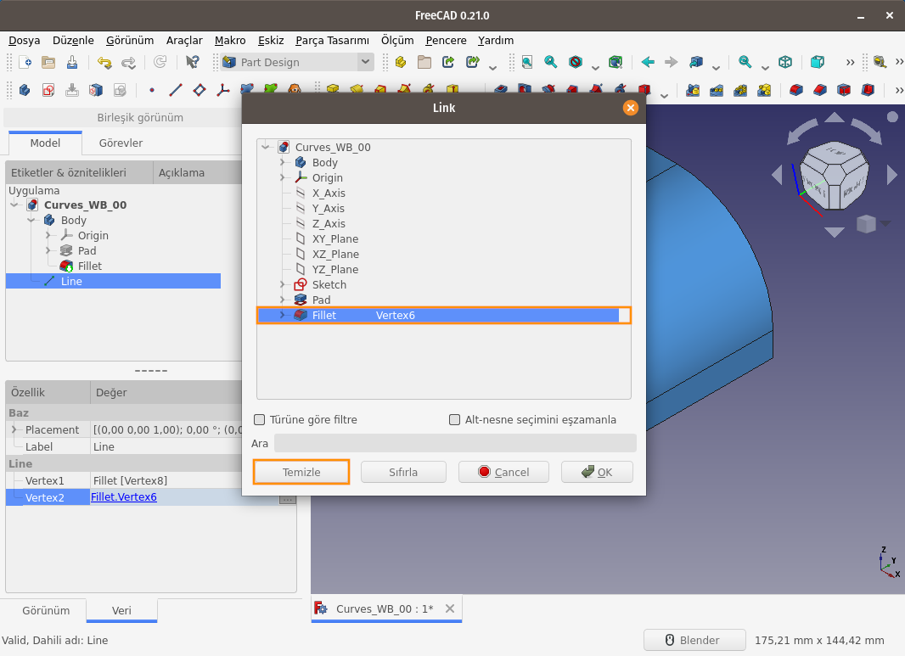
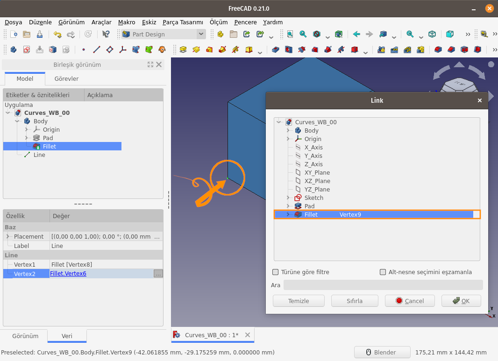
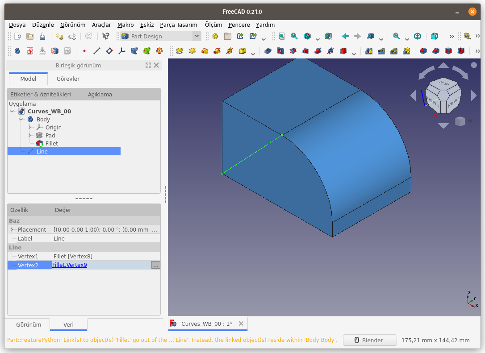

Title: FreeCAD - Curves WB - Curves - 01 - Parametric Line
Date: 2022-11-09 00:00
Category: Curves WB - Curves
Tags: FreeCAD, Curves, Workbench, ÇalışmaTezgahı, Parametric, Line
Author: Mustafa Halil

#  Parametric Line:

**Parametric Line (Parametrik Çizgi)** komutu, seçili <u>iki nokta arasında bir çizgi</u> oluşturur.  

**Kullanım:** Komutu çalıştırmak için aşağıdaki işlemleri sırasıyla uygulayın:

- Öncelikle 3D görünüm ekranında 2 noktayı `CTRL` tuşu yardımı ile seçin
- Curves araç çubuğunda bulunan ilgili düğmeye basın, ya da
- **Curves** menüsündeki **Parametric Line** seçeneğini kullanın.

Görüldüğü üzere, seçili noktaları birbirine bağlayan bir parametrik çizgi oluştu.

Yeni Oluşan Çizgi (Line), iki adet parametreye bağlıdır. Bunlar **Vertex1 (Nokta1)** ve **Vertex2 (Nokta2)**'dir. Bu parametreler değiştirilmek istenirse Çizgi, Unsur Ağacından seçilir ve **Özellikler** kısmına değiştirmek yeterlidir. Örnek olarak **Vertex2 (Nokta2)**’yi değiştirelim. Vertex2'nin yanındaki butona basalım.

Açılan **Link (Bağlantı)** diyalog kutusunda **Vertex2** seçili halde. Öncelikle **Temizle (Clear)** butonuna basıp nokta bilgisini silelim.

Ardından 3D ekrandaki (sahnedeki) nesneye ait noktalardan birini (vertex) seçelim.

Tamam butonuna bastığımızda, Oluşan Parametrik Çizginin değiştiğini, yeni çizginin Nesneye ait **Vertex8** ve **Vertex9** Noktaları arasında oluştuğu görülmektedir.

[<<< Curves Menü Komutlarına Ait Sayfaya Dön]({filename}curves_wb_00_curves_menu.md)
