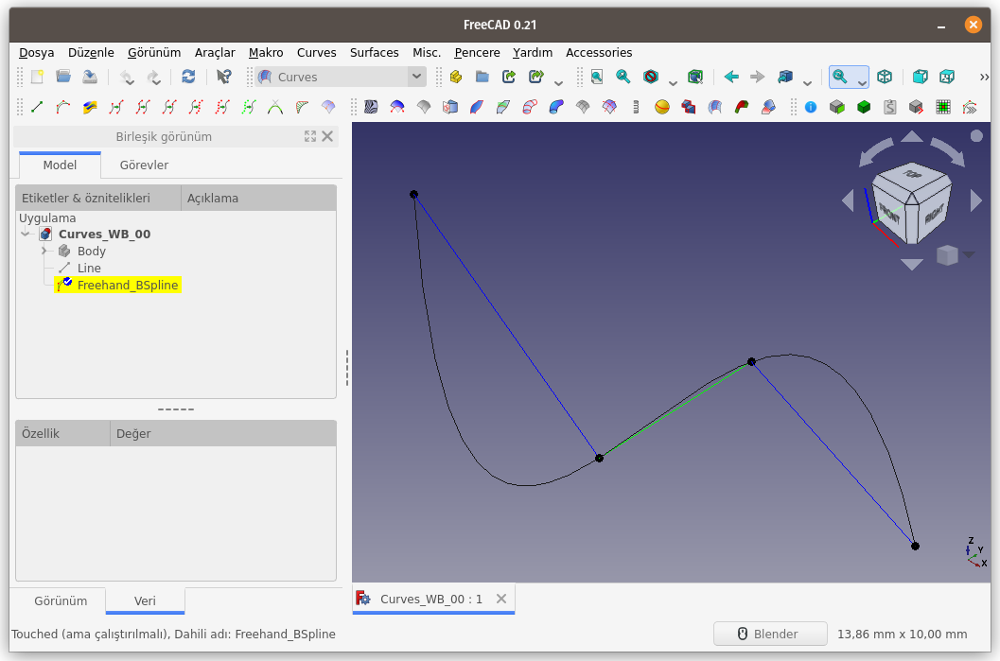
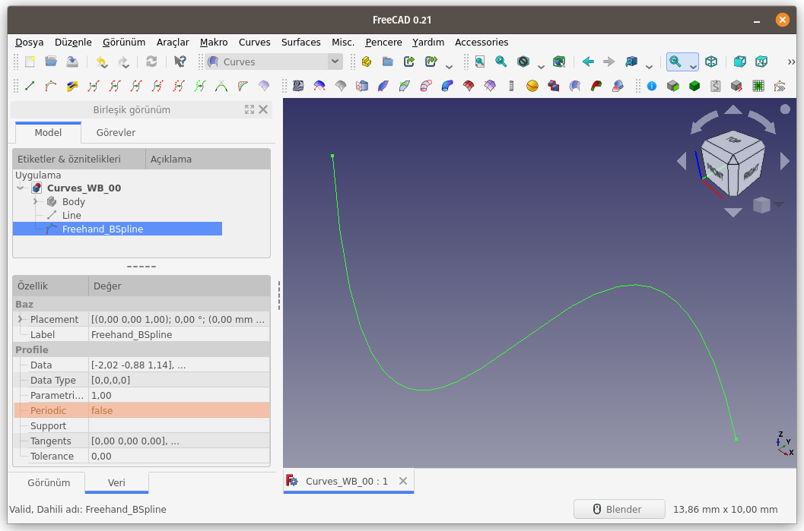

Title: FreeCAD - Curves WB - Curves - 02 - Freehand BSpline
Date: 2022-11-10 00:00
Category: Curves WB - Curves
Tags: FreeCAD, Curves, Workbench, ÇalışmaTezgahı, Freehand, BSpline
Author: Mustafa Halil

#   Freehand BSpline:

**Freehand BSpline** komutu, <u>Serbest çizimli bir B-Spline eğrisi</u> oluşturur.  

**Kullanım:** Komutu çalıştırmak için aşağıdaki işlemleri sırasıyla uygulayın:

- Curves araç çubuğunda bulunan ilgili düğmeye basın, ya da
- **Curves** menüsündeki **Freehand BSpline** seçeneğini kullanın.

**Freehand BSpline** butonuna basıldığında 3D görünüm ekranına (sahneye) <u>düzenleme modunda</u>, bir eğri eklenir. Eğrinin, düzenleme modunda olduğunu, Unsur ağacına bakarak anlayabiliriz. Aşağıdaki resimde göreceğiniz gibi hem unsur agacındaki ögenin arkaplanı sarı renkli görünür ayrıca simgenin üzerinde kontrol (check) işareti olur hemde 3D görünüm ekranında eğrinin kontrol noktaları görüntülenir. Bu noktalar ve kenarlar seçilerek fare yardımıyla hareket ettirilebilir.  

**Seçenekler:**  
Komut sırasında özel bir düzenleme modu aktiftir ve klavye tuşları ve fare tıklamaları ile kontrol edilebilen birkaç eylem ve davranış vardır.  

- Bir noktayı veya kılavuz çizgiyi hareket ettirmek için (kılavuz çizgiler noktalar arasındaki düz çizgilerdir) nokta ya da çizginin üzerinde farenin sol düğmesini basılı tutun ve fareyi hareket ettirin.
- `A` tuşu, tüm noktaları ve kılavuz çizgileri seçer veya seçimini kaldırır. **Pop!_OS** işletim sisteminde , FreeCAD 0.20 ve 0.21 sürümlerinde A tuşu bu işlemi gerçekleştirmedi. Bunun için `ALT` + `A` tuş kombinasyonunu kullanmam gerekti.
- `I` (Isparta’nın I’sı) ya da `i` tuşu, seçilen kılavuz çizgiye bir nokta ekler. Yeni nokta seçili hale gelir. Malumunuz, İngilizce dilinde büyük `İ` ve küçük `ı` harfleri yoktur. Bu nedenle klavyenin `CapsLock` tuşu aktif ise bu komutu çalıştırmak istediğinizde `I` tuşuna, `CapsLock` tuşu aktif değil ise `i` tuşuna basmalısınız.
- `T` tuşu, seçilen noktaların veya kılavuz çizgilerin oluşturduğu BSpline eğrisini, görünüm yönüne bağlı olarak, kılavuz çizgiye teğet hale getirir (bir nevi, eğriyi, kılavuz çizginin arkasına saklar) veya teğet halini iptal eder. Sahneye olan bakış açısı değiştirilerek komut çalıştırılırsa Bspline eğrisi her seferinde farklı hal alacaktır.
- `P` tuşu, seçili nesneleri bakış açıına göre doğrusal olarak hizalar. Seçili nesnelerden kasıt, noktalar ya da kılavuz çizgilerdir. Noktalar ya da kılavuz çizgiler seçilir ve P tuşuna basılırsa, tüm seçili nesneler, sanki düz bir ipin üzerine dizilmiş gibi doğrusal olarak hizalanır.
- `S` tuşu, bir noktayı başka bir B-spline eğrisine ait noktaya tutturmak/birleştirmek için kullanılabilir. Düzenlenmekte olan B-spline eğrisinin bir noktası seçiliyken CTRL tuşuna basılı tutun ve hedef noktasını seçime ekleyin, ardından S tuşuna basın. İşlem sonucunda seçili noktalar birbirine kenetlenir. Hedef nokta, farklı bir eğrinin uç noktası olabileceği gibi, BSPline eğrisinin kendisi de olabilir. İşlem, düzenleme modunda olan Bspline eğrisi ile düzenleme modu dışında olan BSpline eğrisi arasında gerçekleşir. Bu komut çalıştırıldığında gerçekleşen işlem iki sonuç doğurur.
1. Düzenleme modunda olan Bspline eğrisinin bir noktası ile düzenleme modu dışında olan Bspline eğrisinin uç noktası seçilmişse tutturulan / birleştirilen nokta hareket ettirilemez. Bunun sebebi,  Bspline eğrilerinden birinin düzenleme modu dışında olmasıdır.
2. Düzenleme modunda olan Bspline eğrisinin bir noktası ile düzenleme modu dışında olan Bspline eğrisi (uş noktaları hariç)  seçilmişse tutturulan / birleştirilen nokta, sadece eğri güzergahında  (üzerinde) hareket edebilir. Tutturulan/Birleştirilen Noktaları ayırmak için,  birleşen nokta çiftini seçin ve tekrar S tuşuna basın. Düzenlenmekte  olan B-spline'a ait nokta seçili kalır ve artık hareket ettirilebilir.
- `L` tuşu, doğrusal enterpolasyonu ayarlar veya geri alır. BSpline eğrisini, görünüm yönünden bağımsız olarak, seçili kılavuz çizgi doğrultusunda ayarlar ya da geri alır. Eğri, Kılavuz çizgi ile tüm yönlerden (Ön, yan ve üst görünümde) üst üste çakışır.
- `X`, `Y` veya `Z` tuşları, Blender programında olduğu gibi, sürüklenen nesnenin (nokta ya da kılavuz çizginin) hareketini kısıtlamak için kullanılabilir. Nesneyi sürüklerken kısıtlamak istediğiniz eksen tuşuna basın. Kısıtlamayı devre dışı bırakmak için aynı tuşa tekrar basın.
- `Q` tuşu komutu sonlandırır ve düzenleme modundan çıkar.

**Özellikler:**  
Özellikler paneli **Veri** Sekmesinde, aşağıdaki özellikler değiştirilebilir;  

- **Parametrization Factor (Parametrelendirme Faktörü)**:
  Eğrinin oluşturulması için belirlenen (kod içinde kullanılan) parametre faktörüdür (katsayısıdır). Sayı değeri arttıkça, eğrinin oluşturulması için gerekli formül değişiyor ve eğri daha farklı hal alıyor. Nokta ve Kenarlar hareket ettirildiğinde eğri çok daha büyük eğrisellik yarıçapına sahip oluyor.
- **Periodic (Periyodik)**: Bu seçenek, **true** ve **false** değerlerini alabilir. Eğer **true** değeri ayarlanırsa, oluşturulan eğrinin uçları birleştirilerek kapalı bir eğri elde edilir.

[<<< Curves Menü Komutlarına Ait Sayfaya Dön]({filename}curves_wb_00_curves_menu.md)
