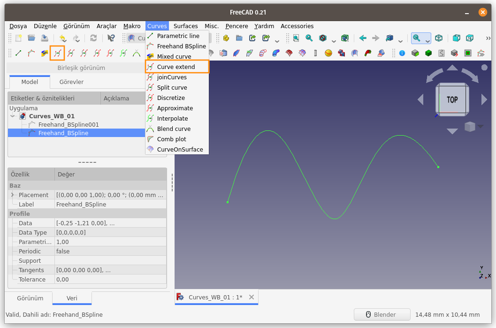
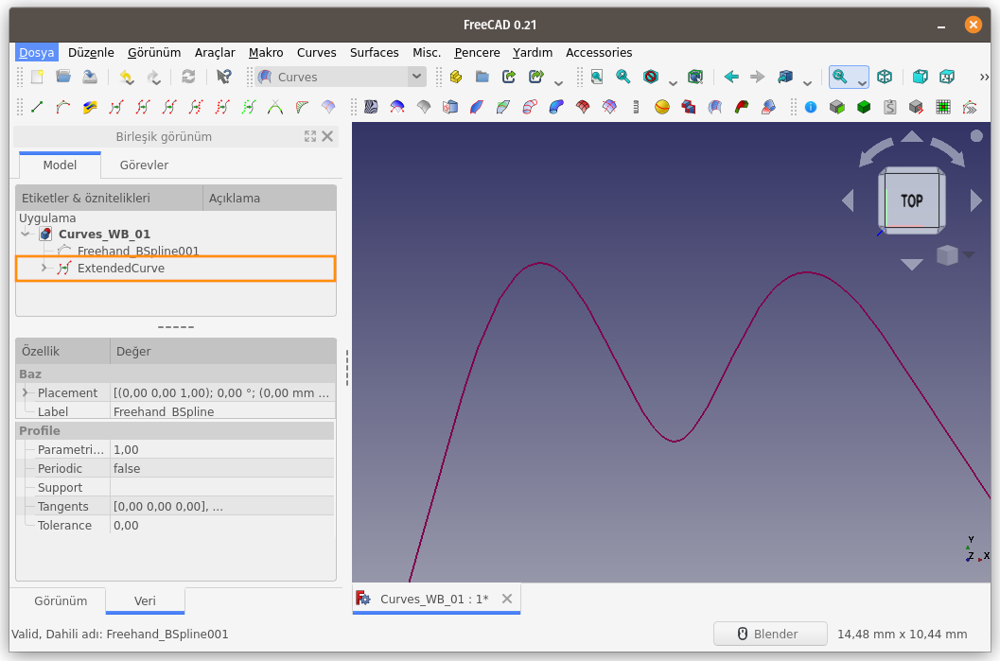
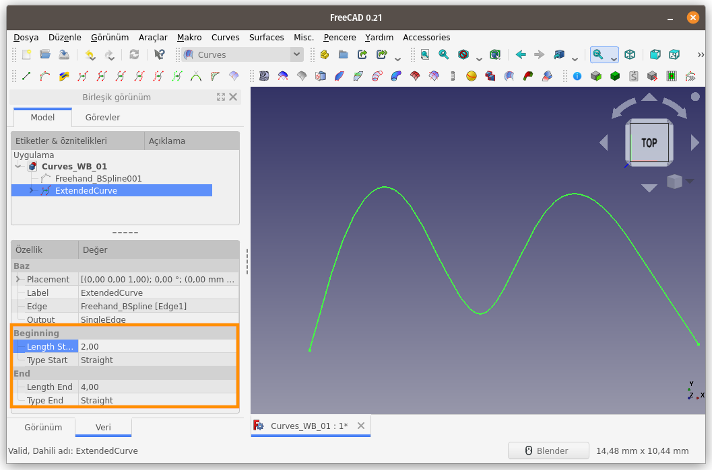
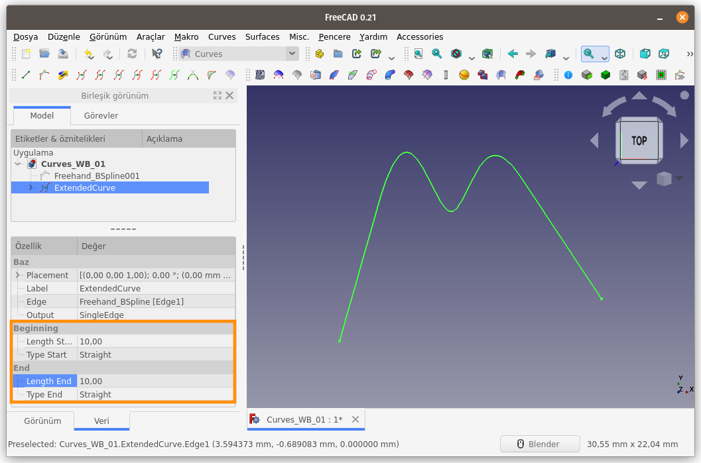
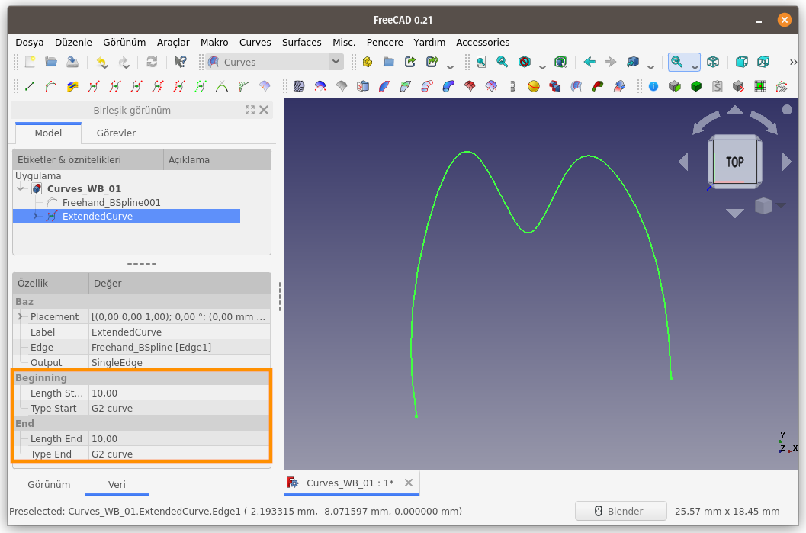

Title: FreeCAD - Curves WB - Curves - 04 - Curve Extend
Date: 2022-11-13 00:00
Category: Curves WB - Curves
Tags: FreeCAD, Curves, Workbench, ÇalışmaTezgahı, Curve, Extend
Author: Mustafa Halil

#  Curve Extend:

**Curve Extend** komutu, <u>Seçili Eğriyi (Kenarı) uzatır</u>.  

**Kullanım:** Komutu çalıştırmak için aşağıdaki işlemleri sırasıyla uygulayın:

- Öncelikle bir eğri seçin
- Curves araç çubuğunda bulunan ilgili düğmeye basın, ya da
- **Curves** menüsündeki **Curve Extend** seçeneğini kullanın.

Bir BSpline eğrisi seçilip **Curve Extend** komut 
çalıştırıldığında, eğrinin iki ucu da, eğriye uç noktalarından teğet 
olacak şekilde uzatılır. Varsayılan uzatma mesafesi 10mm’dir.

Bu değerleri **Unsur Ağacı**nda ilgili **ExtendedCurve** unsurunu seçtiğinizde beliren Özellikler penceresindeki **Beginning** ve **End** başlıkları altındaki **Length Start** ve **Length End** kısımlarından değiştirebilirsiniz.

Aşağıdaki örnekte göreceğiniz üzere 
eğrinin başlangıç ucunu 2 mm, bitiş ucunu ise 4 mm uzayacak şekilde 
ayarladım.

Özellikler bölümünde bulunan ve eğrinin uzatılan kısmı için bize sunulan bir diğer seçenek ise, uzama türü/biçimidir. **Type Start** ve **Type End** açılır menüleri 2 adet seçenek bulunur. Biri **Straight** diğeri ise **G2 Curve**’dür.  
**Straight** seçeneği sayesinde eğrinin ucu, eğriye teğet olacak şekilde uzatılırken,

**G2 Curve** seçeneği sayesinde ise eğri , eğriselliğini/sürekliliğini devam ettirerek uzar.

[<<< Curves Menü Komutlarına Ait Sayfaya Dön]({filename}curves_wb_00_curves_menu.md)
