Title: FreeCAD - Curves WB - Curves - 05 - JoinCurve
Date: 2022-11-15 00:00
Modified: 2023-03-21 00:00
Category: Curves WB - Curves
Tags: FreeCAD, Curves, Workbench, ÇalışmaTezgahı, Join, Curve
Author: Mustafa Halil

# 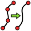 JoinCurve:

**JoinCurve** komutu <u>seçilen çizgileri/eğrileri birleştirerek tek bir Bezier Eğri (BSpline) haline getirir.</u>  

**Kullanım:** 
Komutu çalıştırmak için aşağıdaki işlemleri sırasıyla uygulayın:

- 3B görünümde bir veya birkaç kenar seçin. (birden fazla seçim için `CTRL` tuşunu kullanın)
- Kenarlar art arda eklenmelidir. Eskizden (Sketch'ten) , herhangi bir şeklin kenarları seçilebilir.
- Curves araç çubuğunda bulunan ilgili düğmeye basın, ya da
- **Curves** menüsündeki **JoinCurve** seçeneğini kullanın.
- İşlem sonunda tüm seçili kenarlar birleştirilerek tek bir Bezier eğri (BSpline) olur.

**JoinCurve** komutunu ve özelliklerini bir uygulama yaparak öğrenmeye çalışalım.  
Aşağıdaki resimde görüldüğü üzere elimizde bir adet altıgen eskiz ve bir adet dikdörtgenler prizması var.
 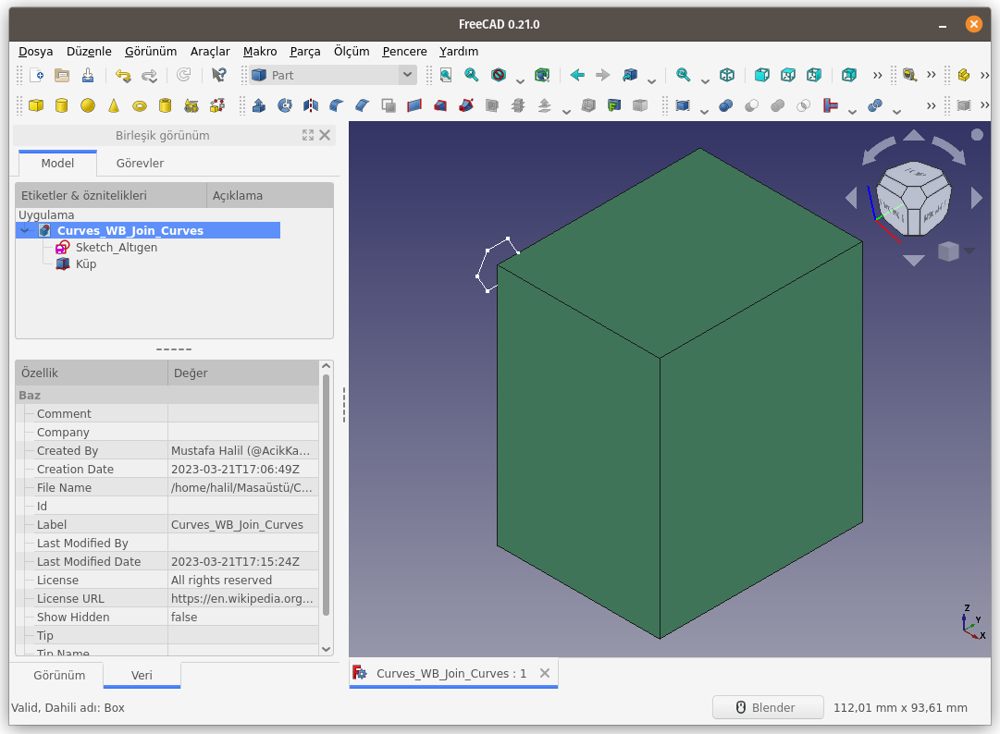 Sahnede bulunan dikdörtgenler prizmasının 5 kenarını seçelim.
 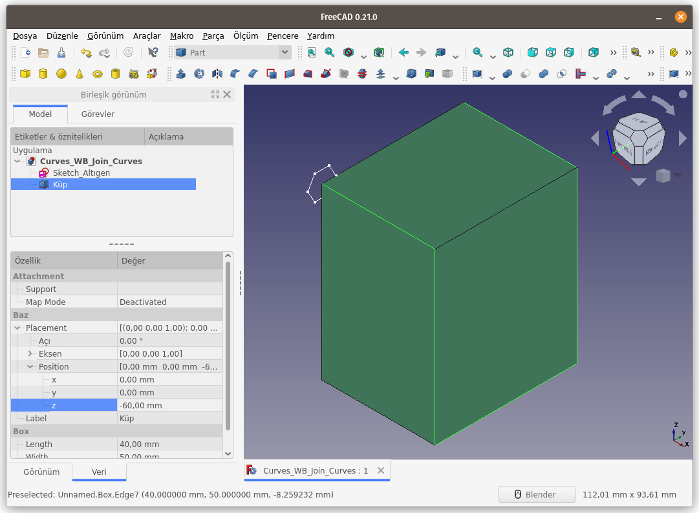 Seçimi, sıralı olarak gerçekleştirelim yani birbirini takip eden kenarları ardarda seçelim ve **JoinCurve** komutunu çalıştıralım.
 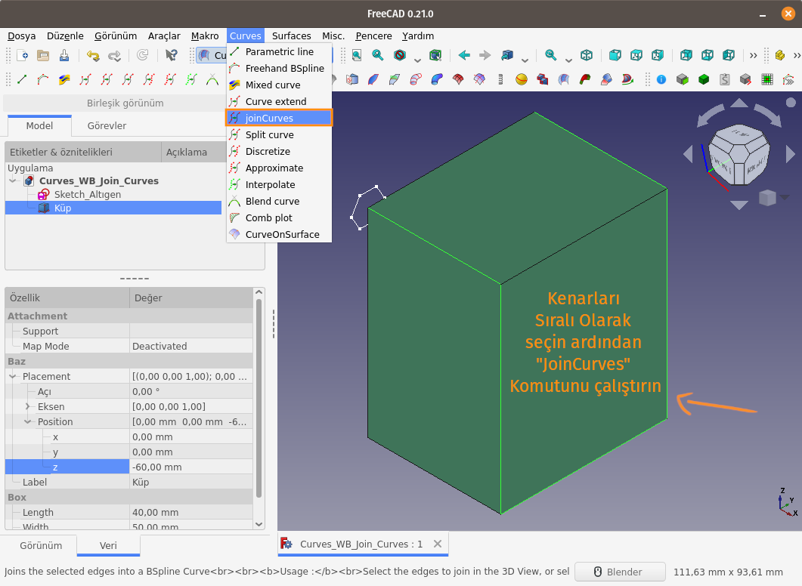 Unsur ağacına bakarsak, sahneye **JoinCurve** adında yeni bir nesne eklendiğini görürüz. Yeni nesneyi net olarak görmek için dikdörtgenler prizmasını gizliyorum.  
3B sahnesinde JoinCurve nesnesinin herhangi bir noktası 
seçildiğinde bütün eğri seçili hale gelir. Aşağıdaki resimde seçili 
kısımlar yeşil renk ile gösteriliyor.
 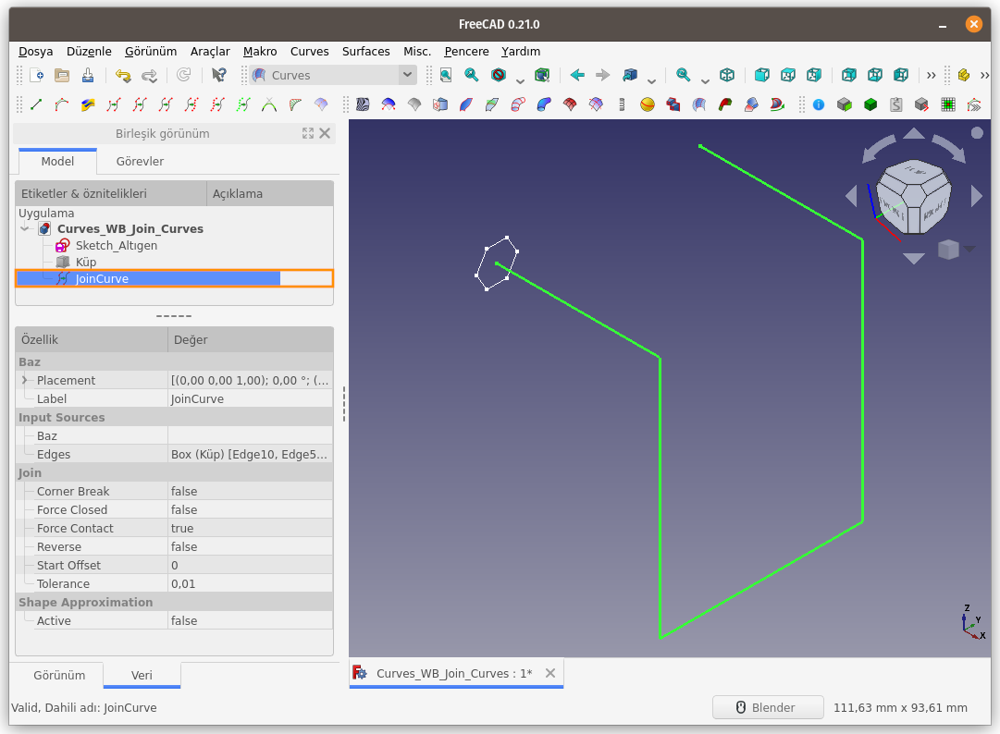 **Corner Break (Köşe Kır)** parametresi **true (doğru/evet)** olarak değiştirildiğinde, **JoinCurve** nesnesinin her bir çizgi parçası ayrı ayrı seçilebilir hale geliyor. 
Aşağıdaki resimde seçili kısımlar yeşil renk ile gösteriliyor.
 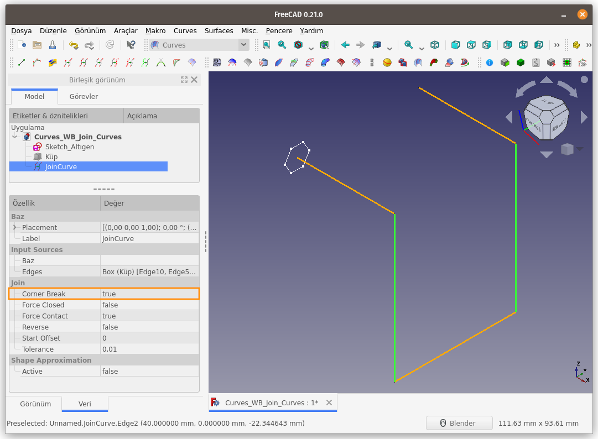 **Force Closed (Kapatmaya Zorla)** parametresi **true (doğru/evet)** olarak ayarlanırsa, **JoinCurve** eğrisinin, uç noktaları birleştirilir ve kapalı eğri oluşturması sağlanır.  
**Corner Break** parametresini **false (yanlış/hayır)** olarak ayarlı iken **Force Closed (Kapatmaya Zorla)** parametresi **true (doğru/evet)** olarak ayarlandığında elde edilen sonuç aşağıdadır.
 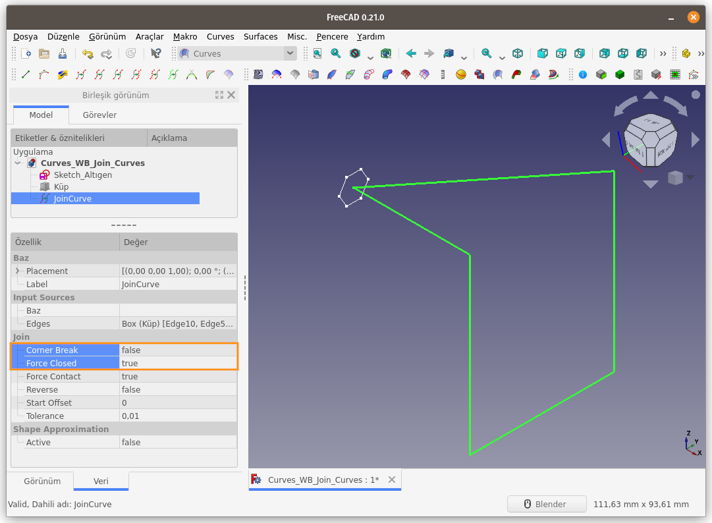 **Corner Break** parametresini **true (doğru/evet)** olarak ayarlı iken **Force Closed (Kapatmaya Zorla)** parametresi **true (doğru/evet)** olarak ayarlandığında ise elde edilen sonuç aşağıdadır. **Corner Break** parametresi aktif olduğu için her bir çizgi bağımsız gibi hareket 
ederek başlangıç ve uç nokta birleşmiş oluyor ve bu kez son çizgi 
parçası, önceki çizgiden ayrılıyor.
 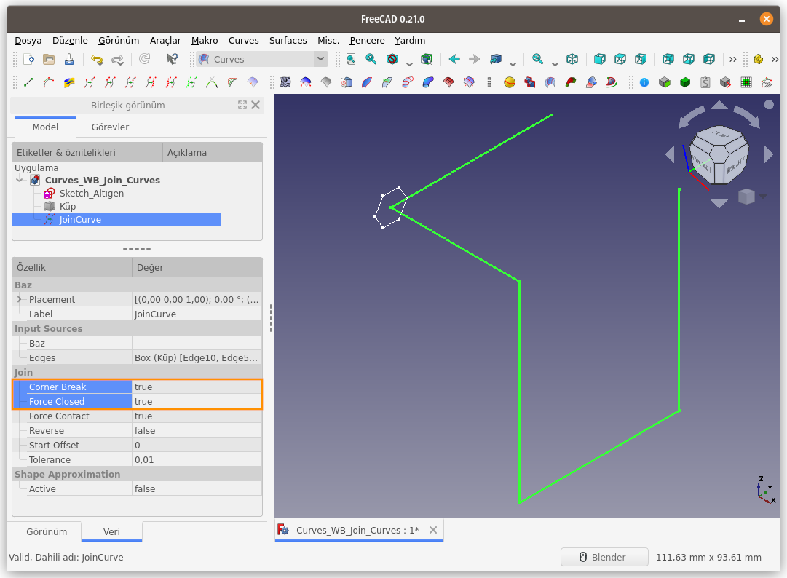 **Shape Approximation** Özelliği Aktifleştirildiğinde, **JoinCurve** nesnesi , değiştirilen parametre değerlerine bağlı olarak farklı 
şekiller almaya başlıyor. Örneği aşağıdaki resme bakarsanız, sadece **Active** parametresi **true (doğru/evet)** olarak değiştirildiğinde, eğriye ait keskin köşelerde bir yumuşama/yuvarlanma olmaya başlandı.
  **Approx Tolerance** parametre değeri artırıldığında yumuşama/radyus değeri de artıyor.
 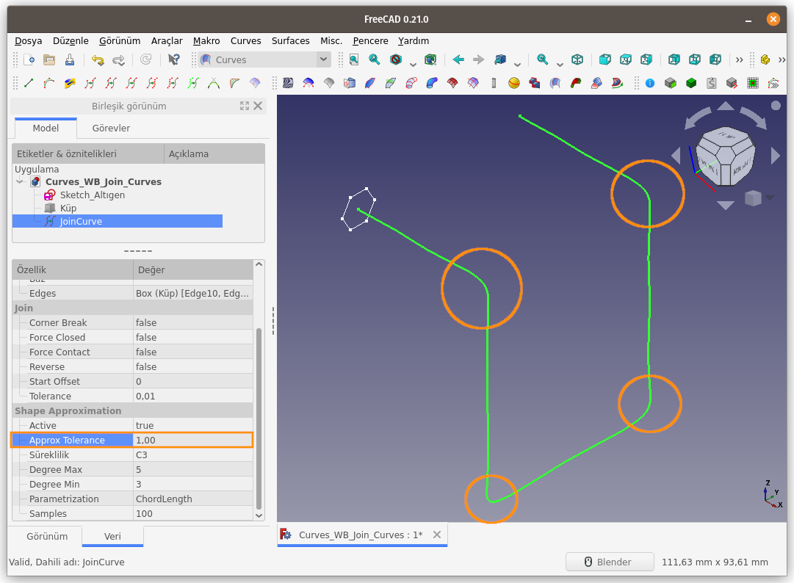 **Approx Tolerance** parametre değeri daha fazla artırıldığında, eğrinin uç noktalarında da radyus etkisi görülmeye başlanıyor.
 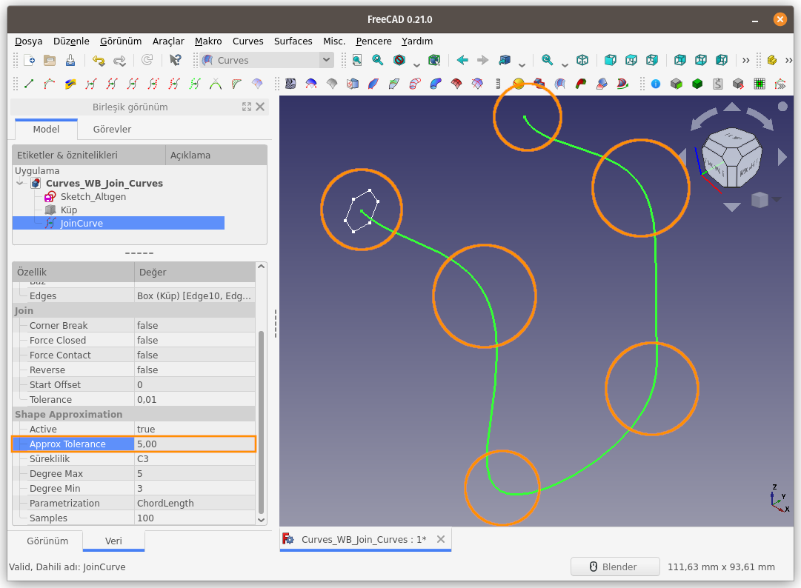 **Continuity (Süreklilik)** parametresi, açılır
 listeden çıkan seçeneklerden birinin seçilerek ayarlandığı 
özelliklerden biridir. Bu değerler, eğrinin oluşturulması aşamasında 
kullanılan algoritmik değerlerdir desek yanlış olmaz sanırım. Değeri **C3**'ten **C0**'a değiştirildiğinde elde edilen eğri profili aşağıdaki şekilde değişiyor.
 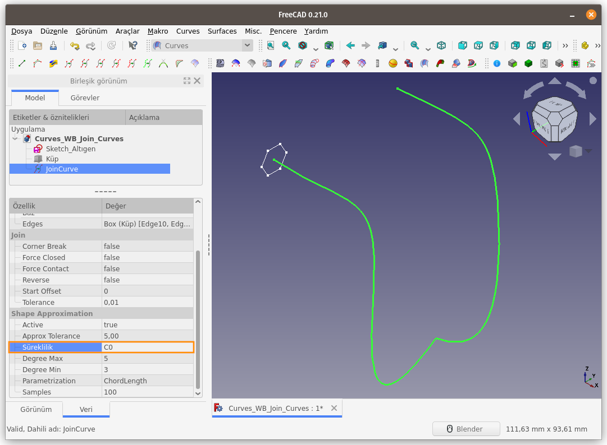 **Continuity (Süreklilik)** parametresi **CN** olarak ayarladığımızda ise eğri yine farklı bir hal alıyor.
 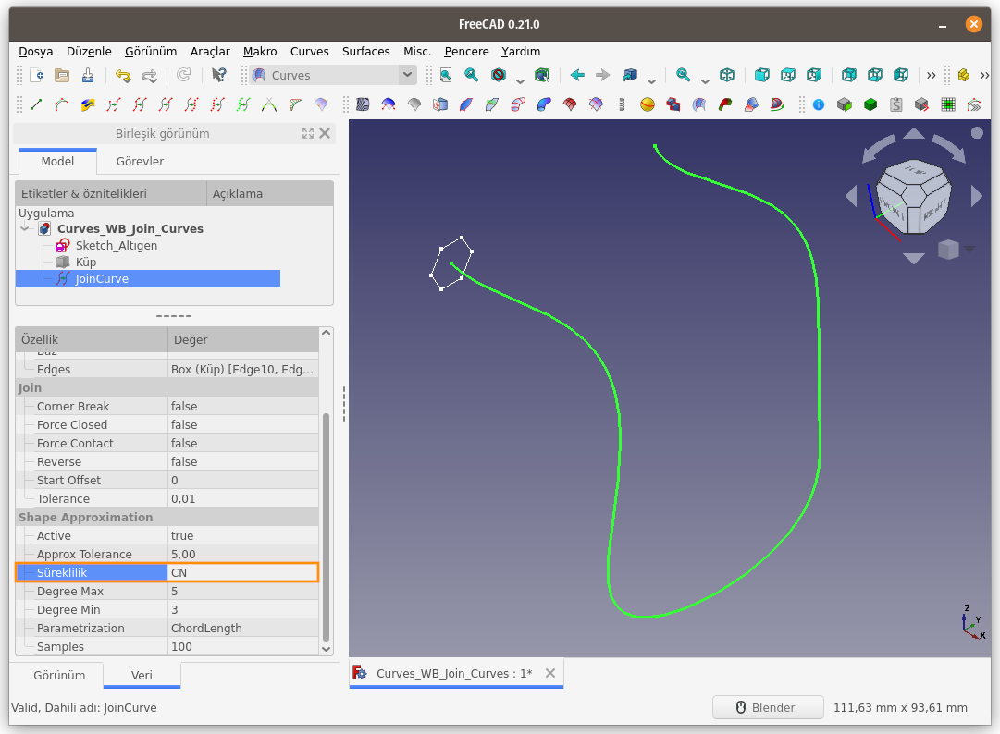 **Samples (Örnekleme)** parametresi, tabiri 
caizse eğrinin kaç adet çizgi parçasının uç uca eklenmesi ile elde 
edileceğini belirlediğimiz kısımdır. Değer büyüdükçe, seçili kenarlara 
daha yakın profilde eğri oluşuyor. Değeri düşürerek eğrinin alacağı 
şekli inceleyelim.
 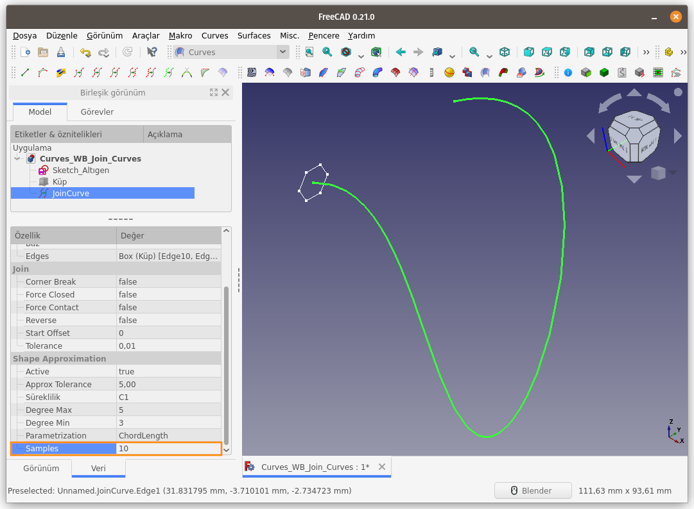 Altıgen Eskiz ve JoinCurve nesnelerini kullanarak **Part Workbench (Parça Çalışma Tezgahı)** komutlarından **Sweep... (Süpür...)**'i çalıştıralım.
 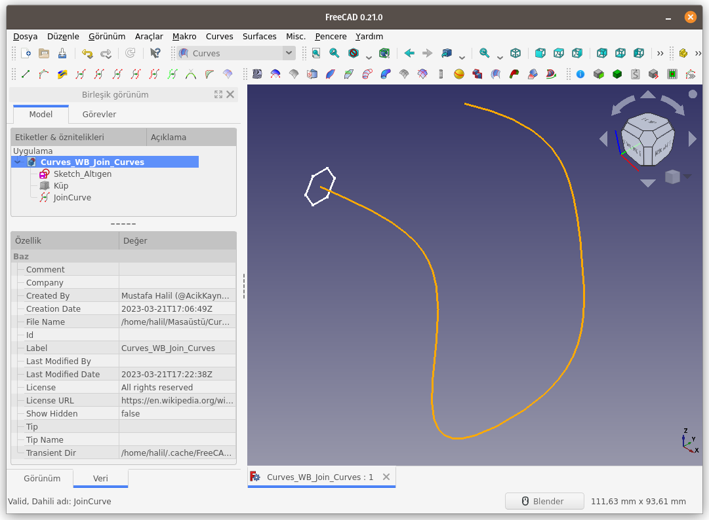 Curves araç çubuğunda bulunan ilgili düğmeye basarak ya da **Part (Parça)** menüsündeki **Sweep... (Süpür...)** komutunu çalıştır.
 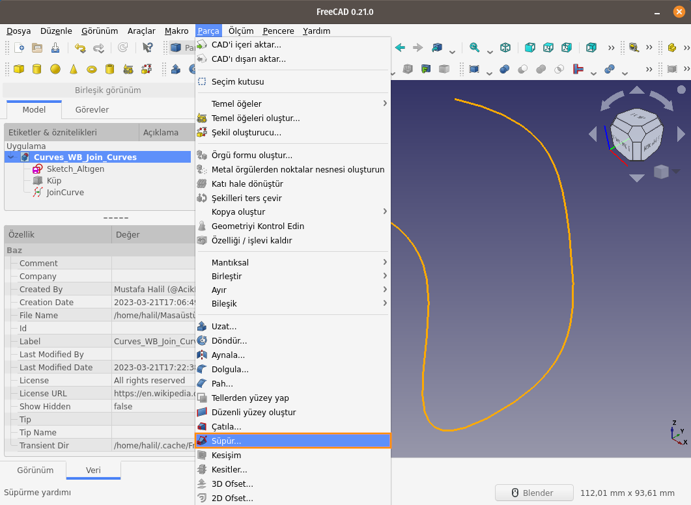 Profil olarak **Sketch_Altıgen**'i, süpürülecek yol (**Yolu Süper**) olarak **JoinCurve** eğrisini (3B sahnesinden) seçip onaylayalım.
 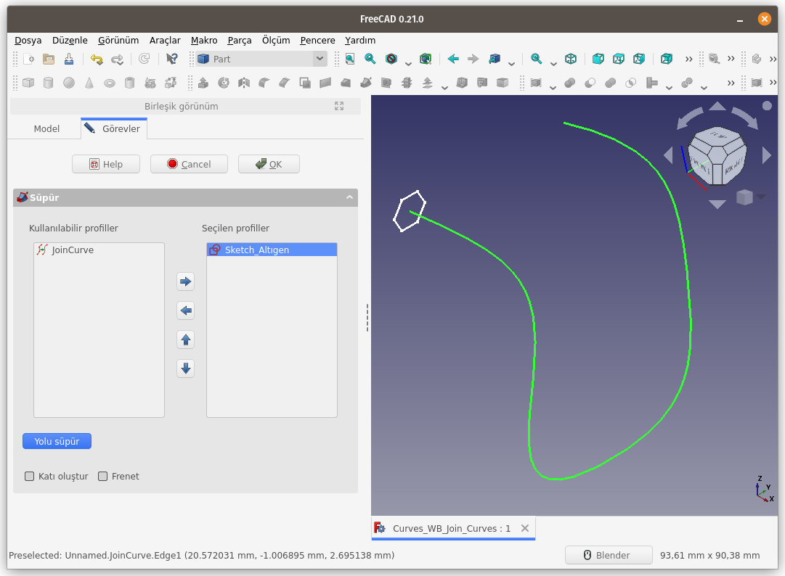 Oluşan 3 boyutlu **Altıgen Boru/Kanal** nesnesi aşağıda görülmektedir.
 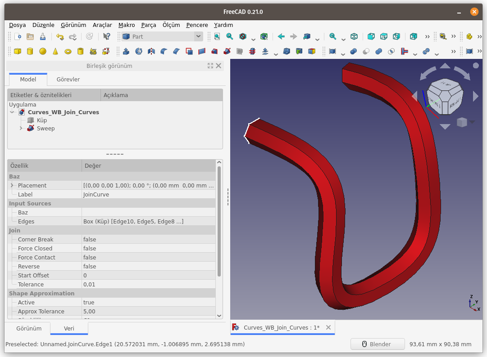 Unsur ağacından **JoinCurve** nesnesini seçip **Corner Break (Köşe Kır)** parametresini **true (doğru/evet)** olarak değiştirirsek elde edeceğimiz nesne aşağıdaki hale gelir.
 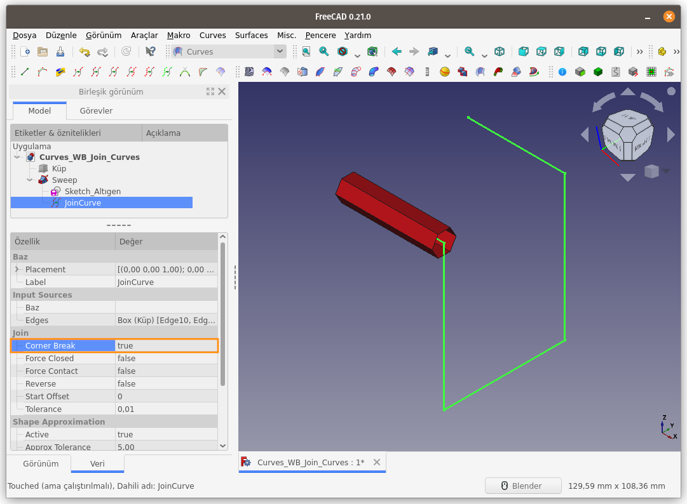 **Continuity (Süreklilik)** parametresi **C0** olarak değiştirildiğinde 3 boyutlu şeklin aldığı hal aşağıdaki gibidir.
 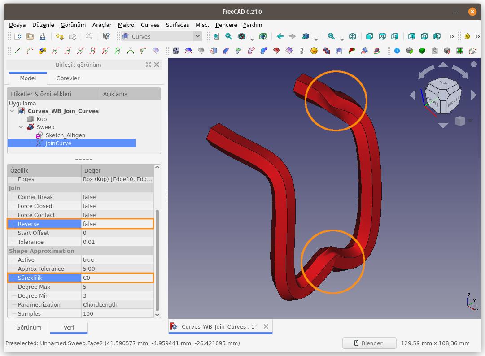 **Continuity (Süreklilik)** parametresi **C0** iken **Reverse (Ters Çevir)** parametresi **true** olarak değiştirildiğinde 3 boyutlu şeklin aldığı hal aşağıdaki gibidir.
 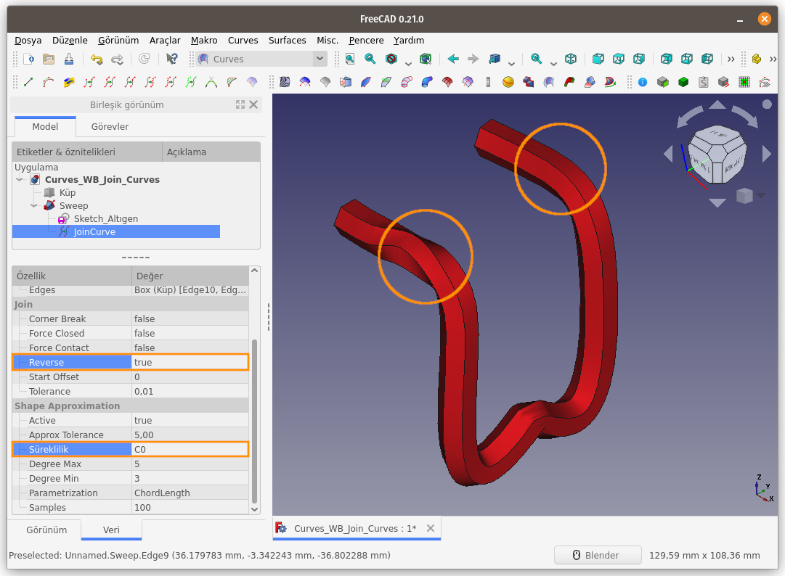 **Continuity (Süreklilik)** parametrelerini değiştirildiğinde 3 boyutlu şeklin aldığı hali kendiniz inceleyerek görebilirsiniz.  
**Samples (Örnekleme)** değerini düşürerek aşağıdaki şekli elde edebilirsiniz.  
Gördüğünüz gibi, Eğri parametreleri değiştiğinde oluşan 
eğrinin şekli ve eğriye bağlı olan 3 boyutlu nesnenin şekli de 
değişiyor.
 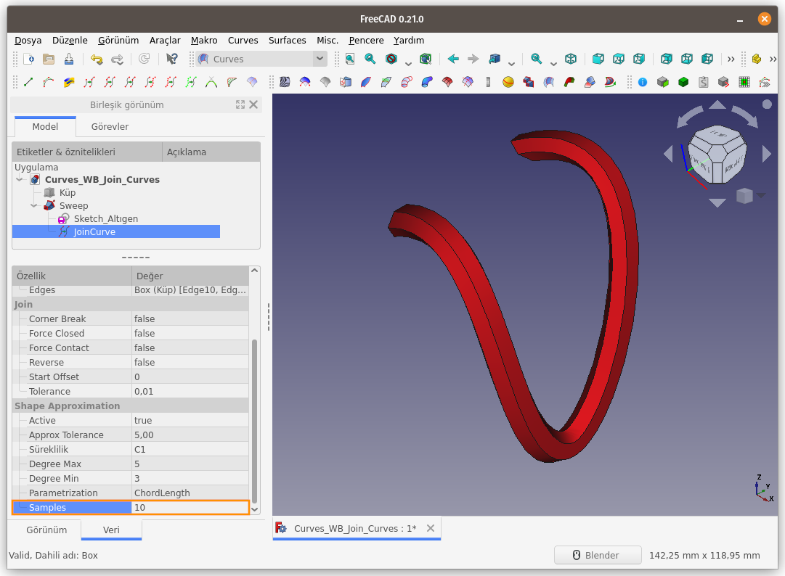

[<<< Curves Menü Komutlarına Ait Sayfaya Dön]({filename}curves_wb_00_curves_menu.md)
