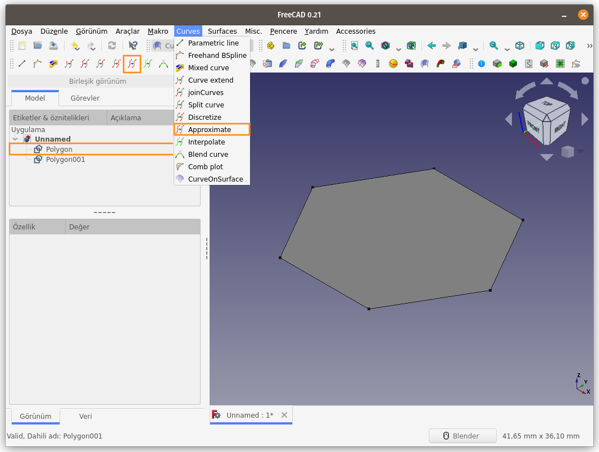
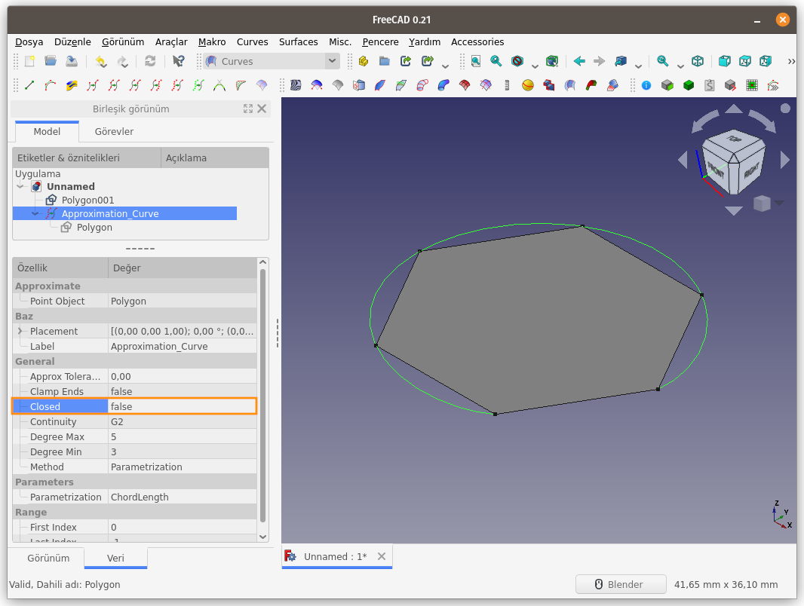
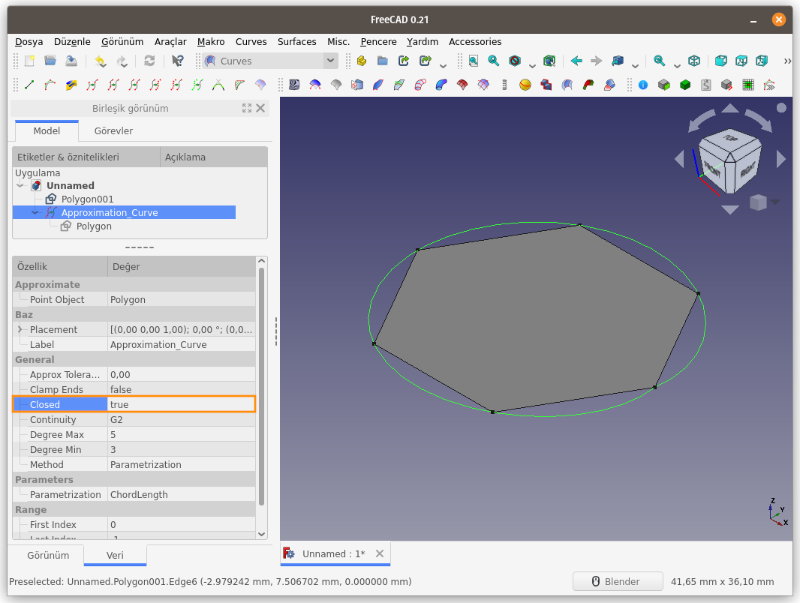

Title: FreeCAD - Curves WB - Curves - 08 - Approximate
Date: 2022-11-20 00:00
Modified: 2023-03-26 00:00
Category: Curves WB - Curves
Tags: FreeCAD, Curves, Workbench, ÇalışmaTezgahı, Approximate
Author: Mustafa Halil

#  Approximate:
**Approximate** komutu, seçili düzlemsel (2D) nesnenin tüm noktalarını ya da **Discretize** komutu ile ayrıklaştırılmış noktaları birleştirerek eğri oluşturur. `Closed` özelliği `true` olarak ayarlanırsa, uçların birleştirildiği kapalı bir eğri oluşturur.  
Bu komutun bir başka kullanım amacı da, **Sweep2Rails** komutu ile oluşturulmuş nokta bulutu, profil/ray eğrileri ya da tel 
kafes yapısını, eğrisel yüzeye dönüştürmektir. Örnek uygulama için [**Sweep2Rails**]({filename}../curves-wb-surfaces/curves_wb_surfaces_05_Sweep2Rails.md) komutunu inceleyebilirsiniz.

**Kullanım:** Komutu çalıştırmak için aşağıdaki işlemleri sırasıyla uygulayın:

- Öncelikle 2D nesneyi, 3D nesnenin belirli noktalarını ya da **Discretize** işlemi ile elde edilmiş noktaları `CTRL` tuşu ile seçin.
- Curves araç çubuğunda bulunan ilgili düğmeye basın, ya da
- **Curves** menüsündeki **Approximate** seçeneğini kullanın.

 Unsur ağacından **Approximate_Curve** nesnesi seçilip özellikler paneli incelendiğinde, **Closed (Kapalı)** özelliğinin **false (yanlış/hayır)** olarak ayarlandığı bu nedenle oluşan eğrinin uclarının birleştirilmediği / açık bırakıldığı görülür.  
**Contiunity** parametresi **G2** olarak seçilmiş olduğu için buna uygun bir algoritma ile eğri oluşturuldu.
  **Closed (Kapalı)** özelliğinin **true (doğru/evet)** olarak ayarlandığında ise oluşan eğrinin ucları birleştirildi, eğri kapalı yapıya dönüştü. 

[<<< Curves Menü Komutlarına Ait Sayfaya Dön]({filename}curves_wb_00_curves_menu.md)
