Title: FreeCAD - Curves WB - Curves - 09 - Interpolate
Date: 2022-11-26 00:00
Category: Curves WB - Curves
Tags: FreeCAD, Curves, Workbench, ÇalışmaTezgahı, Interpolate
Author: Mustafa Halil

# 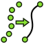 Interpolate:

Seçili Noktaları, Enterpolasyon yöntemi ile hesaplayarak 
birleştiren eğri oluşturur. Enterpolasyon, en basit tanımı ile "var olan
 sayısal değerleri kullanarak, boş noktalardaki değerlerin tahmin 
edilmesi" olarak açıklanmaktadır.  

**Kullanım:** Komutu çalıştırmak için aşağıdaki işlemleri sırasıyla uygulayın:

- `CTRL` tuşu yardımı ile eğriyi oluşturmak istediğiniz noktaları **sıralı olarak** seçin. Noktalar, <u>seçim sırasına göre</u> birleştirilecektir.
- Curves araç çubuğunda bulunan ilgili düğmeye basın, ya da
- **Curves** menüsündeki **Interpolate** seçeneğini kullanın.

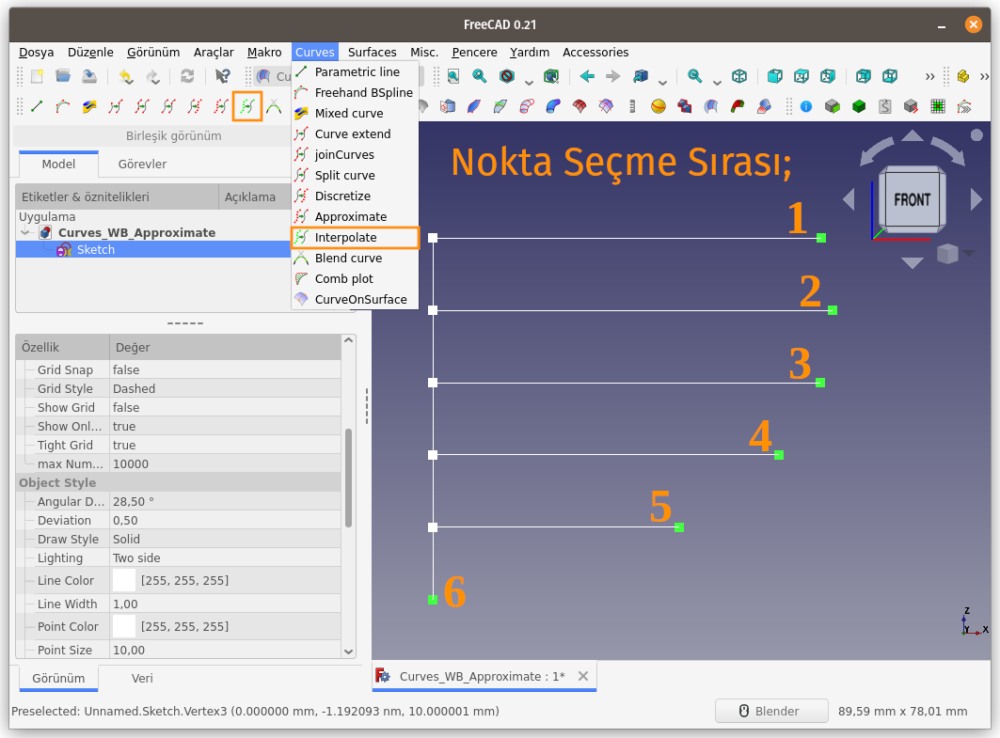  
  
Nokta seçim sırasını değiştirelim;
 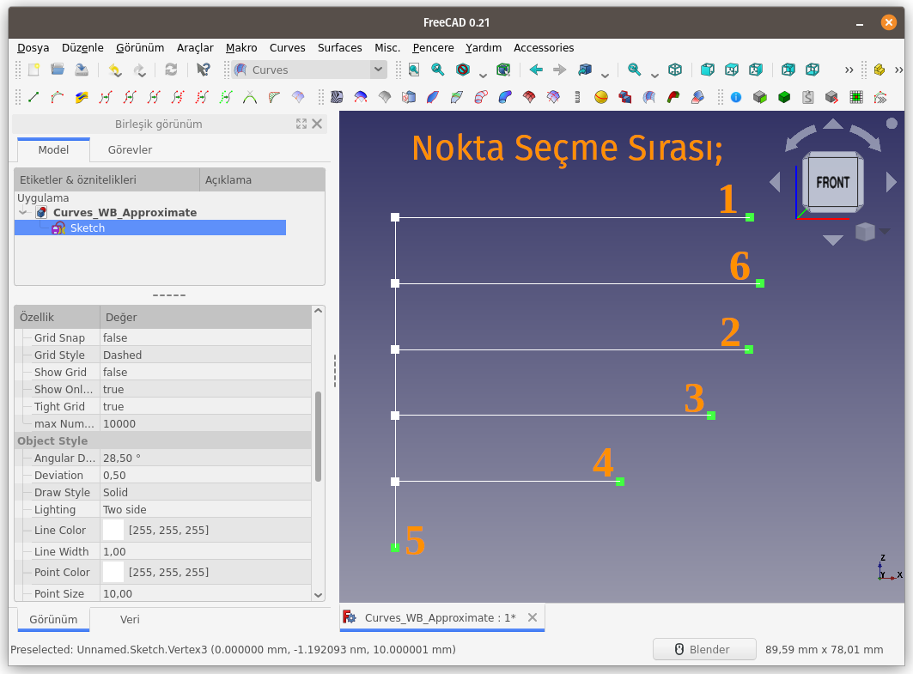  
Seçim sırasına bağlı olarak oluşan eğri;
 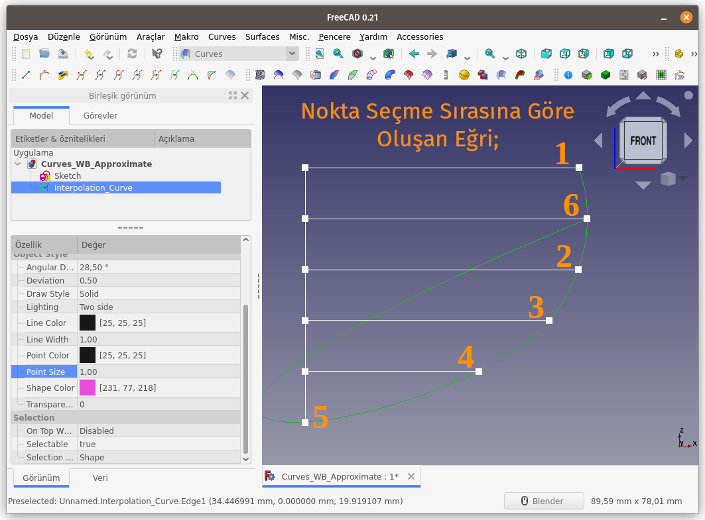  
**Özellikler:**  
Özellikler paneli **Veri** Sekmesinde, aşağıdaki özellikler değiştirilebilir;  

- **Periodic (Periyodik)**: Bu seçenek, **true** ve **false** değerlerini alabilir. Eğer **true** değeri ayarlanırsa, oluşturulan eğrinin uçları birleştirilerek kapalı bir eğri elde edilir.
- **Polygonal (Çokgen / Çok köşeli)**: Seçili noktalar, poligon yani doğru parçaları ile birleştirilerek Enterpolasyonlu Eğri (Interpolation Curve) yapısı oluşturulur.
- **Tolerance**: **Polygonal** seçeneği **true** ise **Tolerans** miktarını değiştirilerek farklı eğri yapıları elde edilebilir.
- **Parametrization Factor (Parametrelendirme Faktörü)**:
  Eğrinin oluşturulması için belirlenen (kod içinde kullanılan) parametre faktörüdür (katsayısıdır). Sayı değeri arttıkça, eğrinin oluşturulması için gerekli formül değişiyor ve eğri daha farklı hal alıyor. Nokta ve Kenarlar hareket ettirildiğinde eğri çok daha büyük eğrisellik yarıçapına sahip oluyor.

İlk seçim sırasına göre, **Periodic** (Periyodik) seçeneği, **true** olarak ayarlandığında elde edilen sonuç;
 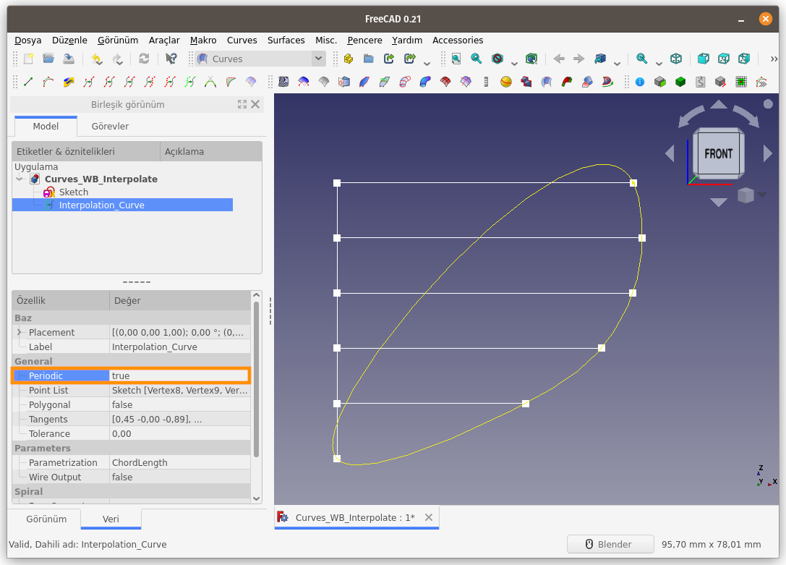  
**Polygonal** (Çokgen / Çok köşeli) seçeneği, **true** olarak ayarlandığında elde edilen sonuç;
 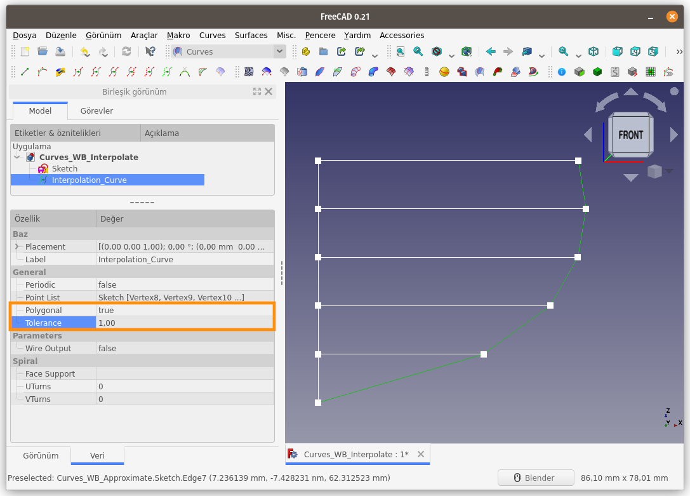  
**Tolerans** değerini sıfırladığımızda elde ettiğimiz sonuç;
 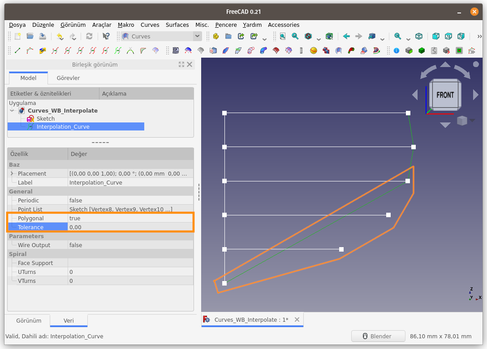  
**Tolerans** değerini **2** olarak ayarladığımızda elde ettiğimiz sonuç;
 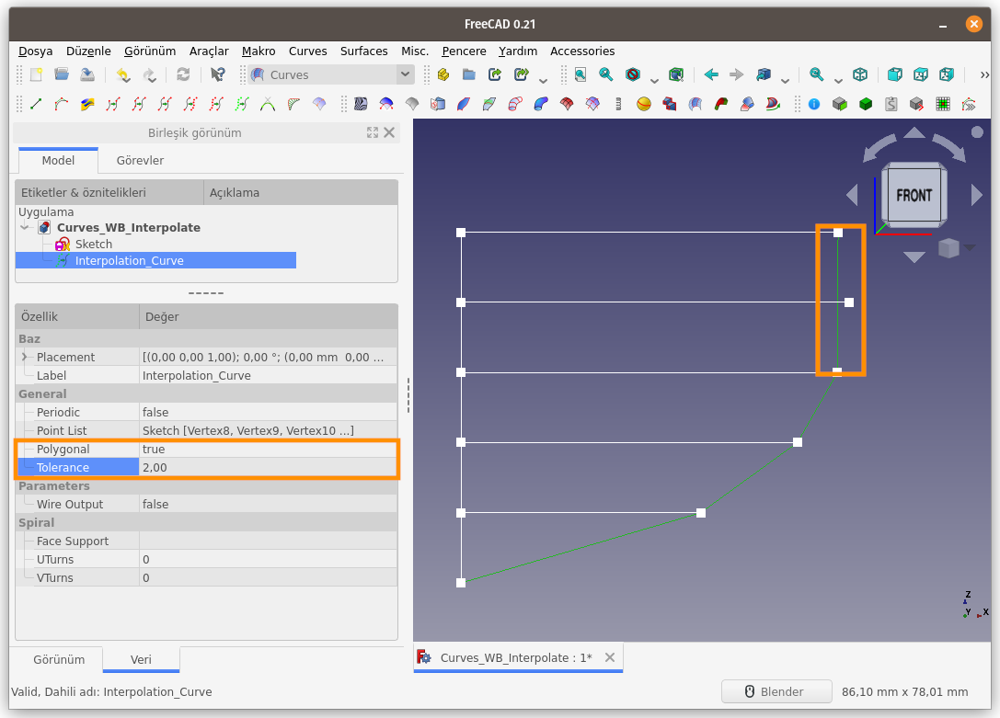  
**Periodic** (Periyodik) ve **Polygonal** (Çokgen / Çok köşeli) seçeneklerini, **true** olarak ayarlarsak ve **Tolerans** değerini **1** olarak belirlersek elde edeceğimiz sonuç;
 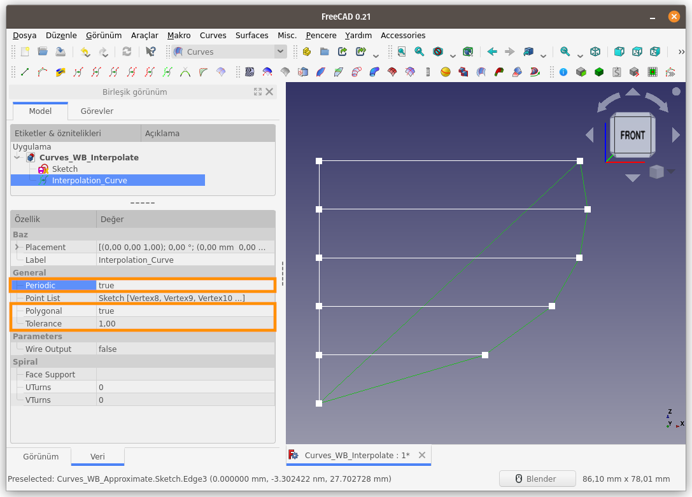  
**Parametrization Factor** (Parametrelendirme Faktörü) değerini manuel olarak girerek eğriyi oluşturalım. Değerleri eşit aralıkla belirtelim.
 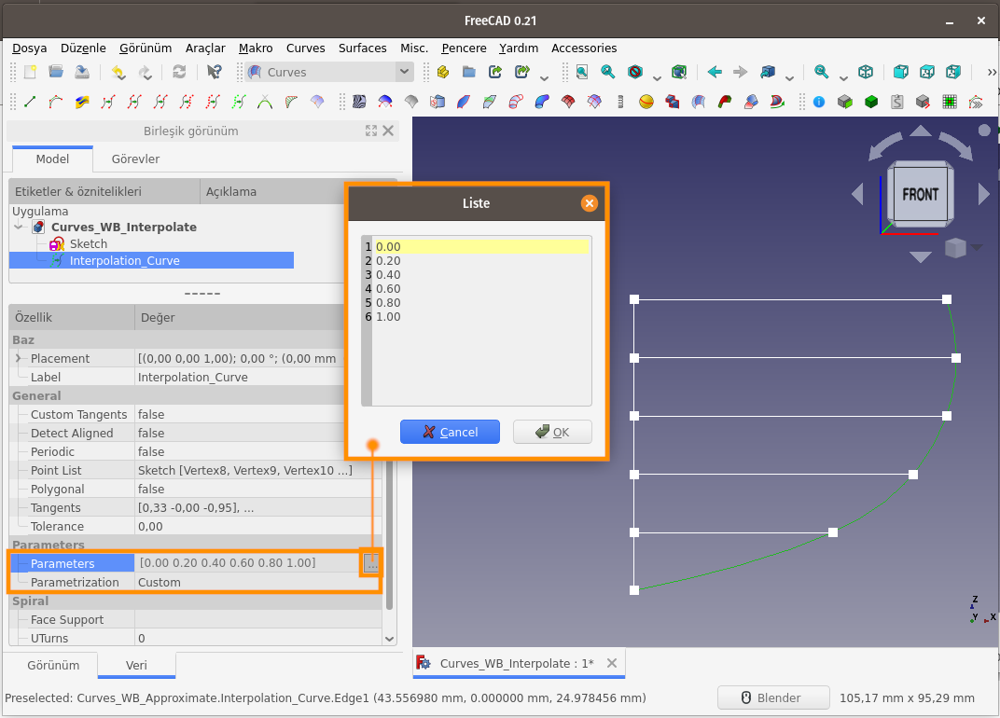  
**Parametrization Factor** (Parametrelendirme Faktörü) değerini rastgele değerler belirterek eğriyi oluşturalım.
 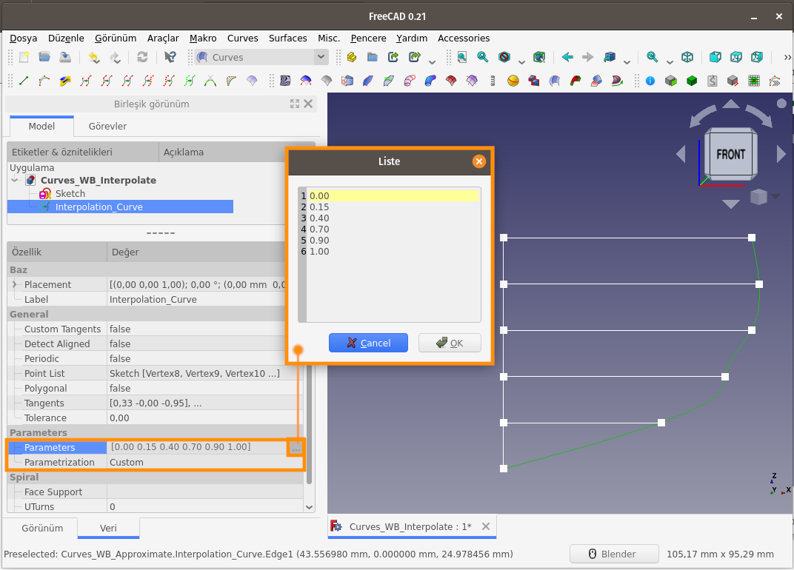  

[<<< Curves Menü Komutlarına Ait Sayfaya Dön]({filename}curves_wb_00_curves_menu.md)
