Title: FreeCAD - Curves WB - Curves - 10 - Blend curve
Date: 2022-12-05 00:00
Modified: 2022-12-18 00:00
Category: Curves WB - Curves
Tags: FreeCAD, Curves, Workbench, ÇalışmaTezgahı, Blend, curve
Author: Mustafa Halil

#  Blend curve:

Bu komut, iki kenar çizgisini bir eğri ile birbirine bağlar. 
Eğrinin alacağı şekil, belirlenen parametrelere göre farklılık gösterir.

**Kullanım:** Komutu çalıştırmak için aşağıdaki işlemleri sırasıyla uygulayın:

- Curves araç çubuğunda bulunan ilgili düğmeye basın, ya da
- **Curves** menüsündeki **Blend curve** seçeneğini kullanın.

İki adet çizgi parçası `CTRL` tuşuna basılarak seçilirer, ardından **Blend curve** komutu çalıştırılırsa, seçili çizgiler (kenarlar) arasında bir eğri oluşur ve bu eğri iki çizgiye de bağlı olur. Örneğin **Eskiz Çalışma Tezgahında (Sketch Workbench)** iki adet çizgi parçası çizerek komutu uygulayalım ve komutun detaylı kullanımını öğrenmeye çalışalım.

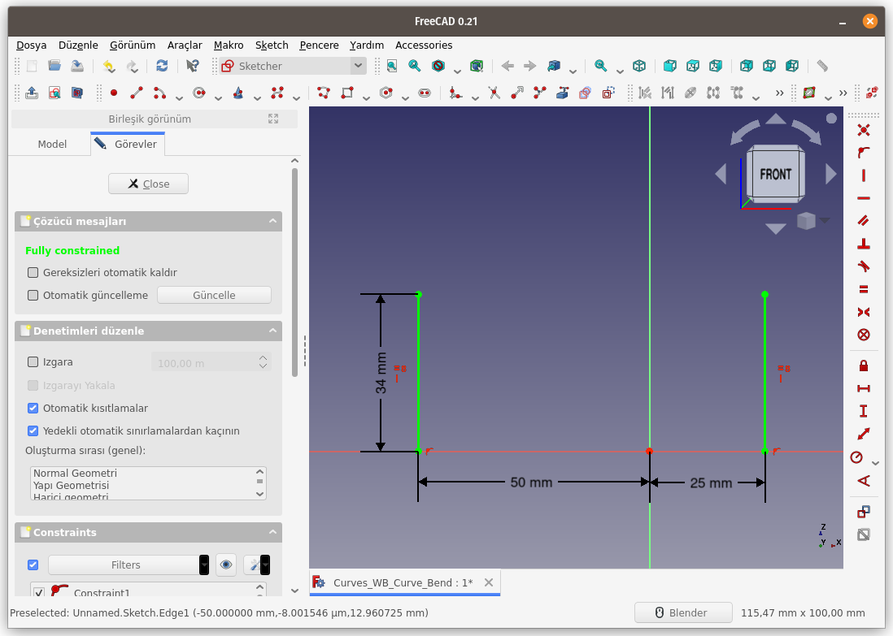  
Eskizdeki (Sketch) çizgileri seçip `Blend curve` komutunu çalıştıralım.
 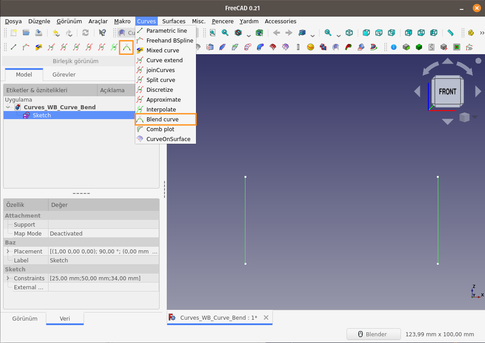  
Komut çalıştırıldıktan sonra elde ettiğimiz sonuç;
 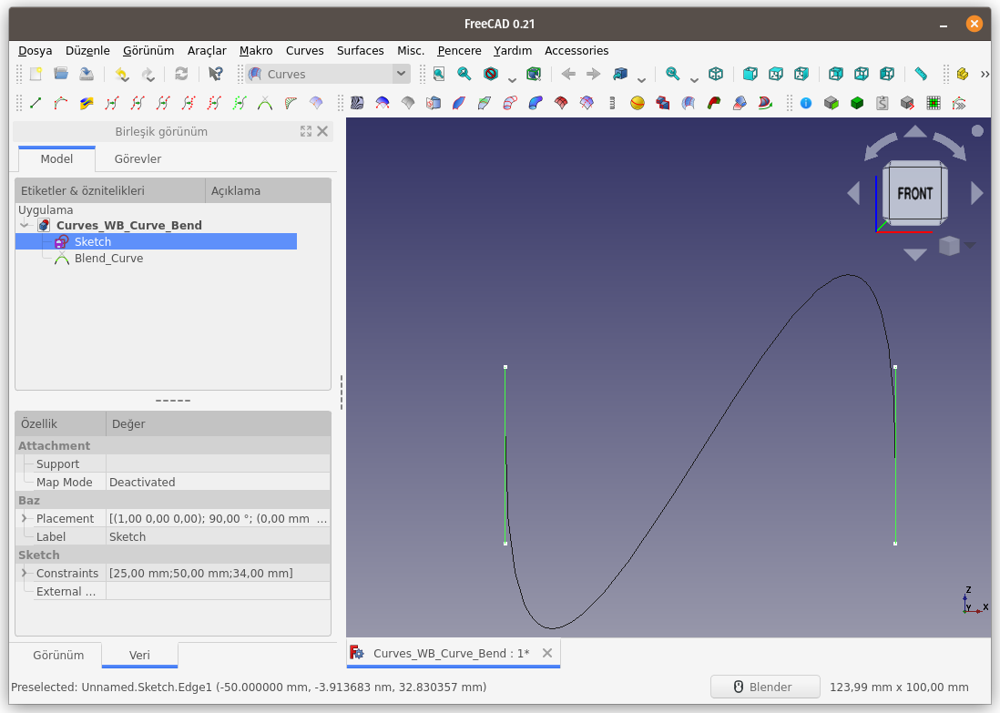  

`Blend curve` komutunun çalıştırılması sonrasında iki 
çizgi (kenar) arasında oluşan eğrinin uçları, çizgilerin (kenarların) 
(yaklaşık olarak) orta noktalarında konumlanıyor. Oluşan **Blend_Curve** eğrisi Unsur ağacından seçtiğinizde aşağıdaki özellikleri görebilir ve seçeneklerini değiştirebilirsiniz. **Blend curve** komutu ile oluşan eğri, iki adet kenara (çizgiye) bağlı olduğu için, 
eğri parametrelerini değiştirmek amacıyla bu iki kenara (Edge1 ve Edge2)
 ayarlar kısmında belirtilmiştir.

**Özellikler:**  
Özellikler paneli **Veri** Sekmesinde, aşağıdaki özellikler değiştirilebilir;  
Açıklama kısmı okunduktan sonra aşağıdaki resimler de incelenirse, yazılanların daha rahat anlayacağını düşünüyorum.

- **Continuity (Süreklilik)**: Eğrinin süreklilik şeklini belirler. `C0`, `G1`, `G2`, `G3` ve `G4` seçenekleri vardır. Her iki kenarın (çizginin) **Continuity (Süreklilik)** ayarını `C0` olarak değiştirdiğimizde, eğriler, **Doğrusal** yapıya dönüşecektir.
  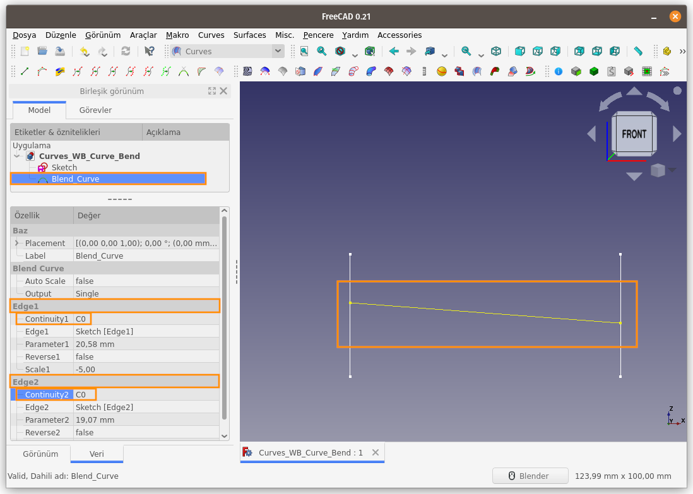  
- **Parameter (Parametre)**: Bu ayar, oluşan eğrinin uç noktalarının, 1. ve 2.Kenarların hangi konumunda bulunması gerektiğini belirleyen kısımdır. Eğrinin uçlarından biri kenar çizginin üst kısmında konumlansın istersen, ilgili kenar çizgisinin uzunluğuna dair bilgiyi bu kısma yazmalıyız. **Sketch WB** ile çizgileri oluştururken her iki çizgiye de 34mm uzunluk değeri atamıştık. O nedenle **Parameter1** kısmına en fazla 34 değerini yazabiliriz. 34'ten daha büyük bir değer yazarsak bile `ENTER` tuşuna bastığımızda değer alabileceği en büyük değer olan 34'e ayarlanır. Eğrinin Kenar1 ve Kenar2 (Edge1 ve Edge2) ile birleştiği başlangıç ve bitiş yönlerinin ters olduğuna dikkat edin. Biri için başlangıç yani sıfır (0) konumu aşağıda iken diğerinde yukarıdadır. Eğri
  iki kenarı birleştirdiği için bir ucun bitişi, diğer ucun başlangıcı olduğu düşünülerek bu mantıktan dolayı yönlerin ters olduğu izah edilebilir.
  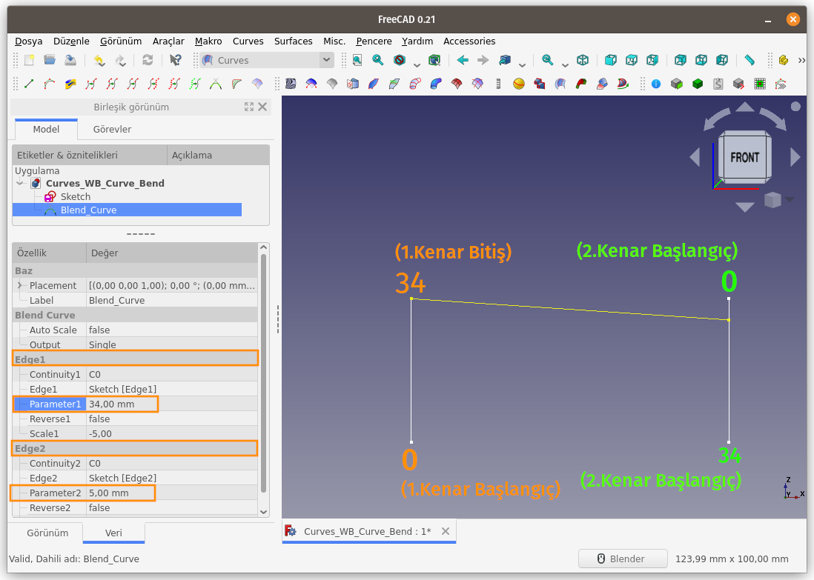  
- **Reverse (Ters / Ters Çevir)**: Bu seçenek ile, **Parameter** kısmında bahsettiğim Kenar1 ve Kenar2'nin (Edge1 ve Edge2) başlangıç ve
  bitiş yönlerinin ters çevrilmesi gerçekleştirilebilir. Örneğin Kenar2'nin (Edge2) Başlangıç ve Bitiş yönünü ters çevirelim ancak Parametre2 (Parameter2) değerini değiştirmeyelim ve sonucu birlikte inceleyelim. Bu ayar sonrasında olması gereken şey, Eğrinin sağ kısımdaki ucunun (2.kenar ile bağlantılı olduğu ucu), 2.Kenarın (Edge2) alt kısmından 5mm yukarıya yerleşmesidir.
  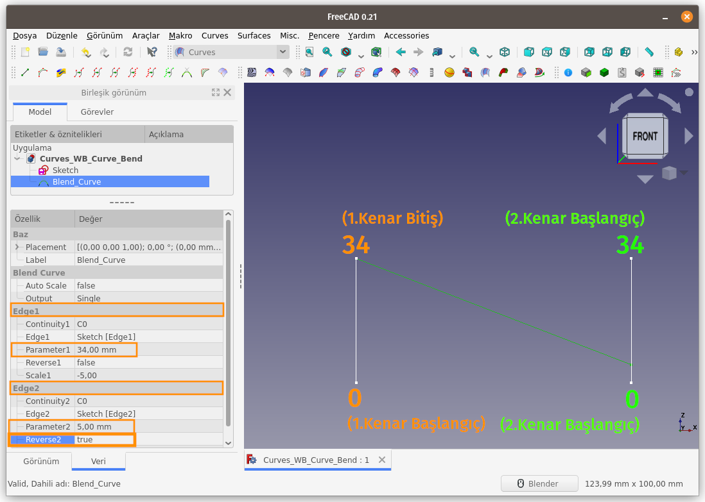  
- **Scale**: Ölçek (scale) ayarı, eğrinin uzunluğunu ya da eğrilik yarıçapını etkileyen bir katsayıdır. Bu ayarı incelemek için öncelikle iki kenarın da (edge) **Continuity (Süreklilik)** ayarını `G1` olarak ayarlayalım. Oluşan eğri aşağıda görülmektedir.
  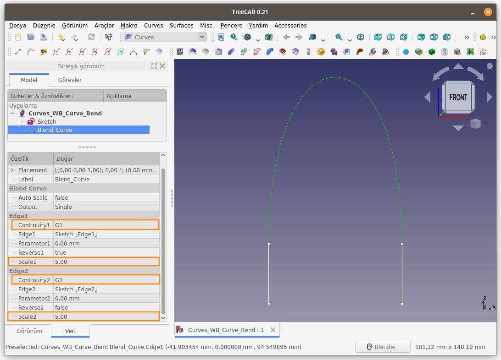  

**Scale** (Ölçek) Değeri küçüldükçe, 
eğrinin kenara olan uzaklığı azalacak, negatif olması halinde eğri ters 
tarafa doğru yönelecektir. Eğer her iki kenarın da Scale değeri 0 
(sıfır) olarak ayarlanırsa, eğri, doğrusal çizgi halini alacaktır.

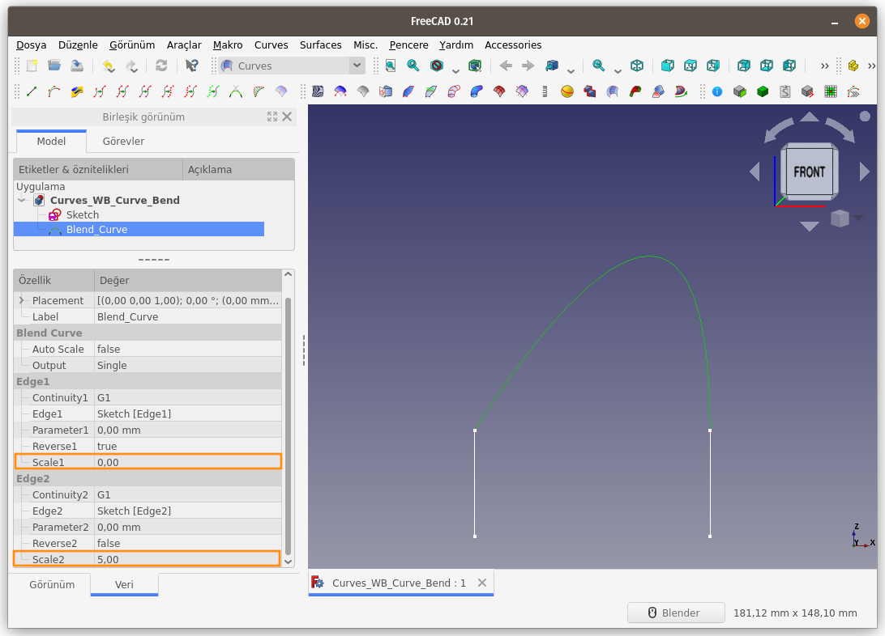  
**Scale1** değeri **0**  
**Scale2** değeri **1,50**;
   
**Scale1** değeri **-1,50** (değer negatif olduğu için eğri ters yönde oluşturulur)  
**Scale2** değeri **1,50**;
 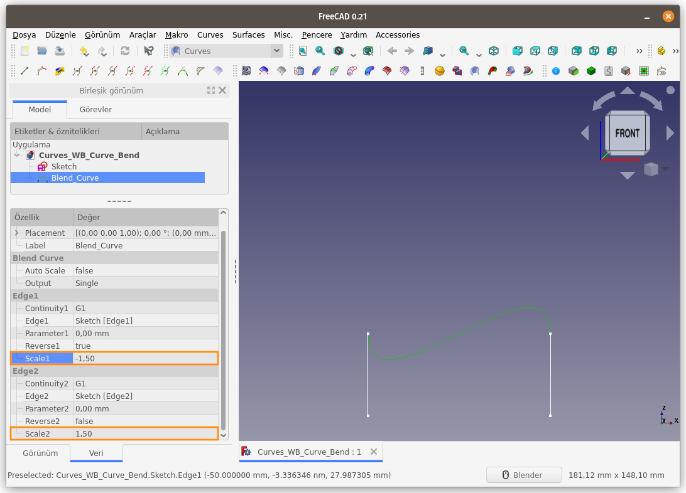  
**Scale1** değeri **0,00**  
**Scale2** değeri **0,00**  
Her iki scale değeri de SIFIR olduğunda Eğri, Doğrusal Çizgiye dönüşür;
 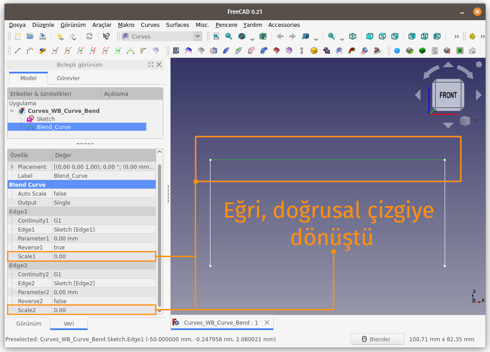  

- **Edge1 / Edge2 (Kenar1 / Kenar2)**: **Blend Curve Tool** ile Eğri oluşturuken yararlandığımız kenarları (edge1 ve edge2), bir Eskiz (Sketch) içerisinde oluşturmuştuk. Eğer aynı eskiz'e (sketch'e) yeni bir kenar çizgisi daha ekler ve oluşturduğumuz Blend Curve Tool ile
  oluşturduğumuz eğrinin kenarlarından birini değiştirmek istersen `Edge1` ve `Edge2` ayarlarını kullanmamız gerekir. Önce Eskizimize (sketch) yeni bir kenar çizgisi ekleyelim.
  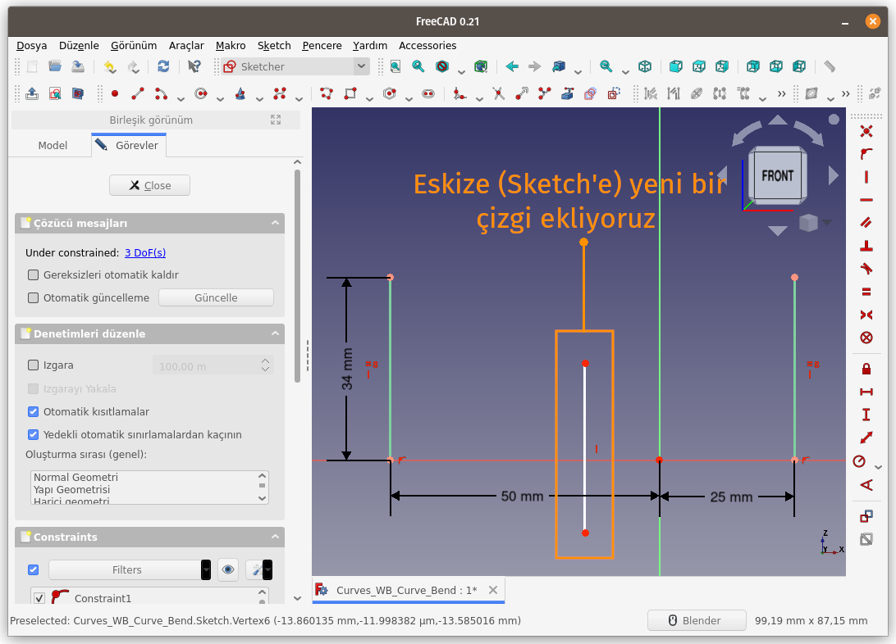  Edge2 (Kenar2)'yi değiştirelim.
  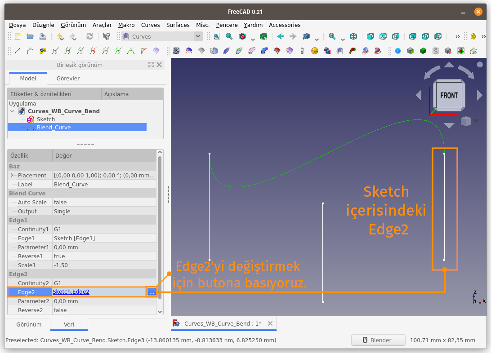  Öncelikle Edge2 (Kenar2)'yi silelim.
  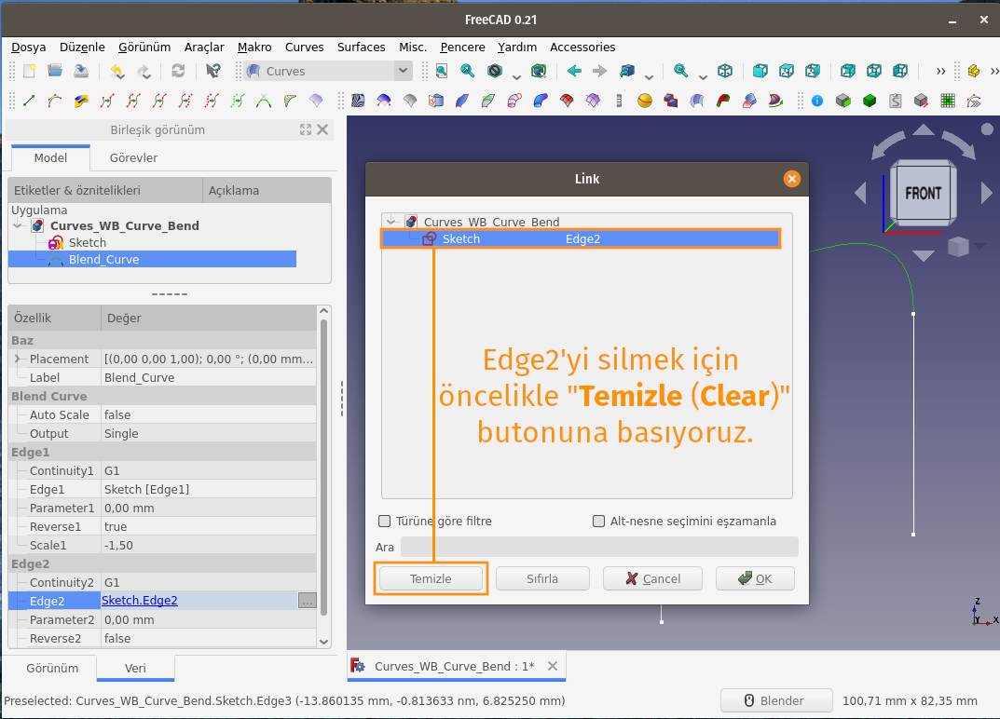  Sahne içerisinden Edge3 (Kenar3)'ü seçiyoruz.
  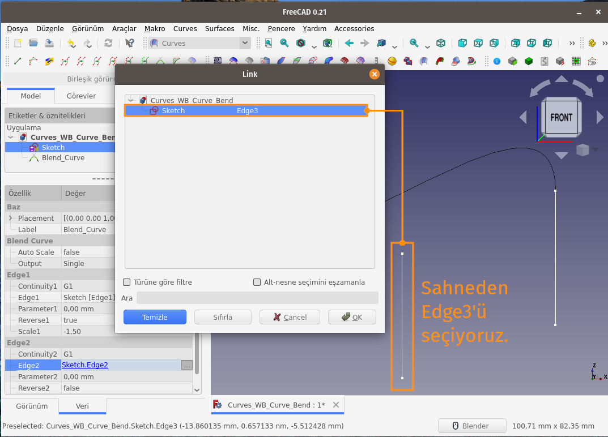  `CTRL` + `R` ile çalışmayı yenilemeyi unutmayalım. Araç çubuğundaki Yenile butonunu da kullanabilirsiniz.  Gördüğünz gibi, artık eskiz (sketch) içerisindeki Edge1 ve Edge3 arasında bağlantılı bir eğri oluşturuldu. Eğri güncellendi.
  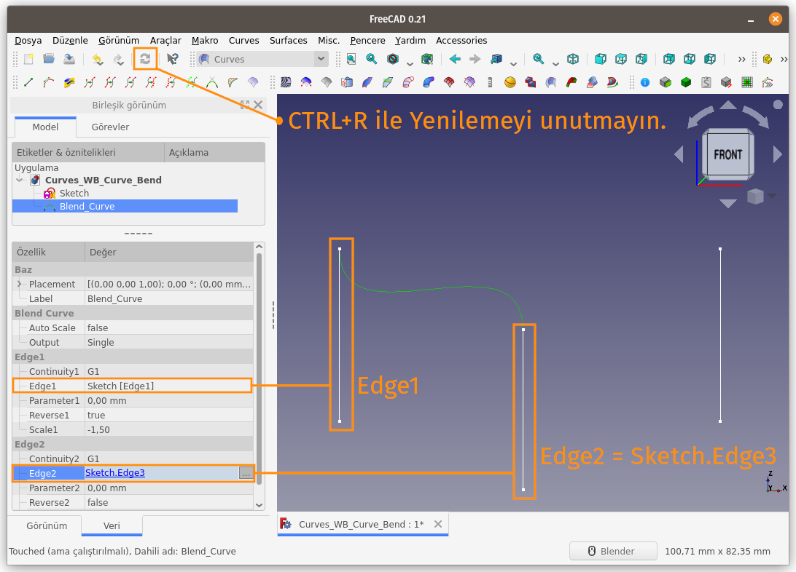  

[<<< Curves Menü Komutlarına Ait Sayfaya Dön]({filename}curves_wb_00_curves_menu.md)
