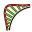
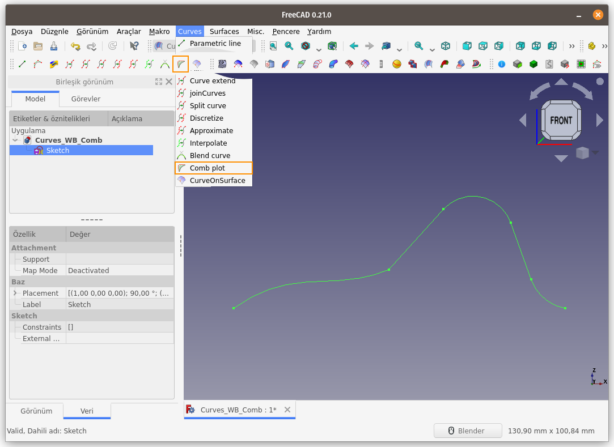
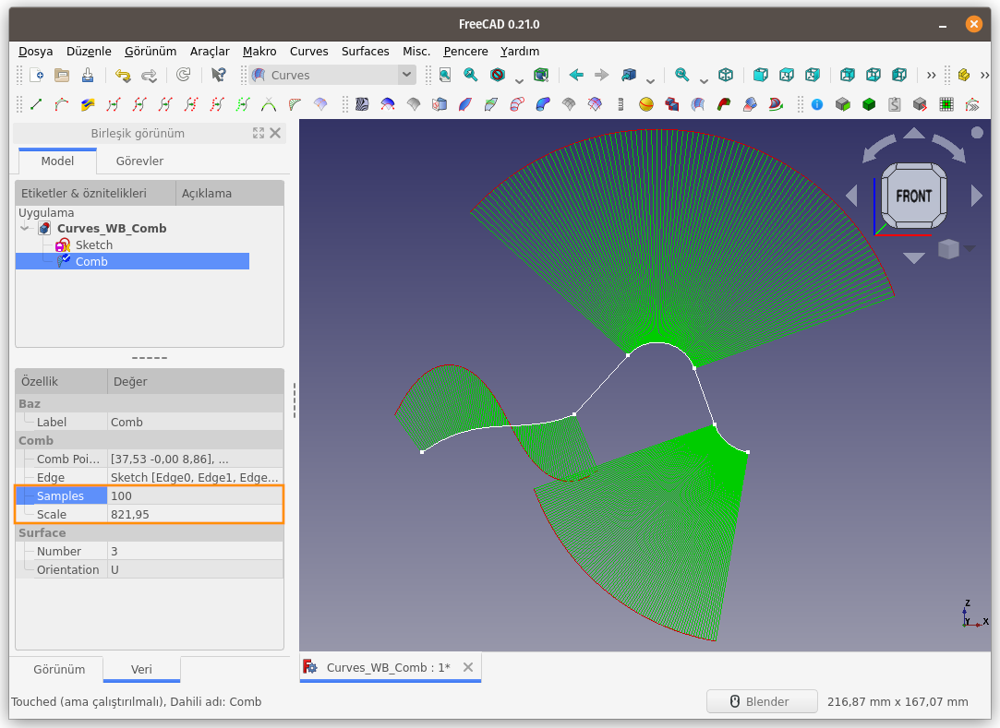
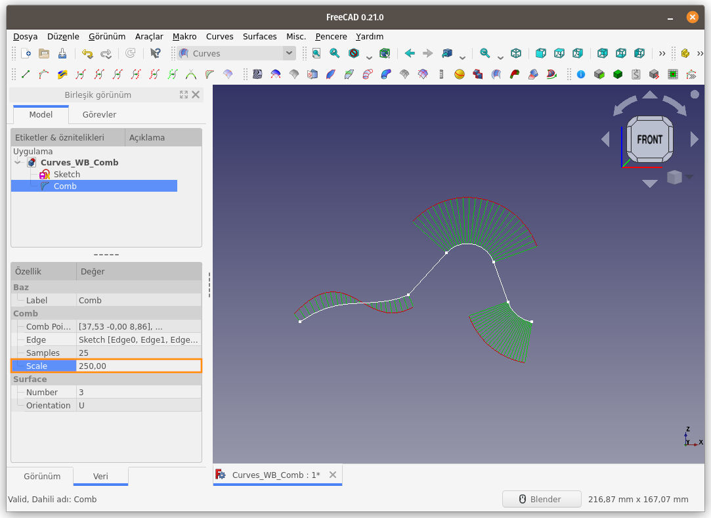
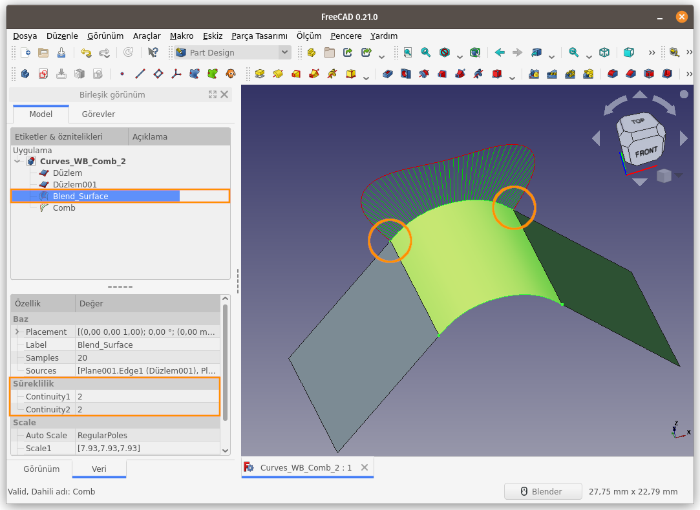
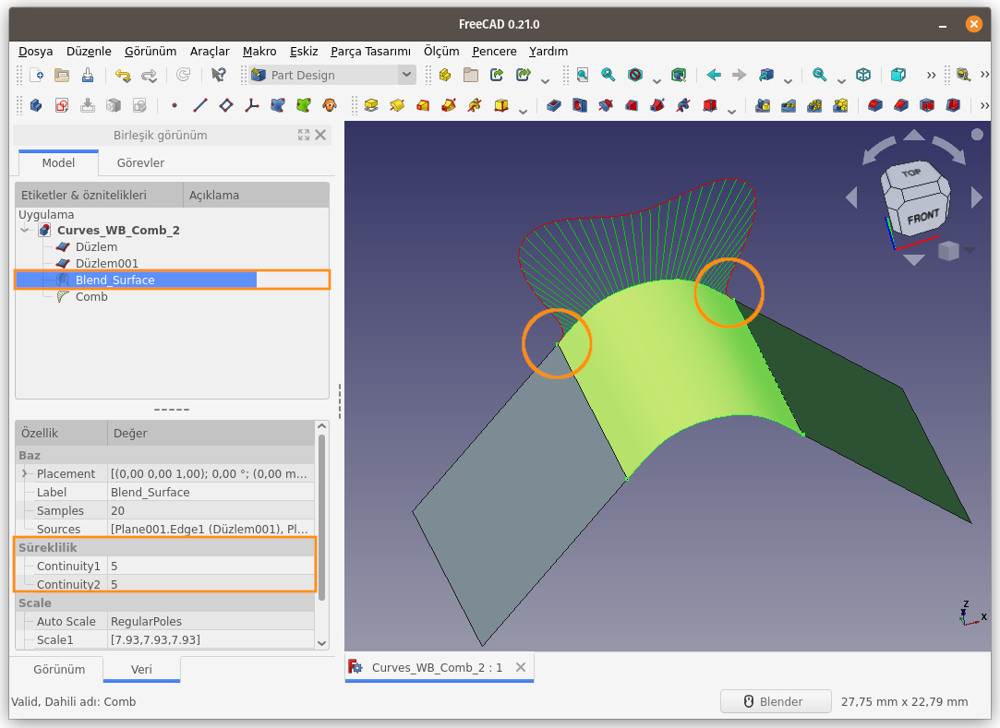

Title: FreeCAD - Curves WB - Curves - 11 - CombPlot
Date: 2023-02-05 00:00
Category: Curves WB - Curves
Tags: FreeCAD, Curves, Workbench, ÇalışmaTezgahı, Comb, plot
Author: Mustafa Halil

#  Comb plot:

Comb Plot (ParametricComb), bir eğrinin düzenliliğini 
veya yumuşaklığını ve iki eğri arasındaki sürekliliği görselleştirmeye 
yardımcı olur. Bu komut ile, 3B eğriler için bir 3B tarak oluşturulur. 
Sample(örnek) ve Scale (ölçek) ayarları değiştirilebilir. Bu araç, 
Curves (Eğriler) adı verilen harici çalışma tezgahının bir parçasıdır.  
**Not:** Bu tarak yalnız görselleştirme içindir.

**Kullanım:** Komutu çalıştırmak için aşağıdaki işlemleri sırasıyla uygulayın:

- Unsur Ağacından bir nesne (çizgi, tel...) veya 3B görünümünde bir veya birkaç kenar seçin (Birlikte seçim için **CTRL** tuşunu kullanın)
- Curves araç çubuğunda bulunan ilgili düğmeye basın, ya da
- **Curves** menüsündeki **Comb plot** seçeneğini kullanın.
- Seçimin eğriliğini gösteren bir tarak oluşturulur.

**NOT:**  
Bu araç görsel bir yardım işlevi görür.  
  
Komut sonrası oluşan tarak yapısı;
   
**Samples** (Örnekleme) değerini 25 olarak değiştiriyoruz;
   
**Scale** (Ölçek) değerini 250 olarak düşürüyoruz;
   
**Blend Surface** komutu ile oluşturulan 
eğrisel yüzeyin parametreleri değiştirildiğinde oluşan yüzey ile, kenar 
çizgilerinin bağlantı sürekliliği **Comb plot** tarağı ile 
gayet net incelenebilir. Bu tarak, iki yüzeyin birleşiminde keskin ya da
 yumuşak geçiş olduğunu görüntüler. Oluşan Model, render görüntüsü ya da
 **Zebra Tool** ile incelendiğinde, birleşim kenarları boyunca ışık yansımasının değişimi net bir şekilde görülebilir.
   
**Blend Surface** komutu parametreleri değiştirildiğinde (artırıldığında) **Comb Plot** tarağının nasıl değiştiğini aşağıdaki resimde görüyoruz;
   

[<<< Curves Menü Komutlarına Ait Sayfaya Dön]({filename}curves_wb_00_curves_menu.md)
