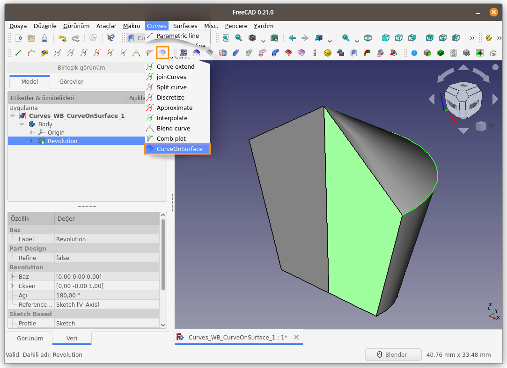
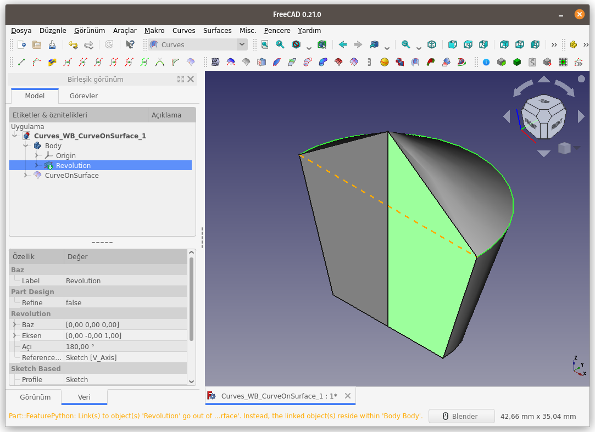
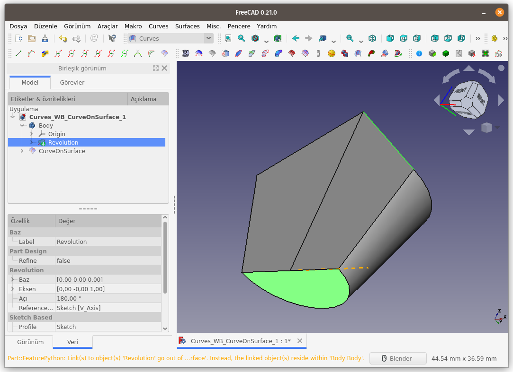
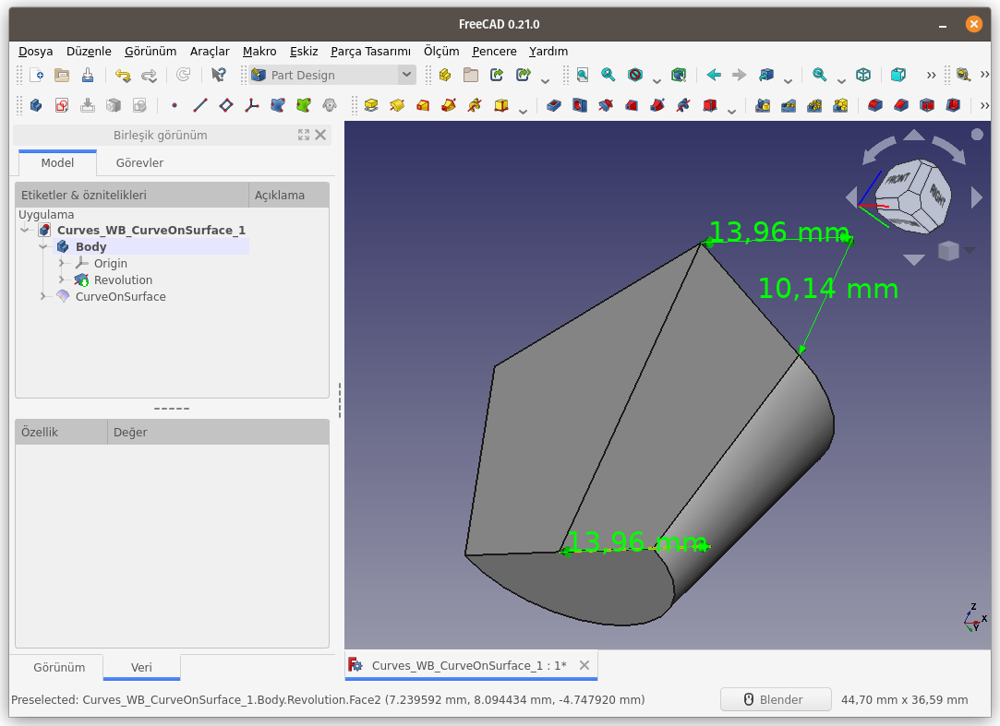
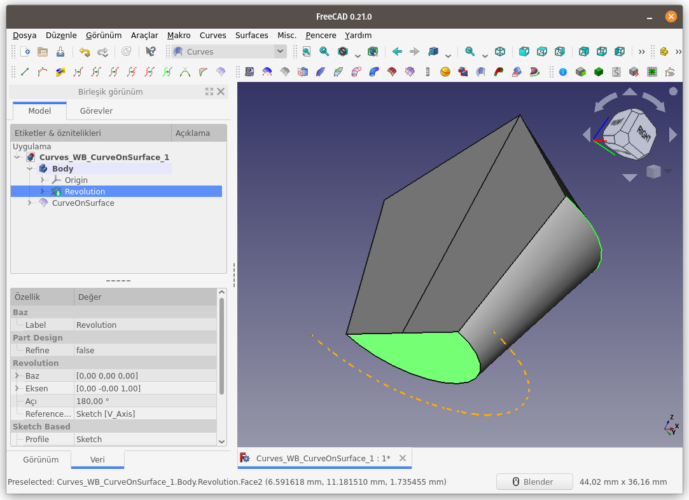
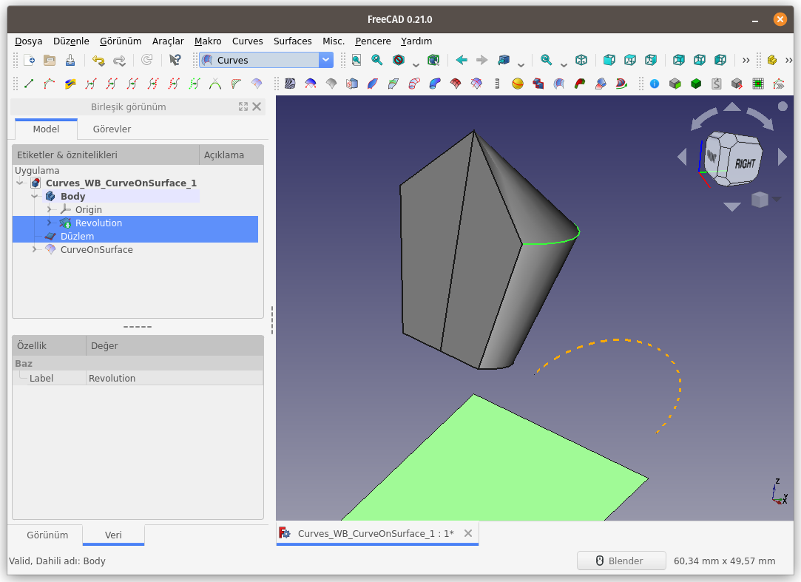
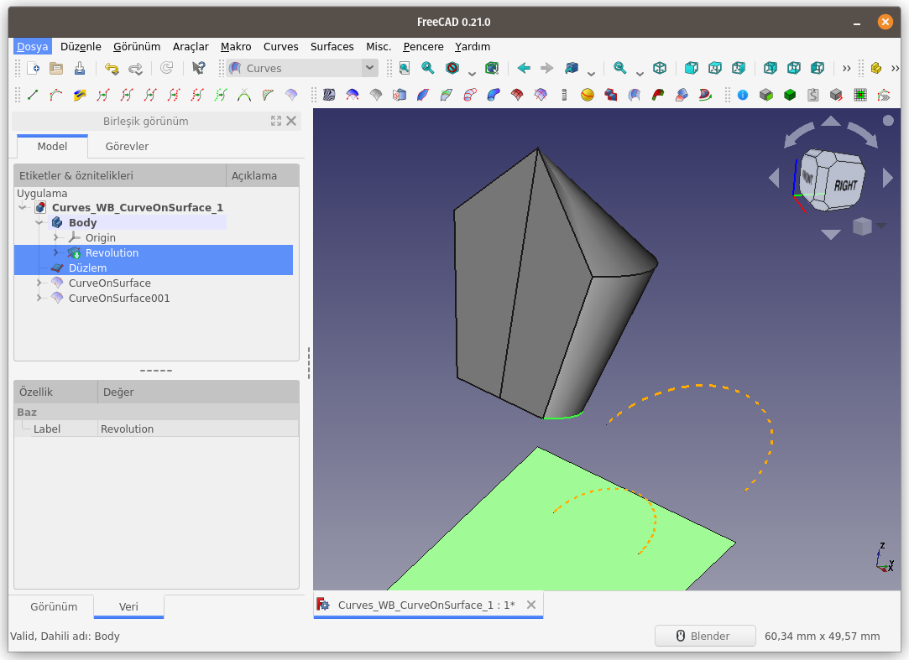
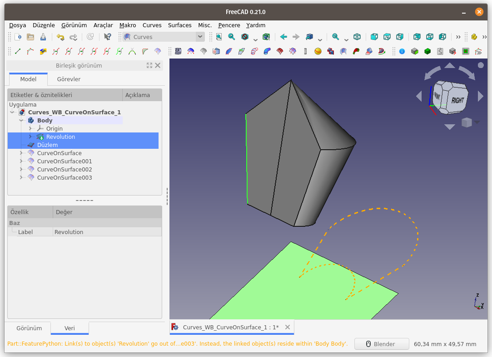
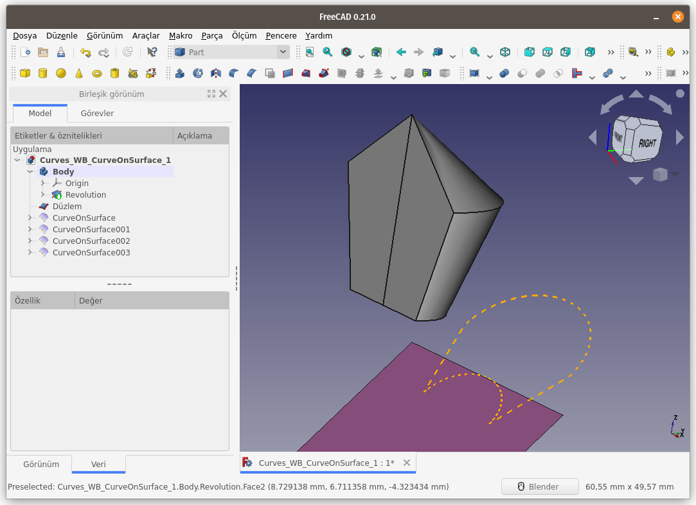
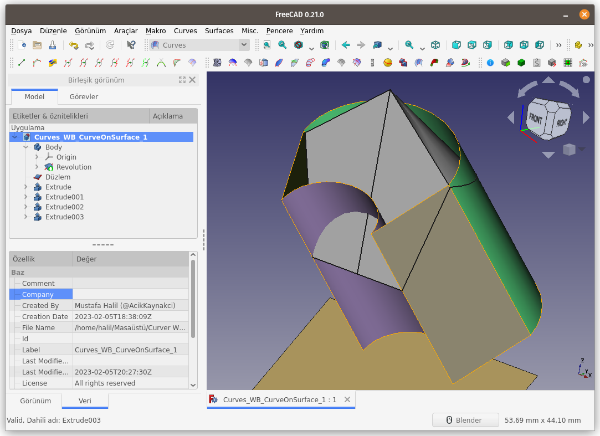

Title: FreeCAD - Curves WB - Curves - 12 - CurveOnSurface
Date: 2023-02-05 00:00
Category: Curves WB - Curves
Tags: FreeCAD, Curves, Workbench, ÇalışmaTezgahı, CurveOnSurface, Curve, Surface
Author: Mustafa Halil

#  CurveOnSurface:

**CurveOnSurface** komutu ile, seçilen eğrinin 
(veya kenar çizgisinin) izdüşümü, seçilen yüzey üzerine aktarılır. İşlem
 sonucunda yeni bir eğri oluşur.  

**Kullanım:** Komutu çalıştırmak için aşağıdaki işlemleri sırasıyla uygulayın:

- Öncelikle bir eğri (veya kenar çizgisi) ve yüzey seçin. (Birlikte seçim için **CTRL** tuşunu kullanın)
- Curves araç çubuğunda bulunan ilgili düğmeye basın, ya da
- **Curves** menüsündeki **CurveOnSurface** seçeneğini kullanın.

Seçili yüzey kendi normali doğrultusunda, seçili eğri ya da kenar çizgisi ile kesişecek şekilde hareket ettirildiğinde, eğri veya kenar, yüzey üzerinde nereye değerse izdüşümü o eğri olur.  
Seçili eğrinin (veya kenar çizgisinin), seçili yüzey üzerine izdüşümünün nasıl aktarıldığını, aşağıdaki resimlerden daha net 
anlayacaksınız.

Öncelikle bir eğri ve bir yüzey seçip **CurveOnSurface** komutunu çalıştıralım.
   
Sahnede turuncu renkli görünen kesik çizgi, seçili eğrinin, 
seçili yüzey üzerine izdüşümüdür. Bu izdüşüm, Unsur ağacında **CurveOnSurface** ismi ile görünmektedir.
   
3D modelimizin üst kısmına ait bir kenarı ve alt yüzeyi 
seçerek komutu çalıştırdığımızda elde ettiğimiz izdüşüm eğrisi aşağıda 
görünmektedir;
   
Gördüğünüz üzere, seçili kenar çizgisinin (hiponetüs) uzunluğu fazla olmasına rağmen, **CurveOnSurface** komutu sayesinde oluşan yeni eğrinin mesafesi 13,96mm olmaktadır. Bunun
 sebebi, seçilen kenar çizgisinin seçili yüzey normali doğrultusunda 
izdüşüm mesafesinin 13,96mm olmasıdır.
   
Modelimizin alt yüzeyindeki (yay ve doğru parçasından 
oluşan) alanı, üst kısımdaki eğrinin çevre uzunluğundan küçük olmasına 
rağmen, birlikte seçilip komut çalıştırıldığında, izdüşüm oluştuğu 
görülmektedir. Bu komuttaki temel mantık, seçili alanın, seçili kenar ya
 da eğriden büyük olması değildir. Yüzey seçmekteki amaç, seçili 
eğrinin, hangi yüzey normali doğrultusunda izdüşümünün oluşturulacağını 
belirtmektir.
   
Bir eğrinin izdüşümünün bir yüzey üzerine aktarılması sonucu yeni bir eğri oluşturmak için, eğri ve yüzeyin <u>aynı nesnede olma zorunluluğu <b>yoktur</b></u>. 2 farklı nesne kullanılarak ta, izdüşüm işlemi gerçekleştirilebilir. Aşağıdaki resimleri inceleyin lütfen.  
  
Yukarıdaki nesnenin alt kısmında bulunan eğri (yay parçası) 
ile Düzlem nesnesinin yüzeyi seçilirse, izdüşüm nasıl olur, bakalım;
   
Sol ve Sağ kenarları da seçip, düzlem yüzeye izdüşümünü alalım;
   
Tüm seçili çizgilerin/eğrilerin düzlem yüzey üzerindeki izdüşümü alındığında sonuç aşağıdaki gibi olmalı;
   
**CurveOnSurface** komutu sayesinde oluşan yeni
 eğrilerin, Yüzey normali doğrultusunda (extrude komutu ile) katılanması
 sonucunda, 3B nesnemizdeki seçili eğriler ile çakıştığı (eşit olduğu) 
görülmektedir.
   

[<<< Curves Menü Komutlarına Ait Sayfaya Dön]({filename}curves_wb_00_curves_menu.md)
