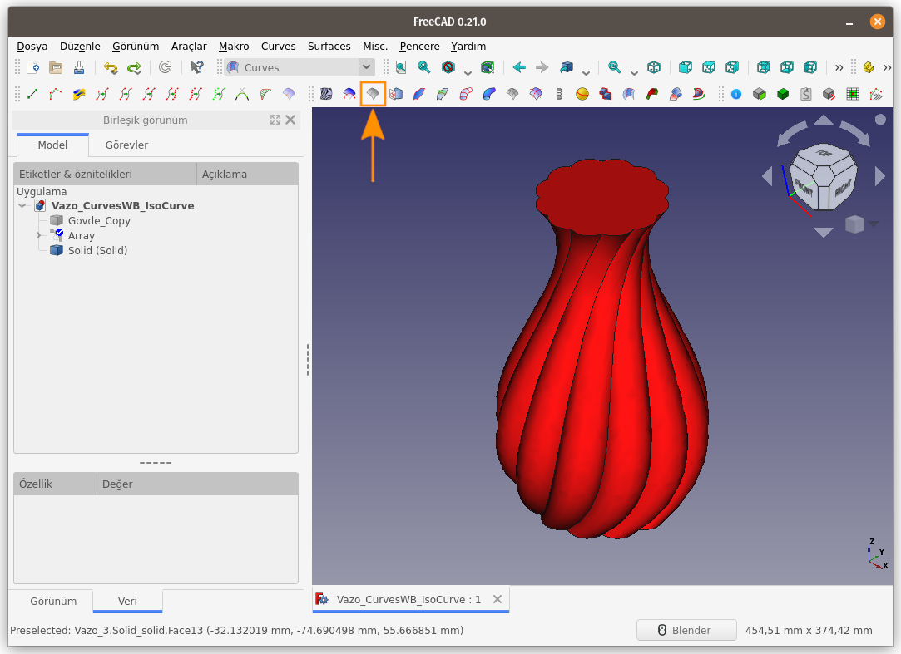
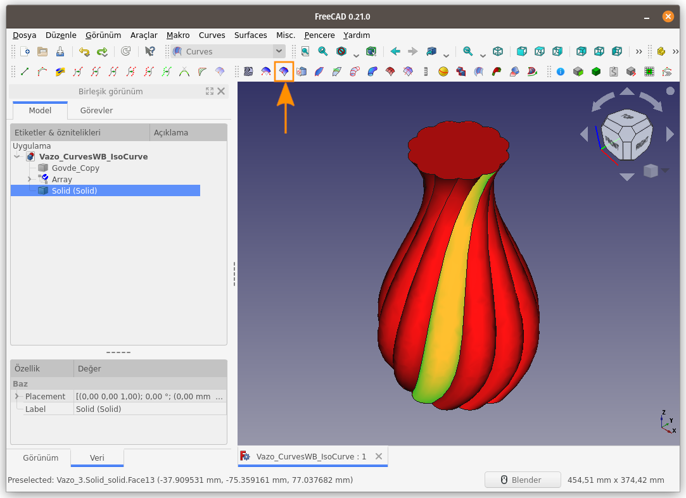
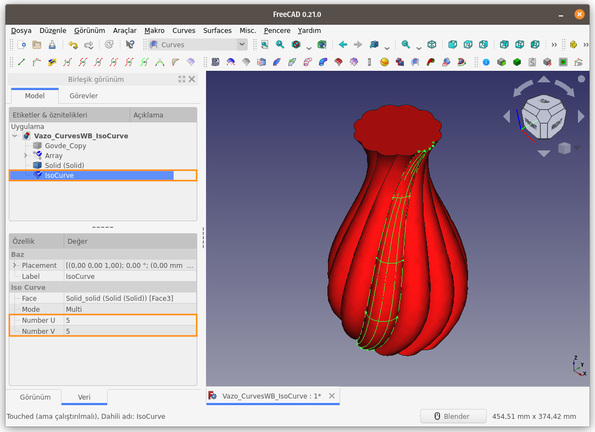
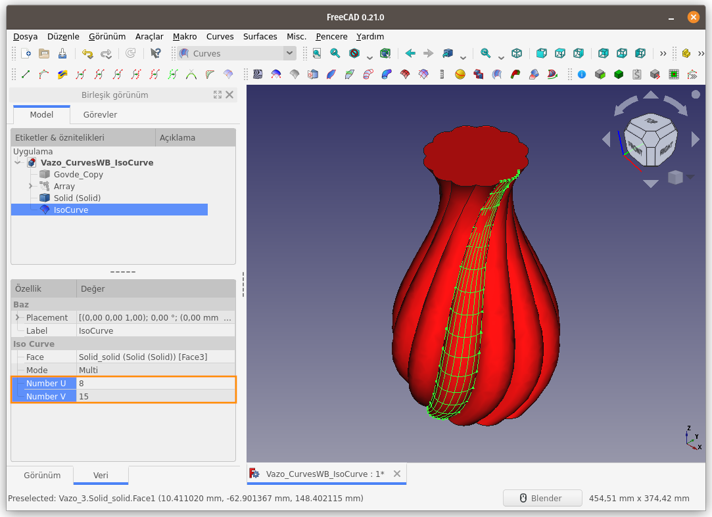
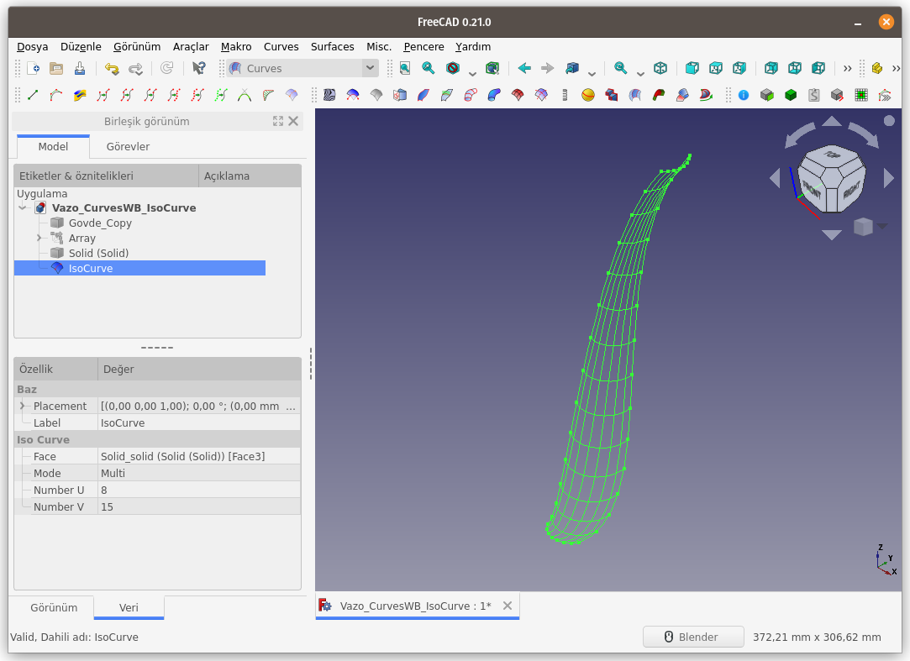

Title: FreeCAD - Curves WB - Surface - 03 - IsoCurve
Date: 2023-02-12 00:00
Category: Curves WB - Surfaces
Tags: FreeCAD, Curves, Workbench, ÇalışmaTezgahı, Surface, IsoCurve
Author: Mustafa Halil

#  IsoCurve

**IsoCurve** komutu, seçilen bir yüzeye UV yönelimli bir kafes yapısı uygular. Yani seçili yüzeyin, Yatay ve Düşey doğrultularında, yüzeyi kaplayacak şekilde, belirlenen sayıda eğriden oluşan wireframe denilen kafes yapısına oluşturur. Oluşan eğriler yüzeye
 temas eder.  

**Kullanım:** Komutu çalıştırmak için aşağıdaki adımları sırası ile uygulayın:

- Öncelikle bir veya birkaç yüzey seçin. (Birlikte seçim için `CTRL` tuşunu kullanın)
- Curves araç çubuğunda bulunan ilgili düğmeye basın, ya da
- **Curves WB** (Çalışma Tezgahındayken) **Surface** menüsündeki **IsoCurve** seçeneğini kullanın.

Daha önce Modellemiş olduğum Burgu Vazo çalışmasını açıyorum. Herhangi bir yüzey seçili olmadığı için, **IsoCurve** butonu pasif vaziyette.  
  
Bir yüzey seçtim ve butonu aktif hale geldi.
  
Aktifleşen **IsoCurve** butonuna tıklıyorum ve seçili yüzey üzerinde 5 yatay ve 5 düşey eğriden müteşekkil bir kafes yapısı oluşuyor.
  
Unsur ağacından **IsoCurve** nesnesi seçiliyken, **Özellikler** panelinde **Iso Curve** başlığı altında **Number U** ve **Number V** değerleri değiştirilerek, kafes yapısını oluşturan eğri sayısı artırılıp azaltılabilir.
  
Burgu Vazo nesnemizi gizleyip **IsoCurve** komutu ile oluşturduğumuz kafes yapısını incelersek, aşağıdaki şekil ile karşılaşırız.
  

[<<< Surfaces Menü Komutlarına Ait Sayfaya Dön]({filename}curves_wb_surfaces_00_menu.md)
