Title: FreeCAD - Curves WB - Surface - 05 - Sweep2Rails
Date: 2023-02-19 00:00
Modified: 2023-05-07 00:00
Category: Curves WB - Surfaces
Tags: FreeCAD, Curves, Workbench, ÇalışmaTezgahı, Surface, Sweep2Rails, Sweep, Rail
Author: Mustafa Halil

#  Sweep2Rails

**Sweep2Rails** komutu, düzlemsel bir yüzeyden, bir dizi eğri (ray) aracılığıyla eğrisel şekilli **nokta bulutu, profil/ray eğrileri** ya da **tel kafes yapısı** oluşturmamızı sağlar. Konunun anlaşılması için aşağıdaki metinleri okuyup resimleri inceleyin lütfen.  

**Kullanım:** Komutu çalıştırmak için aşağıdaki adımları sırası ile uygulayın:

- Öncelikle bir düzlem yüzey ve bir dizi (en az 2) eğri seçin. (Birlikte seçim için `CTRL` tuşunu kullanın)
- Curves araç çubuğunda bulunan ilgili düğmeye basın, ya da
- **Curves WB** (Çalışma Tezgahındayken) **Surface** menüsündeki **Sweep2Rails** seçeneğini kullanın.

Konunun anlaşılması amacıyla, Kürek ucuna benzer bir parça modelleyeceğiz. Öncelikle aşağıdaki resimde gördüğünüz eğrileri çizdim.  
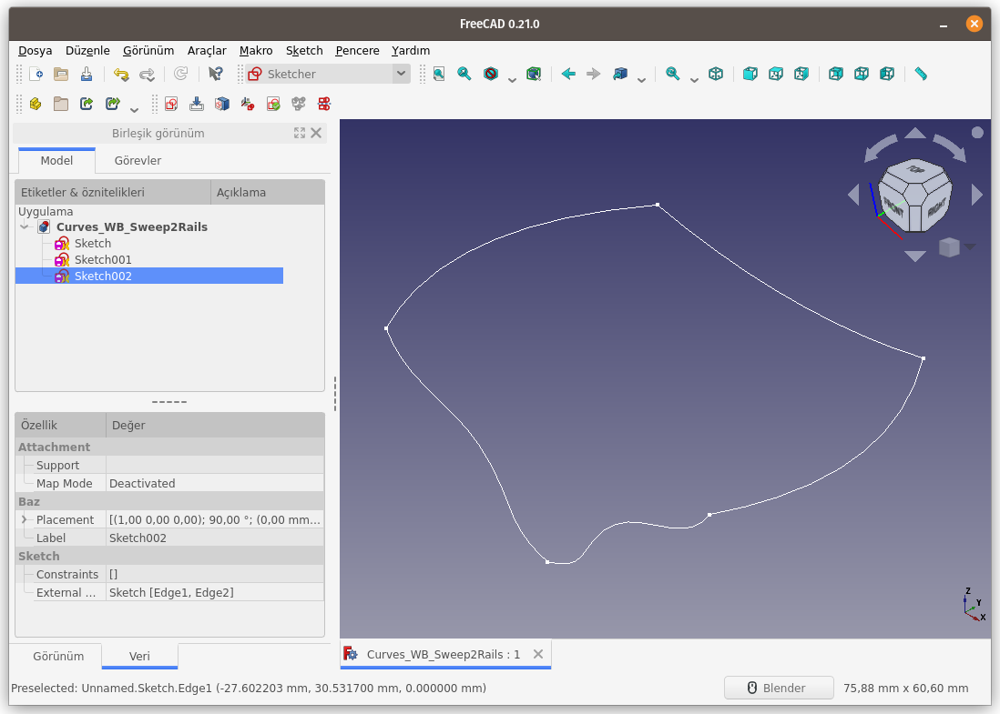  
Doğrusal bir yüzey oluşturmak için 2 eğriyi seçerek, Parça Çalışma Tezgahındaki (Part WB'teki) **Düzenli Yüzey Oluştur (Create ruled surface)** komutunu çalıştırdım.
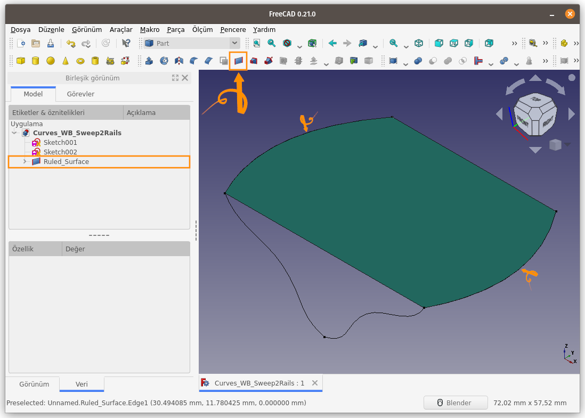  
Düzlem yüzey ile 2 adet ray eğrisini seçerek Curves araç çubuğunda bulunan ilgili düğmeye basın, ya da **Surface** menüsündeki **Sweep2Rails** seçeneğini kullanın.
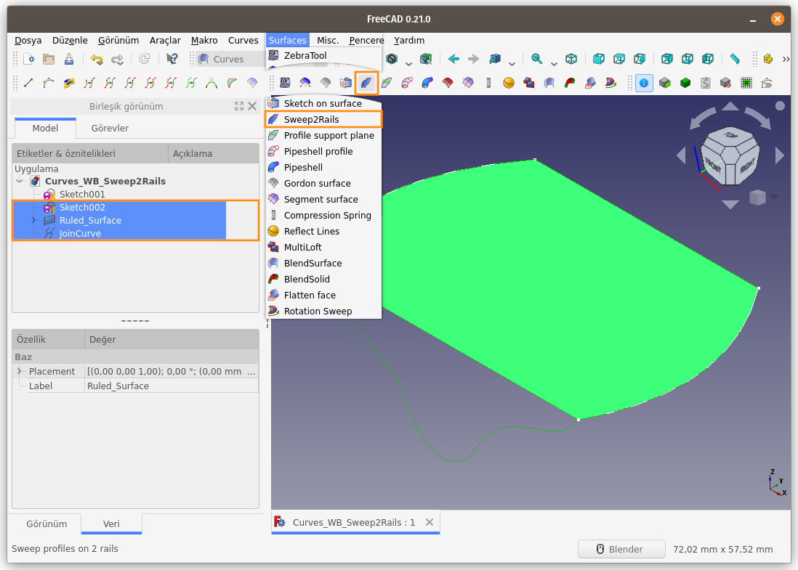  
İşlem sonucunda düzlem yüzey kaybolacak ve varsayılan olarak bir **noktalar / nokta bulutu (points)** oluşacaktır.
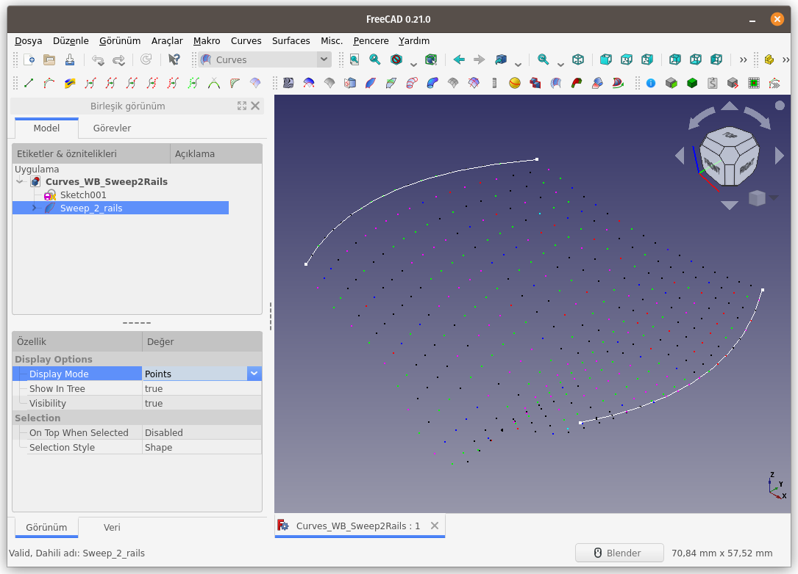  
Unsur ağacından **Sweep_2_rails** nesnesi seçilir, **Veri** Sekmesinden **Profile Samples** ve **Rail Samples** değerleri değiştirilerek, oluşan **nokta bulutu (points), profil(profile) / ray(rail) eğrileri** ya da **tel kafes yapısı (wireframe)** ile oynanabilir.
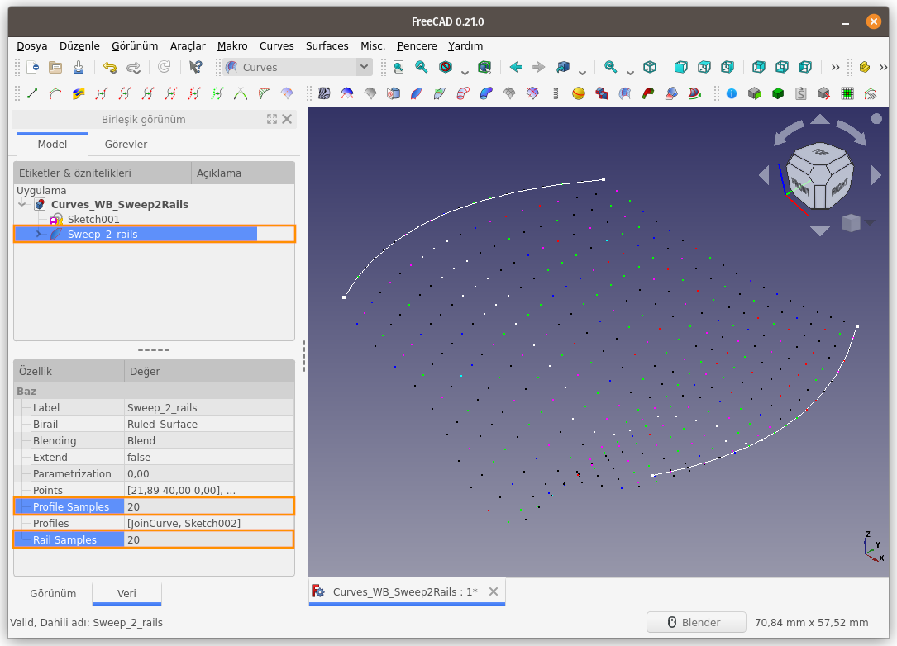  
Değerleri değiştirip yapıdaki değişimi görelim;  
**Profile Samples**:40  
**Rail Samples**: 20 
  
Unsur ağacından **Sweep_2_rails** nesnesi seçerek **Görünüm** Sekmesindeki **Görünüm Biçimi (Display Mode)** seçeneklerini değiştirerek, **nokta bulutu, profil/ray eğrileri** ya da **tel kafes yapısı** arasında geçiş yapılabilir.  
**Profiller (Profiles):** 
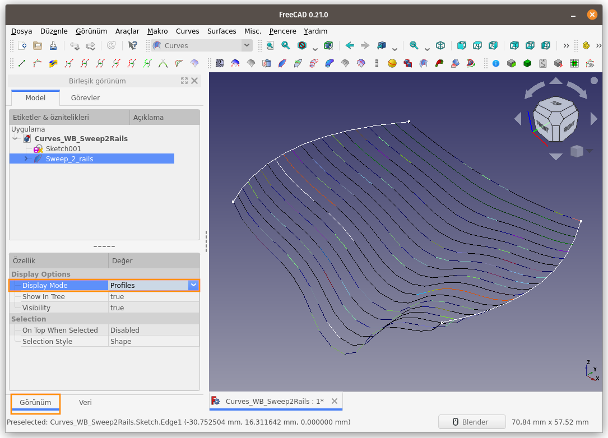  
**Raylar (Rails):** 
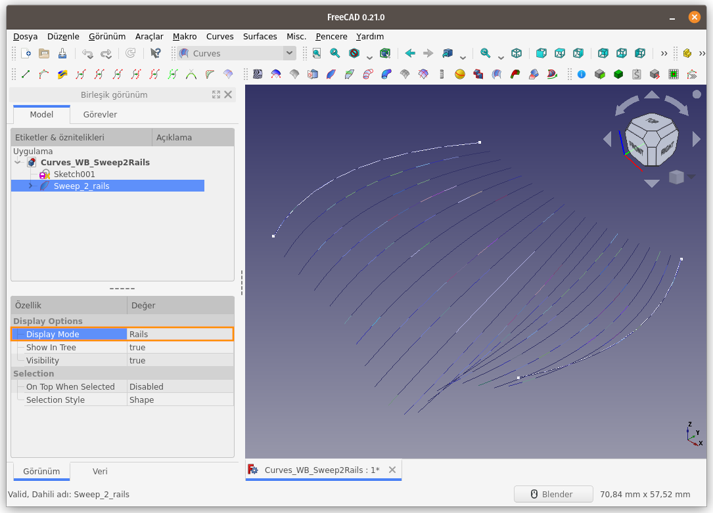  
**Tel Kafes Yapısı (Wireframe):** 
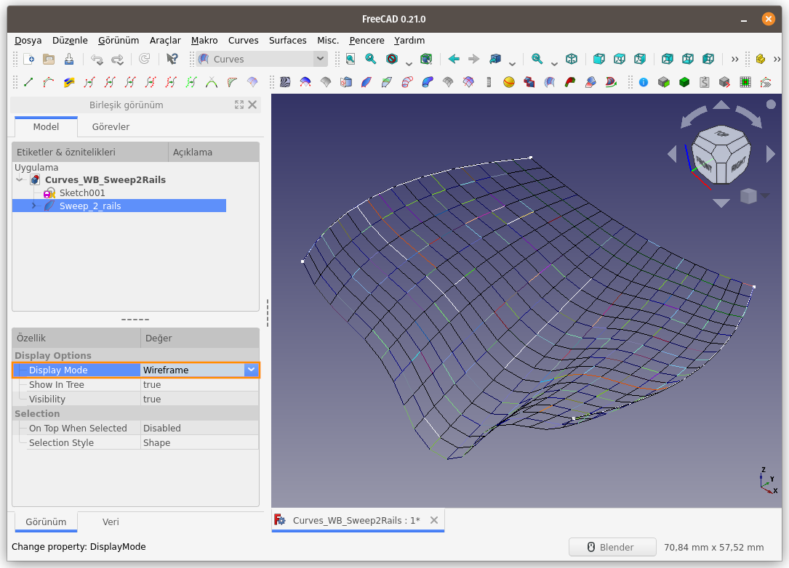  
Oluşan nokta bulutu, profil/ray eğrileri ya da tel kafes yapısı, [**Approximate**](https://mhalil.github.io/Freecad_curves_wb_curves.html#approximate) komutu yardımı ile eğrisel yüzeye dönüştürülebilir.
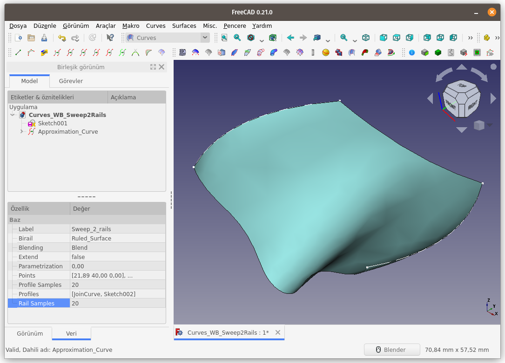  
Yeni oluşan eğrisel yüzeye, Parça Çalışma Tezgahındaki (Part WB'teki) **3D Offset...** komutu ile et kalınlığı verirsek, aşağıdaki sonucu elde ederiz.
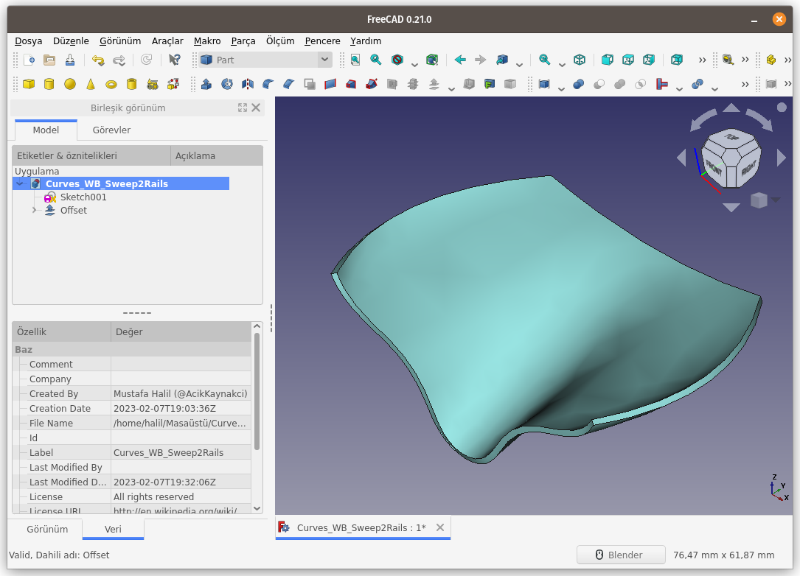  
**Sweep2Rails** komutu ile, yukarıda oluşturmuş olduğumuz düzlem yüzeyi kullanarak, iki adet eğri yerine bir dizi (örneğin 3 adet) ve farklı yönlerde eğri (ray) kullanarak nokta bulutu ve sonrasında yüzey oluşturalım. Böylece bu komutun gücünü daha net 
görelim.  
Ray (Rail) olarak kullanacağımız 3 adet eğri aşağıda gösterilmektedir.
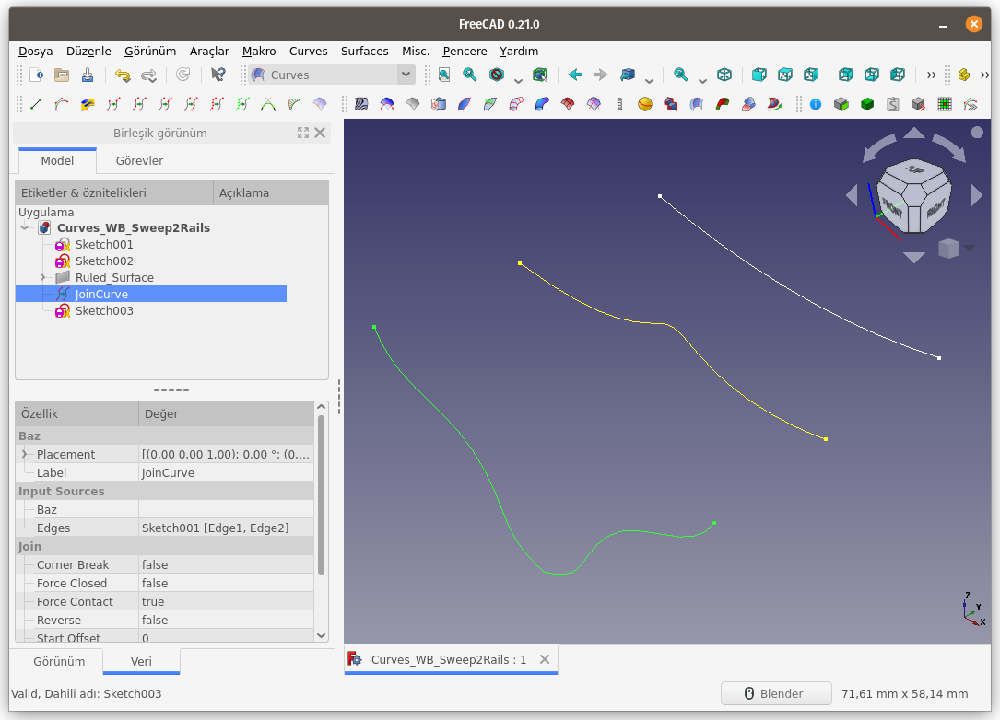  
3 eğriyi ve bir yüzeyi `Ctrl` tuşu yardımıyla seçiyoruz.
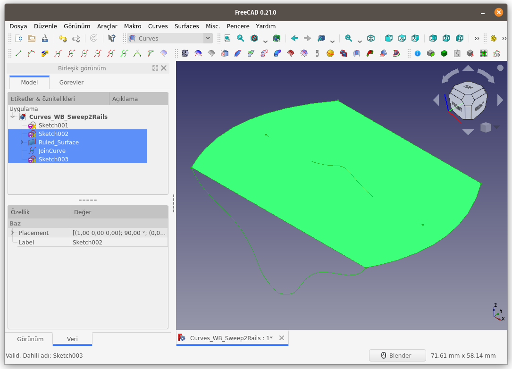  
**Sweep2Rails** komutunu çalıştırıyoruz.
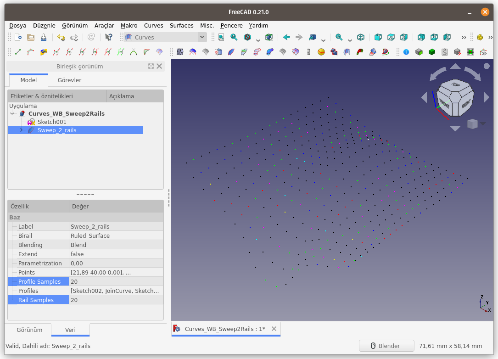  
Oluşan noktaları (points), [**Approximate**](https://mhalil.github.io/Freecad_curves_wb_curves.html#approximate) komutu yardımı ile eğrisel yüzeye dönüştürüyoruz.
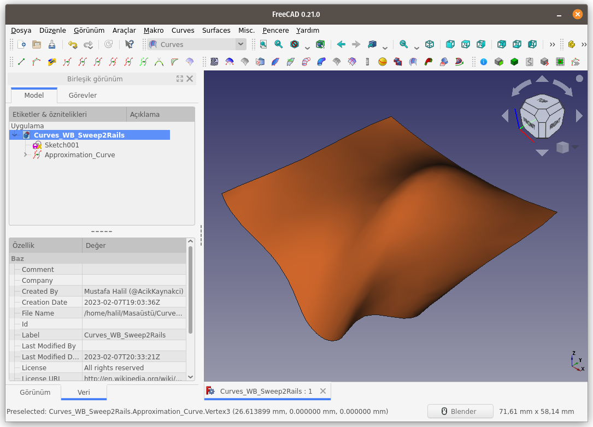  
Sonuç sizce de şık olmadı mı?

[<<< Surfaces Menü Komutlarına Ait Sayfaya Dön]({filename}curves_wb_surfaces_00_menu.md)
