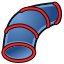
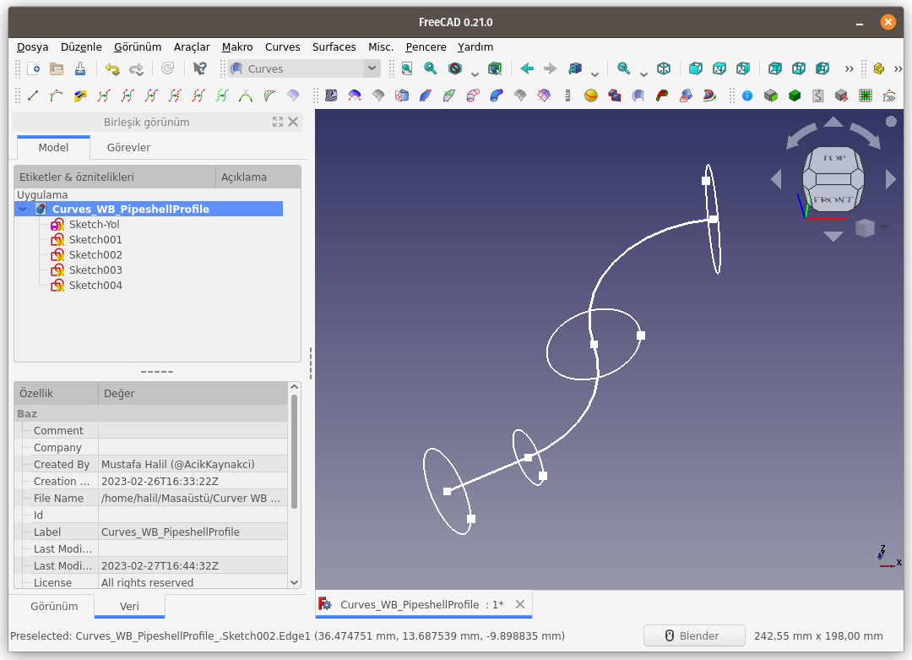
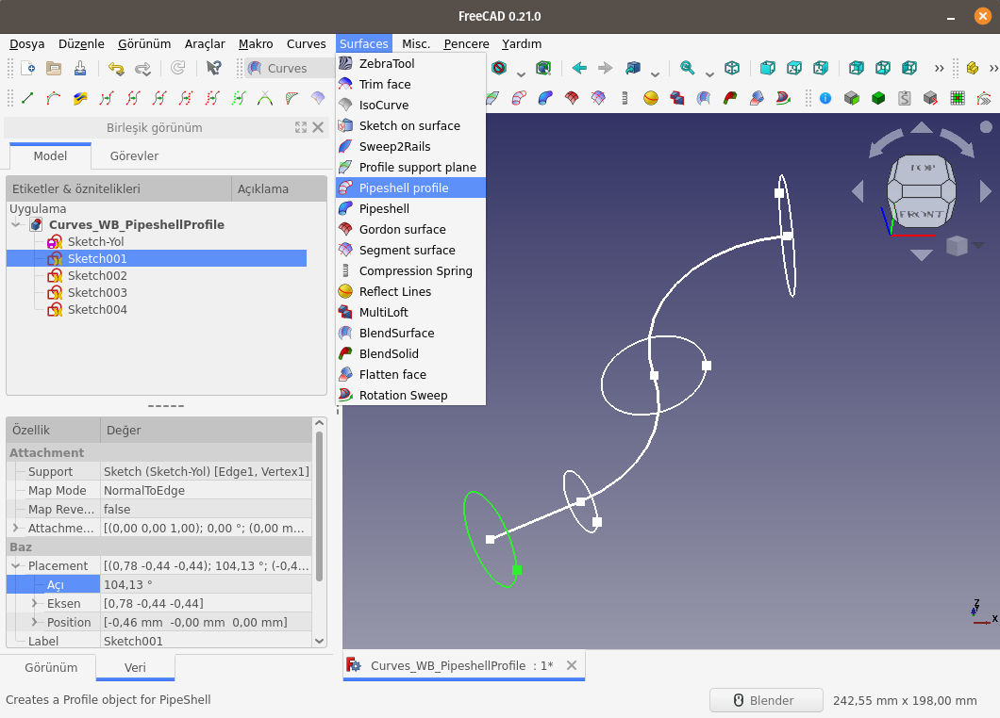
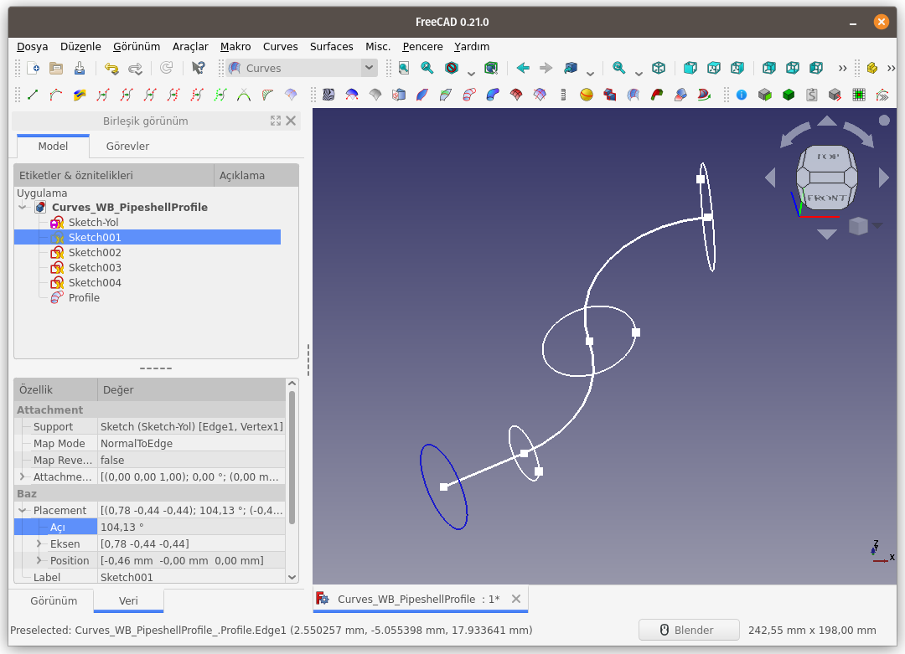
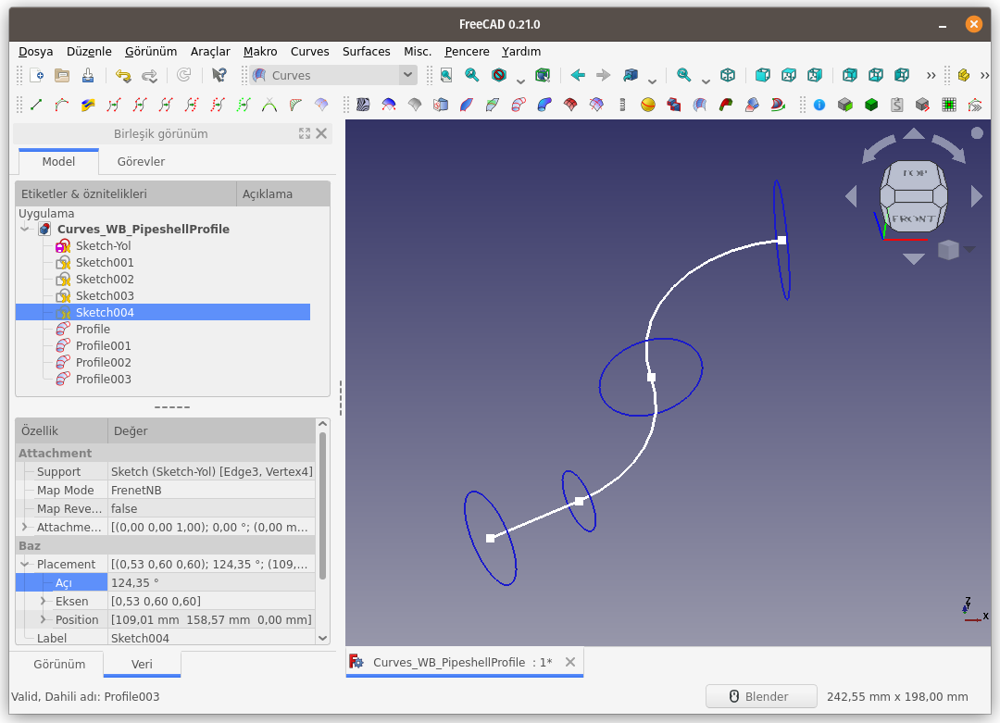
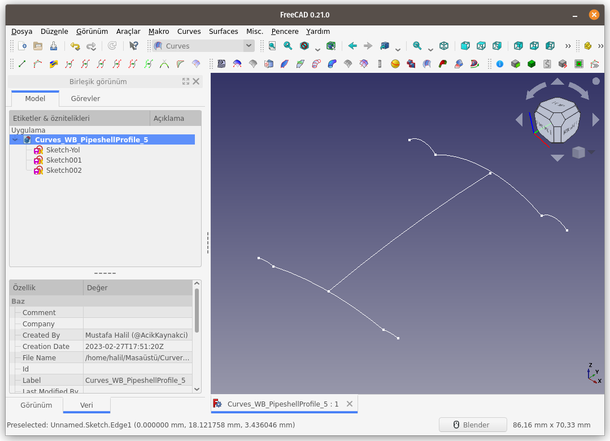
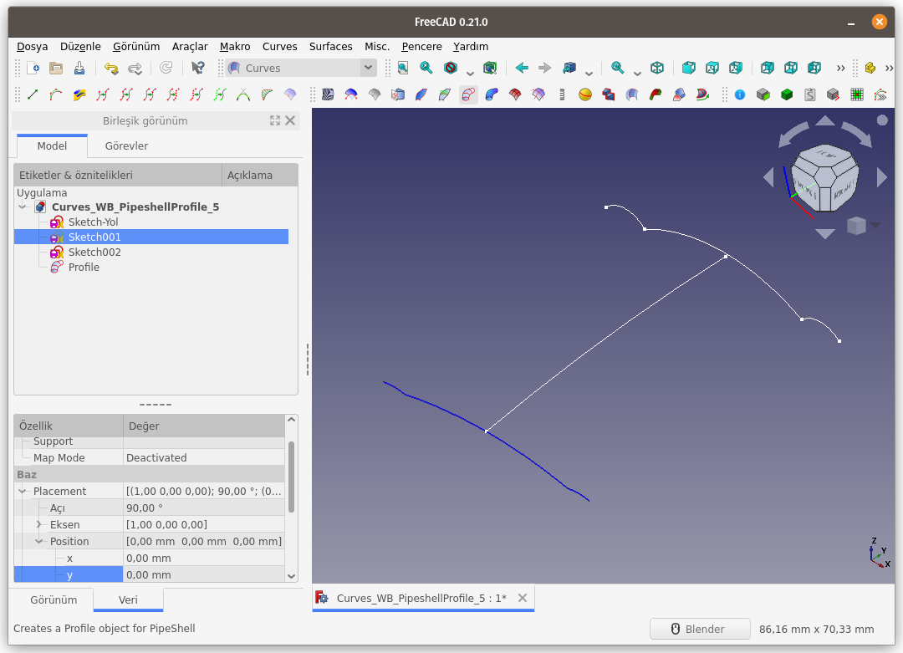
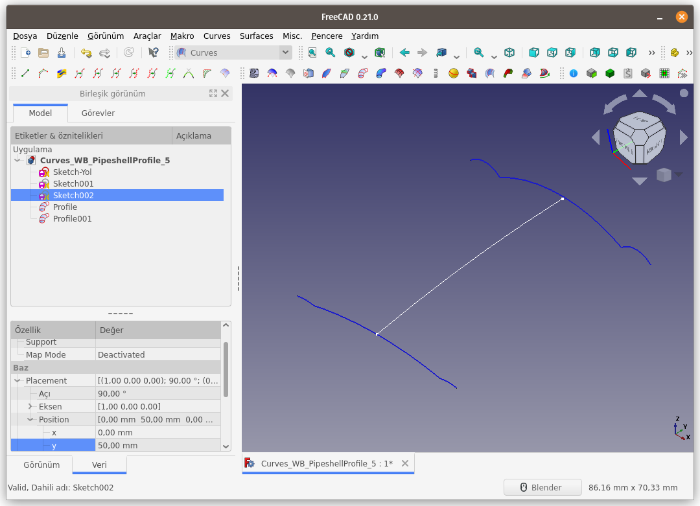

Title: FreeCAD - Curves WB - Surface - 07 - Pipeshell profile
Date: 2023-02-27 00:00
Category: Curves WB - Surfaces
Tags: FreeCAD, Curves, Workbench, ÇalışmaTezgahı, Surface, Pipeshell, profile
Author: Mustafa Halil

#  Pipeshell profile

**Pipeshell profile** komutu, **Parça Çalışma Tezgahı (Part WB)** ve **Parça Tasarımı Çalışma Tezgahı (Part Desing WB)** komutlarından olan **Süpür/Borula (Sweep/AddivitePipe)** komutlarında kullanılan **süpürülecek olan kesit alan (boru kesiti)** oluşturmaya yarayan komuttur. Anlatım biraz kafa karıştırıcı olabilir. Aşağıdaki açıklamaları ve sonraki komut olan **Pipeshell** komutunu okurken konuyu daha net anlayacağınızı düşünüyorum.

**Kullanım:** Komutu çalıştırmak için aşağıdaki adımları sırası ile uygulayın:

- Öncelikle 3D ekranı içinden ya da Unsur agacından bir nesne (eğri, çizgisi, çember, ...vb) seçin.
- Curves araç çubuğunda bulunan ilgili düğmeye basın, ya da
- **Curves WB** (Çalışma Tezgahındayken) **Surface** menüsündeki **Pipeshell profile** seçeneğini kullanın.

3D ekranı içinden (sahneden) ya da Unsur agacından bir nesne (eğri, çizgisi, çember, ...vb) seçin.  
  
Curves araç çubuğunda bulunan butona basarak ya da **Surface** menüsünden seçerek **Pipeshell profile** komutunu çalıştırın.
  
Seçili olan nesne gizlenecek ve ona bağlı yeni bir nesne oluşturulacaktır. Oluşan yeni nesneyi Unsur agacında **Profile** ismi ile görebilirsiniz. Bu nesnenin rengi varsayılan olarak mavi olarak ayarlanır.
  
Süpürülecek tüm nesneleri sıra ile seçerek **Pipeshell profile** komutunu çalıştırın.
  
Kesit olması istenilen (süpürülecek) nesne sadece daire, çember ya da elips olmak zorunda değil. Kapalı çokgenler de kesit olarak seçilebilir.
  
  
Hatta Kesit, kapalı nesne olmak zorunda da değil.
  
  
Araba kaportası oluşturacak şekiller de, kesit olarak kullanılabilir.
  
  
  

[<<< Surfaces Menü Komutlarına Ait Sayfaya Dön]({filename}curves_wb_surfaces_00_menu.md)
