Title: FreeCAD - Curves WB - Surface - 11 - Compression Spring
Date: 2023-03-18 00:00
Category: Curves WB - Surfaces
Tags: FreeCAD, Curves, Workbench, ÇalışmaTezgahı, Surface, Compression, Spring 
Author: Mustafa Halil

# 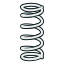 Compression Spring

**Compression Spring (Baskı Yayı)** komutu, adından anlaşıldığı üzere, baskı yayı / sıkıştırma yayı oluşturmak için kullanılan komuttur.  

**Kullanım:** Komutu çalıştırmak için aşağıdaki adımları sırası ile uygulayın:

- Curves araç çubuğunda bulunan ilgili düğmeye basın, ya da
- **Curves WB** (Çalışma Tezgahındayken) **Surface** menüsündeki **Compression Spring** seçeneğini kullanın. Bu sayede sahneye bir baskı yayı (eğrisi) eklenir.

**Curves** araç çubuğunda bulunan ilgili düğmeye, ya da **Curves WB** (Çalışma Tezgahındayken) **Surface** menüsündeki **Compression Spring (Baskı Yayı)** butonuna basarak komutu çalıştıralım. Sahnenin boş olduğunu, Unsur ağacında hiç bir öğe olmadığına dikkat edin.  

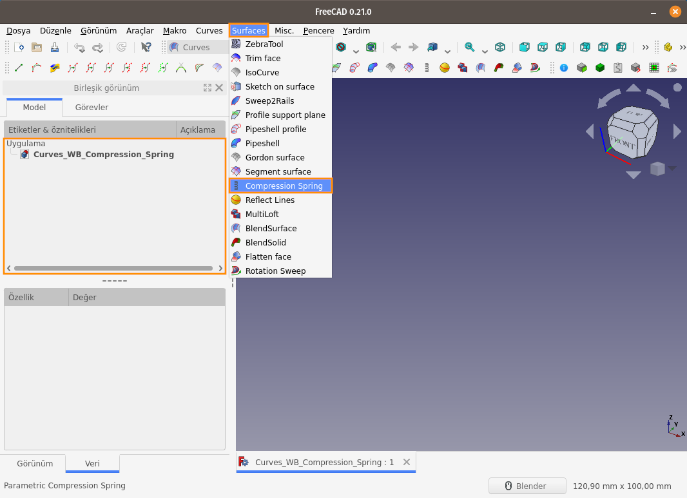  
Komut çalıştırılınca sahneye bir Baskı Yayı (eğrisi) ekleniyor. Unsur ağacından **CompSpring** öğesi seçildiğinde, Baskı yayına ait parametreler aşağıdaki gibi görüntüleniyor. Baskı Yayının **Diameter (Çap)** değeri **4 mm** olarak belirlenmiş. Bu değeri değiştirerek sonucu inceleyelim.
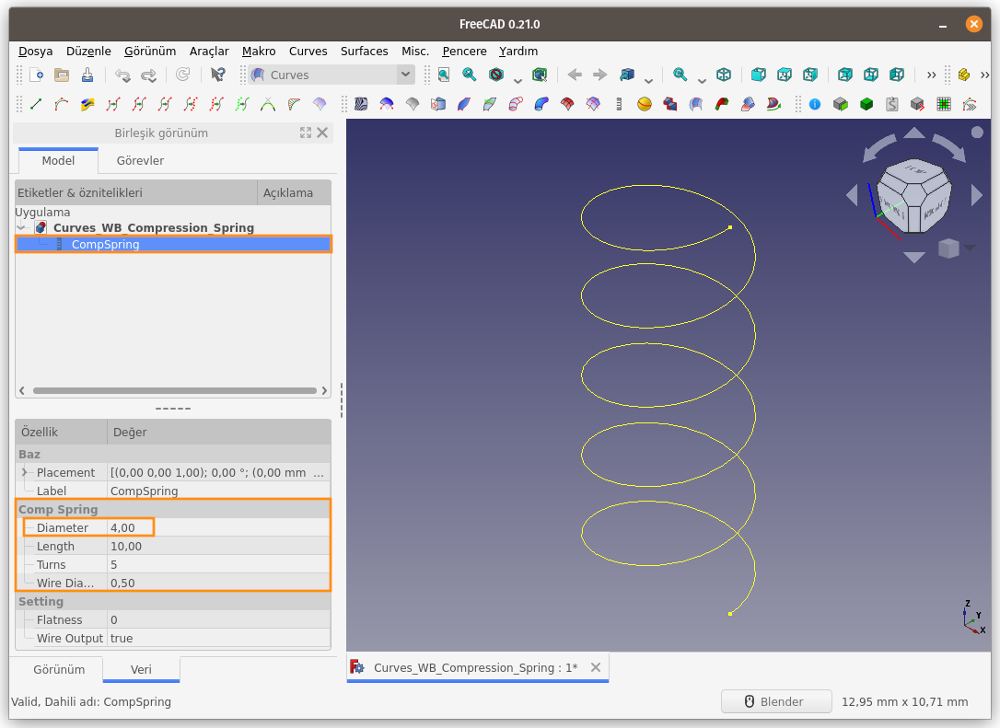  
Baskı Yayının **Diameter (Çap)** değerini **10 mm** olarak değiştirdiğimizde, Baskı yayı otomatik olarak güncelleniyor.
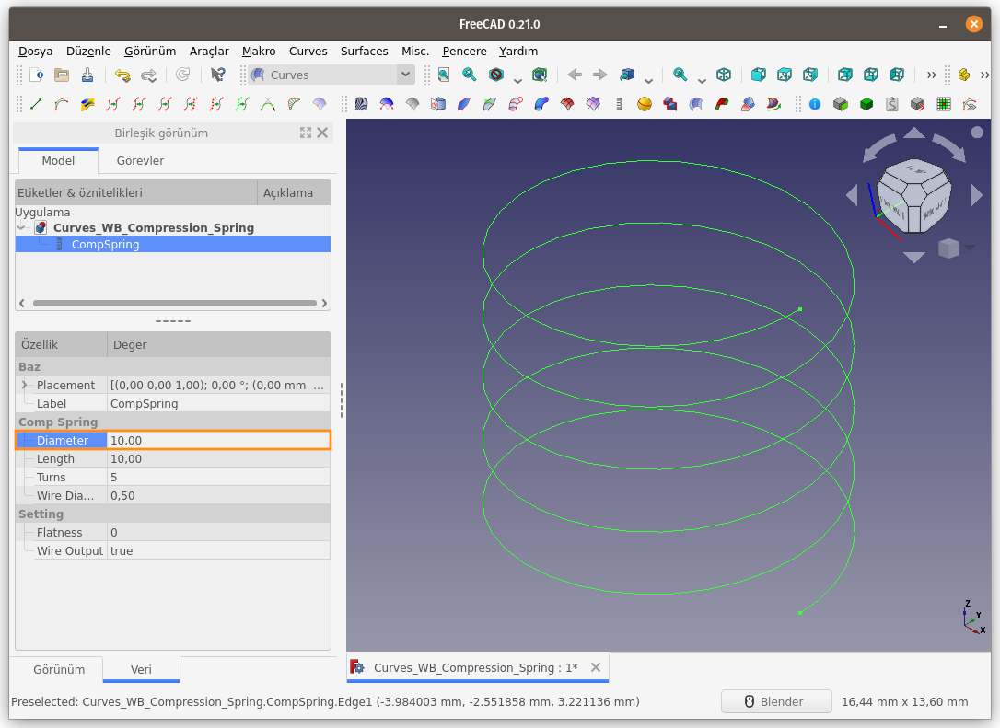  
Baskı Yayını oluşturan bir diğer parametre olan **Length (Boy/Uzunluk/Mesafe)** değerini değiştirerek soncu görelim.  
**10 mm** olan **Length (Boy/Uzunluk/Mesafe)** değerini **5 mm** olarak değiştirdiğimizde görüyoruz ki, baskı yayı daha kısa mesafeye sahip olarak oluşturuldu, yani baskı yayı sıkışmış bir şekil aldı diyebiliriz. Bu parametre değiştirilerek gerçekci animasyon 
oluşturulabilir.
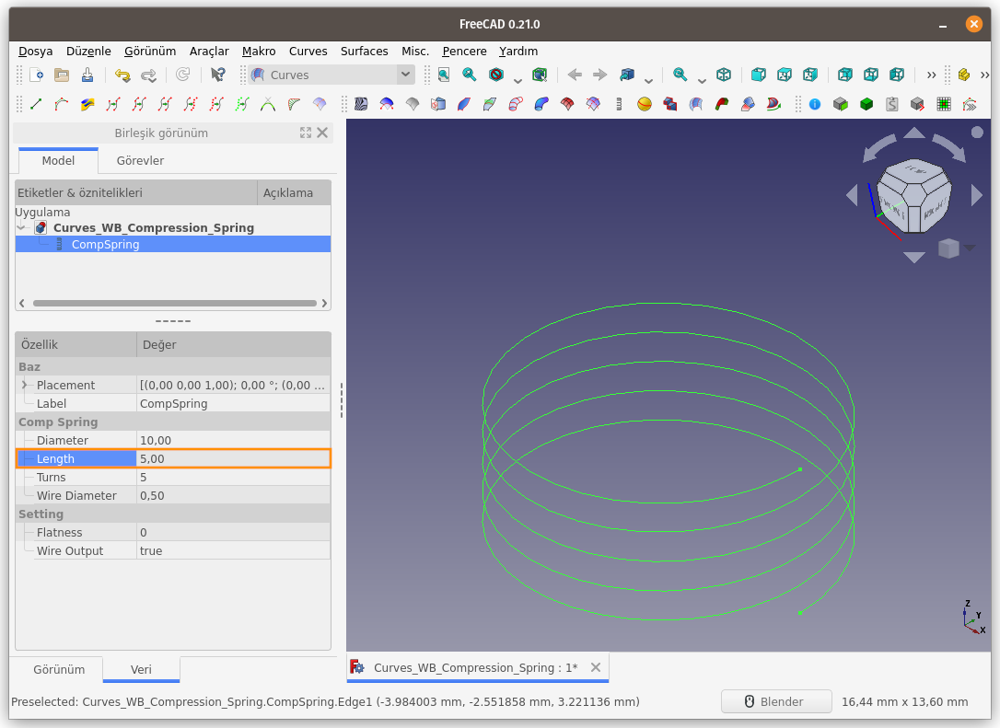  
**Turns (Çevrim/Dönüş)** değeri, Baskı Yayı oluşturulurken eğrinin kaç tur döndürülerek yay oluşturulması gerektiğini belirttiğimiz parametredir. Vidalarda **Hatve / Adım** değeri ile aynı değerdir.  
**5** olan **Turns** değerini **2** olarak değiştirdiğimizde elde ettiğimiz yayın görüntüsü aşağıdadır. Bu ayar ile Eğri, başlangıç noktasından itibaren 2 tur çevrilerek yay elde edildi.
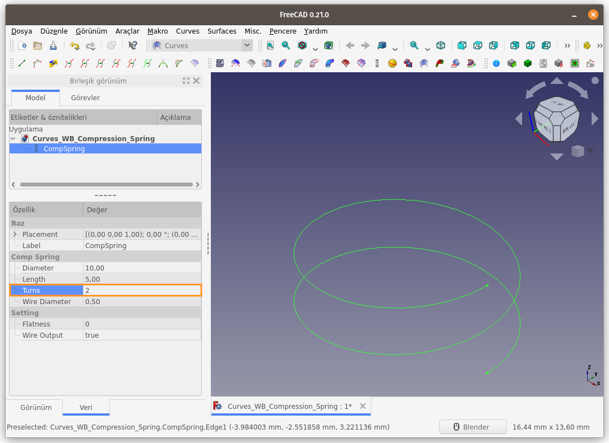  
**Wire Output**, Baskı Yayının görünümünün ayarlandığı parametredir. **Wire Output (Tel Ürün/Sonuç)** parametresinin alabileceği değerler **true (doğru)** ve **false (yanlış)** ile sınırlıdır. Parametre değerini **false (yanlış)** olarak belirlediğimizde, **Baskı Yayı Tel olarak görünmesin** demiş oluyoruz ve baskı yayı dairesel kesitli bir yaya dönüşmüş oluyor.
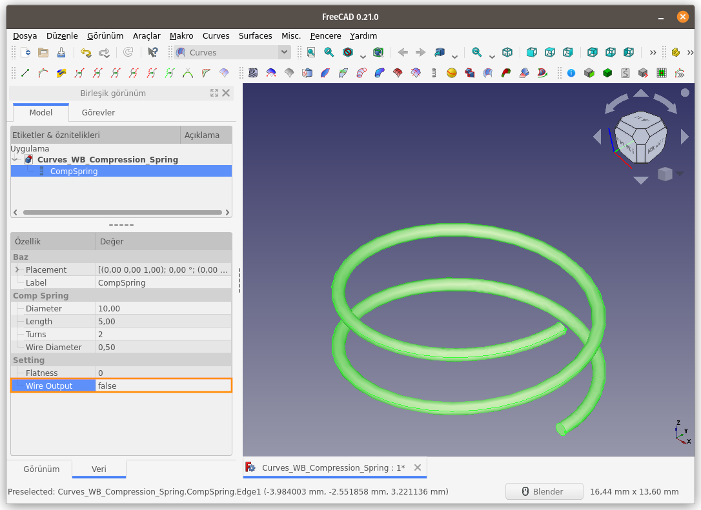  
**Wire Output** parametresi **false (yanlış)** olarak değiştirildiğinde elde ettiğimiz dairesel kesite ait çap değerini, **Wire Diameter (Tel Çapı)** parametresi ile belirleyebiliyoruz.  
**0,5 mm** olan **Wire Diameter (Tel Çapı)** parametre değerini **1,25 mm** olarak değiştirdiğimizde, Baskı Yayının görünümü de eş zamanlı olarak güncelleniyor.
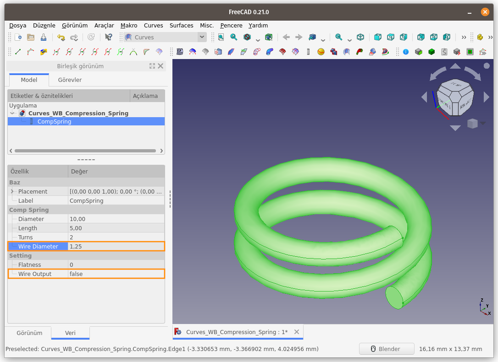  
**Flatness (Düzlük / Düzgünlük)** parametresi, Baskı Yayının uç noktalarının düzlemsel olarak ayarlanmasını sağlayan parametredir.  
**Flatness (Düzlük / Düzgünlük)** parametre değeri **0 (sıfır)** iken oluşan Yaya ait Ön Görünüm, aşağıdaki gibidir.
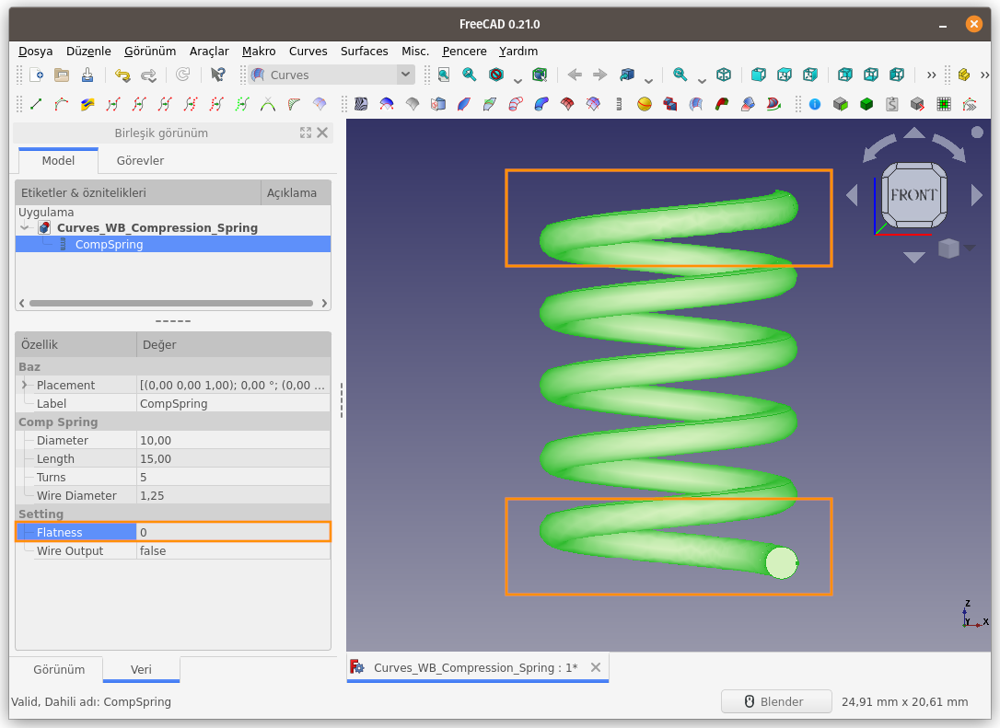  
**Flatness (Düzlük / Düzgünlük)** parametre değerini artırarak Yayın düzlemsel bir yüzeye tam olarak oturması / temas yüzey alanının artırılması sağlamak sağlanabilir.  
**Flatness** değerini **4** olarak değiştirerek elde ettiğimiz Yaya bakalım
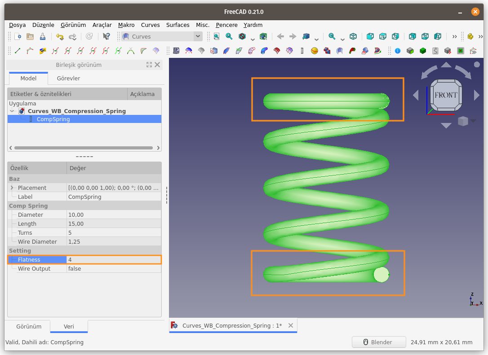  
Baskı Yayının **Diameter (Çap)** parametresini incelemek için sahneye yarıçapı **5 mm** olan bir silindir nesnesi ekliyorum.
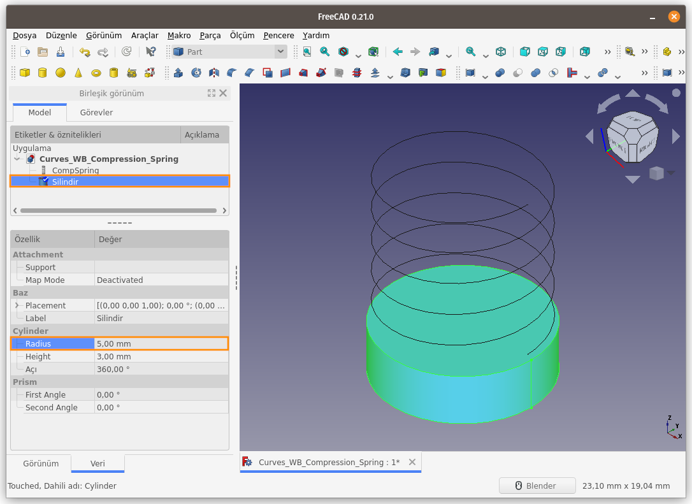  
**ComSpring** nesnesinin **Wire Output** parametresini **false (yanlış)** olarak ayarlıyorum. Sonuç aşağıda.
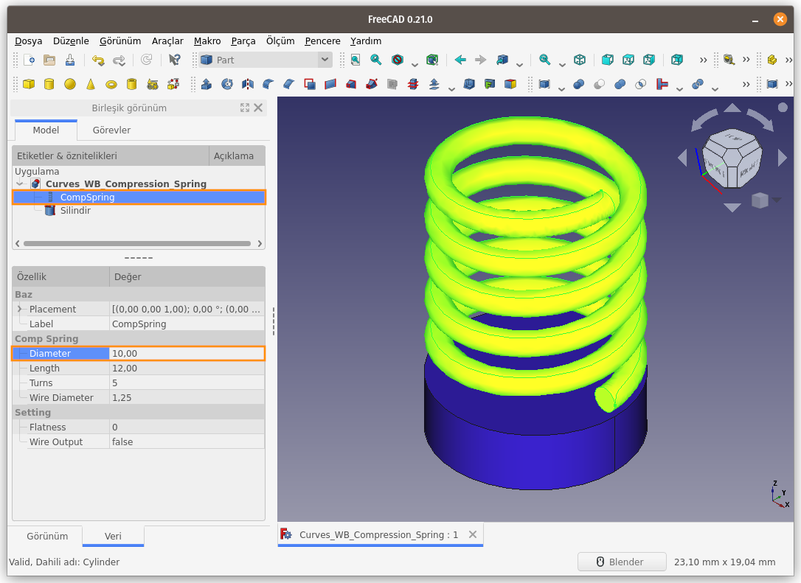  
Sahneye **Ön Görünüm**'den baktığımda Baskı Yayının **Diameter (Çap)** değerinin Silindire kıyasla nasıl göründüğünü daha net olarak görebiliyorum.
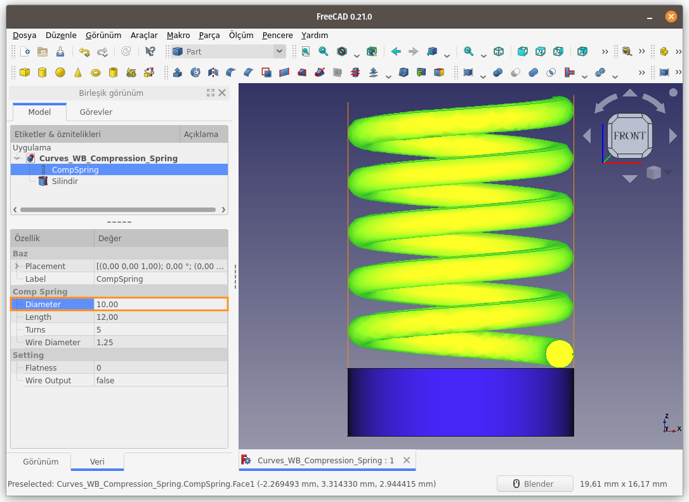  
Silindir yarıçapını **8 mm** (Çapı 16mm), Baskı Yayının Çap değerini de **16 mm** olarak ayarladığımda sonuç yine değişmiyor. Yani Baskı Yayının Çap değeri olarak kastedilen değer, Yayın **Dıştan Dışa** olan çap mesafesidir. Yani **Wire Diameter (Tel Çapı)** parametre değeri, Baskı Yayının konulacağı deliğe/yuvaya ait çap değerini temsil ediyor. 
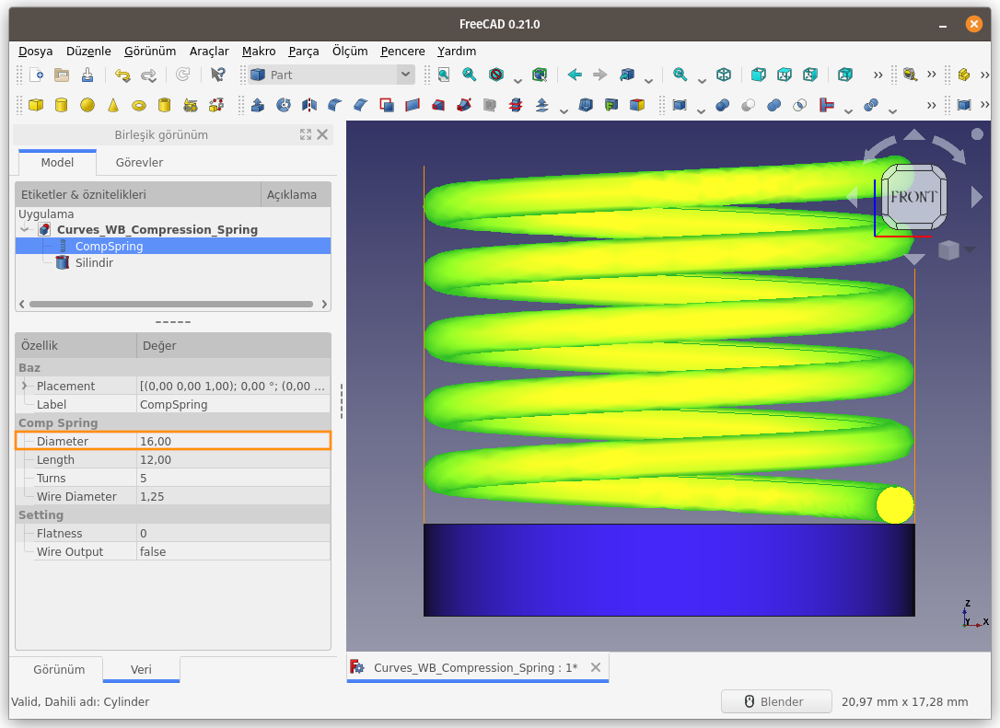  
**Wire Diameter (Tel Çapı)** parametre değerini artırmamıza rağmen, oluşan Baskı Yayının et kalınlığının içe doğru büyüdüğü, yayın dış çapın değişmediği, iç çap değerinin azaldığı, aşağıdaki görüntüden net bir şekilde görülmüş oluyor.
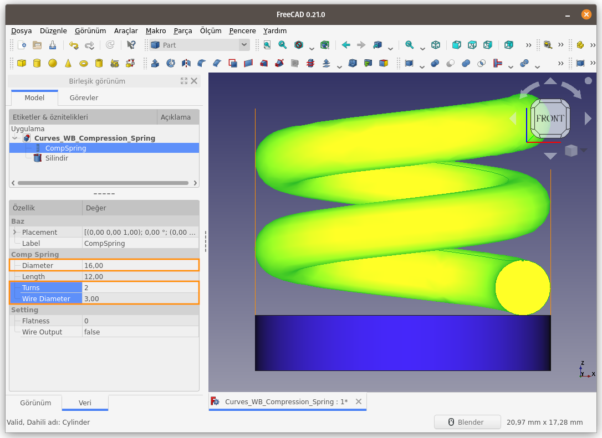  

[<<< Surfaces Menü Komutlarına Ait Sayfaya Dön]({filename}curves_wb_surfaces_00_menu.md)
