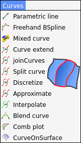
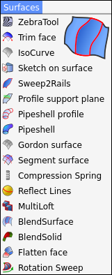

Title: FreeCAD
Date: 2022-02-10 00:00
Modified: 2025-11-09 14:40
Category: FreeCAD
Tags: FreeCAD, 3D, CAD
Author: Mustafa Halil
Summary: FreeCAD Eğitim Notları

# FreeCAD Eğitim Sayfası

Bu bölümde, FreeCAD içerisinde **Komut Dosyası Oluşturma (Scripting)** konusu ve Bazı **Çalışma Tezgahlarına (Curves Workbench [Eğriler Çalışma Tezgahı])** ait komutların ne işe yaradığını ve nasıl kullanılacağını öğreneceğiz.

## [ .:: FreeCAD Komut Dosyası Oluşturma (Scripting) Notları ::.]({filename}../freecad/scripting/freecad_scripting.md)

FreeCAD içerisinde Komut Dosyası Oluşturma (Scripting) Konusunu öğrenmeye çalışıyor ve Türkçe içerikli Kaynak oluşturmayı hedefliyorum. 
Bu bölümde İlk etapta **Python** programlama dili hakkında kısa bir bilgi verecek ardından betik (komut dosyası) yazma konusundan devam edeceğim.  

## [.:: Curves Workbench - CURVES Menüsü ::.]({filename}../freecad/curves-wb-curves/curves_wb_00_curves_menu.md)

**Curves Workbench (Eğriler Çalışma Tezgahı)**,  NURBS eğrileri ve yüzeyleri için bir araç koleksiyonuna dayalı python tabanlı harici bir çalışma tezgahıdır. Bu çalışma tezgahı FreeCAD Master ve OCC 7.4 ile geliştirilmiştir. Bu Çalışma tezgahı ile **Yüzey modelleme** konusunda ihtiyacımızı karşılayan pek çok faydalı komut kullanımımıza sunulmuştur. Bu bölümde **Eğriler (Curves)** menüsüne ait komutların detayları incelenmektedir.

## [.:: Curves Workbench - SURFACES Menüsü ::.]({filename}../freecad/curves-wb-surfaces/curves_wb_surfaces_00_menu.md)

**Eğriler Çalışma Tezgahı (Curves Workbench)** ile **Yüzey modelleme** konusunda ihtiyacımızı karşılayan pek çok faydalı komut kullanımımıza sunulmuştur. Bu bölümde **Yüzeyler (Surfaces)** menüsüne ait komutların detayları incelenmektedir.

## [.:: Silk Workbench (İpek Çalışma Tezgahı) ::.]({filename}../freecad/silk-wb/silk_wb_00_giris.md)

**Silk ÇalışmaTezgahı (WorkBench) Nedir?**
Silk ÇalışmaTezgahı (WorkBench), FreeCAD'de NURBS yüzeyleri oluşturan bir Harici çalışma tezgahıdır. Silk WB, NURBS Düşük derece ve dikiş sürekliliğine odaklanan, tasarım ve mühendislik için yüksek kaliteli ve düşük ağırlıklı yüzey modelleme araçları barındırır.
