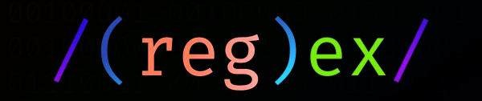

Title: Python
Date: 2022-07-08 00:00 
Modified: 2025-11-20 20:44
Category: Python
Tags: Python, Pandas, Regex, Re, Düzenli İfade, PyAutoGUI, Polars, Flet, Glob, Globals
Author: Mustafa Halil
Summary: Python ve Kütüphaneleri Hakkında Türkçe Eğitim Notları

# Python ve Kütüphaneleri Eğitim Notları

Bu bölümde Python ve **Pandas, Polars, re** (Regex, Düzenli ifadeler), **PyAutoGUI, Flet**, ...vb popüler bazı kütüphaneler hakkında türkçe eğitim notları paylaşacağım.

## [.:: Pandas Kütüphanesi Notları ::.]({filename}../python/pandas/00_pandas_giris.md)

[Python'a Giriş](../freecad-scripting-01-pythona-giris.html) konusuna ait notları, **FreeCAD için Python ile Komut Dosyası Oluşturma (Scripting) Eğitimi**nde paylaşmıştık.  İlave olarak Python'ın en güçlü ve işlevsel kütüphanelerinden biri olan **Pandas**'a ait notları paylaşmaya devam ediyorum.

## [.:: Düzenli İfadeler (Regular Expressions - Regex ) ::.]({filename}../python/duzenli_ifade/re_giris.md)

Düzenli ifadeler (Regular Expressions, kısaca "Regex" ya da "Regexp"), 
Python programlama dilinin en çetrefilli konularından biridir. Ama bütün
 zorluklarına rağmen programlama deneyimimizin bir noktasında mutlaka 
karşımıza çıkacak olan bu yapıyı öğrenmemizde büyük fayda var. Düzenli 
ifadeleri öğrendikten sonra, elle yapılması saatler sürecek bir işlemi 
saliseler içinde yapabildiğinizi gördüğünüzde eminim düzenli ifadelerin 
ne büyük bir nimet olduğunu siz de anlayacaksınız.

## [.:: PyAutoGUI Kütüphanesi Notları ::.]({filename}../python/pyautogui.md)

**PyAutoGUI**, fare ve klavyeleri kontrol etmemizi sağlayan, böylece otomatik görevler yapan kodlar/botlar yazmamıza yardımcı olan güzel, faydalı bir Python 
kütüphanesidir/modülüdür.

**PyAutoGUI** kütüphanesi ile aşağıda listelenen işlemleri yapabiliriz;

- İmleci hareket ettirme,
- İstenilen yere tek, çift ya da daha fazla tıklama,
- Pencere, diyalog kutusu taşıma, kaydırma çubuğunu hareket ettirme,
- Klavyeden yazı yazma, Ekrandaki metnin bir bölümü ya da tamamını seçme,
- Komut gönderme,
- Ekran görüntüsü alma,
- Ekran görüntüsüne sahip olduğumuz buton, pencere ve simgeleri bulma ve tıklama.

## [.:: Polars Kütüphanesi Notları ::.]({filename}../python/polars/00-polars_giris.md)

*Rust ve Python için Işık Hızında VeriÇerçevesi (DataFrame) Kütüphanesi.*

**Polars Nedir?**

`Polars`, `Rust` programlama dilinde yazılmış ve temel olarak `Apache Arrow`’u kullanan bir **DataFrame kütüphanesidir**. Veri düzenleme alışkanlıklarını bilen `Polars`,  okunabilir ve yüksek performanslı kod oluşturmanızı sağlayacak bir ifade dili kullanarak DataFrame'leri işlemek için tüm özellikleri içeren eksiksiz bir `Python API` 'ı sunar.

## [.:: Flet Kütüphanesi Notları ::.]({filename}../python/flet/00_flet_giris.md)

**Flet Nedir?**

**Flet**,  Front-End geliştirme deneyimi olmadan, en sevdiğiniz programlama 
dilinde, etkileşimli, çok kullanıcılı web, masaüstü ve mobil uygulamalar
 oluşturmaya izin veren bir çerçevedir.

Python'da Flutter uygulamaları oluşturmanın en hızlı yolu Flet kütüphanesini (modülünü) kullanmaktır. [Flet Kütüphanesi](https://pypi.org/project/flet/), Geliştiricilerin Python'da kolayca, gerçek zamanlı web, mobil ve masaüstü uygulamaları oluşturmasına olanak tanır.

# Çeşitli Python Fonksiyonları ve Konuları

Python programlama dilinde kullanılan dahili fonksiyonlara ayrılan bölüm. 

* [F-String Kullanımı]({filename}../python/f-string.md)

* [getattr() Fonksiyonu]({filename}../python/getattr.md)

* [Glob() Fonksiyonu]({filename}../python/glob.md)

* [Globals() Fonksiyonu]({filename}../python/globals.md)

* [PyArrow String Türü ile Hızlanmak]({filename}../python/pyarrow.md)

* [String Metotları]({filename}../python/string_metotlari.md)
