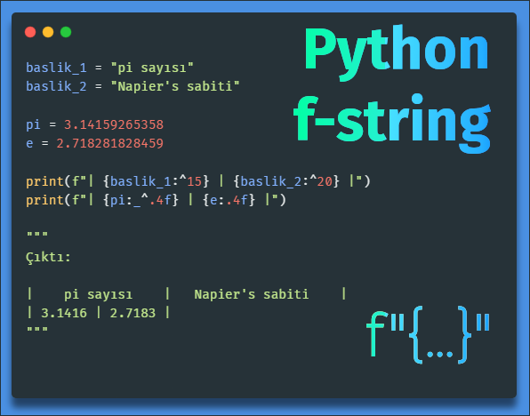

Title: Python - f-string
Date: 2025-08-02 17:36
Modified: 2025-11-19 23:32
Category: Cesitli
Tags: Python, f-string, string
Author: Mustafa Halil

# F-String Kullanımı

F-String, bir dizenin (string ifadenin) seçilen kısımlarını biçimlendirmenize olanak tanır.

F-String, python 3.6'da tanıtıldı ve şu anda dizeleri biçimlendirmek için tercih edilen yöntemdir.



Python 3.6'dan önce` format()` yöntemini kullanmak zorundaydık. `format()` yöntemi hala kullanılabilir, ancak f-string daha hızlıdır ve dizileri biçimlendirmek için tercih edilen yöntemdir. O nedenle `format` yöntemini/metodunu anlatmayacağım.

Bir dizeyi f-string olarak belirtmek için, dize sabitinin önüne `f` harfini eklemeniz yeterlidir, örneğin:

```python
metin = f"Fiyat 4900 Türk Lirası"
print(metin)
```

Çıktı:

```python
Fiyat 4900 Türk Lirası
```

## Yer tutucular ve Değiştiriciler

Bir f-stringdeki değerleri biçimlendirmek için yer tutucular`{}` ekleyin. Bir yer tutucu, değeri biçimlendirmek için kullanılır ve **değişkenler**, **işlemler**, **fonksiyonlar** ile **değiştiriciler** içerebilir.

Örneğin:

Fiyat değişkeni için bir yer tutucu ekleyin:

```python
ücret = 5900
metin = f"Fiyat {ücret} Türk Lirası"
print(metin)
```

Çıktı:

```python
Fiyat 5900 Türk Lirası
```

**Yer tutucu**, değeri biçimlendirmek için bir **değiştirici** de içerebilir.

Değiştirici, iki nokta üst üste (`:`) ve ardından geçerli bir biçimlendirme türü eklenerek dahil edilir. Örneğin, `.2f` ifadesi, **2 basamaklı ondalıklı sayı (float)** anlamına gelir.

Fiyatı 2 ondalık basamakla göster:

```python
ücret = 59
metin = f"Fiyat {ücret:.2f} Türk Lirası"
print(metin)
```

Çıktı:

```python
Fiyat 59.00 Türk Lirası
```

Bir değeri bir değişkende tutmadan doğrudan da biçimlendirebilirsiniz:

```python
metin = f"Fiyat {59:.2f} Türk Lirası"
print(metin)
```

Çıktı:

```python
Fiyat 59.00 Türk Lirası
```

`.2f` yer tutucusu aynı zamanda ondalıklı sayıları yuvarlamak için de kullanılabilir.

```python
pi = 3.1415926535897932384626433 

print(f"{pi:.2f}")
print(f"{pi:.4f}")
```

Çıktı:

```python
3.14
3.1416
```

Eğer yukarıdaki kodda `.4f` yerine sadece `.4` yazmış olsaydık bu kez `.` nokta karakteri hariç toplam 4 karakterlik değer ekrana yazdırılırdı, görelim;

```python
pi = 3.1415926535897932384626433 

print(f"{pi:.4}")
```

Çıktı:

```python
3.142
```

Eğer fstring içerisinde `{` ya da `}` süslü parantez karakterlerini kullanmak istersek, peşpeşe 2 adet süslü parantez `{{` yazmak gerekir.

```python
pi = 3.1415926535897932384626433 
print(f"{{pi sayısı  }} {pi} iken yarısı {pi / 2} dir.")
```

Çıktı:

```python
{pi sayısı  } 3.141592653589793 iken yarısı 1.5707963267948966 dir.
```

## F-String ile İşlemler Gerçekleştirmek

Yer tutucuların içinde Python işlemleri gerçekleştirebilirsiniz. Örneğin doğrudan matematiksel işlemler yapabilirsiniz:

```python
metin = f"Fiyat {20 * 59} Türk Lirası"
print(metin)
```

Çıktı:

```python
Fiyat 1180 Türk Lirası
```

Değişkenler üzerinde de matematik işlemleri gerçekleştirebilirsiniz:

```python
ücret = 65
kdv = 0.25
metin = f"KDV'li fiyat {ücret * (1 + kdv)} Türk Lirası"
print(metin)
```

Çıktı:

```python
KDV'li fiyat 81.25 Türk Lirası
```

Yer tutucuların içinde `if...else` ifadeleri kullanabilirsiniz.

Fiyat 5000 'in üzerindeyse "Pahalı" değerini, aksi takdirde "Ucuz" değerini döndür:

```python
ücret = 5000
metin = f"Bu ürün üçün fiyat oldukça {'Pahalı' if ücret > 3000 else 'Ucuz'}"

print(metin)
```

Çıktı:

```python
Bu ürün üçün fiyat oldukça Pahalı
```

fstring ile kod yazarken satırı bir noktada kesip alt satırdan devam etmek için `\` karakteri kullanılabilir.

```python
ücret = 5000
metin = f"Bu ürün üçün fiyat oldukça {'Pahalı' if ücret > 3000 \
else 'Ucuz'}"

print(metin)
```

## F-String içinde Fonksiyon Çalıştırmak

Yer tutucunun içindeki fonksiyon çalıştırabilirsiniz.

Bir değeri büyük harflere dönüştürmek için `upper()` dizi (string) metodunu kullanın:

```python
meyve = "Çilek"
metin = f"En sevdiğim meyve: {meyve.upper()}'tir."
print(metin)
```

Çıktı:

```python
En sevdiğim meyve: ÇİLEK'tir.
```

F-String içinde kullanılan fonksiyon, dahili (yerleşik) bir Python metodu olmak zorunda değildir; kendi fonksiyonlarınızı da oluşturup kullanabilirsiniz.

**Feet** ölçü birimini **metre**ye dönüştüren bir fonksiyon oluşturun ve bunu f-string içinde kullanın.

```python
def fonksiyonum(x):
  return x * 0.3048

metin = f"Uçak şuan {fonksiyonum(30000)} metre yükseklikte uçuyor."
print(metin)
```

Çıktı:

```python
Uçak şuan 9144.0 metre yükseklikte uçuyor.
```

## Daha Fazla Değiştirici

Bu bölümün başında, `.2f` değiştiricisini kullanarak bir sayıyı, 2 basamaklı ondalıklı sayı olarak biçimlendirmeyi açıklamıştık.

Değerleri biçimlendirmek için kullanılabilecek birkaç başka değiştiriciler de mevcut. Şimdi bunları inceleyelim.

Binlik ayırıcı olarak virgül kullanın:

```python
ücret = 65000
metin = f"Ürünün fiyatı {ücret:,} Türk Lirası"
print(metin)
```

Çıktı:

```python
Ürünün fiyatı 65,000 Türk Lirası
```

Aşağıdaki tabloda tüm biçimlendirme türlerini ve ne işe yaradıklarına dair açıklamalarını görebilirsiniz.

### Biçimlendirme Türleri

| Biçimlendirme Türü | Kullanım Amacı                                                                                                     |
| ------------------ | ------------------------------------------------------------------------------------------------------------------ |
| `:<`               | Sonucu  sola hizalar (kullanılabilir alan içinde)                                                                  |
| `:>`               | Sonucu  sağa hizalar (kullanılabilir alan içinde)                                                                  |
| `:^`               | Sonucu  ortalar (kullanılabilir alan içinde)                                                                       |
| `:=`               | İşareti en sol konuma yerleştirir                                                                                  |
| `:+`               | Sonucun pozitif veya negatif olduğunu belirtmek için artı işareti kullanın                                         |
| `:-`               | Yalnızca negatif değerler için eksi işareti kullanın                                                               |
| `: `               | Pozitif sayıların önüne ekstra boşluk eklemek için boşluk kullanır (ve negatif sayıların önüne eksi işareti ekler) |
| `:,`               | Binlik ayırıcı olarak virgül kullanır                                                                              |
| `:_`               | Binlik ayırıcı olarak alt çizgi de kullanılabilir                                                                  |
| `:b`               | İkili (Binary) biçim                                                                                               |
| `:c`               | Değeri, karşılık gelen Unicode karakterine dönüştürür                                                              |
| `:d`               | Ondalıklı biçim                                                                                                    |
| `:e`               | Bilimsel biçim, küçük e harfi ile                                                                                  |
| `:E`               | Bilimsel biçim, büyük E harfi ile                                                                                  |
| `:f`               | Sabit ondalıklı sayı biçimi                                                                                        |
| `:F`               | Sabit ondalıklı sayı biçimi, büyük harf biçiminde (`inf` ve `nan`'ı `INF` ve `NAN` olarak göster)                  |
| `:g`               | Genel biçim                                                                                                        |
| `:G`               | Genel biçim (bilimsel gösterimler için büyük E harfi kullanılır)                                                   |
| `:o`               | Sekizlik (Octal) biçim                                                                                             |
| `:x`               | Onaltılık (Hex) biçim, küçük harf                                                                                  |
| `:X`               | Onaltılık (Hex) biçim, büyük harf                                                                                  |
| `:n`               | Sayı (number) biçimi                                                                                               |
| `:%`               | Yüzde biçimi                                                                                                       |

> F-String ile biçimlendirme türlerini kullanırken, aşağıdaki sıralamaya göre yerleşim yapılabilir. 
> 
>  `:[Doldurulacak_Karakter][Hizalama_Karakteri (Biçimlendirme_Türü)][Genişlik],.[Ondalik_Ayrimi][Biçim]`

### Örnekler

### :<

Sonucu (kullanılabilir alan içinde) sola hizalar.

Aşağıda sola hizala `:<` biçimine dair örnek bir uygulama göstermek istiyorum.

Standart f-string ile kodu yazarsak aşağıdaki sonucu elde ederiz.

```python
bilgiler = ["Mustafa", "Halil", "Makine Mühendisi"]

for no, deger in enumerate(bilgiler):
    print(f"| {no} | {deger} |")
```

Çıktı:

```python
| 0 | Mustafa |
| 1 | Halil |
| 2 | Makine Mühendisi |
```

Koda `:<` biçimini eklersek bir değişiklik olur mu? görelim:

```python
bilgiler = ["Mustafa", "Halil", "Makine Mühendisi"]

for no, deger in enumerate(bilgiler):
    print(f"| {no} | {deger:<} |")
```

Çıktı:

```python
| 0 | Mustafa |
| 1 | Halil |
| 2 | Makine Mühendisi |
```

Gördüğünüz gibi sonuç değişmedi çünkü varsayılan olarak ifadeler sola dayalı yazılır. Peki ya, `:<` ifadesinden sonra bir sayı değeri (yer tutucu) kullansak ne olur?.

```python
bilgiler = ["Mustafa", "Halil", "Makine Mühendisi"]

for no, deger in enumerate(bilgiler):
    print(f"| {no} | {deger:<20} |")
```

Çıktı:

```python
| 0 | Mustafa              |
| 1 | Halil                |
| 2 | Makine Mühendisi     |
```

İşte istediğim sonuç. `:<` ifadesinin yanına 20 sayısını yazmakla (`:<20`) , python'a toplamda 20 karakterlik yer işgal etmesi ve **deger** değişkenin bu alanda sola hizalanmasını söylemiş olduk.

Peki 20 karakterlik yer işgal ederken yer tutucu olarak boşluk karakteri yerine başka karakter kullanmak istersek ne yapmalıyız? Aşağıdaki örneği inceleyelim;

```python
bilgiler = ["Mustafa", "Halil", "Makine Mühendisi"]

for bilgi in bilgiler:
    print(f"{bilgi:_<20}")
```

Çıktı:

```python
Mustafa_____________
Halil_______________
Makine Mühendisi____
```

### :>

Sonucu  (kullanılabilir alan içinde) sağa hizalar.

Yukarıdaki örneği revize ederek bu kez de **30** karekterlik yer işgal edip, değer ifadesini **sağa** hizalayalım. Bunu için `:>30` ifadesini kullanacağız.

```python
bilgiler = ["Mustafa", "Halil", "Makine Mühendisi"]

for no, deger in enumerate(bilgiler):
    print(f"| {no} | {deger:>30} |")
```

Çıktı:

```python
| 0 |                        Mustafa |
| 1 |                          Halil |
| 2 |               Makine Mühendisi |
```

```python
bilgiler = ["Mustafa", "Halil", "Makine Mühendisi"]

for bilgi in bilgiler:
    print(f"{bilgi:_>20}")
```

Çıktı:

```python
_____________Mustafa
_______________Halil
____Makine Mühendisi
```

### :^

Sonucu (kullanılabilir alan içinde) ortalar.

```python
bilgiler = ["Mustafa", "Halil", "Makine Mühendisi"]

for bilgi in bilgiler:
    print(f"{bilgi:_^20}")
```

Çıktı:

```python
______Mustafa_______
_______Halil________
__Makine Mühendisi__
```

### .f

Sabit ondalıklı sayı biçimi

```python
ondalik: float =  1234.5678

print(f"{ondalik:.2f}")
```

Çıktı:

```python
1234.57
```

### ,.f

Python'da binlik ayırıcı olarak `,` virgül karakteri de kullanılır.

```python
buyuksayi : float = 1234567.8910    # 1_234_567.8910 bu gösterim de aynı sonucu verir, birbirine eşittir.
print(f"{buyuksayi:,.1f}")          # ondalık olarak sadece tek basamak kullan
```

Çıktı:

```python
1,234,567.9
```

### :_

Python'da binlik ayırıcı olarak `,` virgül yerine `|` alt çizgi karakteri de kullanılabilir.

```python
ücret = 65000
metin = f"Ürünün fiyatı {ücret:_} Türk Lirası"
print(metin)
```

Çıktı:

```python
Ürünün fiyatı 65_000 Türk Lirası
```

### .%

Yüzde biçimi

```python
yuzdelik: float = .5678

print(f"{yuzdelik:.2%}")
```

Çıktı:

```python
56.78%
```

### :b

Bir sayının ikili (Binary) biçimini öğrenmek ya da ekrana yazdırmak için `:b` ifadesini kullanabiliriz.

```python
hata_no = 12345
print(f"Hata numarası: {hata_no:b}")
```

Çıktı:

```python
Hata numarası: 11000000111001
```

`:b` ifadesinde `#` karakterini ekleyip çıktıyı inceleyelim;  

```python
hata_no = 12345
print(f"Hata numarası: {hata_no:#b}")
```

Çıktı:

```python
Hata numarası: 0b11000000111001
```

### :o

Bir sayının Sekizlik (Octal) biçimini öğrenmek ya da ekrana yazdırmak için `:o` ifadesini kullanabiliriz.

```python
hata_no = 12345
print(f"Hata numarası: {hata_no:o}")
```

Çıktı:

```python
Hata numarası: 30071
```

`:o` ifadesinde `#` karakterini ekleyip çıktıyı inceleyelim;  

```python
hata_no = 12345
print(f"Hata numarası: {hata_no:#o}")
```

Çıktı:

```python
Hata numarası: 0o30071
```

### :x ya da :X

Bir sayının Onaltılık (Hex) biçimini öğrenmek ya da ekrana yazdırmak için `:x` ya da `:X` ifadelerini kullanabiliriz.

```python
hata_no = 12345
print(f"Hata numarası: {hata_no:x}")
print(f"Hata numarası: {hata_no:#x}")
print(f"Hata numarası: {hata_no:X}")
print(f"Hata numarası: {hata_no:#X}")
```

Çıktı:

```python
Hata numarası: 3039
Hata numarası: 0x3039
Hata numarası: 3039
Hata numarası: 0X3039
```

Onaltılık (Hex) biçimi kullanılırken`x` ya da `X` karakterlerinin önüne sayı değeri yazılırsa bırakılan değer kadar boşluk bırakılır.

```python
hata_no = 12345

print(f"Hata numarası: {hata_no:x}")
print(f"Hata numarası: {hata_no:10x}")
print(f"Hata numarası: {hata_no:X}")
print(f"Hata numarası: {hata_no:10X}")
```

Çıktı:

```python
Hata numarası: 3039
Hata numarası:       3039
Hata numarası: 3039
Hata numarası:       3039
```

### Değişken ile sayı atama

- Yukarıdaki biçimlendirme türlerinin kaçar karakter yer tutacağını, değişken kullanarak ta belirtebiliriz. İçiçe süslü parantez kullanımına dikkat edin.

```python
bilgiler = ["Mustafa", "Halil", "Makine Mühendisi"]
deger = 34

for bilgi in bilgiler:
    print(f"{bilgi:_<{deger}}")
    print(f"{bilgi:_^{deger}}")
    print(f"{bilgi:_>{deger}}")
    print("\n")
```

Çıktı:

```python
Mustafa___________________________
_____________Mustafa______________
___________________________Mustafa


Halil_____________________________
______________Halil_______________
_____________________________Halil


Makine Mühendisi__________________
_________Makine Mühendisi_________
__________________Makine Mühendisi
```

### datetime %x

```python
from datetime import datetime

now: datetime = datetime.now()
print(f'{now:%x}') 
```

Çıktı:

```python
08/31/25
```

### datetime %c

```python
from datetime import datetime

now: datetime = datetime.now()
print(f'{now:%c}') 
```

Çıktı:

```python
Sun Aug 31 14:28:15 2025
```

### datetime %H %M %S

```python
from datetime import datetime

now: datetime = datetime.now()
print(f'{now:%H:%M:%S}') 
```

Çıktı:

```python
14:32:06
```

### Not:

F-String ile biçimlendirme türlerini kullanırken, aşağıdaki sıralamaya göre yerleşim yapılabilir.

>  **:[Doldurulacak_Karakter][Hizalama_Karakteri (Biçimlendirme_Türü)][Genişlik],.[Ondalik_Ayrimi][Biçim]**

Örneğin:

```python
f_sicaklik_gunes = 27_000_000 # Fahrenheit
f_sicaklik_dunya = 58 # Fahrenheit

print(f"Güneşin sıcaklığı {(f_sicaklik_gunes - 32) / 1.8} Celcius derecedir.")
print(f"Dünyanın sıcaklığı {(f_sicaklik_dunya - 32) / 1.8} Celcius derecedir.")
```

Çıktı:

```python
Güneşin sıcaklığı 14999982.222222222 Celcius derecedir.
Dünyanın sıcaklığı 14.444444444444445 Celcius derecedir.
```

Yukarıdaki Sıralamaya göre kodu düzenleyelim;

```python
f_sicaklik_gunes = 27_000_000 # Fahrenheit
f_sicaklik_dunya = 58 # Fahrenheit

print(f"Güneşin sıcaklığı {(f_sicaklik_gunes - 32) / 1.8:*15^,.2f} Celcius derecedir.")
print(f"Dünyanın sıcaklığı {(f_sicaklik_dunya - 32) / 1.8:*15^,.2f} Celcius derecedir.")
```

Çıktı:

```python
Güneşin sıcaklığı *14,999,982.22* Celcius derecedir.
Dünyanın sıcaklığı *****14.44***** Celcius derecedir.
```

```python
print(f"Güneşin sıcaklığı {(f_sicaklik_gunes - 32) / 1.8:~>15_.1f} Celcius derecedir.")
print(f"Dünyanın sıcaklığı {(f_sicaklik_dunya - 32) / 1.8:~>15_.1f} Celcius derecedir.")
```

Çıktı:

```python
Güneşin sıcaklığı ~~~14_999_982.2 Celcius derecedir.
Dünyanın sıcaklığı ~~~~~~~~~~~14.4 Celcius derecedir.
```

String ifadelerle yertutucu kullanımında stringler istenilen kısımdan kesilebilir. Aşağıdaki örnekler konuyu daha net anlatacaktır.

```python
kullanici_1 = "Mustafa Halil"
kullanici_2 = "Sabahattin Ali"
kullanici_3 = "Eyüp Sabri"
kullanici_4 = "Ayşe"

mesaj = f"| {kullanici_1:15} | {kullanici_2:15} |\n| {kullanici_3:15} | {kullanici_4:15} |"

print(mesaj)
```

Çıktı:

```python
| Mustafa Halil   | Sabahattin Ali  | Eyüp Sabri      | Ayşe            |
```

Yukarıdaki kod ile, toplam 15 karakterlik yer tutucu kullanılarak kullanıcı adları ve `|` pipe karakteri yazdırıldı. 

Peki ya `:15` ifadesinin yanına `.3` ifadesi eklense ne olur? Görelim:

```python
mesaj = f"| {kullanici_1:15.3} | {kullanici_2:15.3} | {kullanici_3:15.3} | {kullanici_4:15.3} |"

print(mesaj)
```

Çıktı:

```python
| Mus             | Sab             | Eyü             | Ayş             |
```

Görüldüğü gibi her ifadenin ilk 3 karakteri alındı ve toplamda 15'er karakterlik boşluk (space) karakteri ile (yer tutucu)  ekrana yazdırıldı.

Kodu değiştirerek `.3` ifadesini `.5` olarak değiştirip metni iki satıra bölelim.

```python
mesaj = f"| {kullanici_1:15.5} | {kullanici_2:15.5} |\n| {kullanici_3:15.5} | {kullanici_4:15.5} |"

print(mesaj)
```

Çıktı:

```python
| Musta           | Sabah           |
| Eyüp            | Ayşe            |
```

`Ayşe` ve `Eyüp `isimleri 4'er karakter olduğu için diğer isimler 5 karaktere kırpılırken `Ayşe` ve `Eyüp` ismi doğal olarak kırpılmadı.

## Kaynaklar

* [Python String Formatting - w3schools](https://www.w3schools.com/python/python_string_formatting.asp)
* [Python BEGINNER to ADVANCED in 10 levels - YouTube](https://www.youtube.com/watch?v=sqKuYiUSHXQ&t=2s)
* [Every F-String Trick In Python Explained - YouTube](https://www.youtube.com/watch?v=9saytqA0J9A)
* [Python F-strings: Visually Explained - YouTube](https://www.youtube.com/watch?v=H_TPIAEJl68&list=WL&index=28)
* [Python Dersleri: 10 - F-STRING - YouTube](https://www.youtube.com/watch?v=H4A-ZHytm9s)
