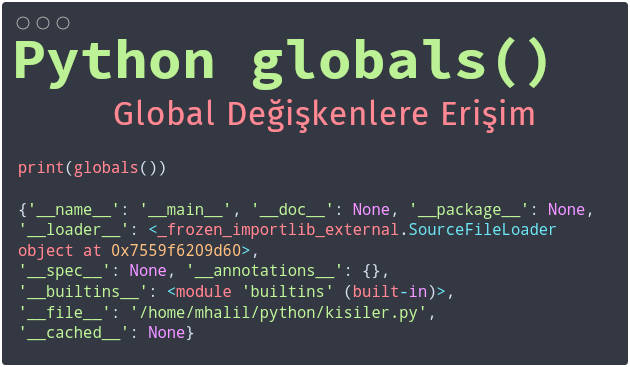

Title: Python - globals
Date: 2024-10-05 17:45
Category: Cesitli
Tags: Python, globals, fonksiyon
Author: Mustafa Halil

# globals() Fonksiyonu



## Tanım

### 1. Tanım:

`globals()` fonksiyonu, Python'da gömülü (built-in) bir fonksiyondur ve geçerli global sembol tablosunu temsil eden bir sözlük (dict) yapısı döndürür.

**Sembol Tablosu**: Bir programla ilgili tüm gerekli bilgileri içeren bir veri yapısıdır. Değişken adları, fonksiyonlar, sınıflar vb. bilgileri barındırır. Global sembol tablosu, programın global kapsamıyla ilgili tüm bilgileri depolar ve Python'da `globals()` fonksiyonu kullanılarak erişilir. Herhangi bir sınıf veya fonksiyonla ilişkilendirilmemiş değişkenler ve fonksiyonlar `global` kapsamda depolanır.

### 2. Tanım

`globals()` fonksiyonu,  çalıştığımız dosyanın adı, yolu, dosya içerisinde tanımlanan global kapsamdaki tüm değişkenleri, fonksiyonları, sınıfları ve diğer sembolleri içeren bir sözlük döndürür. Çıktısı **sözlük (dictionary)** veri yapısındadır. Bu sözlük yapısının içindeki herhangi bir anahtar değerinin karşılığını `print(globals()["degisken_adi"])` şekilde yazdırabiliriz .

### 3. Tanım

Bir başka tanımla,  `globals()` fonksiyonu, Python'da mevcut global **sembol tablosu** sözlüğü döndüren yerleşik (dahili) bir fonksiyondur.

**Sembol tablosu** nedir derseniz; Sembol tablosu, program hakkında gerekli tüm bilgileri içeren bir veri yapısıdır. Bunlar değişken adlarını, fonksiyonları, sınıfları, ... vb. verileri içerir. Global sembol tablosu, programın global kapsamıyla ilgili tüm bilgileri depolar ve Python'da `globals()` fonksiyonu kullanılarak erişilir. Herhangi bir sınıf veya fonksiyonla ilişkili olmayan fonksiyonlar ve değişkenler global kapsamda saklanır. Bir sınıf veya fonksiyonla ilişkili olan fonksiyon ve değişkenlere ise `locals()` fonksiyonu ile erişilebilir.

## Ek Tanımlar:

### Global Alan

Bir Python programında, tüm fonksiyonların ve blokların dışında tanımlanan değişkenlerin ve nesnelerin bulunduğu alandır. Global alandaki değişkenlere, programın herhangi bir yerinden erişilebilir.

### Yerel Alan

Bir Python fonksiyonu veya bloğu içinde tanımlanan değişkenlerin bulunduğu alandır. Yerel alandaki değişkenlere yalnızca tanımlandıkları fonksiyon veya blok içinden erişilebilir.

### Sembol Tablosu

Bir programdaki tüm değişkenlerin, fonksiyonların ve sınıfların adlarını ve bilgilerini içeren bir veri yapısıdır.

### Sözlük

Python'da anahtar-değer çiftleri şeklinde veri depolayan bir veri yapısıdır. Anahtarlar benzersiz olmalıdır ve değerlere anahtarları kullanılarak erişilir.

### Metaprogramlama

Çalışma zamanında kendisini değiştirebilen veya üretebilen programlar yazma tekniğidir.

## Sözdizimi:

`globals()` fonksiyonu herhangi bir parametre almaz. Sözdizimi basitçe şöyledir:

`globals()`

## Kullanım Alanları:

### Global Sembol Tablosunu İnceleme:

* `globals()` fonksiyonu, global kapsamda tanımlı olan tüm değişkenleri, fonksiyonları, sınıfları ve diğer nesneleri listelemek için kullanılabilir. Bu, özellikle programın çalışma zamanında hangi nesnelerin mevcut olduğunu anlamak için faydalıdır.

`print(globals())`
Bu kod, global sembol tablosunu içeren bir sözlük yazdırır.

* `globals()` fonksiyonunun döndürdüğü sözlükte, değişkenin adını anahtar olarak kullanarak değerine erişebilir ve bu değeri istediğiniz gibi değiştirebilirsiniz.

kisiler.py dosyası oluşturup içerisine sadece aşağıdaki kodu yazalım ve kodu çalıştıralım.

`print(globals())`

ÇIKTI:

```python
{'__name__': '__main__', '__doc__': None, '__package__': None, 
'__loader__': <_frozen_importlib_external.SourceFileLoader object at 0x7559f6209d60>, 
'__spec__': None, '__annotations__': {}, '__builtins__': <module 'builtins' (built-in)>, 
'__file__': '/home/mhalil/python/kisiler.py', '__cached__': None}
```

Çıktı, bir sözlük veri tipi olarak karşımıza geldi.

Dosyanın içerisine a, b ve c isimli 3 adet değişken ekleyip bu değişkenlere sırayla 1, 2 ve 3 değerlerini atıyorum. kisiler.py dosyasının içeriği;

```python
a, b, c = 1, 2, 3
print(globals())
```

Kodu çalıştıralım.

ÇIKTI:

```python
{'__name__': '__main__', '__doc__': None, '__package__': None, 
'__loader__': <_frozen_importlib_external.SourceFileLoader object at 0x76e273105d00>, 
'__spec__': None, '__annotations__': {}, '__builtins__': <module 'builtins' (built-in)>, 
'__file__': '/home/mhalil/python/kisiler.py', '__cached__': None, 'a': 1,
 'b': 2, 'c': 3}
```

Gördüğünüz gibi yukarıdaki ilk çıktıdan farklı olarak sözlük içerisine `'a': 1, 'b': 2, 'c': 3` key (anahtar) ve value (değer) bilgileri eklenmiş. a değişkenine şu şekilde erişebiliriz;

```python
print(globals()["a"])
```

diyeceksiniz ki, a değişkenine direkt `print(a)` yazarak ta erişebilirdik, ne anladım bu işten :) Aşağıdaki kodu ve çıktısını inceleyelim:

```python
a = 100

def deger():
    a = 50
    print("Lokal a değeri:", a)
    global_a = globals()["a"]
    print("Fonksiyon içerisinde global a değeri:", global_a)

deger()
print("Global a değeri:", a)
```

ÇIKTI:

```python
Lokal a değeri: 50
Fonksiyon içerisinde global a değeri: 100
Global a değeri: 100
```

Gördüğünüz gibi aynı isme sahip (a) iki değişkeni sorunsuz bir şekilde kullabildik.

```python
def degis():
      global a
      a = 10
degis()
print(a) 
```

Çıktı: `10`

Bu örnekte, `degis()` fonksiyonu içinde `global` anahtar kelimesi kullanılarak `a` değişkeninin global olarak tanımlandığını görüyoruz. `degis()` fonksiyonu çağrıldığında, **global a** değişkeninin değeri **10** olarak güncellenir.

### Dinamik Kod Üretme:

`globals()` fonksiyonu, dinamik olarak kod üretmek için de kullanılabilir. Örneğin, kullanıcıdan alınan bir girdiye göre yeni değişkenler oluşturmak veya fonksiyonları çağırmak için kullanılabilir.

```python
degisken_adi = input("Değişken adı girin: ")
degisken_degeri = input("Değişken değeri girin: ")

globals()[degisken_adi] = degisken_degeri

print(degisken_adi, "=", globals()[degisken_adi])
```

Bu örnekte, kullanıcıdan bir değişken adı ve değeri alınır. Daha sonra, `globals()` fonksiyonu kullanılarak kullanıcı tarafından belirtilen isimde bir **global** değişken oluşturulur ve değeri atanır.

Farklı dosyalardaki (örneğin bir modüldeki) değişken ismini `globals` ile tekrar değişken ismi olarak kullanabilirsiniz.

## Önemli Noktalar:

### Global Değişkenleri Değiştirme Riski:

`globals()` fonksiyonu kullanılarak global değişkenleri değiştirmek, beklenmeyen yan etkilere neden olabilir ve kodun okunabilirliğini azaltabilir. Bu nedenle, global değişkenleri değiştirmek yerine fonksiyonlara parametre olarak iletmek ve dönüş değerlerini kullanmak daha iyi bir uygulamadır.

### Yerel Kapsam:

`globals()` fonksiyonu yalnızca global kapsamdaki nesnelere erişim sağlar. Yerel kapsamda (örneğin bir fonksiyon içinde) `globals()` fonksiyonu çağrılırsa, yine global sembol tablosunu döndürür.

## Sonuç:

* `globals()` fonksiyonu, Python'da gömülü (built-in) bir fonksiyondur.
* `globals()` fonksiyonu,  çalıştığımız dosyanın adı, yolu, dosya içerisinde tanımlanan global kapsamdaki tüm değişkenleri, fonksiyonları, sınıfları ve diğer sembolleri içeren bir sözlük döndürür.
* `globals()` fonksiyonunun aşırı veya dikkatsizce kullanılması, kodunuzun okunmasını ve bakımını zorlaştırabilir; Dikkatli kullanılmalı ve olası yan etkileri göz önünde bulundurulmalıdır.
* `globals()` fonksiyonu kullanılarak global değişkenlerin değerlerini değiştirmek, beklenmeyen sonuçlara yol açabilir ve programın okunabilirliğini azaltabilir.
* Çoğu durumda, global değişkenleri değiştirmek yerine, fonksiyonlara argümanlar iletmek veya sınıflar içindeki verileri yönetmek gibi daha yapılandırılmış yaklaşımlar daha uygundur.
* `globals()` fonksiyonu tarafından döndürülen sözlükte "file" anahtarının değeri, programın çalıştığı dosyanın adını içerir.
* `globals()` fonksiyonu tarafından döndürülen sözlükte, **fonksiyonun adı** anahtar olarak bulunur. Bu anahtara karşılık gelen değer, fonksiyonun kendisidir.
* `globals()` fonksiyonu, programın global alanına dinamik olarak erişmek gerektiğinde, örneğin bir eklenti / modül (kütüphane) sisteminde veya metaprogramlama yaparken kullanışlı olabilir.

## Kaynaklar:

* [https://python-istihza.yazbel.com/gomulu_fonksiyonlar.html](https://python-istihza.yazbel.com/gomulu_fonksiyonlar.html)
* [Gömülü Fonksiyonlar - Python 3.13.5 belgelendirmesi](https://docs.python.org/tr/3/library/functions.html#globals)
* [Gömülü Fonksiyonlar - istihza.yazbel](https://python-istihza.yazbel.com/gomulu_fonksiyonlar.html)
* [Python - globals() function - GeeksforGeeks](https://www.geeksforgeeks.org/python-globals-function/)
* [Python globals() Function](https://www.w3schools.com/python/ref_func_globals.asp)
* [Notebooklm.google.com/](https://notebooklm.google.com/)
