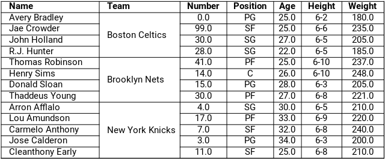

Title: Pandas 01 - Veri Çerçevesi Oluştur
Date: 2022-07-09 20:30
Category: Pandas
Tags: Python, Pandas, DataFrame, Veri Çerçevesi, Oluştur, Kütüphane, Modül
Author: Mustafa Halil

# VeriÇerçevesi (DataFrame) Oluştur

Bu bölümde sıfırdan **Veri Çerçevesi** (**Data Frame**) oluşturmayı ya da harici kaynaktan **(MS Excel, LibreOfis Calc, CSV, JSON, URL ve Pano'dan)** verileri okuyarak veri çerçevesine dönüştürmeyi öğreneceğiz.

## import Fonksiyonu

Öncelikle **Pandas** Kütüphanesini projemize dahil edip (içe aktarıp), kodlama esnasında hızlı olması adına bu kütüphaneye **pd** adını atayalım;

```python
import pandas as pd
```

## DataFrame() Fonksiyonu

Veri Çerçevesi (Data Frame) Oluşturmak ya da Dönüştürmek için **DataFrame()** fonksiyonunu kullanıyoruz. "Veri Çerçevesi"ne dönüştürmek istediğimiz veriyi, parantez içine, parametre olarak yazmalıyız.

```python
pd.DataFrame(veri)
```

Yukarıdaki kullanımda **veri** parametresi (iterable veri ya da sözlük yapısı) aşağıdakilerden herhangi biri olabilir.

- Sözlüklerden (Dictionary’lerden), serilerden veya listelerden oluşan bir sözlük (dictionary)
- 2 boyutlu numpy dizisi
- Başka bir DataFrame

örneğin bir **sözlük (dict)** veri yapısı oluşturup bu yapıyı **Veri Çerçevesi**ne (**Data Frame**'e) dönüştürelim;

```python
sozluk = {"isim" : ["Mustafa", "Halil", "Burak", "Emre", "Ersin", "Sertaç", "Furkan","Murat","Ahmet","Abdülkadir"],
                    "yaş" : [25, 38, 41, 23, 37, 52, 30, 23, 40, 38],
                    "iş-meslek" : ["mühendis", "programcı", "akademisyen", "yönetici","amir","mühendis", "yönetici","müdür","veteriner","yönetici"]}
veri = pd.DataFrame(sozluk)
```

Oluşturduğumuz Veri Çerçevesinin içeriğini görelim;

```python
print(veri)
```

|     | isim       | yaş | iş-meslek   |
| --- | ---------- | --- | ----------- |
| 0   | Mustafa    | 25  | mühendis    |
| 1   | Halil      | 38  | programcı   |
| 2   | Burak      | 41  | akademisyen |
| 3   | Emre       | 23  | yönetici    |
| 4   | Ersin      | 37  | amir        |
| 5   | Sertaç     | 52  | mühendis    |
| 6   | Furkan     | 30  | yönetici    |
| 7   | Murat      | 23  | müdür       |
| 8   | Ahmet      | 40  | veteriner   |
| 9   | Abdülkadir | 38  | yönetici    |

Gördüğünüz gibi verimiz, **DataFrame()** fonksiyonu ile,
 SQL ya da Excel tablosuna benzer şekilde satır ve sütunlardan oluşan 
yapıya dönüştürüldü. Artık bu yapıyı yönetmek ve analiz etmek oldukça 
kolaylaşmış oldu.

Örnek olması açısından, bir de **liste (list)** veri yapısındaki değerlerin **Veri Çerçevesi**ne (**Data Frame**'e) nasıl dönüştürüldüğünü görelim;

```python
veri1 = ["Kerem", 23, "öğrenci"]
df = pd.DataFrame([veri1], columns=["isim", "yaş", "meslek"])
```

`DataFrame()` metodunun içine yazdığımız **liste veri yapısının**, **ayrı bir liste içinde** belirtildiğine dikkat edin. 

Aynı kodu aşağıdaki şekilde yazarak ta aynı sonuca ulaşabiliriz.

```python
df = pd.DataFrame([["Kerem", 23, "öğrenci"]], columns=["isim", "yaş", "meslek"])
```

Oluşturduğumuz Veri Çerçevesinin içeriğini görelim;

```python
print(df)
```

|     | isim  | yaş | iş-meslek |
| --- | ----- | --- | --------- |
| 0   | Kerem | 23  | öğrenci   |

Birden fazla satır kaydı oluşturmak için, aşağıdaki şekilde liste yapısını kullanabilirsiniz;

```python
df = pd.DataFrame([["Kerem", 23, "öğrenci"], ["Safa",18,"öğrenci"]], columns=["isim", "yaş", "meslek"])
print(df)
```

|     | isim  | yaş | iş-meslek |
| --- | ----- | --- | --------- |
| 0   | Kerem | 23  | öğrenci   |
| 1   | Safa  | 18  | öğrenci   |

## Harici Dosyalardan Veri Çerçevesi Oluştur

## CSV Dosyasını İçe Aktarmak

### read_csv() Fonksiyonu

**csv** uzantılı dosyaların içeriğini çalışmalarımıza/projelerimize eklemek/dahil etmek istersek kullanabileceğimiz fonksiyon, **read_csv()**'dir.

örneğin **nba.csv** isimli dosyasınının içeriğini çalışmamıza aktarıp, veri çerçevesine dönüştürelim;

```python
import pandas as pd
nba_csv = pd.read_csv("Veri_Setleri/nba.csv")
print(nba_csv)
```

|     | Name          | Team           | Number | Position | Age  | Height | Weight | College           | Salary    |
| --- | ------------- | -------------- | ------ | -------- | ---- | ------ | ------ | ----------------- | --------- |
| 0   | Avery Bradley | Boston Celtics | 0.0    | PG       | 25.0 | 6-2    | 180.0  | Texas             | 7730337.0 |
| 1   | Jae Crowder   | Boston Celtics | 99.0   | SF       | 25.0 | 6-6    | 235.0  | Marquette         | 6796117.0 |
| 2   | John Holland  | Boston Celtics | 30.0   | SG       | 27.0 | 6-5    | 205.0  | Boston University | NaN       |
| 3   | R.J. Hunter   | Boston Celtics | 28.0   | SG       | 22.0 | 6-5    | 185.0  | Georgia State     | 1148640.0 |
| 4   | Jonas Jerebko | Boston Celtics | 8.0    | PF       | 29.0 | 6-10   | 231.0  | NaN               | 5000000.0 |
| ... | ...           | ...            | ...    | ...      | ...  | ...    | ...    | ...               | ...       |
| 453 | Shelvin Mack  | Utah Jazz      | 8.0    | PG       | 26.0 | 6-3    | 203.0  | Butler            | 2433333.0 |
| 454 | Raul Neto     | Utah Jazz      | 25.0   | PG       | 24.0 | 6-1    | 179.0  | NaN               | 900000.0  |
| 455 | Tibor Pleiss  | Utah Jazz      | 21.0   | C        | 26.0 | 7-3    | 256.0  | NaN               | 2900000.0 |
| 456 | Jeff Withey   | Utah Jazz      | 24.0   | C        | 26.0 | 7-0    | 231.0  | Kansas            | 947276.0  |
| 457 | NaN           | NaN            | NaN    | NaN      | NaN  | NaN    | NaN    | NaN               | NaN       |

458 rows × 9 columns

### index_col Parametresi

Harici kaynaktan veri alarak oluşturulan veri çerçevesinin indeks 
değerini, istediğimiz sütuna eşitleyebiliriz. Bunu yapmak için **index_col** parametresini kullanmalıyız. Örneğin NBA oyuncularının verileri barındıran CSV uzantılı dosyanın **Name** Sütununu, veri çerçevemizin **indeks sütunu** haline getirip veri çerçevemize göz atalım.

```python
nba_csv = pd.read_csv("Veri_Setleri/nba.csv", index_col="Name")
print(nba_csv.head())
```

|               | Team           | Number | Position | Age  | Height | Weight | College           | Salary    |
| ------------- | -------------- | ------ | -------- | ---- | ------ | ------ | ----------------- | --------- |
| Name          |                |        |          |      |        |        |                   |           |
| ---           | ---            | ---    | ---      | ---  | ---    | ---    | ---               | ---       |
| Avery Bradley | Boston Celtics | 0.0    | PG       | 25.0 | 6-2    | 180.0  | Texas             | 7730337.0 |
| Jae Crowder   | Boston Celtics | 99.0   | SF       | 25.0 | 6-6    | 235.0  | Marquette         | 6796117.0 |
| John Holland  | Boston Celtics | 30.0   | SG       | 27.0 | 6-5    | 205.0  | Boston University | NaN       |
| R.J. Hunter   | Boston Celtics | 28.0   | SG       | 22.0 | 6-5    | 185.0  | Georgia State     | 1148640.0 |
| Jonas Jerebko | Boston Celtics | 8.0    | PF       | 29.0 | 6-10   | 231.0  | NaN               | 5000000.0 |

Gördüğünüz gibi artık **indeks bilgileri**, **Oyuncu isimleri**ne dönüşmüş oldu.

### read_table() Fonksiyonu

**read_table()** fonksiyonu ile **csv** 
uzantılı dosyalar içe aktarıldığında, dosyanın her satırı, tablonun bir 
sütununa yazılır. Yani tabloda 2 sütun oluşturulur birinde index 
bilgisi, ikinci sütunda ise **csv** dosyasının satırlarındaki bilgiler bulunur.

```python
nba = pd.read_table("Veri_Setleri/nba.csv")
print(nba)
```

|     | Name,Team,Number,Position,Age,Height,Weight,College,Salary |
| --- | ---------------------------------------------------------- |
| 0   | Avery Bradley,Boston Celtics,0.0,PG,25.0,6-2,1...          |
| 1   | Jae Crowder,Boston Celtics,99.0,SF,25.0,6-6,23...          |
| 2   | John Holland,Boston Celtics,30.0,SG,27.0,6-5,2...          |
| 3   | R.J. Hunter,Boston Celtics,28.0,SG,22.0,6-5,18...          |
| 4   | Jonas Jerebko,Boston Celtics,8.0,PF,29.0,6-10,...          |
| ... | ...                                                        |
| 453 | Shelvin Mack,Utah Jazz,8.0,PG,26.0,6-3,203.0,B...          |
| 454 | Raul Neto,Utah Jazz,25.0,PG,24.0,6-1,179.0,,90...          |
| 455 | Tibor Pleiss,Utah Jazz,21.0,C,26.0,7-3,256.0,,...          |
| 456 | Jeff Withey,Utah Jazz,24.0,C,26.0,7-0,231.0,Ka...          |
| 457 | ,,,,,,,,                                                   |

458 rows × 1 columns

### delimiter Parametresi

CSV dosyaları **read_table()** fonksiyonu ile içe aktarılırken **delimiter = ","** parametresi eklenirse, dosya içeriği, **read_csv** fonksiyonu ile aynı çıktıyı verir. Satırlardaki veriler, **","** virgül kısımlarından ayrılarak, ayrı sütunlara yazılır.

```python
nba = pd.read_table("Veri_Setleri/nba.csv", delimiter=",")
print(nba)
```

|     | Name          | Team           | Number | Position | Age  | Height | Weight | College           | Salary    |
| --- | ------------- | -------------- | ------ | -------- | ---- | ------ | ------ | ----------------- | --------- |
| 0   | Avery Bradley | Boston Celtics | 0.0    | PG       | 25.0 | 6-2    | 180.0  | Texas             | 7730337.0 |
| 1   | Jae Crowder   | Boston Celtics | 99.0   | SF       | 25.0 | 6-6    | 235.0  | Marquette         | 6796117.0 |
| 2   | John Holland  | Boston Celtics | 30.0   | SG       | 27.0 | 6-5    | 205.0  | Boston University | NaN       |
| 3   | R.J. Hunter   | Boston Celtics | 28.0   | SG       | 22.0 | 6-5    | 185.0  | Georgia State     | 1148640.0 |
| 4   | Jonas Jerebko | Boston Celtics | 8.0    | PF       | 29.0 | 6-10   | 231.0  | NaN               | 5000000.0 |
| ... | ...           | ...            | ...    | ...      | ...  | ...    | ...    | ...               | ...       |
| 453 | Shelvin Mack  | Utah Jazz      | 8.0    | PG       | 26.0 | 6-3    | 203.0  | Butler            | 2433333.0 |
| 454 | Raul Neto     | Utah Jazz      | 25.0   | PG       | 24.0 | 6-1    | 179.0  | NaN               | 900000.0  |
| 455 | Tibor Pleiss  | Utah Jazz      | 21.0   | C        | 26.0 | 7-3    | 256.0  | NaN               | 2900000.0 |
| 456 | Jeff Withey   | Utah Jazz      | 24.0   | C        | 26.0 | 7-0    | 231.0  | Kansas            | 947276.0  |
| 457 | NaN           | NaN            | NaN    | NaN      | NaN  | NaN    | NaN    | NaN               | NaN       |

458 rows × 9 columns

## Excel dosyasını içe aktarmak

### read_excel() Fonksiyonu

**MS Excel** ve **Libre Ofis Calc** programlarıyla oluşturulmuş tabloları, çalışmamıza/projemize dahil etmek için **read_excel()** fonksiyonunu kullanmalıyız.

<u>Bu fonksiyon;</u>

- **xls, xlsx, xlsm, xlsb, odf, ods** ve odt **uzantılı** dosyaları destekler.
- Yerel bir dosya sisteminde veya bir URL'den depolanan excel, calc dosyalarını yükleyebilir.
- Bir tek çalışma sayfasından veya bir sayfa listesinden içerik okumayı da destekler.
- İki sayfa okunurken, **DataFrame** Sözlük (Dict) yapısına dönüşür.

```python
pd.read_excel(dosya_adi)
```

Bu fonksiyon kullanıldığında, varsayılan olarak, excel dosyasının **ilk çalışma sayfası** yüklenir ve bu sayfanın **ilk satır**, bir Veri Çerçevesi **başlığı (sütun adı)** olarak ayarlanır.

```python
dogumlar = pd.read_excel("Veri_Setleri/AyaGöreDoğumlar.xlsx")
print(dogumlar.head())
```

|     | Yıl  | Toplam  | Ocak   | Şubat  | Mart   | Nisan  | Mayıs  | Haziran | Temmuz | Ağustos | Eylül  | Ekim   | Kasım | Aralık |
| --- | ---- | ------- | ------ | ------ | ------ | ------ | ------ | ------- | ------ | ------- | ------ | ------ | ----- | ------ |
| 0   | 2001 | 1323341 | 170397 | 103476 | 107912 | 102585 | 110391 | 111722  | 119752 | 120963  | 109590 | 103662 | 92554 | 70337  |
| 1   | 2002 | 1229555 | 155065 | 103446 | 102175 | 95976  | 99501  | 102627  | 109747 | 108061  | 99701  | 96216  | 89285 | 67755  |
| 2   | 2003 | 1198927 | 138670 | 89548  | 101046 | 92574  | 99531  | 104644  | 109225 | 109159  | 98766  | 94838  | 89542 | 71384  |
| 3   | 2004 | 1222484 | 141538 | 94596  | 100696 | 100801 | 102214 | 105728  | 111102 | 110425  | 98492  | 94840  | 90833 | 71219  |
| 4   | 2005 | 1244041 | 142311 | 94234  | 100529 | 97441  | 106833 | 108536  | 111066 | 111430  | 103273 | 103310 | 92364 | 72714  |

Pandas kütüphanesi, tablo okumayı kolaylaştırır ve birden çok satıra yayılan (birleştirilmiş hücrelerdeki) verileri, (ilgili sütunu işleyerek) her hücreye kopyalar. Orjinal tablomuz aşağıdaki gibidir.



```python
nba2 = pd.read_excel("Veri_Setleri/nba.xlsx")
print(nba2)
```

|     | Name                   | Team            | Number | Position | Age  | Height | Weight | College           | Salary     |
| --- | ---------------------- | --------------- | ------ | -------- | ---- | ------ | ------ | ----------------- | ---------- |
| 0   | Avery Bradley          | Boston Celtics  | 0.0    | PG       | 25.0 | 6-2    | 180.0  | Texas             | 7730337.0  |
| 1   | Jae Crowder            | Boston Celtics  | 99.0   | SF       | 25.0 | 6-6    | 235.0  | Marquette         | 6796117.0  |
| 2   | John Holland           | Boston Celtics  | 30.0   | SG       | 27.0 | 6-5    | 205.0  | Boston University | NaN        |
| 3   | R.J. Hunter            | Boston Celtics  | 28.0   | SG       | 22.0 | 6-5    | 185.0  | Georgia State     | 1148640.0  |
| 4   | Thomas Robinson        | Brooklyn Nets   | 41.0   | PF       | 25.0 | 6-10   | 237.0  | Kansas            | 981348.0   |
| 5   | Henry Sims             | Brooklyn Nets   | 14.0   | C        | 26.0 | 6-10   | 248.0  | Georgetown        | 947276.0   |
| 6   | Donald Sloan           | Brooklyn Nets   | 15.0   | PG       | 28.0 | 6-3    | 205.0  | Texas A&M         | 947276.0   |
| 7   | Thaddeus Young         | Brooklyn Nets   | 30.0   | PF       | 27.0 | 6-8    | 221.0  | Georgia Tech      | 11235955.0 |
| 8   | Arron Afflalo          | New York Knicks | 4.0    | SG       | 30.0 | 6-5    | 210.0  | UCLA              | 8000000.0  |
| 9   | Lou Amundson           | New York Knicks | 17.0   | PF       | 33.0 | 6-9    | 220.0  | UNLV              | 1635476.0  |
| 10  | Thanasis Antetokounmpo | New York Knicks | 43.0   | SF       | 23.0 | 6-7    | 205.0  | NaN               | 30888.0    |
| 11  | Carmelo Anthony        | New York Knicks | 7.0    | SF       | 32.0 | 6-8    | 240.0  | Syracuse          | 22875000.0 |
| 12  | Jose Calderon          | New York Knicks | 3.0    | PG       | 34.0 | 6-3    | 200.0  | NaN               | 7402812.0  |
| 13  | Cleanthony Early       | New York Knicks | 11.0   | SF       | 25.0 | 6-8    | 210.0  | Wichita State     | 845059.0   |

Pandas kütüphanesi sayesinde, **Team** Sütunundaki 
birleştirilmiş hücrelerde bulunan veriler, hücrelere ayrı ayrı 
kopyalanarak düzgün, bir veri çevçevesi oluşturmamızı sağlamış oldu. 
Benzer işlemi, [Eksik / Kayıp Veri Tespiti ve Düzenleme Yöntemleri](https://mhalil.github.io/Pandas_Eksik_Kayip_Veri_Yontemleri.html) bölümündeki [**fillna** fonksiyonu](https://mhalil.github.io/Pandas_Eksik_Kayip_Veri_Yontemleri.html#fillna-fonksiyonu)'nun [**method parametresi**](https://mhalil.github.io/Pandas_Eksik_Kayip_Veri_Yontemleri.html#method-parametresi)ni kullanarak ta gerçekleştirebiliriz.

**MS Excel** ve **Libre Ofis Calc** tabloları ile çalışma konusunu, ayrı sayfada detaylı olarak açıkladık. İlgili bağlantıya [buradan](https://mhalil.github.io/Pandas_Excel_Dosyasi_ile_Calis.html) erişebilirsiniz.

## JSON dosyasını içe aktarmak

### read_json() Fonksiyonu

**read_json()** fonksiyonu ile **json** uzantılı dosyaları çalışmalarınıza dahil edebilirsiniz.

```python
veri_json = pd.read_json("Veri_Setleri/json_verisi.json")
print(veri_json)
```

|     | Duration | Pulse | Maxpulse | Calories |
| --- | -------- | ----- | -------- | -------- |
| 0   | 60       | 110   | 130      | 409      |
| 1   | 60       | 117   | 145      | 479      |
| 2   | 60       | 103   | 135      | 340      |
| 3   | 45       | 109   | 175      | 282      |
| 4   | 45       | 117   | 148      | 406      |
| 5   | 60       | 102   | 127      | 300      |

Yerel diskinizde bulunan **json** dosyası dışında, <u>bir websitesindeki <strong>json</strong> dosyasını da</u> çalışmanıza dahil etmek isterseniz yine **read_json()** fonksiyonunu kullanabilirsiniz.

```python
url = "https://api.exchangerate-api.com/v4/latest/USD"
df = pd.read_json(url)
print(df)
```

|     | provider                         | WARNING_UPGRADE_TO_V6                      | terms                                  | base | date       | time_last_updated | rates  |
| --- | -------------------------------- | ------------------------------------------ | -------------------------------------- | ---- | ---------- | ----------------- | ------ |
| AED | https://www.exchangerate-api.com | https://www.exchangerate-api.com/docs/free | https://www.exchangerate-api.com/terms | USD  | 2022-07-11 | 1657497602        | 3.67   |
| AFN | https://www.exchangerate-api.com | https://www.exchangerate-api.com/docs/free | https://www.exchangerate-api.com/terms | USD  | 2022-07-11 | 1657497602        | 87.53  |
| ALL | https://www.exchangerate-api.com | https://www.exchangerate-api.com/docs/free | https://www.exchangerate-api.com/terms | USD  | 2022-07-11 | 1657497602        | 114.07 |
| AMD | https://www.exchangerate-api.com | https://www.exchangerate-api.com/docs/free | https://www.exchangerate-api.com/terms | USD  | 2022-07-11 | 1657497602        | 409.31 |
| ANG | https://www.exchangerate-api.com | https://www.exchangerate-api.com/docs/free | https://www.exchangerate-api.com/terms | USD  | 2022-07-11 | 1657497602        | 1.79   |
| ... | ...                              | ...                                        | ...                                    | ...  | ...        | ...               | ...    |
| XPF | https://www.exchangerate-api.com | https://www.exchangerate-api.com/docs/free | https://www.exchangerate-api.com/terms | USD  | 2022-07-11 | 1657497602        | 117.34 |
| YER | https://www.exchangerate-api.com | https://www.exchangerate-api.com/docs/free | https://www.exchangerate-api.com/terms | USD  | 2022-07-11 | 1657497602        | 249.15 |
| ZAR | https://www.exchangerate-api.com | https://www.exchangerate-api.com/docs/free | https://www.exchangerate-api.com/terms | USD  | 2022-07-11 | 1657497602        | 16.83  |
| ZMW | https://www.exchangerate-api.com | https://www.exchangerate-api.com/docs/free | https://www.exchangerate-api.com/terms | USD  | 2022-07-11 | 1657497602        | 16.38  |
| ZWL | https://www.exchangerate-api.com | https://www.exchangerate-api.com/docs/free | https://www.exchangerate-api.com/terms | USD  | 2022-07-11 | 1657497602        | 374.49 |

161 rows × 7 columns

## URL ya da HTML dosyası içe aktarmak

### read_html() Fonksiyonu

**read_html()** fonksiyonu ile web sitelerinde ya da 
htm/html uzantılı dosyalardaki tabloları, çalışmalarınıza dahil 
edebilirsiniz. Öncelikle veri almak istediğimiz sayfanın içerisinde kaç 
adet tablo olduğunu bulalım.

```python
url_tablo = pd.read_html("https://tr.wikipedia.org/wiki/Van")
print(f"Sayfada bulunan toplam tablo sayısı: {len(url_tablo)}")
```

```python
Sayfada bulunan toplam tablo sayısı: 11
```

Hangi tabloyu kullanmak (içe aktarmak) istiyorsak öncelikle o tabloyu, tam olarak belirtmemiz/tanımlamamız gerekiyor. Bunu da **read_html()** fonksiyonunun **match (eşle)** parametresi ile yapmamız gerekir. Benim kullanmak istediğim tablonun içerisinde **Van il nüfus bilgileri** ibaresi bulunduğu için ben bu "<u>kelime grubunu</u>" **match** parametresine dahil ediyorum.

```python
url_tablo = pd.read_html("https://tr.wikipedia.org/wiki/Van", match="Van il nüfus bilgileri")
len(url_tablo)
```

```python
1
```

Bu demek oluyor ki, sayfa içeriğinde, **Van il nüfus bilgileri** ibaresi bulunan **1 adet eşleşmiş tablo** var, artık **url** değişkeni sayfadaki tek tabloyu temsil ediyor ve bu tabloya erişmek için ilk indis olan **0 sıfır**'ı kullanmamız gerekir.

```python
print(url_tablo[0])
```

**Van il nüfus bilgileri**

|     | Yıl      | Toplam    | Sıra | Fark | Şehir - Kır                         |
| --- | -------- | --------- | ---- | ---- | ----------------------------------- |
| 0   | 1965[11] | 266.840   | 48   | NaN  | %23 60.686206.154 %77               |
| 1   | 1970[12] | 325.763   | 43   | %22  | %27 88.227237.536 %73               |
| 2   | 1975[13] | 386.314   | 42   | %19  | %30 115.830270.484 %70              |
| 3   | 1980[14] | 468.646   | 39   | %21  | %33 156.852311.794 %67              |
| 4   | 1985[15] | 547.216   | 35   | %17  | %35 189.269357.947 %65              |
| 5   | 1990[16] | 637.433   | 32   | %16  | %41 258.967378.466 %59              |
| 6   | 2000[17] | 877.524   | 23   | %38  | %51 446.976430.548 %49              |
| 7   | 2007[18] | 979.671   | 19   | %12  | %52 511.678467.993 %48              |
| 8   | 2008[19] | 1.004.369 | 19   | %3   | %51 514.481489.888 %49              |
| 9   | 2009[20] | 1.022.310 | 19   | %2   | %52 527.525494.785 %48              |
| 10  | 2010[21] | 1.035.418 | 19   | %1   | %52 539.619495.799 %48              |
| 11  | 2011[22] | 1.022.532 | 19   | -%1  | %52 526.725495.807 %48              |
| 12  | 2012[23] | 1.051.975 | 19   | %3   | %52 548.717503.258 %48              |
| 13  | 2013[24] | 1.070.113 | 19   | %2   | Şehir ve kır ayrımı kaldırılmıştır. |
| 14  | 2014[25] | 1.085.542 | 19   | %1   | Şehir ve kır ayrımı kaldırılmıştır. |
| 15  | 2015[26] | 1.096.397 | 19   | %1   | Şehir ve kır ayrımı kaldırılmıştır. |
| 16  | 2016[26] | 1.100.190 | 19   | %0   | Şehir ve kır ayrımı kaldırılmıştır. |
| 17  | 2017[26] | 1.106.891 | 19   | %1   | Şehir ve kır ayrımı kaldırılmıştır. |
| 18  | 2018[26] | 1.123.784 | 19   | %2   | Şehir ve kır ayrımı kaldırılmıştır. |
| 19  | 2019[26] | 1.136.757 | 19   | %1   | Şehir ve kır ayrımı kaldırılmıştır. |
| 20  | 2020[26] | 1.149.342 | 19   | %1   | Şehir ve kır ayrımı kaldırılmıştır. |
| 21  | 2021[26] | 1.141.015 | 19   | -%1  | NaN                                 |

**len(url_tablo)** çıktısı **1**'den büyük, yani sayfada aranan kelime ile eşleşen 1'den fazla tablo olsaydı, o durumda **url_tablo[0]** kodundaki indis değerini değiştirerek istediğimiz tabloya erişebilecektik. Örneğin; **url_tablo[3]**  
Aşağıdaki kodu çalıştırırsanız, ilgili sayfada **ilçe** ibaresi geçen 5 adet tablo bulunduğunu göreceksiniz.

```python
url_tablo = pd.read_html("https://tr.wikipedia.org/wiki/Ankara", match="İlçe")
len(url_tablo)
```

Bu tablolardan 3. tabloya ulaşmak için **print(url_tablo[2])** komutunu çalıştırmanız gerekecektir (indis değeri 0'dan başladığı için 3 yerine 2 yazmalıyız).

## Panodan İçe Aktarmak

### read_clipboard() Fonksiyonu

**read_clipboard()** fonksiyonu ile panoya 
kopyaladığımız veriyi (örneğin bir Excel tablosu ya da websitesindeki 
tabloyu) Veri Çerçevesine dönüştürebiliriz.

```
pano = pd.read_clipboard()
print(pano)
```

|     | İlçe         | 2020    | 2021    | Fark    | Nüfus art. % | Mah. say. | Alanı km2 | Yoğunluk |
| --- | ------------ | ------- | ------- | ------- | ------------ | --------- | --------- | -------- |
| 0   | Adalar       | 16.033  | 16.372  | 339.000 | 2.11         | 5         | 11        | NaN      |
| 1   | Arnavutköy   | 296.709 | 312.023 | 15.314  | 5.16         | 38        | 453       | NaN      |
| 2   | Ataşehir     | 422.594 | 427.217 | 4.623   | 1.09         | 17        | 25        | NaN      |
| 3   | Avcılar      | 436.897 | 457.981 | 21.084  | 4.82         | 10        | 50        | NaN      |
| 4   | Bağcılar     | 737.206 | 744.351 | 7.145   | 0.96         | 22        | 23        | NaN      |
| 5   | Bahçelievler | 592.371 | 605.300 | 12.929  | 2.18         | 11        | 17        | NaN      |
| 6   | Bakırköy     | 226.229 | 228.759 | 2.530   | 1.11         | 15        | 29        | NaN      |
| 7   | Başakşehir   | 469.924 | 503.243 | 33.319  | 7.09         | 11        | 107       | NaN      |

[Sonraki Bölüm →](pandas-02-excel-dosyalari-ile-calismak.html)
