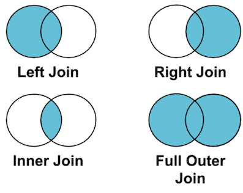

Title: Pandas 06 - Veri Düzenleme Yöntemleri
Date: 2022-07-15 00:00
Category: Pandas
Tags: Python, Pandas, Kütüphane, Modül
Author: Mustafa Halil

# Düzenleme Yöntemleri

Bu bölümde, Oluşturulan Veri Çerçevelerinin düzenlemesine dair pek çok komut, fonksiyon ve parametre öğreneceğiz. Pandas kullanırken en fazla ihtiyaç duyacağımız Yöntemlerin bir kısmını bu bölümde ele alacak, anlatacağız.

### İndeks Değerlerini Ayarlamak

### index_col Parametresi

Veri Çerçevesi (Data Frame) oluştururken sütunlardan birini, indeks değeri olarak ayarlamak/atamak istersek, **index_col** parametresini kullanabiliriz.
Öncelikle elimizdeki excel dosyamızı veri çerçevesine dönüştürüp içeriğine göz atalım.

```python
import pandas as pd
dogumlar = pd.read_excel("Veri_Setleri/AyaGöreDoğumlar.xlsx", sheet_name = "ortalama")
print(dogumlar).head()
```

|     | Yıl  | Toplam  | Ortalama      |
| --- | ---- | ------- | ------------- |
| 0   | 2001 | 1323341 | 110278.416667 |
| 1   | 2002 | 1229555 | 102462.916667 |
| 2   | 2003 | 1198927 | 99910.583333  |
| 3   | 2004 | 1222484 | 101873.666667 |
| 4   | 2005 | 1244041 | 103670.083333 |

Oluşan veri çerçevesindeki **Yıl** sütununu indeks olarak ayarlayalım.

```python
dogumlar = pd.read_excel("Veri_Setleri/AyaGöreDoğumlar.xlsx", sheet_name = "ortalama", index_col=0)
print(dogumlar.head())
```

| Yıl  | Toplam  | Ortalama      |
| ---- | ------- | ------------- |
| 2001 | 1323341 | 110278.416667 |
| 2002 | 1229555 | 102462.916667 |
| 2003 | 1198927 | 99910.583333  |
| 2004 | 1222484 | 101873.666667 |
| 2005 | 1244041 | 103670.083333 |

İşlem başarılı. **Yıl** Sütunu, indeks olarak ayarlandı.

### set_index() Fonksiyonu

Veri Çerçevelerinin oluştururken, indeks değerlerini **index_col** parametresi ile ayarlayabildiğimiz gibi İstersek Veri Çerçevesini oluşturduktan sonra da, **set_index()** metodu ile de indeks değerlerini değiştirebilir / atayabiliriz. **dogumlar** isimli veri çerçevemizi yeniden oluşturup indeks başlığı **set_index()** metodu ile değiştirelim.

```python
dogumlar = pd.read_excel("Veri_Setleri/AyaGöreDoğumlar.xlsx")
print(dogumlar)
```

|     | Yıl  | Toplam  | Ocak   | Şubat  | Mart   | Nisan  | Mayıs  | Haziran | Temmuz | Ağustos | Eylül  | Ekim   | Kasım  | Aralık |
| --- | ---- | ------- | ------ | ------ | ------ | ------ | ------ | ------- | ------ | ------- | ------ | ------ | ------ | ------ |
| 0   | 2001 | 1323341 | 170397 | 103476 | 107912 | 102585 | 110391 | 111722  | 119752 | 120963  | 109590 | 103662 | 92554  | 70337  |
| 1   | 2002 | 1229555 | 155065 | 103446 | 102175 | 95976  | 99501  | 102627  | 109747 | 108061  | 99701  | 96216  | 89285  | 67755  |
| 2   | 2003 | 1198927 | 138670 | 89548  | 101046 | 92574  | 99531  | 104644  | 109225 | 109159  | 98766  | 94838  | 89542  | 71384  |
| 3   | 2004 | 1222484 | 141538 | 94596  | 100696 | 100801 | 102214 | 105728  | 111102 | 110425  | 98492  | 94840  | 90833  | 71219  |
| 4   | 2005 | 1244041 | 142311 | 94234  | 100529 | 97441  | 106833 | 108536  | 111066 | 111430  | 103273 | 103310 | 92364  | 72714  |
| 5   | 2006 | 1255432 | 128708 | 94760  | 104126 | 97624  | 103903 | 112016  | 115097 | 117298  | 107158 | 105773 | 93167  | 75802  |
| 6   | 2007 | 1289992 | 131276 | 93927  | 102807 | 100159 | 108119 | 110359  | 122324 | 118169  | 111055 | 109888 | 99639  | 82270  |
| 7   | 2008 | 1295511 | 130424 | 98099  | 102962 | 102877 | 107003 | 110089  | 119977 | 120048  | 114470 | 107978 | 97389  | 84195  |
| 8   | 2009 | 1266751 | 122407 | 92414  | 99419  | 103432 | 103783 | 107847  | 117160 | 116229  | 115824 | 105407 | 96155  | 86674  |
| 9   | 2010 | 1261169 | 119444 | 95023  | 103583 | 99477  | 103676 | 109441  | 113639 | 113082  | 110324 | 104427 | 101610 | 87443  |
| 10  | 2011 | 1252812 | 118547 | 92484  | 100992 | 95348  | 94131  | 104086  | 114390 | 121152  | 112959 | 105048 | 102970 | 90705  |
| 11  | 2012 | 1294605 | 119556 | 99966  | 105499 | 98880  | 105807 | 110056  | 118649 | 123634  | 110338 | 108327 | 102413 | 91480  |
| 12  | 2013 | 1297505 | 118373 | 94803  | 102471 | 96865  | 106757 | 109672  | 123758 | 121625  | 112913 | 110716 | 104182 | 95370  |
| 13  | 2014 | 1351088 | 121694 | 96802  | 105603 | 105652 | 112448 | 115978  | 129616 | 126296  | 119030 | 111754 | 105566 | 100649 |
| 14  | 2015 | 1336908 | 120373 | 99169  | 105792 | 103110 | 105254 | 115681  | 130945 | 123296  | 116428 | 112839 | 106319 | 97702  |
| 15  | 2016 | 1316204 | 114274 | 100640 | 105166 | 101947 | 104080 | 117994  | 120126 | 124833  | 114366 | 107951 | 104959 | 99868  |
| 16  | 2017 | 1299419 | 114968 | 95567  | 101700 | 96132  | 106274 | 115827  | 122894 | 122386  | 110811 | 108538 | 104386 | 99936  |
| 17  | 2018 | 1255258 | 107530 | 90002  | 101283 | 94776  | 104719 | 110383  | 117967 | 116715  | 107105 | 107818 | 100436 | 96524  |
| 18  | 2019 | 1188524 | 104044 | 85510  | 96631  | 93013  | 105166 | 97965   | 112628 | 109182  | 99981  | 98320  | 92936  | 93148  |
| 19  | 2020 | 1115821 | 94888  | 83433  | 89503  | 88526  | 93159  | 99232   | 105970 | 100478  | 96018  | 93428  | 87540  | 83646  |
| 20  | 2021 | 1079842 | 80733  | 77535  | 86214  | 82789  | 88506  | 94266   | 99252  | 100407  | 97334  | 93290  | 92189  | 87327  |

Veri çerçevesini yeniden (AyaGöreDoğumlar.xlsx isimli excel doyasından içe aktararak) oluşturduğumuz ve **index_col** parametresi kullanmadığımız için, İndeks değerleri Pandas tarafından otomatik olarak oluşturuldu. Bu kez de **Toplam** isimli sütun değerlerini **set_index** metoduyla, indeks değerleri olarak atayalım.

```python
print(dogumlar.set_index("Toplam"))
```

| Toplam  | Yıl  | Ocak   | Şubat  | Mart   | Nisan  | Mayıs  | Haziran | Temmuz | Ağustos | Eylül  | Ekim   | Kasım  | Aralık |
| ------- | ---- | ------ | ------ | ------ | ------ | ------ | ------- | ------ | ------- | ------ | ------ | ------ | ------ |
| 1323341 | 2001 | 170397 | 103476 | 107912 | 102585 | 110391 | 111722  | 119752 | 120963  | 109590 | 103662 | 92554  | 70337  |
| 1229555 | 2002 | 155065 | 103446 | 102175 | 95976  | 99501  | 102627  | 109747 | 108061  | 99701  | 96216  | 89285  | 67755  |
| 1198927 | 2003 | 138670 | 89548  | 101046 | 92574  | 99531  | 104644  | 109225 | 109159  | 98766  | 94838  | 89542  | 71384  |
| 1222484 | 2004 | 141538 | 94596  | 100696 | 100801 | 102214 | 105728  | 111102 | 110425  | 98492  | 94840  | 90833  | 71219  |
| 1244041 | 2005 | 142311 | 94234  | 100529 | 97441  | 106833 | 108536  | 111066 | 111430  | 103273 | 103310 | 92364  | 72714  |
| 1255432 | 2006 | 128708 | 94760  | 104126 | 97624  | 103903 | 112016  | 115097 | 117298  | 107158 | 105773 | 93167  | 75802  |
| 1289992 | 2007 | 131276 | 93927  | 102807 | 100159 | 108119 | 110359  | 122324 | 118169  | 111055 | 109888 | 99639  | 82270  |
| 1295511 | 2008 | 130424 | 98099  | 102962 | 102877 | 107003 | 110089  | 119977 | 120048  | 114470 | 107978 | 97389  | 84195  |
| 1266751 | 2009 | 122407 | 92414  | 99419  | 103432 | 103783 | 107847  | 117160 | 116229  | 115824 | 105407 | 96155  | 86674  |
| 1261169 | 2010 | 119444 | 95023  | 103583 | 99477  | 103676 | 109441  | 113639 | 113082  | 110324 | 104427 | 101610 | 87443  |
| 1252812 | 2011 | 118547 | 92484  | 100992 | 95348  | 94131  | 104086  | 114390 | 121152  | 112959 | 105048 | 102970 | 90705  |
| 1294605 | 2012 | 119556 | 99966  | 105499 | 98880  | 105807 | 110056  | 118649 | 123634  | 110338 | 108327 | 102413 | 91480  |
| 1297505 | 2013 | 118373 | 94803  | 102471 | 96865  | 106757 | 109672  | 123758 | 121625  | 112913 | 110716 | 104182 | 95370  |
| 1351088 | 2014 | 121694 | 96802  | 105603 | 105652 | 112448 | 115978  | 129616 | 126296  | 119030 | 111754 | 105566 | 100649 |
| 1336908 | 2015 | 120373 | 99169  | 105792 | 103110 | 105254 | 115681  | 130945 | 123296  | 116428 | 112839 | 106319 | 97702  |
| 1316204 | 2016 | 114274 | 100640 | 105166 | 101947 | 104080 | 117994  | 120126 | 124833  | 114366 | 107951 | 104959 | 99868  |
| 1299419 | 2017 | 114968 | 95567  | 101700 | 96132  | 106274 | 115827  | 122894 | 122386  | 110811 | 108538 | 104386 | 99936  |
| 1255258 | 2018 | 107530 | 90002  | 101283 | 94776  | 104719 | 110383  | 117967 | 116715  | 107105 | 107818 | 100436 | 96524  |
| 1188524 | 2019 | 104044 | 85510  | 96631  | 93013  | 105166 | 97965   | 112628 | 109182  | 99981  | 98320  | 92936  | 93148  |
| 1115821 | 2020 | 94888  | 83433  | 89503  | 88526  | 93159  | 99232   | 105970 | 100478  | 96018  | 93428  | 87540  | 83646  |
| 1079842 | 2021 | 80733  | 77535  | 86214  | 82789  | 88506  | 94266   | 99252  | 100407  | 97334  | 93290  | 92189  | 87327  |

### Sütunları Atla

### usecols Parametresi

Bir Excel çalışma sayfasını ya da farklı kaynaktan alınan veriyi, Pandas ile Veri Çerçevesine (DataFrame'e) dönüştürürken, bazı sütunları atlamamız / göz ardı etmemiz gerekebilir, bunu **usecols** parametresi kullanarak yapabiliriz. Bu parametre, tamsayı (int), metin (str), list-like veya callable (varsayılan None) değerlerini alır. Sütun
 adlarının veya konumlarının listesini belirtmek için, bir dize (string) listesi veya bir tamsayı (int) listesi kullanmalıyız.

Aylara Göre Doğum Sayıları tablosunu yukarıda görmüştük. Bu tabloda 14 sütun bulunmaktadır. Sadece istediğimiz aylara ait sütun bilgilerini görüntülemek istersek **usecols** parametresine ya **ay isimlerini** ya da **ayın sütun indis değerini** yazmamız gerekir. Her iki kullanımı da görelim.

```python
dogumlar = pd.read_excel("Veri_Setleri/AyaGöreDoğumlar.xlsx", usecols=["Yıl", "Ocak", "Haziran", "Ağustos"])
print(dogumlar.head())
```

|     | Yıl  | Ocak   | Haziran | Ağustos |
| --- | ---- | ------ | ------- | ------- |
| 0   | 2001 | 170397 | 111722  | 120963  |
| 1   | 2002 | 155065 | 102627  | 108061  |
| 2   | 2003 | 138670 | 104644  | 109159  |
| 3   | 2004 | 141538 | 105728  | 110425  |
| 4   | 2005 | 142311 | 108536  | 111430  |

```python
dogumlar = pd.read_excel("Veri_Setleri/AyaGöreDoğumlar.xlsx", usecols=[0,2,7,9])
print(dogumlar.head())
```

|     | Yıl  | Ocak   | Haziran | Ağustos |
| --- | ---- | ------ | ------- | ------- |
| 0   | 2001 | 170397 | 111722  | 120963  |
| 1   | 2002 | 155065 | 102627  | 108061  |
| 2   | 2003 | 138670 | 104644  | 109159  |
| 3   | 2004 | 141538 | 105728  | 110425  |
| 4   | 2005 | 142311 | 108536  | 111430  |

**usecols** parametresine, <u>sütun isimlerini yazarken</u>, sütun isimleri metinsel (string) ifade olduğu için **çift tırnak işareti "** kullandığımıza, <u>indis değeri yazarken</u> , indis değerleri tamsayı (int) olduğu için, tırnak işareti kullanmadığımıza dikkat edin.

Ayrıca, **usecols** parametresini, sütun aralığı belirterek te kullanabiliriz. Veri çerçevemizin sütunlarını, Excel programının sütun isimleri gibi (A, B, C,... şeklinde) düşünerek aralık belirtebiliriz. Aşağıdaki örnek, ne demek istediğimi daha net 
anlatacaktır.

```python
dogumlar = pd.read_excel("Veri_Setleri/AyaGöreDoğumlar.xlsx", usecols="C:G")
print(dogumlar.head())
```

|     | Ocak   | Şubat  | Mart   | Nisan  | Mayıs  |
| --- | ------ | ------ | ------ | ------ | ------ |
| 0   | 170397 | 103476 | 107912 | 102585 | 110391 |
| 1   | 155065 | 103446 | 102175 | 95976  | 99501  |
| 2   | 138670 | 89548  | 101046 | 92574  | 99531  |
| 3   | 141538 | 94596  | 100696 | 100801 | 102214 |
| 4   | 142311 | 94234  | 100529 | 97441  | 106833 |

Oluşturduğumuz Veri Çerçevemizdeki **Yıl** Sütunu **A**'ya, **Toplam** sütunu **B**'ye, **Ocak** Sütunu da **C**'ye denk geldiği için, çıktımız **Ocak** Ayından başlayıp **G** sütununa denk gelen **Mayıs** ayına kadar olan aralığı alarak çıktı olarak bize sundu.

### Satırları Atla

### skiprows Parametresi

Bir Excel çalışma sayfasını ya da farklı kaynaktan alınan veriyi, Pandas ile Veri Çerçevesine (DataFrame'e) dönüştürürken, bazı satırları atlamamız / göz ardı etmemiz gerekebilir, bunu **skiprows** parametresi kullanarak yapabiliriz. Bu, parametre olarak, list-like, tamsayı (int) veya callable (isteğe bağlı) değerlerini alır. Bu parametre ile ilk birkaç satırı, seçilen satırı ve belirttiğimiz satır aralığını atlayabiliriz.

```python
basliksiz = pd.read_excel("Veri_Setleri/SatırAtla.xlsx")
print(basliksiz.head(10))
```

|     | Unnamed: 0               | Unnamed: 1 | Unnamed: 2 | Unnamed: 3   |
| --- | ------------------------ | ---------- | ---------- | ------------ |
| 0   | mhg                      | NaN        | NaN        | NaN          |
| 1   | NaN                      | NaN        | 654        | NaN          |
| 2   | NaN                      | NaN        | NaN        | NaN          |
| 3   | Film_Adı                 | Yıl        | Puan       | Oylayan_Kişi |
| 4   | The Shawshank Redemption | 1994       | 9,2        | 1071904      |
| 5   | The Godfather            | 1972       | 9,2        | 751381       |
| 6   | The Godfather: Part II   | 1974       | 9          | 488889       |
| 7   | Pulp Fiction             | 1994       | 8,9        | 830504       |
| 8   | The Dark Knight          | 2008       | 8,9        | 1045186      |
| 9   | 12 Angry Men             | 1957       | 8,9        | 264112       |

Atlamak / gözardı etmek istediğimiz satırları tek tek te belirtebiliriz.

```python
basliksiz = pd.read_excel("Veri_Setleri/SatırAtla.xlsx", skiprows=[0,1,2,3,5,8,10,12])
print(basliksiz.head(10))
```

|     | Film_Adı                                          | Yıl  | Puan | Oylayan_Kişi |
| --- | ------------------------------------------------- | ---- | ---- | ------------ |
| 0   | The Godfather                                     | 1972 | 9,2  | 751381       |
| 1   | The Godfather: Part II                            | 1974 | 9    | 488889       |
| 2   | The Dark Knight                                   | 2008 | 8,9  | 1045186      |
| 3   | Schindler's List                                  | 1993 | 8,9  | 545703       |
| 4   | Fight Club                                        | 1999 | 8,8  | 814389       |
| 5   | Star Wars: Episode V - The Empire Strikes Back    | 1980 | 8,8  | 519895       |
| 6   | The Lord of the Rings: The Fellowship of the R... | 2001 | 8,8  | 784999       |
| 7   | One Flew Over the Cuckoo's Nest                   | 1975 | 8,7  | 447005       |
| 8   | Goodfellas                                        | 1990 | 8,7  | 465445       |
| 9   | Seven Samurai                                     | 1954 | 8,7  | 161969       |

### Sütun Ekle

Veri çerçevesine yeni bir sütun ekleyip bu sütuna değer atamak mümkündür. Bunu şu yöntemle yapabiliriz.

 `Veri_Çerçevesi_Adı["Yeni_Sütun_Adı"] = Atanacak_Değerler`

Örneğin NBA oyuncularının çeşitli bilgilerinin bulunduğu veri çerçevesinden, yıllık kazanç miktarlarını (**Salary**) 12'ye bölerek aylık kazançlarını hesaplayarak, **Aylık Kazanç** isimli yeni sütuna yazmaya çalışalım.
Önce Veri çerçevemizin orijinal haline göz atalım.

```python
veri = pd.read_csv("Veri_Setleri/nba.csv")
print(veri)
```

|     | Name          | Team           | Number | Position | Age  | Height | Weight | College           | Salary    |
| --- | ------------- | -------------- | ------ | -------- | ---- | ------ | ------ | ----------------- | --------- |
| 0   | Avery Bradley | Boston Celtics | 0.0    | PG       | 25.0 | 6-2    | 180.0  | Texas             | 7730337.0 |
| 1   | Jae Crowder   | Boston Celtics | 99.0   | SF       | 25.0 | 6-6    | 235.0  | Marquette         | 6796117.0 |
| 2   | John Holland  | Boston Celtics | 30.0   | SG       | 27.0 | 6-5    | 205.0  | Boston University | NaN       |
| 3   | R.J. Hunter   | Boston Celtics | 28.0   | SG       | 22.0 | 6-5    | 185.0  | Georgia State     | 1148640.0 |
| 4   | Jonas Jerebko | Boston Celtics | 8.0    | PF       | 29.0 | 6-10   | 231.0  | NaN               | 5000000.0 |
| ... | ...           | ...            | ...    | ...      | ...  | ...    | ...    | ...               | ...       |
| 453 | Shelvin Mack  | Utah Jazz      | 8.0    | PG       | 26.0 | 6-3    | 203.0  | Butler            | 2433333.0 |
| 454 | Raul Neto     | Utah Jazz      | 25.0   | PG       | 24.0 | 6-1    | 179.0  | NaN               | 900000.0  |
| 455 | Tibor Pleiss  | Utah Jazz      | 21.0   | C        | 26.0 | 7-3    | 256.0  | NaN               | 2900000.0 |
| 456 | Jeff Withey   | Utah Jazz      | 24.0   | C        | 26.0 | 7-0    | 231.0  | Kansas            | 947276.0  |
| 457 | NaN           | NaN            | NaN    | NaN      | NaN  | NaN    | NaN    | NaN               | NaN       |

458 rows × 9 columns

Şimdi istediğimizi yapmaya (yıllık kazanç miktarlarını (**Salary**) 12'ye bölerek aylık kazançları, **Aylık Kazanç** isimli yeni sütuna yazmaya) sıra geldi.

```python
veri["Aylık Kazanç"] = veri["Salary"] / 12
print(veri)
```

|     | Name          | Team           | Number | Position | Age  | Height | Weight | College           | Salary    | Aylık Kazanç  |
| --- | ------------- | -------------- | ------ | -------- | ---- | ------ | ------ | ----------------- | --------- | ------------- |
| 0   | Avery Bradley | Boston Celtics | 0.0    | PG       | 25.0 | 6-2    | 180.0  | Texas             | 7730337.0 | 644194.750000 |
| 1   | Jae Crowder   | Boston Celtics | 99.0   | SF       | 25.0 | 6-6    | 235.0  | Marquette         | 6796117.0 | 566343.083333 |
| 2   | John Holland  | Boston Celtics | 30.0   | SG       | 27.0 | 6-5    | 205.0  | Boston University | NaN       | NaN           |
| 3   | R.J. Hunter   | Boston Celtics | 28.0   | SG       | 22.0 | 6-5    | 185.0  | Georgia State     | 1148640.0 | 95720.000000  |
| 4   | Jonas Jerebko | Boston Celtics | 8.0    | PF       | 29.0 | 6-10   | 231.0  | NaN               | 5000000.0 | 416666.666667 |
| ... | ...           | ...            | ...    | ...      | ...  | ...    | ...    | ...               | ...       | ...           |
| 453 | Shelvin Mack  | Utah Jazz      | 8.0    | PG       | 26.0 | 6-3    | 203.0  | Butler            | 2433333.0 | 202777.750000 |
| 454 | Raul Neto     | Utah Jazz      | 25.0   | PG       | 24.0 | 6-1    | 179.0  | NaN               | 900000.0  | 75000.000000  |
| 455 | Tibor Pleiss  | Utah Jazz      | 21.0   | C        | 26.0 | 7-3    | 256.0  | NaN               | 2900000.0 | 241666.666667 |
| 456 | Jeff Withey   | Utah Jazz      | 24.0   | C        | 26.0 | 7-0    | 231.0  | Kansas            | 947276.0  | 78939.666667  |
| 457 | NaN           | NaN            | NaN    | NaN      | NaN  | NaN    | NaN    | NaN               | NaN       | NaN           |

458 rows × 10 columns

### Satır ya da Sütun Sil

Veri çerçevesine ekleme yapılabildiği gibi, silme / çıkarma işlemi de yapılabiliyor.
Bunun için **drop()** metodu kullanılıyor.

### drop() Fonksiyonu

Bu metodun kullanım/yazım şekli aşağıdaki gibidir.

```python
Veri_Çerçevesi_Adı.drop("Satır ya da Sütun Adı", axis = 0 ya da 1, inplace = True/False)
```

- **Satır ya da Sütun Adı**, adından belli olduğu üzere, silinecek sütunun adıdır. Birden fazla sütun silinmek istenirse, isimler liste şeklinde yani köşeli parantez içinde yazılmalıdır.

#### axis Parametresi

Sıfır **(0)** Satırları, Bir **(1)** Sütunları temsil eder. Varsayılan (default) değeri 0'dır. Aynı isme ait satır ve sütun bilgisi olması durumunda, bu parametre satırın mı, sütunun mu silinmesi gerektiği konusunda bize yardımcı olur.

#### inplace Parametresi

Gerçekleştirilen silme işleminin veri çerçevesinde kalıcı ya da geçici olmasını ayarladığımız kısımdır. **inplace = True** yazılırsa, yapılan işlem kalıcı hale gelecektir.

NBA oyuncularının bilgilerinin bulunduğu veri çerçevesinden, **Yaş (Age)** bilgisini silmeye çalışalım.

```python
veri.drop("Age", axis = 1, inplace=True)
print(veri)
```

|     | Name          | Team           | Number | Position | Height | Weight | College           | Salary    | Aylık Kazanç  |
| --- | ------------- | -------------- | ------ | -------- | ------ | ------ | ----------------- | --------- | ------------- |
| 0   | Avery Bradley | Boston Celtics | 0.0    | PG       | 6-2    | 180.0  | Texas             | 7730337.0 | 644194.750000 |
| 1   | Jae Crowder   | Boston Celtics | 99.0   | SF       | 6-6    | 235.0  | Marquette         | 6796117.0 | 566343.083333 |
| 2   | John Holland  | Boston Celtics | 30.0   | SG       | 6-5    | 205.0  | Boston University | NaN       | NaN           |
| 3   | R.J. Hunter   | Boston Celtics | 28.0   | SG       | 6-5    | 185.0  | Georgia State     | 1148640.0 | 95720.000000  |
| 4   | Jonas Jerebko | Boston Celtics | 8.0    | PF       | 6-10   | 231.0  | NaN               | 5000000.0 | 416666.666667 |
| ... | ...           | ...            | ...    | ...      | ...    | ...    | ...               | ...       | ...           |
| 453 | Shelvin Mack  | Utah Jazz      | 8.0    | PG       | 6-3    | 203.0  | Butler            | 2433333.0 | 202777.750000 |
| 454 | Raul Neto     | Utah Jazz      | 25.0   | PG       | 6-1    | 179.0  | NaN               | 900000.0  | 75000.000000  |
| 455 | Tibor Pleiss  | Utah Jazz      | 21.0   | C        | 7-3    | 256.0  | NaN               | 2900000.0 | 241666.666667 |
| 456 | Jeff Withey   | Utah Jazz      | 24.0   | C        | 7-0    | 231.0  | Kansas            | 947276.0  | 78939.666667  |
| 457 | NaN           | NaN            | NaN    | NaN      | NaN    | NaN    | NaN               | NaN       | NaN           |

458 rows × 9 columns

Gördüğünüz gibi veri çerçevemizde artık Oyuncuların Yaş bilgilerini barındıran **Age** isimli sütun bulunmuyor, tamemiyle silindi.

Birden fazla satır ya da sütun silmek istediğimiz zaman silinmesini istediğimiz satır ya da sütun isimlerinin (ya da indeks değerlerini) liste olarak yani köşeli parantez içerisinde belirtmemiz gerekir.

```python
veri.drop(["College", "Number"], axis = 1, inplace=True)
print(veri)
```

|     | Name          | Team           | Position | Height | Weight | Salary    | Aylık Kazanç  |
| --- | ------------- | -------------- | -------- | ------ | ------ | --------- | ------------- |
| 0   | Avery Bradley | Boston Celtics | PG       | 6-2    | 180.0  | 7730337.0 | 644194.750000 |
| 1   | Jae Crowder   | Boston Celtics | SF       | 6-6    | 235.0  | 6796117.0 | 566343.083333 |
| 2   | John Holland  | Boston Celtics | SG       | 6-5    | 205.0  | NaN       | NaN           |
| 3   | R.J. Hunter   | Boston Celtics | SG       | 6-5    | 185.0  | 1148640.0 | 95720.000000  |
| 4   | Jonas Jerebko | Boston Celtics | PF       | 6-10   | 231.0  | 5000000.0 | 416666.666667 |
| ... | ...           | ...            | ...      | ...    | ...    | ...       | ...           |
| 453 | Shelvin Mack  | Utah Jazz      | PG       | 6-3    | 203.0  | 2433333.0 | 202777.750000 |
| 454 | Raul Neto     | Utah Jazz      | PG       | 6-1    | 179.0  | 900000.0  | 75000.000000  |
| 455 | Tibor Pleiss  | Utah Jazz      | C        | 7-3    | 256.0  | 2900000.0 | 241666.666667 |
| 456 | Jeff Withey   | Utah Jazz      | C        | 7-0    | 231.0  | 947276.0  | 78939.666667  |
| 457 | NaN           | NaN            | NaN      | NaN    | NaN    | NaN       | NaN           |

458 rows × 7 columns

## drop_duplicates() Fonksiyonu

Veri çerçevemizde çift kayıt varsa, yani tüm veriler aynı olan birden fazla satır verisi varsa, bunlardan biri kalacak şekilde diğerlerinin silmek için **drop_duplicates** metodunu / fonksiyonunu kullanabiliriz.

Örnek kodları inceleyelim.

```python
import pandas as pd
sozluk = {"isim" : ["Mustafa", "Halil", "Burak", "Emre", "Ersin", "Sertaç", "Furkan","Murat","Ahmet","Abdülkadir", "Halil", "Ersin"],
                    "yaş" : [25, 42, 43, 23, 37, 52, 30, 38, 40, 38, 42, 37],
                   "iş-meslek" : ["mühendis", "programcı", "akademisyen", "yönetici","amir","mühendis", "yönetici","müdür","veteriner","yönetici", "programcı", "amir"]}
veri = pd.DataFrame(sozluk)
print(veri)
```

|     | isim       | yaş | iş-meslek   |
| --- | ---------- | --- | ----------- |
| 0   | Mustafa    | 25  | mühendis    |
| 1   | Halil      | 42  | programcı   |
| 2   | Burak      | 43  | akademisyen |
| 3   | Emre       | 23  | yönetici    |
| 4   | Ersin      | 37  | amir        |
| 5   | Sertaç     | 52  | mühendis    |
| 6   | Furkan     | 30  | yönetici    |
| 7   | Murat      | 38  | müdür       |
| 8   | Ahmet      | 40  | veteriner   |
| 9   | Abdülkadir | 38  | yönetici    |
| 10  | Halil      | 42  | programcı   |
| 11  | Ersin      | 37  | amir        |

Veri çerçevemizi incelediğimizde 1. ve 10. indeksli satırlardaki ile 4. ve 11. indeksli satırlardaki verilerin aynı olduğunu görüyoruz. Bu fazla verilerden kurtulalım.

```python
print(veri.drop_duplicates())
```

|     | isim       | yaş | iş-meslek   |
| --- | ---------- | --- | ----------- |
| 0   | Mustafa    | 25  | mühendis    |
| 1   | Halil      | 42  | programcı   |
| 2   | Burak      | 43  | akademisyen |
| 3   | Emre       | 23  | yönetici    |
| 4   | Ersin      | 37  | amir        |
| 5   | Sertaç     | 52  | mühendis    |
| 6   | Furkan     | 30  | yönetici    |
| 7   | Murat      | 38  | müdür       |
| 8   | Ahmet      | 40  | veteriner   |
| 9   | Abdülkadir | 38  | yönetici    |

Veri çerçevesinde, tüm satır verisi aynı olmasa da, sadece belirtilen sütunda aynı değere sahip verilerden birinin kalıp diğerlerinin silinmesini istersek kullanmamız gereken parametre, **subset**'tir.

#### subset Parametresi

**subset** parametresine sütun ismi ya da isimleri yazarken liste veri tipinde girşi yapmak gerekir, yani sütun isimlerini köşeli parantez içerisinde yazmalıyız.

```python
import pandas as pd
sozluk = {"isim" : ["Mustafa", "Halil", "Burak", "Emre", "Ersin", "Sertaç", "Furkan","Murat","Ahmet","Abdülkadir"],
                    "yaş" : [25, 42, 43, 23, 37, 52, 30, 25, 40, 38],
                   "iş-meslek" : ["mühendis", "programcı", "akademisyen", "yönetici","amir","mühendis", "yönetici","müdür","veteriner","yönetici"]}
veri = pd.DataFrame(sozluk)
print(veri)
```

|     | isim       | yaş | iş-meslek   |
| --- | ---------- | --- | ----------- |
| 0   | Mustafa    | 25  | mühendis    |
| 1   | Halil      | 42  | programcı   |
| 2   | Burak      | 43  | akademisyen |
| 3   | Emre       | 23  | yönetici    |
| 4   | Ersin      | 37  | amir        |
| 5   | Sertaç     | 52  | mühendis    |
| 6   | Furkan     | 30  | yönetici    |
| 7   | Murat      | 25  | müdür       |
| 8   | Ahmet      | 40  | veteriner   |
| 9   | Abdülkadir | 38  | yönetici    |

Görüldüğü üzre, veri çerçevemizde birebir aynı satır verileri bulunmuyor ancak aynı meslek grubuna sahip kayıtlar mecvut. Diyelim ki her meslek grubundan bir kişi kalacak, diğer veriler silinecek şekilde bir işlem yapmak istiyoruz. Bu durumda aşağıdaki kdu alıştırmamız gerekir.

```python
print(veri.drop_duplicates(subset=["iş-meslek"]))
```

|     | isim    | yaş | iş-meslek   |
| --- | ------- | --- | ----------- |
| 0   | Mustafa | 25  | mühendis    |
| 1   | Halil   | 42  | programcı   |
| 2   | Burak   | 43  | akademisyen |
| 3   | Emre    | 23  | yönetici    |
| 4   | Ersin   | 37  | amir        |
| 7   | Murat   | 25  | müdür       |
| 8   | Ahmet   | 40  | veteriner   |

İndeks verilerine bakarsanız, 5. , 6. ve 9. satırlardaki verilerin silindiğini göreceksiniz. Bunun sebebi, 5. satırda **iş-meslek** sütununda yazan ifadenin, daha üst satırlarda var olması sebebiyle silinmesidir.

Çift olan verilerden İlki mi? sonuncu mu kalacak, hangisinin silineceğine pandas nasıl karar verecek derseniz, onun için de **keep** parametresini kullanmamız gerekecek.

#### keep Parametresi

**keep** parametresine **last** değeri atanırsa, bu kez çift verilerden sonuncusu kalacak ve ilk veriler silinecektir.

Örnek kodu inceleyelim.

```python
print(veri.drop_duplicates(subset=["iş-meslek"], keep="last"))
```

|     | isim       | yaş | iş-meslek   |
| --- | ---------- | --- | ----------- |
| 1   | Halil      | 42  | programcı   |
| 2   | Burak      | 43  | akademisyen |
| 4   | Ersin      | 37  | amir        |
| 5   | Sertaç     | 52  | mühendis    |
| 7   | Murat      | 25  | müdür       |
| 8   | Ahmet      | 40  | veteriner   |
| 9   | Abdülkadir | 38  | yönetici    |

Görüldüğü gibi, bu kez "iş-meslek" sütununda ilk veriler olan 0. , 3. ve 6. satırlar silindi.

### String Metotları

Python ile kodlama yaparken, metinsel ifadelerle uğraştığımızda kullandığımız **string metotlarını** hatırlarsınız. Örneğin, Metinlerin tümünü büyük harfe ya da küçük harfe
 çevirmek. Bu tür string metotları Pandas ile kulanmak ve veri çerçevesine uygulamak mümkün. Bunun için **str** ifadesini kullanabiliriz. 

Önce Bir Veri Çerçevesi oluşturalım ve gözatalım.

```python
sozluk = {"isim" : ["Mustafa", "Halil", "Burak", "Emre", "Ersin", "Sertaç", "Furkan","Murat","Ahmet","Abdülkadir"],
                    "yaş" : [25, 38, 41, 23, 37, 52, 30, 23, 40, 38],
                   "iş-meslek" : ["mühendis", "programcı", "akademisyen", "yönetici","amir","mühendis", "yönetici","müdür","veteriner","yönetici"]}
veri = pd.DataFrame(sozluk)
print(veri)
```

|     | isim       | yaş | iş-meslek   |
| --- | ---------- | --- | ----------- |
| 0   | Mustafa    | 25  | mühendis    |
| 1   | Halil      | 38  | programcı   |
| 2   | Burak      | 41  | akademisyen |
| 3   | Emre       | 23  | yönetici    |
| 4   | Ersin      | 37  | amir        |
| 5   | Sertaç     | 52  | mühendis    |
| 6   | Furkan     | 30  | yönetici    |
| 7   | Murat      | 23  | müdür       |
| 8   | Ahmet      | 40  | veteriner   |
| 9   | Abdülkadir | 38  | yönetici    |

Veri Çerçevemizin **iş-meslek** sütunundaki tüm metinleri büyük harfe çevirip ekrana yazdıralım.

```python
print(veri["iş-meslek"].str.upper())
```

```python
0       MÜHENDIS
1      PROGRAMCI
2    AKADEMISYEN
3       YÖNETICI
4           AMIR
5       MÜHENDIS
6       YÖNETICI
7          MÜDÜR
8      VETERINER
9       YÖNETICI
Name: iş-meslek, dtype: object
```

Uyguladığımız metot sonrası, veri çerçevemizi tekrar çağırdığımızda, **iş-meslek** sütunundaki metinlerin değişmediğini, eski halinde kaldığını göreceğiz.
 Bunu sebebi, yaptığımız değişikliği bir değişken olarak alıp, **iş-meslek** sütununa atamamaktır. İfade etmeye çalıştığım şeyin, aşağıdaki satırda daha net anlaşılacağını düşünüyorum. Atama işlem sonrası Veri çerçevemizi çağırıp değişikiğin uygulandığını görüyoruz.

```python
veri["iş-meslek"] = veri["iş-meslek"].str.upper()
print(veri)
```

|     | isim       | yaş | iş-meslek   |
| --- | ---------- | --- | ----------- |
| 0   | Mustafa    | 25  | MÜHENDIS    |
| 1   | Halil      | 38  | PROGRAMCI   |
| 2   | Burak      | 41  | AKADEMISYEN |
| 3   | Emre       | 23  | YÖNETICI    |
| 4   | Ersin      | 37  | AMIR        |
| 5   | Sertaç     | 52  | MÜHENDIS    |
| 6   | Furkan     | 30  | YÖNETICI    |
| 7   | Murat      | 23  | MÜDÜR       |
| 8   | Ahmet      | 40  | VETERINER   |
| 9   | Abdülkadir | 38  | YÖNETICI    |

Şimdi de **iş-meslek** Sütunundaki verilerin sadece baş harflerini büyük yapalım.

```python
veri["iş-meslek"] = veri["iş-meslek"].str.capitalize()
print(veri)
```

|     | isim       | yaş | iş-meslek   |
| --- | ---------- | --- | ----------- |
| 0   | Mustafa    | 25  | Mühendis    |
| 1   | Halil      | 38  | Programci   |
| 2   | Burak      | 41  | Akademisyen |
| 3   | Emre       | 23  | Yönetici    |
| 4   | Ersin      | 37  | Amir        |
| 5   | Sertaç     | 52  | Mühendis    |
| 6   | Furkan     | 30  | Yönetici    |
| 7   | Murat      | 23  | Müdür       |
| 8   | Ahmet      | 40  | Veteriner   |
| 9   | Abdülkadir | 38  | Yönetici    |

Son olarak ta, veri çerçevemizim sütun başlıklarını büyük karfe çevirelim.

```python
veri.columns = veri.columns.str.upper()
print(veri)
```

|     | ISIM       | YAŞ | IŞ-MESLEK   |
| --- | ---------- | --- | ----------- |
| 0   | Mustafa    | 25  | Mühendis    |
| 1   | Halil      | 38  | Programci   |
| 2   | Burak      | 41  | Akademisyen |
| 3   | Emre       | 23  | Yönetici    |
| 4   | Ersin      | 37  | Amir        |
| 5   | Sertaç     | 52  | Mühendis    |
| 6   | Furkan     | 30  | Yönetici    |
| 7   | Murat      | 23  | Müdür       |
| 8   | Ahmet      | 40  | Veteriner   |
| 9   | Abdülkadir | 38  | Yönetici    |

## transpose() Fonksiyonu

Satırların sütuna, sütunların satıra çevrilme işlemini `transpose()` fonksiyonu yardımıyla gerçekleştirebiliriz. Bu fonksiyon, Excel, LibreOfis,...vb uygulamalarda, "İşlemi tersine çevir" komutu ile aynı sonucu verir. Yukarıda oluşturduğumuz veri çerçevemizin transpozunu aşağıdaki şekilde alabiliriz.

```python
print(veri.transpose())
```

|           | 0        | 1         | 2           | 3        | 4     | 5        | 6        | 7     | 8         | 9          |
| --------- | -------- | --------- | ----------- | -------- | ----- | -------- | -------- | ----- | --------- | ---------- |
| isim      | Mustafa  | Halil     | Burak       | Emre     | Ersin | Sertaç   | Furkan   | Murat | Ahmet     | Abdülkadir |
| yaş       | 25       | 38        | 41          | 23       | 37    | 52       | 30       | 23    | 40        | 38         |
| iş-meslek | mühendis | programcı | akademisyen | yönetici | amir  | mühendis | yönetici | müdür | veteriner | yönetici   |

## apply() Fonksiyonu

Python programlama dilini öğrenirken karşılaştığımız **fonksiyonlar** konusunu hatırlarsınız Kullanıcı tarafından yazılan ya da standart python fonksiyonlarını, veri çerçevemize uygulamak istersek, `apply()` fonksiyonu kullanmamız gerekir.

Yukarıdaki **iş-meslek** sütunundaki metinlerin büyük harfe dönüştürülmesi örneğini, bir de `apply()` fonksiyonu ile uygulayalım.

```python
def buyuk_harf(x):
    return x.upper()

print(veri["IŞ-MESLEK"].apply(buyuk_harf))
```

```python
0       MÜHENDIS
1      PROGRAMCI
2    AKADEMISYEN
3       YÖNETICI
4           AMIR
5       MÜHENDIS
6       YÖNETICI
7          MÜDÜR
8      VETERINER
9       YÖNETICI
Name: IŞ-MESLEK, dtype: object
```

İşlemin kalıcı olmsı için yine atama operatörünü kullanmalıyız.

```python
veri["IŞ-MESLEK"] = veri["IŞ-MESLEK"].apply(buyuk_harf)
print(veri)
```

|     | ISIM       | YAŞ | IŞ-MESLEK   |
| --- | ---------- | --- | ----------- |
| 0   | Mustafa    | 25  | MÜHENDIS    |
| 1   | Halil      | 38  | PROGRAMCI   |
| 2   | Burak      | 41  | AKADEMISYEN |
| 3   | Emre       | 23  | YÖNETICI    |
| 4   | Ersin      | 37  | AMIR        |
| 5   | Sertaç     | 52  | MÜHENDIS    |
| 6   | Furkan     | 30  | YÖNETICI    |
| 7   | Murat      | 23  | MÜDÜR       |
| 8   | Ahmet      | 40  | VETERINER   |
| 9   | Abdülkadir | 38  | YÖNETICI    |

## Veri Çerçevelerini Birleştir

Pandas Kütüphanesinde Veri çerçevelerini birleştirmek için kullanılabilecek birden fazla Fonksiyon/Metot vardır. Aşağıda bu Fonksiyonların kullanımı anlatılmıştır.

## concat() Fonksiyonu

**Concat** kelimesi Concatenate kelimesinin kısaltamasıdır. **Concatenate** kelimesinin Türkçe karşılığı **Birleştir**'dir.  
`concat()` fonksiyonu ile veri çerçeveleri alt alta ya da yan yana birleştirilebilir. Varsayılan değer satır bazlı yani alt alta birleştirmedir.

Birleştirme örneklerini öğrenemek için öncelikle 2 sözlük yapısı oluşturup, bunları veri çerçevesine dönüştürelim.

```python
veri1 = {'A': ['A1','A2','A3','A4'],'B': ['B1','B2','B3','B4'],'C': ['C1','C2','C3','C4']}
veri2 = {'A': ['A5','A6','A7','A8'],'B': ['B5','B6','B7','B8'],'C': ['C5','C6','C7','C8']}
df1 = pd.DataFrame(veri1, index = [1,2,3,4])
df2 = pd.DataFrame(veri2, index = [5,6,7,8])
print(df1)
```

|     | A   | B   | C   |
| --- | --- | --- | --- |
| 1   | A1  | B1  | C1  |
| 2   | A2  | B2  | C2  |
| 3   | A3  | B3  | C3  |
| 4   | A4  | B4  | C4  |

```python
print(df2)
```

|     | A   | B   | C   |
| --- | --- | --- | --- |
| 5   | A5  | B5  | C5  |
| 6   | A6  | B6  | C6  |
| 7   | A7  | B7  | C7  |
| 8   | A8  | B8  | C8  |

Oluşturduğumuz veri çerçevelerini, `concat()` fonksiyonu ile birleştirelim. `concat()` fonksiyonuna en az iki adet veri çevçevesi eklemek gerekir. Malumunuz, Pandas'ta genellikle birden fazla parametre, seçenek ekleneceği zaman, bu değerler köşeli parantez içerisinde yani **liste** veri tipi olarak yazılır.

```python
print(pd.concat([df1, df2]))
```

|     | A   | B   | C   |
| --- | --- | --- | --- |
| 1   | A1  | B1  | C1  |
| 2   | A2  | B2  | C2  |
| 3   | A3  | B3  | C3  |
| 4   | A4  | B4  | C4  |
| 5   | A5  | B5  | C5  |
| 6   | A6  | B6  | C6  |
| 7   | A7  | B7  | C7  |
| 8   | A8  | B8  | C8  |

Gördüğünüz gibi, iki veri çerçevesi altalta birleştirildi.

### axis parametresi

Hatırlarsanız **drop** metodunu anlatırken **axis** parametresinden bahsetmiştik. **axis** parametresi, **0 ve 1** değerlerini alır, **0 satırları, 1 ise sütunları** temsil eder demiştik. Aynı parametreyi birleştirme işleminde de kullanabiliriz. eğer **axis** parametresi kullanılmaz ise, varsayılan değer **axis = 0** olduğu için yani satırları baz alarak birleştirme yapılır.

Şimdi **axis=1** parametresini ekleyerek veri çerçevelerini yanyana birleştirmeyi deneyelim.

```python
print(pd.concat([df1, df2], axis = 1))
```

|     | A   | B   | C   | A   | B   | C   |
| --- | --- | --- | --- | --- | --- | --- |
| 1   | A1  | B1  | C1  | NaN | NaN | NaN |
| 2   | A2  | B2  | C2  | NaN | NaN | NaN |
| 3   | A3  | B3  | C3  | NaN | NaN | NaN |
| 4   | A4  | B4  | C4  | NaN | NaN | NaN |
| 5   | NaN | NaN | NaN | A5  | B5  | C5  |
| 6   | NaN | NaN | NaN | A6  | B6  | C6  |
| 7   | NaN | NaN | NaN | A7  | B7  | C7  |
| 8   | NaN | NaN | NaN | A8  | B8  | C8  |

Bu durumda, 2 veri çerçevesi yanyana birleştirildi ancak veri çerçevelerinde aynı indeks değerleri bulunmadığı için ilgili indeks değerinin krşılığında **NaN (Not A Number)** değeri atandı.

 Eğer aşağıdaki gibi bir veri çerçevemiz olsaydı ve bu veri çerçevesini df1 ile yanyana birleştirseydik nasıl bir sonuç elde ederdik dersiniz.

```python
veri3 = {'A': ['A5','A6','A7','A8'],'B': ['B5','B6','B7','B8'],'C': ['C5','C6','C7','C8']}
df3 = pd.DataFrame(veri3, index = [1,6,3,8])
print(df3)
```

|     | A   | B   | C   |
| --- | --- | --- | --- |
| 1   | A5  | B5  | C5  |
| 6   | A6  | B6  | C6  |
| 3   | A7  | B7  | C7  |
| 8   | A8  | B8  | C8  |

```python
print(pd.concat([df1, df3], axis = 1))
```

|     | A   | B   | C   | A   | B   | C   |
| --- | --- | --- | --- | --- | --- | --- |
| 1   | A1  | B1  | C1  | A5  | B5  | C5  |
| 2   | A2  | B2  | C2  | NaN | NaN | NaN |
| 3   | A3  | B3  | C3  | A7  | B7  | C7  |
| 4   | A4  | B4  | C4  | NaN | NaN | NaN |
| 6   | NaN | NaN | NaN | A6  | B6  | C6  |
| 8   | NaN | NaN | NaN | A8  | B8  | C8  |

df1 ve df3'te ortak indeks değerleri olduğu için 1. ve 3. satırlar tamamen geçerli veri ile doldu.

**concat** fonksiyonu sadece 2 veri çerçevesini birleştirmiyor. 2'den fazla veri çerçevesini de birleştiriyor. Oluşturduğumuz df1, df2 ve df3 veri çerçevelerini altalta ve yanyana birleştirip sonuçları inceleyelim.

```python
print(pd.concat([df1, df2, df3]))
```

|     | A   | B   | C   |
| --- | --- | --- | --- |
| 1   | A1  | B1  | C1  |
| 2   | A2  | B2  | C2  |
| 3   | A3  | B3  | C3  |
| 4   | A4  | B4  | C4  |
| 5   | A5  | B5  | C5  |
| 6   | A6  | B6  | C6  |
| 7   | A7  | B7  | C7  |
| 8   | A8  | B8  | C8  |
| 1   | A5  | B5  | C5  |
| 6   | A6  | B6  | C6  |
| 3   | A7  | B7  | C7  |
| 8   | A8  | B8  | C8  |

```python
print(pd.concat([df1, df2, df3], axis = 1))
```

|     | A   | B   | C   | A   | B   | C   | A   | B   | C   |
| --- | --- | --- | --- | --- | --- | --- | --- | --- | --- |
| 1   | A1  | B1  | C1  | NaN | NaN | NaN | A5  | B5  | C5  |
| 2   | A2  | B2  | C2  | NaN | NaN | NaN | NaN | NaN | NaN |
| 3   | A3  | B3  | C3  | NaN | NaN | NaN | A7  | B7  | C7  |
| 4   | A4  | B4  | C4  | NaN | NaN | NaN | NaN | NaN | NaN |
| 5   | NaN | NaN | NaN | A5  | B5  | C5  | NaN | NaN | NaN |
| 6   | NaN | NaN | NaN | A6  | B6  | C6  | A6  | B6  | C6  |
| 7   | NaN | NaN | NaN | A7  | B7  | C7  | NaN | NaN | NaN |
| 8   | NaN | NaN | NaN | A8  | B8  | C8  | A8  | B8  | C8  |

## join() Fonksiyonu

`join()` metodu, Veri çerçevelerini birleştirmek için kullanılan fonksiyonlardan biridir. `join()` fonksiyonunun parametreleri kullanılarak, matematik dersinteki **Kümeler** konusu mantığında birleştirme işlemleri yapılabilir.  
**join()** metodu, parametresiz kullanıldığında varsayılan olarak **left join** (`how = "left"`)
 değerini alır. Sol tarafta yazılan veri çerçevesindeki tüm değerler alınır, bu çerçevedeki indeks değerleri sağ tarafta yazılan veri çerçevesinde varsa, bu değerlere birleştirilir. Soldaki indeks değeri sağdaki veri çerçeveside yoksa o halde ilgili satır ve sütunlara eksik veri mahiyetinde **NaN** (Not a Number) değeri atanır.

```python
veri4 = {'Ad': ["mustafa", "halil", "emre", "burak"],
        'yas': [38,42,35,44],
        'meslek': ["yönetici", "mak.müh.", "yönetici", "akademisyen"]}
df4 = pd.DataFrame(veri4)
print(df4)
```

|     | Ad      | yas | meslek      |
| --- | ------- | --- | ----------- |
| 0   | mustafa | 38  | yönetici    |
| 1   | halil   | 42  | mak.müh.    |
| 2   | emre    | 35  | yönetici    |
| 3   | burak   | 44  | akademisyen |

```python
print(df1.join(df4))
```

|     | A   | B   | C   | Ad    | yas  | meslek      |
| --- | --- | --- | --- | ----- | ---- | ----------- |
| 1   | A1  | B1  | C1  | halil | 42.0 | mak.müh.    |
| 2   | A2  | B2  | C2  | emre  | 35.0 | yönetici    |
| 3   | A3  | B3  | C3  | burak | 44.0 | akademisyen |
| 4   | A4  | B4  | C4  | NaN   | NaN  | NaN         |

Sonuca bakarsanız, **df1** veri çerçevesinin temel alındı ve **df4**'teki indeks değerlerine bakılarak, **df1**'in indeks değeri olan sütunlarının veri çerçevesine dahil edildiğini, 
katıldığını görebilirsiniz. Yani ilk veri çerçevesine ilave olarak, iki veri çerçevesinin ortak indeksleri eklenmiş diyebiliriz. İşlemin tersini yaparsak, yani df4'ü temel alarak **join** metodunu uygularsak ne olur?

```python
print(df4.join(df1))
```

|     | Ad      | yas | meslek      | A   | B   | C   |
| --- | ------- | --- | ----------- | --- | --- | --- |
| 0   | mustafa | 38  | yönetici    | NaN | NaN | NaN |
| 1   | halil   | 42  | mak.müh.    | A1  | B1  | C1  |
| 2   | emre    | 35  | yönetici    | A2  | B2  | C2  |
| 3   | burak   | 44  | akademisyen | A3  | B3  | C3  |

Bu kez de, tahmin ettiğimiz gibi, **df4** veri çerçevesi temel alındı, ve **df1**'in ortak indeks değerleri dahil edildi, **df4**'ün indeks değeri **df1** de olmadığı durumda, ilgili satıra **NaN** değeri atandı.

### how parametresi

**join** metodunun **how** parametresi ile, veri çerçevelerinin, sağdaki ya da soldaki veri çerçevesine göre katılma/dahil edilme seçeneğini ayarlayabilir, veri çerçevelerinin 
birleşimini ya da kesişimini de alabiliriz. **how** parametresi, **left, right, inner** ve **outer** değerlerini alır. Varsayılan değer **left**'tir. (**left join**)

Aşağıdaki örneği inceleyerek konuyu daha iyi anlayabilirsiniz.

#### how parametresinin seçenekleri

`join()` Fonksiyonunun `how` parametresinin alabileceği seçenekler;  

- `left` (varsayılan)
- `right`
- `outer`
- `inner`

Şimdi bu seçenekleri sıra ile inceleyelim.



### left join

`join()` metodunun, `how` parametresi almadan kullanıldığında varsayılan olarak **left join** (`how = "left"`) değerini aldığından bahsetmiştik. Bu durumda **Sol tarafta yazılan veri çerçevesindeki tüm değerler alınır, bu çerçevedeki indeks değerleri sağ tarafta yazılan veri çerçevesinde varsa, bu değerlere birleştirilir**. Soldaki indeks değeri sağdaki veri çerçeveside yoksa o halde ilgili satır ve sütunlara eksik veri mahiyetinde **NaN** (Not a Number) değeri atanır.  
`how = "left"` kodunu eklesek te eklemesekte aynı sonucu elde ederiz. Ağaşıdaki kodları ayrı ayrı çalıştırıp, göreabilirsiniz.

```python
print(df1.join(df4))
```

```python
print(df1.join(df4, how="left"))
```

|     | A   | B   | C   | Ad    | yas  | meslek      |
| --- | --- | --- | --- | ----- | ---- | ----------- |
| 1   | A1  | B1  | C1  | halil | 42.0 | mak.müh.    |
| 2   | A2  | B2  | C2  | emre  | 35.0 | yönetici    |
| 3   | A3  | B3  | C3  | burak | 44.0 | akademisyen |
| 4   | A4  | B4  | C4  | NaN   | NaN  | NaN         |

### right join

Aynı kodu, **how="right"** parametresi ekleyerek te çalıştırıp sonucu görelim.

```python
print(df1.join(df4, how="right"))
```

|     | A   | B   | C   | Ad      | yas | meslek      |
| --- | --- | --- | --- | ------- | --- | ----------- |
| 0   | NaN | NaN | NaN | mustafa | 38  | yönetici    |
| 1   | A1  | B1  | C1  | halil   | 42  | mak.müh.    |
| 2   | A2  | B2  | C2  | emre    | 35  | yönetici    |
| 3   | A3  | B3  | C3  | burak   | 44  | akademisyen |

**how** parametresi eklenmeyen İlk kodda, indeksler 1'den yani **df1** temel alınarak birleştirme işlemi gerçekleştirilirken, **how="right"** parametresi eklenen ikinci kodda **df2** yani sağdaki veri çerçevesi temel alınarak (indeks değerli 0'dan başlayarak) birleştirme işlemi gerçekleşti.

### outer join

`outer`seçeneği kullanıldığında, **Birleşik küme** mantığı ile birleştirme işlemi gerçekleşir. Her iki veri çerçevesi tüm içeriği ile alınıp, yanyana birleştirilir.

```python
print(df1.join(df4, how="outer"))
```

|     | A   | B   | C   | Ad      | yas  | meslek      |
| --- | --- | --- | --- | ------- | ---- | ----------- |
| 0   | NaN | NaN | NaN | mustafa | 38.0 | yönetici    |
| 1   | A1  | B1  | C1  | halil   | 42.0 | mak.müh.    |
| 2   | A2  | B2  | C2  | emre    | 35.0 | yönetici    |
| 3   | A3  | B3  | C3  | burak   | 44.0 | akademisyen |
| 4   | A4  | B4  | C4  | NaN     | NaN  | NaN         |

Görüldüğü üzre, önce **df1** veri çerçevesi alındı, daha sonra **df4** veri çerçevesinin içeriği alınarak yanına dahil edildi. Her iki ver içerçevesinde indeks değerleri içermeyen satırlan **NaN** olarak belirlendi.

### inner join

`inner`seçeneği kullanıldığında, **Kesişim kümesi** mantığı ile birleştirme işlemi gerçekleşir. İki veri çerçevesinde ortak indeks değerlerine sahip satırlar alınır, yanyana birleştirilir.

**df1** 1'den 4'e kadar olan indeks değerlerine sahipken, **df4** 0'dan 3'e kadar indeks değerlerine sahip veri çerçeveleridir. Şimdi bu iki veri çerçevesini `how="inner"` parametresi ile birbirine dahil etmek istersen ne olur?

```python
print(df1.join(df4, how="inner"))
```

|     | A   | B   | C   | Ad    | yas | meslek      |
| --- | --- | --- | --- | ----- | --- | ----------- |
| 1   | A1  | B1  | C1  | halil | 42  | mak.müh.    |
| 2   | A2  | B2  | C2  | emre  | 35  | yönetici    |
| 3   | A3  | B3  | C3  | burak | 44  | akademisyen |

İkisinde de ortak olan 1,2 ve 3 nolu indeks değerlerindeki veriler birleştirildi yani her iki veri çerçevesinin **kesişimi** alındı.

```python
print(df4.join(df1, sort= True))
```

|     | Ad      | yas | meslek      | A   | B   | C   |
| --- | ------- | --- | ----------- | --- | --- | --- |
| 0   | mustafa | 38  | yönetici    | NaN | NaN | NaN |
| 1   | halil   | 42  | mak.müh.    | A1  | B1  | C1  |
| 2   | emre    | 35  | yönetici    | A2  | B2  | C2  |
| 3   | burak   | 44  | akademisyen | A3  | B3  | C3  |

## merge() Fonksiyonu

`merge()` fonksiyonu `join()` fonksiyonuna benzer ancak bazı farklı özellikleri vardır. Veri Çerçevesi (DataFrame) veya adlandırılmış Seri nesnelerini (Series) veritabanı stili birleştirme yöntemi ile (SQL’de bulunan inner join, outer join … ‘e benzer) birleştirmek için `merge()` fonksiyonunu kullanılabilir.  
Adlandırılmış Seri nesnesi (Series), adlandırılmış tek bir sütuna sahip Veri çerçevesi (DataFrame) olarak ele alınır.  
`merge()` fonksiyonunun bir çok parametresi vardır. Biz burada temel bir kaç parametreye değineceğiz.

```python
DataFrame.merge(right, how='inner', on=None, left_on=None, right_on=None, 
            left_index=False, right_index=False, sort=False, 
            suffixes=('_x', '_y'), copy=True, indicator=False, validate=None)
```

### on Parametresi

`on` parametresi, Veri Çerçevelerinin hangi sütun baz alınarak birleştirileceğini belirteceğimiz parametredir. Öğrenci isimleri ile Vize ve Final sonuçlarının bulunduğu iki veri çerçevesi oluşturup, parametrelerin kullanımını görelim.

```python
import pandas as pd
vize = pd.DataFrame({"Ogrenci": ["ali", "busra", "ceyhun", "eda", "gamze", "kamil"], 
                     "Sinav Sonucu": [41, 58, 73, 81, 95, 85]})

final = pd.DataFrame({"Ogrenci": ["ali", "busra", "derya", "fatih", "halil"], 
                      "Sinav Sonucu": [60, 68, 74, 90, 95]})
print(vize)
```

|     | Ogrenci | Sinav Sonucu |
| --- | ------- | ------------ |
| 0   | ali     | 41           |
| 1   | busra   | 58           |
| 2   | ceyhun  | 73           |
| 3   | eda     | 81           |
| 4   | gamze   | 95           |
| 5   | kamil   | 85           |

```python
print(final)
```

|     | Ogrenci | Sinav Sonucu |
| --- | ------- | ------------ |
| 0   | ali     | 60           |
| 1   | busra   | 68           |
| 2   | derya   | 74           |
| 3   | fatih   | 90           |
| 4   | halil   | 95           |

Yukarıdaki iki veri çerçevesini, **Ogrenci** isimli sütunu temel alarak birleştirlim. `how` parametresine takılmayın, aşağıda detaylıca anlatılıyor.

```python
tumu = pd.merge(vize, final, on = "Ogrenci", how = "outer")
print(tumuprint)
```

|     | Ogrenci | Sinav Sonucu_x | Sinav Sonucu_y |
| --- | ------- | -------------- | -------------- |
| 0   | ali     | 41.0           | 60.0           |
| 1   | busra   | 58.0           | 68.0           |
| 2   | ceyhun  | 73.0           | NaN            |
| 3   | eda     | 81.0           | NaN            |
| 4   | gamze   | 95.0           | NaN            |
| 5   | kamil   | 85.0           | NaN            |
| 6   | derya   | NaN            | 74.0           |
| 7   | fatih   | NaN            | 90.0           |
| 8   | halil   | NaN            | 95.0           |

Birleştirme işlemi sonucunda, İki veri çerçevesindeki tüm veriler, yeni veri çerçevesinde birleştirildi. Hem Vize hemde Final veri çerçevelerinde isimleri bulunan öğrencilerin sınav sonuçları yeni veri çerçevesinde eklenmişken, vize ya da final sonucu olmayan öğrenciler için, ilgili sütun değerleri **NaN** (Not a Number) olarak ayarlandı.

### how Parametresi

`how` parametresi, veri çerçevelerini birleştirirken matematikteki Kümeler konusuna benzer seçenekler sunar. `merge()` fonksiyonunda `how` parametresi kullanılmadığı taktirde varsayılan olarak `inner` seçeneği belirtilmiş olur ve birleştirilecek veri çerçevelerinin sadece ortak değerleri alınarak (ortak küme gibi davranarak) birleştirme
 işlemi gerçekleştirilir.

Birleştirme işlemi sonucunda Sütun başlıklarının sonuna varsayılan **_x** ve **_y** sonekleri eklenir.

`how` Parametresi için kullanılabilecek seçenekler:

- `inner` (varsayılan)
- `outer`
- `left`
- `right`
- `cross`

### inner Seçeneği

`inner` seçeneği, sadece iki veri çerçevesinde de bulunan **ortak değerleri** birleştirir. Tek veri çerçevesinde olan değerler silinir. `how = "inner"` ibaresini yazsak ta yazmasak ta aynı sonucu elde ederiz. Aşağıdaki İki kod, aynı sonucu verir, deneyip görelim.

```python
print(pd.merge(vize, final, on = "Ogrenci", how = "inner"))
```

|     | Ogrenci | Sinav Sonucu_x | Sinav Sonucu_y |
| --- | ------- | -------------- | -------------- |
| 0   | ali     | 41             | 60             |
| 1   | busra   | 58             | 68             |

```python
print(pd.merge(vize, final, on = "Ogrenci"))
```

|     | Ogrenci | Sinav Sonucu_x | Sinav Sonucu_y |
| --- | ------- | -------------- | -------------- |
| 0   | ali     | 41             | 60             |
| 1   | busra   | 58             | 68             |

### outer Seçeneği

`outer` seçeneği kullanıldığında, iki veri çerçevesinde bulunan **tüm değerler** birleştirilir. Sol tarafta yazılan veri çerçevesindeki değerler temel alınır. İki veri çerçevesinde bulunan ortak değerler korunur, aksi halde eksik değerler için **NaN** değeri atanır.

```python
print(pd.merge(vize, final, on = "Ogrenci", how = "outer"))
```

|     | Ogrenci | Sinav Sonucu_x | Sinav Sonucu_y |
| --- | ------- | -------------- | -------------- |
| 0   | ali     | 41.0           | 60.0           |
| 1   | busra   | 58.0           | 68.0           |
| 2   | ceyhun  | 73.0           | NaN            |
| 3   | eda     | 81.0           | NaN            |
| 4   | gamze   | 95.0           | NaN            |
| 5   | kamil   | 85.0           | NaN            |
| 6   | derya   | NaN            | 74.0           |
| 7   | fatih   | NaN            | 90.0           |
| 8   | halil   | NaN            | 95.0           |

### left Seçeneği

`left` seçeneği ile yapılan birleştirme işleminde, **sol tarafta yazılan veri çerçevesinin tüm değerlerini alır ve sağ tarafta yazılan veri çerçevesindeki ortak değerleri** tabloya ekler. Solda yazılan veri çerçevesindeki değerlerin, sağda yazılan veri çerçevesinde karşılığı yoksa, ilgili sütuna **NaN** değeri atanır. Sağ tarafta yazılan veri çerçevesinin, sol tarafta yazılan veri çerçevesinde karşılığı yoksa, bu değerler yok sayılır, 
birleştirme işlemine dahil edilmez.

```python
print(pd.merge(vize, final, on = "Ogrenci", how = "left"))
```

|     | Ogrenci | Sinav Sonucu_x | Sinav Sonucu_y |
| --- | ------- | -------------- | -------------- |
| 0   | ali     | 41             | 60.0           |
| 1   | busra   | 58             | 68.0           |
| 2   | ceyhun  | 73             | NaN            |
| 3   | eda     | 81             | NaN            |
| 4   | gamze   | 95             | NaN            |
| 5   | kamil   | 85             | NaN            |

### right Seçeneği

`right` seçeneği ile yapılan birleştirme işleminde, **sağ tarafta yazılan veri çerçevesinin tüm değerlerini alır ve sol tarafta yazılan veri çerçevesindeki ortak değerleri** tabloya ekler. Sağda yazılan veri çerçevesindeki değerlerin, solda yazılan veri çerçevesinde karşılığı yoksa, ilgili sütuna **NaN** değeri atanır. Sol tarafta yazılan veri çerçevesinin, sağ tarafta yazılan veri çerçevesinde karşılığı yoksa, bu değerler yok sayılır, 
birleştirme işlemine dahil edilmez.

```python
print(pd.merge(vize, final, on = "Ogrenci", how = "right"))
```

|     | Ogrenci | Sinav Sonucu_x | Sinav Sonucu_y |
| --- | ------- | -------------- | -------------- |
| 0   | ali     | 41.0           | 60             |
| 1   | busra   | 58.0           | 68             |
| 2   | derya   | NaN            | 74             |
| 3   | fatih   | NaN            | 90             |
| 4   | halil   | NaN            | 95             |

### cross Seçeneği

`cross` seçeneği sonucunda, kartezyen çarpımı yöntemi ile birleştirme yapılır.

```python
veri1 = pd.DataFrame({'HARF': ['A', 'B', "C"]})
veri2 = pd.DataFrame({'SAYI': [10,20,30]})
print(veri1)
```

|     | HARF |
| --- | ---- |
| 0   | A    |
| 1   | B    |
| 2   | C    |

```python
print(veri2)
```

|     | SAYI |
| --- | ---- |
| 0   | 10   |
| 1   | 20   |
| 2   | 30   |

```python
print(pd.merge(veri1, veri2, how="cross"))
```

|     | HARF | SAYI |
| --- | ---- | ---- |
| 0   | A    | 10   |
| 1   | A    | 20   |
| 2   | A    | 30   |
| 3   | B    | 10   |
| 4   | B    | 20   |
| 5   | B    | 30   |
| 6   | C    | 10   |
| 7   | C    | 20   |
| 8   | C    | 30   |

### left_on Parametresi

Bu parametre opsiyonel yani İsteğe bağlıdır, kullanmak zorunda değilsiniz. Soldaki Veri Çerçevesi üzerinde birleştirmenin hangi düzeyde yapılacağını belirtmek için kullanılır. Sütun başlıklarının sonuna varsayılan **_x** ve **_y** sonekleri eklenir.

`left_on` parametresi, etiket veya liste ya da dizi benzeri veri alır.

### right_on Parametresi

Bu parametre opsiyonel yani İsteğe bağlıdır, kullanmak zorunda değilsiniz. Sağdaki Veri Çerçevesi üzerinde birleştirmenin hangi düzeyde yapılacağını belirtmek için kullanılır. Sütun başlıklarının sonuna varsayılan **_x** ve **_y** sonekleri eklenir.

`right_on` parametresi, etiket veya liste ya da dizi benzeri veri alır.

```python
arastirma1 = pd.DataFrame({'Manav_1': ['elma', 'nar', 'portakal', 'elma'],
                    'fiyat': [1, 2, 3, 4]})

arastirma2 = pd.DataFrame({'Manav_2': ['elma', 'nar', 'portakal', 'elma'],
                    'fiyat': [5, 6, 7, 8]})
print(arastirma1)
```

|     | Manav_1  | fiyat |
| --- | -------- | ----- |
| 0   | elma     | 1     |
| 1   | nar      | 2     |
| 2   | portakal | 3     |
| 3   | elma     | 4     |

```python
print(arastirma2)
```

|     | Manav_2  | fiyat |
| --- | -------- | ----- |
| 0   | elma     | 5     |
| 1   | nar      | 6     |
| 2   | portakal | 7     |
| 3   | elma     | 8     |

```python
print(arastirma1.merge(arastirma2, left_on='Manav_1', right_on='Manav_2'))
```

|     | Manav_1  | fiyat_x | Manav_2  | fiyat_y |
| --- | -------- | ------- | -------- | ------- |
| 0   | elma     | 1       | elma     | 5       |
| 1   | elma     | 1       | elma     | 8       |
| 2   | elma     | 4       | elma     | 5       |
| 3   | elma     | 4       | elma     | 8       |
| 4   | nar      | 2       | nar      | 6       |
| 5   | portakal | 3       | portakal | 7       |

```python
print(arastirma2.merge(arastirma1, right_on='Manav_1', left_on='Manav_2'))
```

|     | Manav_2  | fiyat_x | Manav_1  | fiyat_y |
| --- | -------- | ------- | -------- | ------- |
| 0   | elma     | 5       | elma     | 1       |
| 1   | elma     | 5       | elma     | 4       |
| 2   | elma     | 8       | elma     | 1       |
| 3   | elma     | 8       | elma     | 4       |
| 4   | nar      | 6       | nar      | 2       |
| 5   | portakal | 7       | portakal | 3       |

### suffixes Parametresi

`merge()` fonksiyonu ile birleştirme işlemi sonucunda, sütun başlıklarının sonuna **_x** ve **_y** soneklerinin dahil edildiğini söyledik. Bu değer vaysayılan değerdir. 
Bu değeri değiştirmek ve sütun başlıklarının sonuna, istediğimiz değeri eklemek istersek bu işlemi `suffixes` parametresi ile yapabiliriz.

```python
print(arastirma1.merge(arastirma2, left_on='Manav_1', right_on='Manav_2',
            suffixes=("_bir", "_iki")))
```

|     | Manav_1  | fiyat_bir | Manav_2  | fiyat_iki |
| --- | -------- | --------- | -------- | --------- |
| 0   | elma     | 1         | elma     | 5         |
| 1   | elma     | 1         | elma     | 8         |
| 2   | elma     | 4         | elma     | 5         |
| 3   | elma     | 4         | elma     | 8         |
| 4   | nar      | 2         | nar      | 6         |
| 5   | portakal | 3         | portakal | 7         |

[← Önceki Bölüm](pandas-05-eksik-kayip-veri-yontemleri.html) | [Sonraki Bölüm →](pandas-07-veri-siralama-yontemleri.html)
