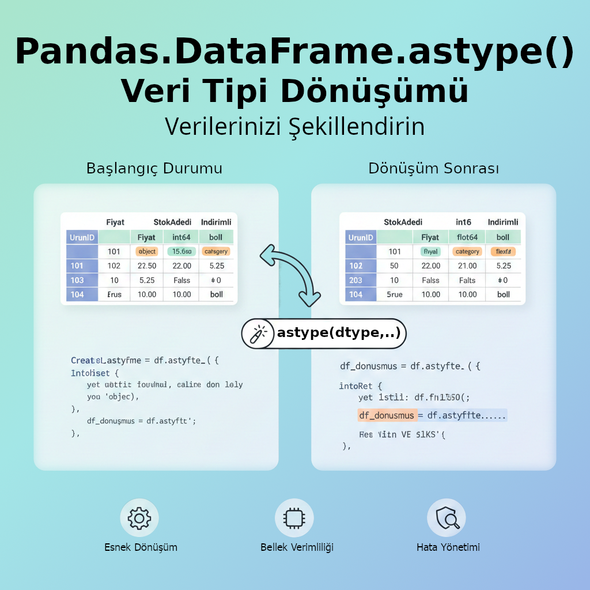

Title: Pandas - astype
Date: 2025-11-22 16:52
Category: Pandas
Tags: Python, Pandas, Kütüphane, Modül, astype
Author: Mustafa Halil

# `astype()` Metodu

`astype()` metodu, Pandas'taki veri çerçevelerinin (DataFrame) veya serilerin (Series) **veri tiplerini / türlerini (dtype) değiştirmek için** kullanılan temel bir fonksiyondur.



`astype()` metodu ile bir DataFrame'deki tüm sütunları veya belirli sütunları istediğiniz bir veri tipine dönüştürebiliriz. Veri analizi sırasında, verilerin doğru şekilde işlenmesi, filtrelenmesi ve hafızada daha verimli saklanması için veri tiplerini (örneğin, tam sayıları ondalıklı sayıya, objeleri kategoriye veya sayıları tam sayıya) dönüştürmek sıklıkla gereklidir.

## Sözdizimi:

```python
df.astype(dtype, copy=True, errors='raise')
```

### Parametreler

| Parametre    | Açıklama                                                                                                                                                                                                                              |
| ------------ | ------------------------------------------------------------------------------------------------------------------------------------------------------------------------------------------------------------------------------------- |
| **`dtype`**  | Dönüştürmek istediğiniz yeni veri tipini belirtir. Bir sütun için tek bir tip (örneğin `'int64'`, `float`, `'category'`) veya birden fazla sütun için `{'sütun_adı': 'yeni_tip', ...}` şeklinde bir **sözlük (dictionary)** olabilir. |
| **`copy`**   | Dönüşümden sonra veri çerçevesinin bir kopyasını döndürüp döndürmeyeceğini belirtir. Varsayılanı `True`'dur. (Not: Pandas'ın yeni Copy-on-Write özelliği ile bu parametrenin davranışı değişmektedir.)                                |
| **`errors`** | Dönüşüm sırasında bir hata oluşursa ne yapılacağını belirtir: **`'raise'`** (varsayılan, hata fırlatır ve durur) veya **`'ignore'`** (hatayı yok sayar ve orijinal nesneyi döndürür).                                                 |

## Örneklerle Kullanım

Aşağıdaki örneklerde, öncelikle bir başlangıç Veri Çerçevesi (DataFrame) oluşturup, ardından `astype` metodu ile çeşitli dönüşümler yapacağız.

### Başlangıç DataFrame'i Oluşturma

```python
import pandas as pd

# Örnek Veri Çerçevesi
data = {
    'UrunID': ['101', '102', '103', '104'],
    'Fiyat': ['15.50', '22.00', '5.25', '10.00'],
    'StokAdedi': [50, 10, 20, 0],
    'Indirimli': [True, False, False, True]
}
df = pd.DataFrame(data)

print(df)
```

Veri Çerçevemiz aşağıdadır;

```python
  UrunID  Fiyat  StokAdedi  Indirimli
0    101  15.50         50       True
1    102  22.00         10      False
2    103   5.25         20      False
3    104  10.00          0       True
```

Sütunların veri tiplerine bakalım;

```python
print("--- Başlangıç Veri Tipleri ---")
print(df.dtypes)
```

Çıktı:

```python
--- Başlangıç Veri Tipleri ---
UrunID       object (string)
Fiyat        object (string)
StokAdedi      int64
Indirimli      bool
dtype: object
```

### Örnek 1: Tüm Veri Çerçevesini Tek Bir Tipe Dönüştürme (Uyarı: Genellikle bundan kaçınılır, tavsiye edilmez)

Tüm sütunları aynı türe dönüştürmek, ancak sadece tüm sütunlar bu dönüşüme uygunsa mantıklıdır.

```python
# 'StokAdedi' sütununu (int64) daha küçük bir tam sayı tipi olan int16'ya dönüştürme.
df['StokAdedi'] = df['StokAdedi'].astype('int16')

print("--- Örnek 1 Sonrası Veri Tipleri ---")
print(df.dtypes)
```

Çıktı:

```python
--- Örnek 1 Sonrası Veri Tipleri ---
UrunID        object
Fiyat         object
StokAdedi      int16  <-- Değişti
Indirimli       bool
dtype: object
```

### Örnek 2: Birden Fazla Sütunu Sözlük (Dictionary) Kullanarak Dönüştürme

Bu, en yaygın kullanım şeklidir. Farklı sütunları kendi hedef tiplerine dönüştürürüz.

- `UrunID` (şu anda `object`/string) -> **`category`** (Kategorik veri tipi, string'lere göre daha az bellek kullanır ve bazı işlemlerde daha hızlıdır.)

- `Fiyat` (şu anda `object`/string) -> **`float64`** (Ondalıklı sayıya dönüştürme.)

```python
df_donusmus = df.astype({
    'UrunID': 'category',
    'Fiyat': 'float64'
})

print("\n--- Örnek 2 Sonrası Veri Tipleri ve Veri Çerçevesi ---")
print(df_donusmus.dtypes)
```

Çıktı:

```python
--- Örnek 2 Sonrası Veri Tipleri ve Veri Çerçevesi ---
UrunID      category  <-- Değişti
Fiyat        float64  <-- Değişti
StokAdedi      int64
Indirimli       bool
dtype: object
```

Dönüşmüş Veri çerçevesine bakalım;

```python
print("DataFrame:")
print(df_donusmus)
```

Çıktı:

```python
DataFrame:
  UrunID  Fiyat  StokAdedi  Indirimli
0    101  15.50         50       True
1    102  22.00         10      False
2    103   5.25         20      False
3    104  10.00          0       True
```

### Örnek 3: Hata Yönetimi (`errors='ignore'`)

Bir dönüşümün başarısız olma ihtimali varsa (örneğin bir metin sütununu sayıya dönüştürmeye çalışırken sayı olmayan karakterler varsa), `errors='ignore'` kullanarak dönüşüm hatasını yok sayıp orijinal veriyi geri döndürebilirsiniz.

Ancak, genellikle sayısal dönüşümler için daha güçlü olan `pd.to_numeric()` fonksiyonunun `errors='coerce'` parametresi kullanılır, bu da hatalı değerleri **NaN** (Not a Number) olarak değiştirir. Yine de `astype` örneğini görelim:

```python
df_hata = pd.DataFrame({'Deger': ['10', '20', 'hata', '30']})
print(df_hata)

# Çıktı:
#   Deger
# 0    10
# 1    20
# 2  hata
# 3    30

# errors='raise' (Varsayılan): 'hata' değeri yüzünden ValueError fırlatır.

# errors='ignore': Hata fırlatmak yerine orijinal DataFrame'i döndürür.
try:
    df_result = df_hata.astype('int64', errors='ignore')
    if df_result.equals(df_hata):
         print("\n--- Örnek 3: Hata Yönetimi (`errors='ignore'`) ---")
         print("Dönüşüm hatası nedeniyle orijinal DataFrame döndürüldü.")

except ValueError as e:
    # Bu blok, 'raise' olsaydı çalışırdı.
    pass
```

Çıktı:

```python
--- Örnek 3: Hata Yönetimi (`errors='ignore'`) ---
Dönüşüm hatası nedeniyle orijinal DataFrame döndürüldü.
```

Bu örnek, `astype` metodunun veri tiplerini yönetmede ne kadar esnek ve güçlü olduğunu göstermektedir.

## Kaynak:

* [pandas.DataFrame.astype &#8212; pandas 2.3.3 documentation](https://pandas.pydata.org/pandas-docs/stable/reference/api/pandas.DataFrame.astype.html)
* [Google Gemini](https://gemini.google.com)
