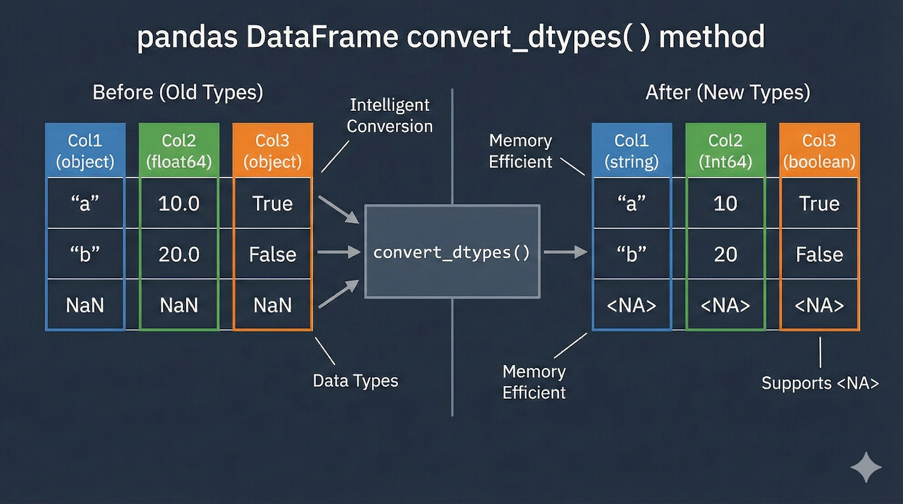

Title: Pandas - convert_dtypes
Date: 2025-11-22 17:55
Category: Pandas
Tags: Python, Pandas, Kütüphane, Modül, convert_dtypes
Author: Mustafa Halil

# `convert_dtypes()` Metodu

Bu metodu, veri setini otomatik olarak temizleyen ve düzenleyen **"akıllı bir veri tipi (türü) dönüştürücüsü"** gibi düşünebilirsin.



## Sözdizimi:

```python
DataFrame.convert_dtypes(infer_objects=True, convert_string=True, 
                        convert_integer=True, convert_boolean=True, 
                        convert_floating=True, 
                        dtype_backend='numpy_nullable')
```

### Temel Sorun Nedir? (Neden Buna İhtiyacımız Var?)

Pandas'ın eski sürümlerinde veya standart NumPy kullanımında şöyle can sıkıcı durumlar yaşanır:

1. **Tam Sayılar ve Boş Değerler:** Elinde tam sayıların olduğu bir sütun var (örneğin: `[1, 2, 5]`). Eğer bu sütunda bir tane bile boş değer (NaN) varsa, Pandas mecburen bütün sayıları **ondalıklı sayıya (float)** çevirirdi. Çünkü standart `int` (tam sayı) tipi boş değerleri tanımazdı.

2. **Metinler (String):** Metin içeren sütunlar genellikle `object` (nesne) adında çok genel bir tipte saklanırdı. Bu da hem hafızayı yorar hem de bazı işlemleri zorlaştırırdı.

### `convert_dtypes()` Ne Yapar?

`convert_dtypes()` metodu, Veri Çerçevemizin (tablomuzun) sütunlarına bakar ve şunu der: *"Hey, bu sütun aslında tam sayı ama içinde boşluklar var diye float yapılmış. Ben bunu yeni nesil **'boşluk kabul eden tam sayı' (Int64)** tipine çevireyim."* veya *"Bu sütun 'object' olarak görünüyor ama hepsi yazı, ben bunu **'string'** tipine çevireyim."*

Özetle verini **en uygun ve en modern** veri tipine dönüştürür.

## Parametreler

| Parametre              | Varsayılan Değer   | Ne İşe Yarar?                                                                                                                                                                                                                     |
| ---------------------- | ------------------ | --------------------------------------------------------------------------------------------------------------------------------------------------------------------------------------------------------------------------------- |
| **`infer_objects`**    | `True`             | **Genel Dönüşüm İzni:** `object` (nesne) tipindeki sütunların incelenip daha iyi bir tipe (sayı, tarih vb.) dönüştürülmeye çalışılıp çalışılmayacağını belirler.                                                                  |
| **`convert_string`**   | `True`             | **Metin Dönüşümü:** `object` olarak saklanan metinlerin, Pandas'ın özel `StringDtype` tipine dönüştürülüp dönüştürülmeyeceğini belirler.                                                                                          |
| **`convert_integer`**  | `True`             | **Tam Sayı Dönüşümü:** Ondalıklı sayı gibi görünen ama aslında tam sayı olan verilerin (örn: `10.0`), boş değerleri de destekleyen özel tam sayı tipine (`Int64` vb.) dönüştürülmesini sağlar.                                    |
| **`convert_boolean`**  | `True`             | **Mantıksal Dönüşüm:** `object` tipindeki sütunların (içinde True/False ve boşluklar olan), Pandas'ın özel `BooleanDtype` tipine dönüştürülmesini sağlar.                                                                         |
| **`convert_floating`** | `True`             | **Ondalıklı Sayı Dönüşümü:** Ondalıklı sayıların, boş değerleri (`<NA>`) destekleyen `Float64` tipine dönüştürülüp dönüştürülmeyeceğini belirler.                                                                                 |
| **`dtype_backend`**    | `'numpy_nullable'` | **Teknik Altyapı (İleri Seviye):** Verilerin hafızada nasıl tutulacağını seçer. Varsayılan (`numpy_nullable`) NumPy tabanlıdır. `'pyarrow'` seçilirse, daha hızlı olan PyArrow altyapısını kullanır (Pandas 2.0+ sürümü gerekir). |

Bu parametrelerin hepsi **isteğe bağlıdır**. Hiçbir şey yazmazsan (parantezi boş bırakırsan), Pandas çoğu zaman en doğru kararı verip hepsini `True` (Evet) kabul eder ve en iyi dönüşümü yapmaya çalışır.

1. ### Küçük Bir İpucu

Eğer tablodaki `convert_integer=False` yaparsan, Pandas tam sayıya çevirebileceği bir sütunu (örneğin `[1, 2, 3]`) olduğu gibi bırakır veya başka kurallar uygular, o özel dönüşümü pas geçer. Genelde varsayılan ayarlarda bırakmak en iyi sonucu verir.

## Örneklerle Anlatım

Dokümandaki örneği adım adım inceleyelim.

### 1. Veri Setimizi Oluşturalım (Eski Tip)

Önce içinde karışık tiplerin ve boş değerlerin (`np.nan`) olduğu bir tablo oluşturalım.

```python
import pandas as pd
import numpy as np

df = pd.DataFrame({
    "a": pd.Series([1, 2, 3], dtype=np.dtype("int32")),
    "b": pd.Series(["x", "y", "z"], dtype=np.dtype("O")),           # 'O' object demek (genel nesne)
    "c": pd.Series([True, False, np.nan], dtype=np.dtype("O")),     # İçinde boşluk olan Mantıksal (Boolean)
    "d": pd.Series(["h", "i", np.nan], dtype=np.dtype("O")),        # İçinde boşluk olan Metin
    "e": pd.Series([10, np.nan, 20], dtype=np.dtype("float")),      # Aslında tam sayı ama boşluk var diye float olmuş
    "f": pd.Series([np.nan, 100.5, 200], dtype=np.dtype("float")),  # Gerçek ondalıklı sayı
})
print(df)

print("--- Dönüştürmeden Önceki Tipler ---")
print(df.dtypes)
```

Çıktı:

```python
   a  b      c    d     e      f
0  1  x   True    h  10.0    NaN
1  2  y  False    i   NaN  100.5
2  3  z    NaN  NaN  20.0  200.0

--- Dönüştürmeden Önceki Tipler ---
a      int32
b     object
c     object
d     object
e    float64
f    float64
dtype: object
```

**Dönüştürmeden Önceki Çıktı (Sorunlar):**

- `b`, `c`, `d` sütunları **`object`** olarak görünüyor (Verimsiz).

- `e` sütunu aslında 10 ve 20 gibi tam sayılar içeriyor ama aradaki `NaN` yüzünden **`float64`** olmuş.

### 2. `convert_dtypes()` ile Dönüştürme (Çözüm)

Şimdi sihirli komutumuzu kullanalım:

```python
dfn = df.convert_dtypes()
print(dfn)
```

Çıktı:

```python
   a  b      c     d     e      f
0  1  x   True     h    10   <NA>
1  2  y  False     i  <NA>  100.5
2  3  z   <NA>  <NA>    20  200.0
```

Şimdi dönüştürme sonrası sütun tiplerine (türlerine) bakalım.

```python
print("--- Dönüştürdükten Sonraki Tipler ---")
print(dfn.dtypes)
```

Çıktı:

```python
a             Int32
b    string[python]
c           boolean
d    string[python]
e             Int64
f           Float64
dtype: object
```

**Dönüştürdükten Sonraki Çıktı (Sonuç):**

- **a (Int32):** Zaten tam sayıydı, modern tam sayı oldu.

- **b (string):** `object` yerine artık net bir şekilde **`string`** (metin) oldu.

- **c (boolean):** İçinde boşluk olduğu için eskiden `object` idi, şimdi **`boolean`** (Mantıksal: Doğru/Yanlış) oldu ve boş değerleri (`<NA>`) destekliyor.

- **e (Int64):** Eskiden `float` (10.0, 20.0) idi. Artık **`Int64`** oldu. Yani hem tam sayı kaldı hem de boş değeri (`<NA>`) kabul etti.

## Özet: Ne Zaman Kullanmalısın?

- Veriyi bir CSV veya Excel'den okudun ve `df.dtypes` yazdığında her yer **`object`** veya gereksiz yere **`float`** görünüyorsa,

- Veri setini temizleyip hafızada daha az yer kaplamasını istiyorsan,

- Boş değerlerle (`NaN` veya `<NA>`) başın dertteyse ve mantıklı bir veri tipi (Nullable Types) istiyorsan,

**`df = df.convert_dtypes()`** komutunu kullanarak verini modernize edebilirsin.

## Kaynak:

* [pandas.DataFrame.convert_dtypes &#8212; pandas 2.3.3 documentation](https://pandas.pydata.org/pandas-docs/stable/reference/api/pandas.DataFrame.convert_dtypes.html)

* [Google Gemini](https://gemini.google.com)
