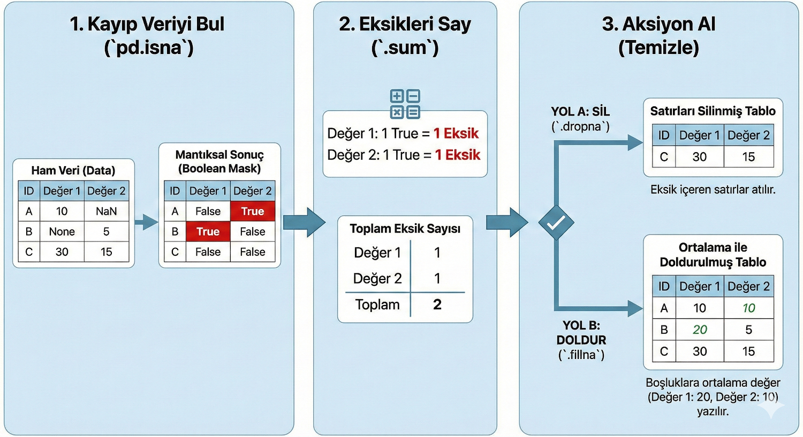

Title: Pandas - isna
Date: 2025-11-23 13:13
Category: Pandas
Tags: Python, Pandas, Kütüphane, Modül, isna
Author: Mustafa Halil

# `isna()` Metodu

`isna()`, veri analizi yaparken en sık kullanılan ve en temel fonksiyonlardan biridir. Bunu bir **"Kayıp Veri Dedektifi"** gibi düşünebilirsin.



## Sözdizimi:

```python
pandas.isna(obj)
```

## Parametreler:

`pandas.isna` fonksiyonu, diğer karmaşık pandas fonksiyonlarının aksine (örneğin `read_csv` gibi onlarca ayarı olanların aksine) **çok sade ve net** bir yapıya sahiptir.

Aslında teknik olarak sadece **tek bir** ana parametresi (girdisi) vardır.

* **obj** : **skaler veya dizi benzeri**

Null veya eksik değerler için kontrol edilecek nesne. ("kontrol edilmesini istediğin veri" anlamına gelir.)

Parametrenin (`obj`) içine ne koyarsak, çıktı olarak ne alacağını şu tabloda özetleyebiliriz:

| `obj` Parametresine Ne Verirsen | Çıktı Olarak Ne Alırsın?                                |
| ------------------------------- | ------------------------------------------------------- |
| **Tek bir değer** (örn. `None`) | **Tek bir Boolean** (`True`)                            |
| **Liste** (örn. `[1, None]`)    | **Boolean Dizisi** (`[False, True]`)                    |
| **DataFrame** (Tablo)           | **Boolean DataFrame** (Aynı boyutta True/False tablosu) |
| **Series** (Sütun)              | **Boolean Series** (Aynı uzunlukta True/False sütunu)   |

## Döndürdüğü değer:

**bool veya bool dizisi benzeri**

Skaler girdi için, skaler boolean döndürür. Dizi girdisi için, karşılık gelen her bir öğenin eksik olup olmadığını gösteren boolean dizisi döndürür.

## 1. `pandas.isna()` Nedir?

Bu fonksiyonun tek bir görevi vardır: **"Bu verinin içi boş mu yoksa dolu mu?"** sorusuna cevap vermek.

- Eğer veri **yoksa** (boşsa, tanımsızsa), `True` (Doğru, evet boş) sonucunu verir.

- Eğer veri **varsa**, `False` (Yanlış, hayır boş değil) sonucunu verir.

Veri dünyasında "boş" anlamına gelen birkaç terim vardır ve `isna` bunların hepsini yakalar:

- `NaN` (Not a Number - Sayı değil)

- `None` (Hiçlik - Python'da boş değer)

- `NaT` (Not a Time - Zaman verisi yok)

## 2. Nasıl Çalışır? (Örneklerle)

Öncelikle pandas kütüphanesini `pd` olarak, numpy kütüphanesini de (boş değerler oluşturmak için) `np` olarak çağırdığımızı varsayalım.

## Bilinmesi Gereken Küçük Bir Detay

Bu fonksiyonun başka gizli bir ayarı (örneğin `axis` veya `inplace` gibi) **yoktur**. Sadece veriyi alır, analiz eder ve sonucu söyler. Verinin kendisini değiştirmez veya silmez.

## Mantık: Bilgisayar `True`'yu Sayı Olarak Görür

Python'da (ve çoğu programlama dilinde) mantıksal değerlerin sayısal karşılığı vardır:

- **`False` (Dolu)** = **0**

- **`True` (Boş/Kayıp)** = **1**

Biz `isna()` komutunu çalıştırdığımızda, aslında arka planda 1 ve 0'lardan oluşan bir tablo oluştururuz. `sum()` (topla) fonksiyonunu kullandığımızda ise bilgisayar bu 1'leri toplar. Yani **kaç tane 1 varsa, o kadar boş veri var demektir.**

#### Örnek 1: Tek Bir Değeri Kontrol Etmek

En basit haliyle başlayalım. Elimizde tek bir değer var ve boş mu diye bakıyoruz.

```python
import pandas as pd
import numpy as np

# "Merhaba" boş bir veri mi?
print(pd.isna("Merhaba"))
# Çıktı: False (Hayır, burada bir veri var)

# np.nan (Not a Number) boş bir veri mi?
print(pd.isna(np.nan))
# Çıktı: True (Evet, bu bir kayıp veri)

# None boş bir veri mi?
print(pd.isna(None))
# Çıktı: True (Evet, bu da boş)
```

#### Örnek 2: Bir Listeyi Kontrol Etmek

Genelde tek bir değerle değil, bir liste dolusu veriyle çalışırız. `isna()` her bir elemana tek tek bakıp rapor verir.

```python
liste = ["Elma", "Armut", np.nan, "Muz", None]

print(pd.isna(liste))

# Çıktı:
# [False, False, True, False, True]
```

- **Elma:** Dolu -> `False`

- **Armut:** Dolu -> `False`

- **np.nan:** Boş -> `True`

- **Muz:** Dolu -> `False`

- **None:** Boş -> `True`

#### Örnek 3: Bir Tabloyu (DataFrame) Kontrol Etmek

Veri biliminde en çok karşılaşacağın senaryo budur. Elinde bir Excel tablosu gibi bir veri seti (DataFrame) var ve hangi hücrelerin boş olduğunu görmek istiyorsun.

```python
import pandas as pd
import numpy as np

# Küçük bir öğrenci tablosu oluşturalım
veri = {
    'İsim': ['Ali', 'Ayşe', 'Mehmet'],
    'Not': [85, np.nan, 90],  # Ayşe'nin notu girilmemiş (NaN)
    'Şehir': ['Ankara', None, 'İzmir'] # Ayşe'nin şehri girilmemiş (None)}

df = pd.DataFrame(veri)

print("--- Orijinal Tablo ---")
print(df)
```

Çıktı:

```python
--- Orijinal Tablo ---
     İsim   Not   Şehir
0     Ali  85.0  Ankara
1    Ayşe   NaN    None
2  Mehmet  90.0   İzmir
```

Tabloda boşluk var mı? denetleyelim;

```python
print("\n--- Boş Değer Kontrolü (isna) ---")
print(pd.isna(df))
```

Çıktı:

```python
--- Boş Değer Kontrolü (isna) ---
    İsim    Not  Şehir
0  False  False  False
1  False   True   True
2  False  False  False
```

**Çıktı tablo olarak şöyle görünecektir:**

|       | İsim  | Not      | Şehir    |
| ----- | ----- | -------- | -------- |
| **0** | False | False    | False    |
| **1** | False | **True** | **True** |
| **2** | False | False    | False    |

Gördüğün gibi, 1 numaralı satırda (**Ayşe**) "**Not**" ve "**Şehir**" sütunları `True` döndü, yani buralarda veri eksik.

#### Örnek 4: Bir Tabloyu (DataFrame) ve Toplamı Kontrol Etmek

Orijinal verimiz:

```python
import pandas as pd
import numpy as np

veri = {
    'İsim': ['Ali', 'Ayşe', 'Mehmet', 'Zeynep'],
    'Not': [85, np.nan, 90, np.nan],  # 2 tane boş not var
    'Şehir': ['Ankara', None, 'İzmir', 'Bursa'] # 1 tane boş şehir var
}

df = pd.DataFrame(veri)
print(df)

# #Çıktı:
     # #İsim   Not   Şehir
# #0     Ali  85.0  Ankara
# #1    Ayşe   NaN    None
# #2  Mehmet  90.0   İzmir
# #3  Zeynep   NaN   Bursa
```

##### Sütun Bazında Sayma (En Sık Kullanılan)

"Hangi sütunda kaç eksiğim var?" sorusunun cevabıdır.

```python
eksik_sayisi = df.isna().sum()
print(eksik_sayisi)

# #Çıktı:
# #İsim     0
# #Not      2
# #Şehir    1
# #dtype: int64
```

**Yorum:**

- **İsim:** 0 eksik (Herkesin ismi var, süper).

- **Not:** 2 eksik (2 öğrencinin notu girilmemiş).

- **Şehir:** 1 eksik (1 öğrencinin şehri girilmemiş).

##### Toplam Eksik Sayısı

"Bu tablonun tamamında toplam kaç tane hücre boş?" sorusunun cevabıdır. Bunun için peşpeşe iki kere topla (`sum()`) fonksiyonu kullanmamız gerekir.

```python
toplam_eksik = df.isna().sum().sum()
print(f"Tabloda toplam {toplam_eksik} adet eksik veri var.")

# #Çıktı:
# #Tabloda toplam 3 adet eksik veri var.
```

## Neden Bu Kadar Önemli?

Büyük bir veri setiyle (örneğin 100.000 satırlık bir müşteri listesiyle) çalıştığını düşün.

1. Veriyi yükler yüklemez ilk yapacağın şey `df.isna().sum()` yazmaktır.

2. Eğer "Telefon Numarası" sütununda 90.000 eksik varsa, o sütunu analizden çıkarırsın (çünkü çoğu boş).

3. Eğer sadece 5 eksik varsa, o 5 kişiyi bulup veriyi silebilir veya düzeltebilirsin.

## Neden Bunu Kullanıyoruz?

Veri temizliği (Data Cleaning) yaparken bu fonksiyon hayati önem taşır. Analize başlamadan önce şunları yapabilmek için `isna()` kullanırız:

1. **Eksikleri Saymak:** `df.isna().sum()` diyerek her sütunda kaç tane eksik veri olduğunu bulabilirsin.

2. **Filtrelemek:** Sadece eksik verisi olan satırları bulup inceleyebilirsin.

3. **Doldurmak:** Boş olan yerleri bulup (True olanları), oralara 0 veya ortalama bir değer yazabilirsin.

> **Özetle;** `pandas.isna()`, verindeki "çürük elmaları" (eksik bilgileri) bulmana yarayan en pratik araçtır.

## Temizlik ve Veri Doldurma

Verideki boşlukları tespit ettik, saydık; şimdi sıra **"Temizlik"** aşamasında.

Bu aşamada iki ana stratejimiz vardır: Ya o veriyi **gözden çıkarırız (sileriz)** ya da tahmin ederek **doldururuz**.

İşte örnek senaryomuz için bir veri seti:

```python
import pandas as pd
import numpy as np

# Senaryo: Bir şirketin çalışan verileri
veri = {
    'Çalışan': ['Ali', 'Veli', 'Ayşe', 'Fatma', 'Can'],
    'Maaş': [5000, np.nan, 7000, 4500, np.nan],  # Maaşlar eksik
    'Departman': ['İK', 'IT', np.nan, 'IT', 'Pazarlama'] # Bir departman eksik
}

df = pd.DataFrame(veri)
print("--- Orijinal Tablo ---")
print(df)

# #Çıktı:
# #--- Orijinal Tablo ---
  # #Çalışan    Maaş  Departman
# #0     Ali  5000.0         İK
# #1    Veli     NaN         IT
# #2    Ayşe  7000.0        NaN
# #3   Fatma  4500.0         IT
# #4     Can     NaN  Pazarlama
```

### 1. Boş Verileri Filtrelemek (Silmek) - `dropna()`

Eğer eksik veri çok fazlaysa veya o satır eksikken işimize yaramıyorsa, en temiz yol o satırı tamamen uçurmaktır.

**Yöntem:** `dropna()` (Drop Na - Yokları Düşür/At) fonksiyonunu kullanırız.

İçinde EN AZ bir tane bile boş veri olan satırları silmek için aşağıdaki kodu kullanabiliriz.

```python
temiz_df = df.dropna()

print("\n--- Boşlukları Silinmiş Tablo ---")
print(temiz_df)

# #Çıktı:
# #--- Boşlukları Silinmiş Tablo ---
  # #Çalışan    Maaş Departman
# #0     Ali  5000.0        İK
# #3   Fatma  4500.0        IT
```

**Sonuç:** Veli, Ayşe ve Can listeden silinir. Sadece her şeyi tam olan Ali ve Fatma kalır. Bu biraz acımasız bir yöntemdir, çok veri kaybedebilirsiniz.

**İpucu:** Sadece belli bir sütuna bakarak da silme yapabiliriz. Örneğin "Departmanı boş olanı silme, ama Maaşı boş olanı sil" diyebiliriz: `df.dropna(subset=['Maaş'])`

### 2. Boş Verileri Doldurmak - `fillna()`

Veri bizim için kıymetliyse silmek istemeyiz. Bunun yerine mantıklı bir değerle "yama" yaparız.

#### A. Sabit Bir Değerle Doldurmak

Genelde metin (string) verilerinde kullanılır. Örneğin departmanı bilinmeyene "Bilinmiyor" yazmak gibi.

```python
# Departman sütunundaki boşluklara "Bilinmiyor" yazalım
df['Departman'] = df['Departman'].fillna('Bilinmiyor')

print("\n--- Departmanı Doldurulmuş Tablo ---")
print(df)

# #Çıktı:
# #--- Departmanı Doldurulmuş Tablo ---
  # #Çalışan    Maaş   Departman
# #0     Ali  5000.0          İK
# #1    Veli     NaN          IT
# #2    Ayşe  7000.0  Bilinmiyor
# #3   Fatma  4500.0          IT
# #4     Can     NaN   Pazarlama
```

**Sonuç:** Ayşe'nin departmanı artık `NaN` değil, "Bilinmiyor" oldu.

#### B. Ortalama ile Doldurmak (En Popüler Yöntem)

Sayısal verilerde (Maaş, Yaş, Not gibi) boşluklara "0" yazmak genelde ortalamayı çok düşürür ve analizi bozar. Bunun yerine **mevcut verilerin ortalamasını** boşluklara yazmak en mantıklı yoldur.

Buna **"Imputation" (Atama)** denir.

1. Önce mevcut maaşların ortalamasını bulalım;

```python
ortalama_maas = df['Maaş'].mean()
print(f"\nOrtalama Maaş: {ortalama_maas}")

# #Çıktı:
# #Ortalama Maaş: 5500.0
```

2. Boş maaş yerlerine bu ortalamayı yazalım;

```python
df['Maaş'] = df['Maaş'].fillna(ortalama_maas)

print("\n--- Maaşları Ortalamayla Doldurulmuş Tablo ---")
print(df)

# #Çıktı:
# #--- Maaşları Ortalamayla Doldurulmuş Tablo ---
  # #Çalışan    Maaş   Departman
# #0     Ali  5000.0          İK
# #1    Veli  5500.0          IT
# #2    Ayşe  7000.0  Bilinmiyor
# #3   Fatma  4500.0          IT
# #4     Can  5500.0   Pazarlama
```

**Sonuç:** Veli ve Can'ın maaşı boştu. Pandas diğerlerinin ortalamasını (5500) hesapladı ve Veli ile Can'a 5500 maaş atadı. Böylece veri setini kaybetmeden analize devam edebilir hale geldik.

### Özet: Hangisini Seçmeliyim?

1. **Silmek (`dropna`):** Veri setin çok büyükse ve %1-2'lik bir kayıp seni üzmeyecekse silmek en güvenli yoldur. Yanlış tahmin yapma riskin olmaz.

2. **Doldurmak (`fillna`):** Veri setin küçükse ve her satır değerliyse doldurmak daha iyidir. Sayısal verilerde genellikle **ortalama (mean)** veya **ortanca (median)** ile doldurulur.

### Metot Detayları

`dropna()` ve `fillna()` metotlarının geniş anlatımlarına aşağıdaki bağlantılardan erişebilirsiniz;

* `dropna()` metoduna ait detaylara [BU SAYFADAN]({filename}dropna.md) ulaşabilirsiniz.

* `fillna()` metoduna ait detaylara [BU SAYFADAN]({filename}fillna.md) ulaşabilirsiniz.

## Kaynaklar:

* [pandas.isna &#8212; pandas 2.3.3 documentation](https://pandas.pydata.org/pandas-docs/stable/reference/api/pandas.isna.html#pandas.isna)

* [Google Gemini](https://gemini.google.com)
