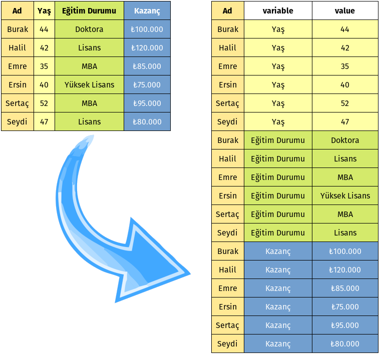

Title: Pandas - Melt
Date: 2022-07-22 20:25
Modified: 2025-06-29 20:00
Category: Pandas
Tags: Python, Pandas, Kütüphane, Modül, melt, id_vars, value_vars, var_name, value_name, 
Author: Mustafa Halil

# Pandas Melt Fonksiyonuyla Verilerinizi Yeniden Şekillendirin

Bu bölümde, Pandas'ın `melt()` fonksiyonunun nasıl kullanacağını öğreneceğiz. `pd.melt() fonksiyonu, bir Pandas yapısını geniş formattan uzun formata yeniden şekillendirmek için kullanılır.` Bunun anlamı, bir veya daha fazla sütunun **tanımlayıcı** olarak kullanılması ve diğer tüm sütunların değer olarak kullanılmasıdır. Kısacası bu fonksiyon, Veri Çerçevenizi `Özet Tablo (pivot_table() fonksiyonu) kullanmadan, biçimlendirmenizi` sağlar.

**Bu bölümün sonunda şunları öğrenmiş olacaksınız:**

- Verilerinizi çözmek/şekillendirmek veya melt() fonsiyonu ile işlemek ne anlama gelir?
- Pandas'ın **melt()** fonksiyonu nasıl anlaşılır ve kullanılır?
- Tek veya birden çok değişkeni çözmek/şekillendirmek için Pandas **melt()** işlevi nasıl kullanılır?



## Verileri Yeniden Şekillendirmek için Neden Pandas'ın melt() Fonksiyonunu Kullanmalısınız?

Bu fonksiyon, internetten bulduğunuz veya size bir meslektaşınız tarafından geniş biçimli veri sunulduğunda, bu verileri işlemek konusunda yararlı olacaktır. Bu verilerin anlaşılması kolaydır, ancak başka bir analiz biçimine çevirmek/yeniden şekilendirmek daha zordur. 
Örneğin, verileriniz ile [bir pivot tablosu oluşturmak](https://mhalil.github.io/Pandas_OzetTablo_PivotTable.html) istiyorsanız, o zaman **melt()** fonksiyonu uygulanmış verilere sahip olmak, size çok yardımcı olacaktır.

## Örnek Veri Çerçevesi (DataFrame) Yüklemek

Geniş formatta yani sütun sayısı fazla olan örnek bir veri çerçevesi yükleyerek başlayalım:

```python
import pandas as pd

df = pd.DataFrame(
    {'Ad': ['Burak', 'Halil', 'Emre', 'Ersin', 'Sertaç', 'Seydi'],
    'Yaş': [44, 42, 35, 40, 52, 47],
    'Eğitim Durumu': ['Doktora', 'Lisans', 'MBA', 'Yüksek Lisans', 'MBA', 'Lisans'],
    'Kazanç': [100000,120000, 85000, 75000, 95000, 80000]})
```

Gördüğünüz gibi geniş formatta bir veri setimiz oluştu. Veri setimize göz atalım:

```python
print(df)
```

|     | Ad     | Yaş | Eğitim Durumu | Kazanç |
| --- | ------ | --- | ------------- | ------ |
| 0   | Burak  | 44  | Doktora       | 100000 |
| 1   | Halil  | 42  | Lisans        | 120000 |
| 2   | Emre   | 35  | MBA           | 85000  |
| 3   | Ersin  | 40  | Yüksek Lisans | 75000  |
| 4   | Sertaç | 52  | MBA           | 95000  |
| 5   | Seydi  | 47  | Lisans        | 80000  |

## Pandas Melt Fonksiyonunun Sözdizimi nedir?

**melt()** fonksiyonunun/işlevinin genel sözdizimi biçimi şöyle görünür:

```python
pandas.melt(
   dataframe, 
   id_vars=None, 
   value_vars=None, 
   var_name=None, 
   value_name='value', 
   col_level=None
)
```

Bu parametrelere biraz daha ayrıntılı bakalım:

- `dataframe`= **melt()** fonksiyonu uygulamak istediğimiz veri çerçevesi (adı)
- `id_vars`= Tanımlayıcı (yani Tekrar etmesini istediğimiz) değişken olarak kullanmak istediğimiz **sütun(lar)**
- `value_vars`= Çözmek/Şekillendirmek (Filtre uygulamak gibi düşünülebilir) istediğimiz sütunlar. Bu parametre yazılmazsa, `id_vars`'a atanmayan her bir sütun kullanılır.
- `var_name`= Değişken sütununa verilecek ad.
- `value_name`= Değer sütununa verilecek ad. Bu parametreyi kullanmazsanız, **Values** kelimesi varsayılan sütun isim olacaktır.
- `col_level`= Eğer sütunlar çoklu dizin ise, `melt()` fonksiyonu için kullanılacak Sütunü belirtmek için bu parametrekullanılır.

## Pandas Melt Fonksiyonunu Kullanarak Verilerimizin Nasıl Tekrar Şekillendirebiliriz?

Veri kümesini çözmek/yeniden şekillendirmek için Pandas `melt()` fonksiyonunu nasıl kullanabileceğimize bir göz atalım.  
Daha önce öğrendiklerimiz gibi, `melt()` fonksiyonunu kullanmak için bir veri çerçevesi atamamız gerekiyor:

```python
melted = pd.melt(
   df, 
   id_vars = 'Ad', 
   var_name = 'Özellik', 
   value_name = 'Değer')

print(melted)
```

|     | Ad     | variable      | value         |
| --- | ------ | ------------- | ------------- |
| 0   | Burak  | Yaş           | 44            |
| 1   | Halil  | Yaş           | 42            |
| 2   | Emre   | Yaş           | 35            |
| 3   | Ersin  | Yaş           | 40            |
| 4   | Sertaç | Yaş           | 52            |
| 5   | Seydi  | Yaş           | 47            |
| 6   | Burak  | Eğitim Durumu | Doktora       |
| 7   | Halil  | Eğitim Durumu | Lisans        |
| 8   | Emre   | Eğitim Durumu | MBA           |
| 9   | Ersin  | Eğitim Durumu | Yüksek Lisans |
| 10  | Sertaç | Eğitim Durumu | MBA           |
| 11  | Seydi  | Eğitim Durumu | Lisans        |
| 12  | Burak  | Kazanç        | 100000        |
| 13  | Halil  | Kazanç        | 120000        |
| 14  | Emre   | Kazanç        | 85000         |
| 15  | Ersin  | Kazanç        | 75000         |
| 16  | Sertaç | Kazanç        | 95000         |
| 17  | Seydi  | Kazanç        | 80000         |

Kodlara `value_vars` parametresini, kod bloğuna dahil etmediğimize dikkat edin. Tüm verilerimizi çözmek/yeniden şekillendirmek istediğimiz için bu parametreyi kullanmadık.

Bu, aşağıdaki kodu yazmakla aynıdır. Bunların her ikisi de aynı (yukarıdaki) çıktıyı verir/döndürür:

```python
melted = pd.melt(
   df, 
   id_vars = 'Ad', 
   value_vars = ['Yaş', 'Eğitim Durumu', 'Kazanç'], 
   var_name = 'Özellik', 
   value_name = 'Değer'
)

print(melted)
```

## SONUÇ

Bu bölümde, Pandas kütüphanesinin `melt()` fonksiyonu aracılığı ile sadece birkaç satır kod yazarak, geniş bir veri kümesini, `pivot_table()` ve benzeri yapılarla kolayca işleyip daha fazla analiz yapabilmemizi sağlayacak, çok daha kullanışlı bir veri kümesine dönüştürmenin ne kadar kolay olduğunu öğrendik.

## Kaynak

Bu dokümanı [datagy.io](https://datagy.io/using-the-pandas-melt-function-in-python-to-unpivot-data/) sayfasındaki bilgilerden yararlanarak hazırladım.
