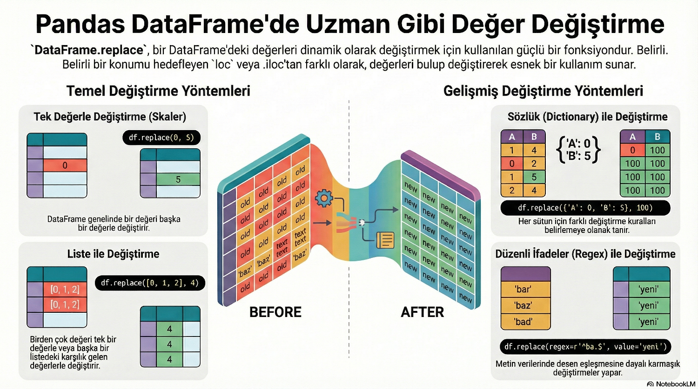

Title: Pandas - replace
Date: 2025-11-22 22:02
Category: Pandas
Tags: Python, Pandas, Kütüphane, Modül, replace
Author: Mustafa Halil

# `replace()` Metodu

Basitçe anlatmak gerekirse: **`replace()` metodu, bir DataFrame (veri tablosu) içindeki belirli değerleri bulup, onları istediğiniz yeni değerlerle değiştirmenizi sağlar.** Excel'deki "Bul ve Değiştir" (Find & Replace) özelliğinin kodla yapılan hali gibidir.



## Sözdizimi:

```python
DataFrame.replace(to_replace=None, value=<no_default>, *, 
                    inplace=False, limit=None, regex=False, 
method=<no_default>)
```

## Parametreler:

| Parametre        | Ne İşe Yarar?                                                                                                                                      | Varsayılan (Default) | Örnek Kullanım Senaryosu                                                                                              |
| ---------------- | -------------------------------------------------------------------------------------------------------------------------------------------------- | -------------------- | --------------------------------------------------------------------------------------------------------------------- |
| **`to_replace`** | **Aranan Değer.** Tabloda bulup değiştirmek istediğiniz değerdir. Sayı, metin, liste, sözlük veya Regex (kurallı ifade) olabilir.                  | `None`               | Tablodaki tüm `-1`'leri bulmak için buraya `-1` yazarız.                                                              |
| **`value`**      | **Yeni Değer.** Bulunan değerin yerine ne yazılacağıdır.                                                                                           | `None`               | `-1` yerine `0` yazılacaksa, buraya `0` yazarız. *(Eğer `to_replace` bir sözlük ise bu parametre boş bırakılabilir.)* |
| **`inplace`**    | **Kalıcılık Ayarı.** `True` yapılırsa değişiklik ana tabloda kalıcı olur. `False` ise size değiştirilmiş yeni bir kopya verir, ana tablo bozulmaz. | `False`              | Değişikliği değişkene atamadan direkt tabloya işlemek için `True` yaparız.                                            |
| **`regex`**      | **Desen Arama.** `True` yapılırsa, `to_replace` kısmına yazılan metin bir kalıp (Regex) olarak algılanır.                                          | `False`              | İçinde "Hata" geçen **tüm** metinleri bulmak için kullanılır.                                                         |
| **`limit`**      | **Sınır.** İleri veya geri doldurma yaparken kaç tane değerin değiştirileceğini sınırlar. (Çok sık kullanılmaz).                                   | `None`               | Sadece ilk 2 "Yok" değerini değiştir, gerisine dokunma.                                                               |
| **`method`**     | **Doldurma Yöntemi.** Değer vermeden, önceki (`ffill`) veya sonraki (`bfill`) değeri kopyalamak için kullanılır.                                   | `pad`                | Eksik verileri bir üst satırdaki veriyle doldurmak için.                                                              |

### Parametreler Arasındaki İlişkiye Dair İpuçları

Bu parametreler genellikle kombinasyon halinde kullanılır. En sık karşılaşacağınız 3 senaryo şudur:

**1. Birebir Değiştirme (`to_replace` + `value`)** Eski değer ve yeni değer ayrı ayrı verilir.

```python
# -1'i bul, 0 yap
df.replace(to_replace=-1, value=0)
```

**2. Sözlük ile Değiştirme (Sadece `to_replace`)** Eğer sözlük (dictionary) kullanırsanız, `value` parametresini kullanmanıza gerek kalmaz. Pandas neyi ne yapacağını sözlükten anlar.

```python
# A'yı 1, B'yi 2 yap (value parametresi yok!)
df.replace(to_replace={'A': 1, 'B': 2})
```

**3. Regex ile Değiştirme (`to_replace` + `value` + `regex`)** Kelime parçalarını bulup değiştirmek için `regex=True` şarttır.

```python
# İçinde 'TL' geçen her şeyi sil (boşluk yap)
df.replace(to_replace='TL', value='', regex=True)
```

Bu parametreler arasında en çok **`to_replace`**, **`value`** ve **`inplace`** üçlüsünü kullanacaksınız.

Bu tabloda `regex` (Regular Expressions) kavramı geçti. Regex kullanımı veri temizliğinde çok güçlüdür.

> **Temel Fark:** Bu işlem, belirli bir konumda (örneğin 3. satır ve A sütunu) güncelleme yapmanızı gerektiren `.loc` veya `.iloc` gibi yöntemlerden farklıdır; `replace()` metodu, belirlediğiniz değeri tüm DataFrame içinde dinamik olarak arar ve değiştirir.

Aşağıda bu metodu nasıl kullanabileceğinizi senaryolarla ve basit örneklerle açıklıyorum.

### 1. Tek Bir Değeri Değiştirmek

Diyelim ki tablonuzda hatalı girilmiş bir değer var (örneğin tüm -1'ler aslında 0 olmalı). Bunu tek bir hamlede düzeltebilirsiniz.

```python
import pandas as pd

# Örnek bir tablo oluşturalım
df = pd.DataFrame({
    'Ogrenci': ['Ali', 'Ayse', 'Mehmet'],
    'Not': [85, -1, 90]  # Ayşe'nin notu yanlışlıkla -1 girilmiş
})
print(df)
# #Çıktı:
  # #Ogrenci  Not
# #0     Ali   85
# #1    Ayse   -1
# #2  Mehmet   90
```

`-1` değerini `0` ile değiştirelim;

```python
yeni_df = df.replace(-1, 0)

print(yeni_df)
# #Çıktı:
  # #Ogrenci  Not
# #0     Ali   85
# #1    Ayse    0
# #2  Mehmet   90

# Sonuç: Ayşe'nin notu artık 0 olur.
```

### 2. Birden Fazla Değeri Aynı Şeyle Değiştirmek

Bazen birden fazla farklı değeri tek bir standart değere çevirmek istersiniz. Örneğin, "Yok", "Bilinmiyor" ve "---" gibi girişlerin hepsini `NaN` (boş değer) veya `0` yapmak isteyebilirsiniz.

```python
import pandas as pd

df = pd.DataFrame({
    'Durum': ['Aktif', 'Kapali', 'Yok', 'Bilinmiyor']})

print(df)

# #Çıktı:
        # #Durum
# #0       Aktif
# #1      Kapali
# #2         Yok
# #3  Bilinmiyor
```

Listelerle değiştirme; `to_replace` parametresinin liste veri tipi (köşeli parantezli) olduğuna dikkat edin.

```python
# 'Yok' ve 'Bilinmiyor' değerlerini 'Belirsiz' yapalım
df = df.replace(['Yok', 'Bilinmiyor'], 'Belirsiz')
print(df)

# #Çıktı:
      # #Durum
# #0     Aktif
# #1    Kapali
# #2  Belirsiz
# #3  Belirsiz
```

### 3. Her Değeri Farklı Bir Şeyle Değiştirmek (Sözlük Yöntemi)

Bu, en sık kullanılan yöntemlerden biridir. Bir değer listesini, karşılık gelen başka bir listeyle değiştirirsiniz.

```python
import pandas as pd

df = pd.DataFrame({
    'Kod': ['A', 'B', 'C', 'A']})

print(df)
# #Çıktı:
  # #Kod
# #0   A
# #1   B
# #2   C
# #3   A
```

A -> 1, B -> 2, C -> 3 olsun istiyoruz. Bunun için bir sözlük (dictionary) veri tipi kullanıyoruz:

```python
df = df.replace({'A': 1, 'B': 2, 'C': 3})

print(df)
# #Çıktı:
   # #Kod
# #0    1
# #1    2
# #2    3
# #3    1
```

### 4. Sadece Belirli Bir Sütunda Değişiklik Yapmak

Bazen bir değer (örneğin `0`) bir sütunda "Hata" anlamına gelirken, başka bir sütunda gerçek bir sayı olabilir. Bu durumda değişikliği sadece ilgili sütuna uygulayabilirsiniz.

```python
import pandas as pd

df = pd.DataFrame({
    'A_Sutunu': [0, 1, 2],
    'B_Sutunu': [0, 5, 10]})

print(df)
# #Çıktı:
   # #A_Sutunu  B_Sutunu
# #0         0         0
# #1         1         5
# #2         2        10
```

Sadece 'A_Sutunu'ndaki 0'ları 100 yap, B sütununa dokunma;

```python
df = df.replace({'A_Sutunu': 0}, 100)

print(df)
# #Çıktı:

   # #A_Sutunu  B_Sutunu
# #0       100         0
# #1         1         5
# #2         2        10
```

### 5. Regex (Düzenli İfade) Kullanımı

Regex (Düzenli İfadeler), veri temizliğinde Pandas'ın "süper gücüdür". Verilerinizde standart olmayan metinler olduğunda, bunları tek tek yazmak yerine bir **kalıp/desen (pattern)** tanımlayarak hepsini tek seferde düzeltebilirsiniz. Bu durumda `regex=True` parametresini kullanabilirsiniz.

#### 1. Örnek: Dosya Uzantısına Göre Veri Değiştirme

```python
import pandas as pd

df = pd.DataFrame({
    'Dosya': ['resim.jpg', 'resim.png', 'dokuman.pdf']})

print(df)
# #Çıktı:
         # #Dosya
# #0    resim.jpg
# #1    resim.png
# #2  dokuman.pdf
```

Sonu .jpg veya .png ile biten her şeyi 'Gorsel' olarak değiştir. (Burada biraz regex bilgisi gerekir)

```python
df = df.replace(to_replace=r'.*\.(jpg|png)$', value='Gorsel', regex=True)

print(df)
# #Çıktı:
         # #Dosya
# #0       Gorsel
# #1       Gorsel
# #2  dokuman.pdf
```

#### 2. Örnek: Sayıların Yanındaki Birimleri (TL, kg, m) Temizlemek

Veri setlerinde en sık karşılaşılan sorun, sayısal olması gereken sütunlara metin karışmasıdır (örneğin "100 TL"). Hesaplama yapabilmek için bu harfleri silmemiz gerekir.

**Senaryo:** Fiyat sütunundaki "TL", "tl" veya boşlukları silip sadece sayıları bırakmak istiyoruz.

```python
import pandas as pd

df = pd.DataFrame({
    'Urun': ['Elma', 'Armut', 'Muz'],
    'Fiyat': ['20 TL', '35tl', '40  TL'] # Karışık formatlar
})

print(df)

# #Çıktı:
    # #Urun   Fiyat
# #0   Elma   20 TL
# #1  Armut    35tl
# #2    Muz  40  TL
```

Verileri Temizleyelim.

```python
df['Fiyat'] = df['Fiyat'].replace(to_replace=r'[A-Za-z\s]', value='', regex=True)

print(df)

# #Çıktı:
     # #Urun Fiyat
# #0   Elma    20
# #1  Armut    35
# #2    Muz    40
```

Sonuç: Fiyatlar artık sadece sayısal veri ('20', '35', '40') oldu.

**Regex Açıklaması:**
`[A-Za-z]` : Büyük veya küçük tüm harfleri bul.
`\s` : Boşlukları bul.
Bunları bul ve `''` (hiçlik) ile değiştir.

#### 3. Örnek: Belirli Bir Kelime ile Başlayan Her Şeyi Değiştirmek

Bazen kategorileri sadeleştirmek istersiniz. Örneğin, bir sürü farklı "Müdür" unvanı varsa (Satış Müdürü, İK Müdürü, Bölge Müdürü), hepsini sadece "Yönetici" yapmak isteyebilirsiniz.

Senaryo: İçinde "Müdür" kelimesi geçen veya "Müdür" ile biten her şeyi "Yönetici" yapalım. Orjinal Verimiz;

```python
import pandas as pd

df = pd.DataFrame({
    'Isim': ['Ali', 'Veli', 'Ayşe'],
    'Unvan': ['Satış Müdürü', 'IT Uzmanı', 'Bölge Müdürü']})

print(df)
# #Çıktı:
   # #Isim         Unvan
# #0   Ali  Satış Müdürü
# #1  Veli     IT Uzmanı
# #2  Ayşe  Bölge Müdürü
```

Değişiklik yapalım;

```python
df.replace(to_replace=r'.*Müdürü', value='Yönetici', regex=True, inplace=True)

print(df)
# #Çıktı:
   # #Isim      Unvan
# #0   Ali   Yönetici
# #1  Veli  IT Uzmanı
# #2  Ayşe   Yönetici
```

**Sonuç**: 'Satış Müdürü' ve 'Bölge Müdürü' -> 'Yönetici' olur. 'IT Uzmanı' değişmez.

**Regex Açıklaması:**
`.*` : Öncesinde ne olursa olsun (nokta her karakter, yıldız hepsi demek)
`Müdürü`   : 'Müdürü' kelimesiyle bitenleri yakalar.

#### 4. Örnek: Parantez İçindeki Gereksiz Bilgileri Silmek

Şehir isimlerinin yanında bazen parantez içinde bölge kodları veya eski isimler olur. "İstanbul (Avrupa)" gibi. Sadece şehir ismini bırakmak için regex harikadır.

**Senaryo:** Parantez açılan yerden sonrasını tamamen silmek istiyoruz.

```python
import pandas as pd

df = pd.DataFrame({
    'Sehir': ['İstanbul (Avr)', 'Ankara (Merkez)', 'İzmir']})

print(df)
# #Çıktı:
             # #Sehir
# #0   İstanbul (Avr)
# #1  Ankara (Merkez)
# #2            İzmir
```

Değişikşiği gerçekleştirelim;

```python
df.replace(to_replace=r'\(.*', value='', regex=True, inplace=True)

# Oluşan boşlukları da temizleyelim (strip)
df['Sehir'] = df['Sehir'].str.strip()

print(df)
# #Çıktı:
      # #Sehir
# #0  İstanbul
# #1    Ankara
# #2     İzmir
```

Sonuç: 'İstanbul', 'Ankara', 'İzmir' kalır.

**Regex Açıklaması:**
`\(`       : Parantez işaretini bul (Ters slash kaçış karakteridir).
`.*` : Parantezden sonraki her şeyi seç.

> **Özetle**; verinizdeki "kirli" veya istenmeyen değerleri temizlemek veya kodlamak için `replace` metodu, Pandas'ın İsviçre çakısı gibidir.

## Küçük Regex Kopya Kağıdı :)

`replace` içinde kullanabileceğiniz en temel regex sembolleri şunlardır:

| Sembol | Anlamı                | Örnek     | Neyi Yakalar?                                                  |
| ------ | --------------------- | --------- | -------------------------------------------------------------- |
| `^`    | Metnin **başı**       | `^Ankara` | Sadece "Ankara" ile **başlayanları** yakalar.                  |
| `$`    | Metnin **sonu**       | `TL$`     | Sadece "TL" ile **bitenleri** yakalar.                         |
| `.`    | Herhangi bir karakter | `k.l`     | "kal", "kel", "kıl" hepsini yakalar.                           |
| `*`    | Hepsini al            | `.*`      | Önündeki kurala uyan her şeyi sonuna kadar alır.               |
| `\d`   | Rakam (Digit)         | `\d`      | 0'dan 9'a sayıları bulur.                                      |
| `\D`   | Rakam Olmayan         | `\D`      | Harfleri ve sembolleri bulur (Sayıları temizlemek için ideal). |
| `\s`   | Boşluk (Space)        | `\s`      | Boşluk, tab karakterlerini bulur.                              |

Düzenli İfadeler (Regular Expressions - Regex ) Konusunu detaylıca incelemek isterseniz [BU SAYFAYI]({filename}../duzenli_ifade/re_giris.md) ziyaret edebilirsiniz.

## Kaynaklar:

* [pandas.DataFrame.replace &#8212; pandas 2.3.3 documentation](https://pandas.pydata.org/pandas-docs/stable/reference/api/pandas.DataFrame.replace.html)

* [Google Gemini](https://gemini.google.com)

* c[Google NotebookLM](https://notebooklm.google.com)
