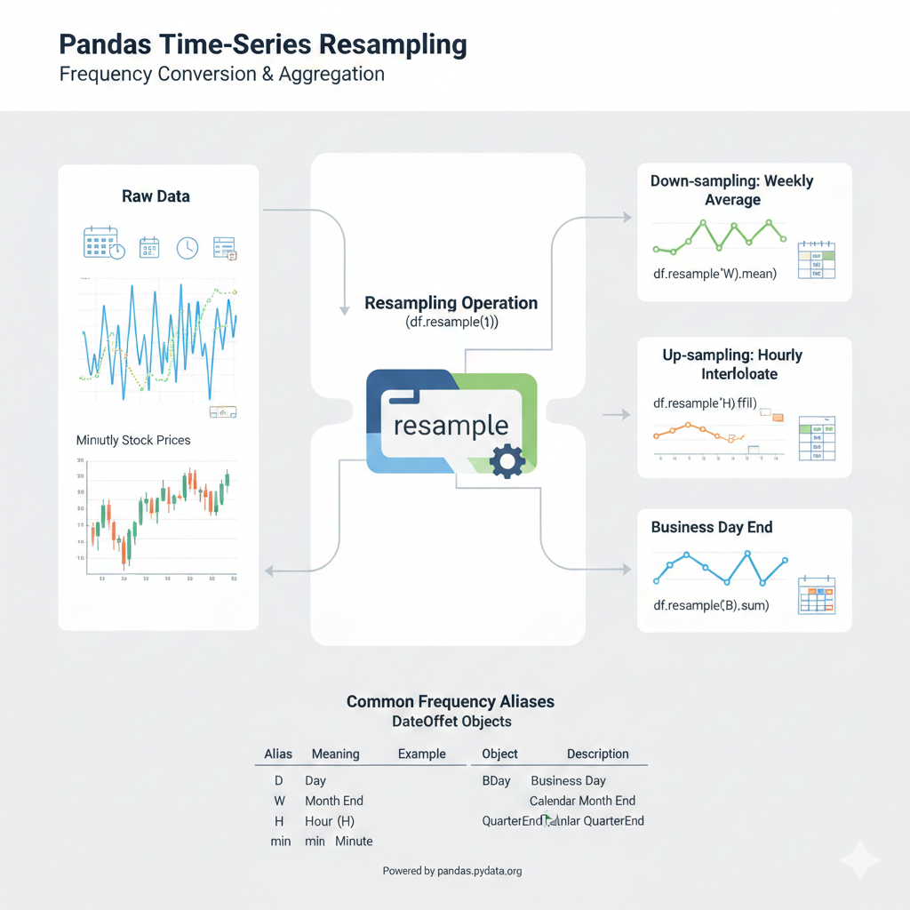

Title: Pandas - resample
Date: 2025-11-21 23:15
Modified: 2025-11-22 13:57
Category: Pandas
Tags: Python, Pandas, Kütüphane, Modül, resample
Author: Mustafa Halil

# `resample()` Metodu

`resample()` Metodu, **zaman serisi verilerinin frekansını dönüştürmek ve yeniden örneklemek için kullanılan** temel bir metottur. 



## Sözdizimi:

`resample()` fonksiyonunun sözdizimi aşağıdaki gibidir. Parametrelerin açıklaması  aşağıda **Parametreler** başlığında bulabilirsiniz.

```python
DataFrame.resample(rule, axis=<no_default>, closed=None, label=None, 
                    convention='start', kind=<no_default>, on=None, 
                    level=None, origin='start_day', offset=None, 
group_keys=False)
```

## Zaman Serisini Yeniden Örneklemek

`resample` yöntemi, bir `DataFrame` veya `Series` nesnesinin zaman tabanlı dizinini (`DatetimeIndex`, `PeriodIndex` veya `TimedeltaIndex`) kullanarak veriyi daha yüksek (yukarı örnekleme/up-sampling) veya daha düşük (aşağı örnekleme/down-sampling) bir frekansa dönüştürmenizi sağlar.

**Örnek:** Günlük sıcaklık verilerini alıp haftalık ortalamalara dönüştürmek bir aşağı örneklemedir (down-sampling). Dakikalık hisse senedi verilerini alıp saniyelik verilere dönüştürmek ise bir yukarı örneklemedir (up-sampling).

Bu işlemin ana adımları şunlardır:

1. **Gruplama:** Veriyi yeni, belirlenmiş zaman aralıklarına (gruplara) böler.

2. **Uygulama:** Her bir grup için bir toplama (aggregation) veya dönüşüm fonksiyonu (örneğin, `.mean()`, `.sum()`, `.ffill()`, `.ohlc()`) uygular.

## Parametreler

| Parametre        | Parametre Anlamı ve Açıklaması                                                                                                                                                                                                                                                                                                                                                                                                                                                                                                                                                                                                                                                |
| ---------------- | ----------------------------------------------------------------------------------------------------------------------------------------------------------------------------------------------------------------------------------------------------------------------------------------------------------------------------------------------------------------------------------------------------------------------------------------------------------------------------------------------------------------------------------------------------------------------------------------------------------------------------------------------------------------------------- |
| **`rule`**       | **Kural** (Zorunlu). Hedeflenen frekans dönüşümünü temsil eden zaman ofset dizesi (örneğin, `'W'` haftalık, `'M'` aylık, `'3H'` 3 saatlik).                                                                                                                                                                                                                                                                                                                                                                                                                                                                                                                                   |
| **`axis`**       | **Eksen**. Yeniden örnekleme için kullanılacak eksen. Varsayılan **0** (`index`). Seriler için kullanılmaz. *(Sürüm 2.0.0'dan itibaren kullanım dışı: `frame.T.resample(...)` kullanın.)*                                                                                                                                                                                                                                                                                                                                                                                                                                                                                     |
| **`closed`**     | **Kapalı Taraf**. Yeni zaman aralığı (bin) hangi tarafının **kapalı** (dahil) olacağını belirtir. Varsayılan, çoğu frekans için **`'left'`** (sol) iken, ay sonu, yıl sonu gibi (‘ME’, ‘YE’, ‘QE’, ‘BME’, ‘BA’, ‘BQE’, and ‘W’) bazı frekanslar için **`'right'`** (sağ) olur.                                                                                                                                                                                                                                                                                                                                                                                                |
| **`label`**      | **Etiket**. Oluşturulan zaman aralığına etiket olarak hangi **kenarın** (başlangıç veya bitiş) kullanılacağını belirtir. Varsayılan, çoğu frekans (‘ME’, ‘YE’, ‘QE’, ‘BME’, ‘BA’, ‘BQE’, and ‘W’ hariç) için **`'left'`** (sol) iken, bazı frekanslar için **`'right'`** (sağ) olur.                                                                                                                                                                                                                                                                                                                                                                                          |
| **`convention`** | **Kural** (Sadece `PeriodIndex` için). Zaman aralığının **başlangıcını** (`'start'`) mı yoksa **sonunu** (`'end'`) mu kullanacağını kontrol eder. Varsayılan **`'start'`**.                                                                                                                                                                                                                                                                                                                                                                                                                                                                                                   |
| **`kind`**       | **Tür**. Sonuç dizininin `DatetimeIndex` (`'timestamp'`) mi yoksa `PeriodIndex` (`'period'`) mi olacağını belirtir. Varsayılan olarak girdi türü korunur. *(Sürüm 2.2.0'dan itibaren kullanım dışı.)*                                                                                                                                                                                                                                                                                                                                                                                                                                                                         |
| **`on`**         | **Üzerinde**. `DataFrame` için, dizin yerine yeniden örnekleme için kullanılacak **sütun adını** belirtir. Bu sütun zaman serisi türünde olmalıdır.                                                                                                                                                                                                                                                                                                                                                                                                                                                                                                                           |
| **`level`**      | **Seviye**. `MultiIndex` (Çoklu Dizin) için, yeniden örnekleme için kullanılacak **seviyenin adını veya numarasını** belirtir. Bu seviye zaman serisi türünde olmalıdır.                                                                                                                                                                                                                                                                                                                                                                                                                                                                                                      |
| **`origin`**     | **Başlangıç Noktası**. Gruplamanın ayarlanacağı **başlangıç zaman damgasını** belirtir. Özellikle **Tik-frekansları** (sabit frekanslar, örn. saatler, dakikalar) için önemlidir. Varsayılan **`'start_day'`** (zaman serisinin ilk gününün gece yarısı). Diğer seçenekler: `'epoch'`, `'start'`, `'end'`, `'end_day'`.<br> '**epoch**': başlangıç tarihi 1970-01-01'dir.<br/><br/>'**start**': başlangıç tarihi zaman serisinin ilk değeridir.<br/><br/>'**start_day**': başlangıç tarihi zaman serisinin ilk gününün gece yarısıdır.<br/><br/>'**end**': başlangıç tarihi zaman serisinin son değeridir.<br/><br/>'**end_day**': başlangıç tarihi son günün gece yarısıdır. |
| **`offset`**     | **Ofset**. `origin`'e eklenen ek bir zaman farkı (`Timedelta`). Gruplama başlangıcını kaydırmak için kullanılır.                                                                                                                                                                                                                                                                                                                                                                                                                                                                                                                                                              |
| **`group_keys`** | **Grup Anahtarları**. Yeniden örneklenmiş nesne üzerinde `.apply()` kullanıldığında, grup anahtarlarının sonuç dizinine dahil edilip edilmeyeceğini belirtir. Varsayılan **`False`**                                                                                                                                                                                                                                                                                                                                                                                                                                                                                          |

Aşağıda, örneklerle bu konuyu detaylı olarak açıklayacağım.

Örnekler için temel veri serisi olarak, 9 adet bir dakikalık zaman damgasına sahip bir `Series` oluşturalım:

```python
index = pd.date_range('1/1/2025', periods=9, freq='min')
series = pd.Series(range(9), index=index)

# #Çıktı:
# #2025-01-01 00:00:00    0
# #2025-01-01 00:01:00    1
# #2025-01-01 00:02:00    2
# #2025-01-01 00:03:00    3
# #2025-01-01 00:04:00    4
# #2025-01-01 00:05:00    5
# #2025-01-01 00:06:00    6
# #2025-01-01 00:07:00    7
# #2025-01-01 00:08:00    8
# #Freq: min, dtype: int64
```

### 1. Frekans Düşürme (Downsampling) ve Toplama İşlevleri

Frekans düşürme, daha uzun zaman aralıklarına geçiş yapıldığı (örneğin dakikalıktan 3 dakikalığa) ve bu aralıklardaki verilerin birleştirildiği (aggregate) durumdur.

#### A. Basit Toplama (`sum()`):

Seriyi 3 dakikalık zaman aralığına (kovalara) (bin) düşürmek ve bu kovalara düşen zaman damgalarının değerlerini toplamak için kullanılır.

* **İşlem:** `series.resample('3min').sum()`
* **Açıklama:**
  * İlk kova (00:00:00'da başlayan): 0, 1, 2 değerlerini içerir. Toplamı 3'tür.
  * İkinci kova (00:03:00'da başlayan): 3, 4, 5 değerlerini içerir. Toplamı 12'dir.
  * Üçüncü kova (00:06:00'da başlayan): 6, 7, 8 değerlerini içerir. Toplamı 21'dir.

```python
print(series.resample('3min').sum())

# # Çıktı:
# #2025-01-01 00:00:00     3
# #2025-01-01 00:03:00    12
# #2025-01-01 00:06:00    21
# #Freq: 3min, dtype: int64
```

#### B. Kova Kenarı Etiketlemesi (`label`) ve Kova Kapatma (`closed`)

Yeniden örnekleme yaparken, oluşturulan zaman aralığı (kova)  kenarı `label` etiketiyle etiketlenebilir ve kovanın hangi tarafının kapalı (değeri içerdiği) olması gerektiğini (`closed`) belirleyebiliriz.

* **`label='right'` kullanımı:** Eğer etiket olarak sağ kenar (`'right'`) kullanılırsa, varsayılan olarak bu etiketi temsil eden değer kovanın içine dahil edilmez.

* **`label='right', closed='right'` kullanımı:** Sağ kenardaki değeri kovaya dahil etmek için `closed='right'` parametresi kullanılır.

* **İşlem:** `series.resample('3min', label='right', closed='right').sum()`

* **Açıklama:** Bu durumda, ilk kova (00:00:00 etiketi) 00:00:00'dan 00:03:00'a kadar olan değerleri içerir ve 00:00:00'daki değeri (0) içerir.

```python
print(series.resample('3min', label='right', closed='right').sum())

# Çıktı:
# 2000-01-01 00:00:00    0  (00:00:00'dan önceki veriler)
# 2000-01-01 00:03:00    6  (0, 1, 2, 3 toplamı 6 değil, bu örnekteki toplam 00:00'dan 00:03'e kadar olan aralığı sağdan kapalı olarak toplar: (00:00, 00:03]) [6].
# 2000-01-01 00:06:00   15
# 2000-01-01 00:09:00   15
```

### 2. Frekans Yükseltme (Upsampling) ve Veri Doldurma

Frekans yükseltme (örneğin 1 dakikalıktan 30 saniyeliğe) yapıldığında, aralara yeni zaman damgaları eklenir ve bu yeni girişler varsayılan olarak `NaN` (boş) değerler içerir.

#### A. `asfreq()` Parametresi ile Sadece Yeniden Dizinleme:

`asfreq()` ile Seriyi 30 saniyelik kovalara yükseltir ve veri olmayan yerlere `NaN` atar.

* **İşlem:** `series.resample('30s').asfreq()`

```python
print(series.resample('30s').asfreq())

# #Çıktı:

# #2025-01-01 00:00:00    0.0
# #2025-01-01 00:00:30    NaN  <-- Yeni eklenen satır
# #2025-01-01 00:01:00    1.0
# #2025-01-01 00:01:30    NaN  <-- Yeni eklenen satır
# #2025-01-01 00:02:00    2.0
# #2025-01-01 00:02:30    NaN  <-- Yeni eklenen satır
# #2025-01-01 00:03:00    3.0
# #2025-01-01 00:03:30    NaN  <-- Yeni eklenen satır
# #2025-01-01 00:04:00    4.0
# #2025-01-01 00:04:30    NaN  <-- Yeni eklenen satır
# #2025-01-01 00:05:00    5.0
# #2025-01-01 00:05:30    NaN  <-- Yeni eklenen satır
# #2025-01-01 00:06:00    6.0
# #2025-01-01 00:06:30    NaN  <-- Yeni eklenen satır
# #2025-01-01 00:07:00    7.0
# #2025-01-01 00:07:30    NaN  <-- Yeni eklenen satır
# #2025-01-01 00:08:00    8.0
# #Freq: 30s, dtype: float64
```

#### B. `ffill()` Parametresi ile İleriye Yönlü Doldurma:

`ffill()` (Forward Fill) ile Yükseltilmiş frekanstaki `NaN` değerleri, kendinden önceki geçerli değerle doldurur.

* **İşlem:** `series.resample('30s').ffill()`

```python
print(series.resample('30s').ffill())

# #Çıktı:
# #2025-01-01 00:00:00    0
# #2025-01-01 00:00:30    0  <-- Önceki değer ile dolduruldu
# #2025-01-01 00:01:00    1
# #2025-01-01 00:01:30    1  <-- Önceki değer ile dolduruldu
# #2025-01-01 00:02:00    2
# #2025-01-01 00:02:30    2  <-- Önceki değer ile dolduruldu
# #2025-01-01 00:03:00    3
# #2025-01-01 00:03:30    3  <-- Önceki değer ile dolduruldu
# #2025-01-01 00:04:00    4
# #2025-01-01 00:04:30    4  <-- Önceki değer ile dolduruldu
# #2025-01-01 00:05:00    5
# #2025-01-01 00:05:30    5  <-- Önceki değer ile dolduruldu
# #2025-01-01 00:06:00    6
# #2025-01-01 00:06:30    6  <-- Önceki değer ile dolduruldu
# #2025-01-01 00:07:00    7
# #2025-01-01 00:07:30    7  <-- Önceki değer ile dolduruldu
# #2025-01-01 00:08:00    8
# #Freq: 30s, dtype: int64
```

#### C. `bfill()` Parametresi ile Geriye Yönlü Doldurma:

`bfill()` (Backward Fill) ile Yükseltilmiş frekanstaki `NaN` değerleri, kendinden sonraki geçerli değerle doldurur.

* **İşlem:** `series.resample('30s').bfill()`

```python
print(series.resample('30s').bfill())

# #Çıktı:
# #2025-01-01 00:00:00    0
# #2025-01-01 00:00:30    1  <-- Sonraki değer ile dolduruldu
# #2025-01-01 00:01:00    1
# #2025-01-01 00:01:30    2  <-- Sonraki değer ile dolduruldu
# #2025-01-01 00:02:00    2
# #2025-01-01 00:02:30    3  <-- Sonraki değer ile dolduruldu
# #2025-01-01 00:03:00    3
# #2025-01-01 00:03:30    4  <-- Sonraki değer ile dolduruldu
# #2025-01-01 00:04:00    4
# #2025-01-01 00:04:30    5  <-- Sonraki değer ile dolduruldu
# #2025-01-01 00:05:00    5
# #2025-01-01 00:05:30    6  <-- Sonraki değer ile dolduruldu
# #2025-01-01 00:06:00    6
# #2025-01-01 00:06:30    7  <-- Sonraki değer ile dolduruldu
# #2025-01-01 00:07:00    7
# #2025-01-01 00:07:30    8  <-- Sonraki değer ile dolduruldu
# #2025-01-01 00:08:00    8
# #Freq: 30s, dtype: int64
```

### 3. Özel Fonksiyonlar ve DataFrame Kullanımı

#### A. `apply()` Fonksiyonu ile Özel Fonksiyon Uygulama:

`apply()` ile Yeniden örnekleme sonrasında, standart toplama işlevleri yerine kullanıcı tanımlı bir işlev (`custom_resampler`) uygulamak mümkündür.

* **Örnek İşlev:** Gelen dizinin toplamına 5 ekleyen bir işlev.
* **İşlem:** `series.resample('3min').apply(custom_resampler)`

```python
print(series.resample('3min').sum())

# #Çıktı:
# #2025-01-01 00:00:00     3
# #2025-01-01 00:03:00    12
# #2025-01-01 00:06:00    21
# #Freq: 3min, dtype: int64
```

```python
def custom_resampler(x):
    return (x + 5)

print(series.resample('3min').sum().apply(custom_resampler))

# Önceki toplamlar (3, 12, 21) üzerine 5 eklenir:
# Çıktı
# 2000-01-01 00:00:00    8  (3 + 5)
# 2000-01-01 00:03:00   17 (12 + 5)
# 2000-01-01 00:06:00   26 (21 + 5)
```

> **NOT**:
> 
> `GroupBy` aracılığıyla kullanılabilen tüm yerleşik metotlar, `sum`, `mean`, `std`, `sem`, `max`, `min`, `median`, `first`, `last`, `ohlc` dahil olmak üzere, döndürülen nesnenin bir metodu olarak kullanılabilir.

```python
rng = pd.date_range("1/1/2012", periods=100, freq="s")

ts = pd.Series(np.random.randint(0, 500, len(rng)), index=rng)

ts.resample("5Min").sum()
# Çıktı:
# 2012-01-01    25103
# Freq: 5min, dtype: int64

ts.resample("5Min").mean()
# Çıktı:
# 2012-01-01    251.03
# Freq: 5min, dtype: float64

ts.resample("5Min").ohlc()
# Çıktı:            open  high  low  close
# 2012-01-01   308   460    9    205

ts.resample("5Min").max()
# Çıktı:
# 2012-01-01    460
# Freq: 5min, dtype: int64
```

#### B. `on` Parametresi ile İndeks Dışında Bir Sütun Kullanma:

`DataFrame` nesneleri için, yeniden örnekleme işlemini varsayılan dizin (`index`) yerine datetime benzeri bir sütun üzerinden gerçekleştirmek için **`on`** parametresi kullanılabilir.

* **Örnek Senaryo:** Haftalık başlangıç tarihleri (`week_starting`) olan bir DataFrame'i aylık esasa göre yeniden örnekleyip ortalamasını almak.
* **İşlem:** `df.resample('ME', on='week_starting').mean()`

Örnek Veri Çerçevesi:

```python
d = {'price': [10, 11, 9, 13, 14, 18, 17, 19],
     'volume': [50, 60, 40, 100, 50, 100, 40, 50]}

df = pd.DataFrame(d)

df['week_starting'] = pd.date_range('01/01/2018', periods=8, freq='W')

print(df)

# #Çıktı:
   # #price  volume week_starting
# #0     10      50    2018-01-07
# #1     11      60    2018-01-14
# #2      9      40    2018-01-21
# #3     13     100    2018-01-28
# #4     14      50    2018-02-04
# #5     18     100    2018-02-11
# #6     17      40    2018-02-18
# #7     19      50    2018-02-25
```

Tablo halinde Çıktı; 

| İndeks | price | volume | week_starting |
| ------ | ----- | ------ | ------------- |
| 0      | 10    | 50     | 2018-01-07    |
| 1      | 11    | 60     | 2018-01-14    |
| 2      | 9     | 40     | 2018-01-21    |
| 3      | 13    | 100    | 2018-01-28    |
| 4      | 14    | 50     | 2018-02-04    |
| 5      | 18    | 100    | 2018-02-11    |
| 6      | 17    | 40     | 2018-02-18    |
| 7      | 19    | 50     | 2018-02-25    |

```python
print(df.resample('ME', on='week_starting').mean())

# Sonuç (Ocak ve Şubat ortalamaları):
#              price  volume
# week_starting
# 2018-01-31   10.75    62.5  (Ocak verilerinin ortalaması)
# 2018-02-28   17.00    60.0  (Şubat verilerinin ortalaması)
```

**İşlem Sonucu Tablo halinde (Aylık Ortalama):**

| week_starting | price | volume |
| ------------- | ----- | ------ |
| 2018-01-31    | 10.75 | 62.5   |
| 2018-02-28    | 17.00 | 60.0   |

Bu sonuç **price** sütununda, Ocak ayına ait 4 haftanın (10, 11, 9, 13) ve Şubat ayına ait 4 haftanın (14, 18, 17, 19) ortalamasının alındığını gösterir.

**Uygulanan Yeniden Örnekleme (resample) İşleminin Açıklaması:**

Bu `df` üzerinde `df.resample('ME', on='week_starting').mean()` işlemi uygulandığında:

• `'ME'` (Month End): Veriler aylık bazda gruplanır.

• `on='week_starting'`: Yeniden örnekleme işlemi, DataFrame'in dizini yerine **week_starting** sütunundaki `datetime` benzeri veriler kullanılarak yapılır.

• `mean()`: Gruplanan her ay için `price` ve `volume` sütunlarının ortalaması hesaplanır.

#### C. level ile MultiIndex Seviyesi Kullanma:

`level` parametresi ile Bir MultiIndex (Çoklu Dizin) içeren bir DataFrame'de, yeniden örneklemenin hangi `datetime` benzeri seviyede yapılacağını belirtmek için **`level`** parametresi kullanılır.

* **Örnek Senaryo:** Hem gün hem de gün içindeki zaman dilimi (`morning`, `afternoon`) içeren bir MultiIndex'te, sadece gün seviyesinde (Seviye 0) yeniden örnekleme yapmak.

Orjinal Verimiz;

```python
days = pd.date_range('1/1/2025', periods=4, freq='D')

d2 = {'price': [10, 11, 9, 13, 14, 18, 17, 19],
      'volume': [50, 60, 40, 100, 50, 100, 40, 50]}

df2 = pd.DataFrame(d2, index=pd.MultiIndex.from_product([days, ['morning', 'afternoon']]))

print(df2)

# #Çıktı:
                      # #price  volume
# #2025-01-01 morning       10      50
           # #afternoon     11      60
# #2025-01-02 morning        9      40
           # #afternoon     13     100
# #2025-01-03 morning       14      50
           # #afternoon     18     100
# #2025-01-04 morning       17      40
           # #afternoon     19      50
```

* **İşlem:** `df2.resample('D', level=0).sum()`

```python
print(df2.resample('D', level=0).sum())

# #Çıktı (Günlük toplam):
            # #price  volume
# #2025-01-01     21     110 (10+11, 50+60)
# #2025-01-02     22     140 (9+13, 40+100)
# #2025-01-03     32     150 (14+18, 50+100)
# #2025-01-04     36      90 (17+19, 40+50)
```

## 📅 Pandas Frekans Takma Adları (Offset Aliases)

Bu takma adlar, pandas kütüphanesinde zaman serisi işlemlerinde (örneğin, **yeniden örnekleme (`resample`)**, tarih aralığı oluşturma (`date_range`)) bir zaman periyodunu veya aralığını kolayca belirtmek için kullanılan kısa, standartlaştırılmış dizelerdir.

Bu kodlar, milisaniyeden yıla kadar uzanan geniş bir frekans yelpazesini temsil eder.

### 📝 Başlıca Frekans Takma Adları

Aşağıdaki tablo, sıkça kullanılan Frekans Takma Adlarını ve ne anlama geldiklerini göstermektedir:

| Takma Ad (Alias) | Açıklama (Description)         | Türkçe Anlamı                         |
| ---------------- | ------------------------------ | ------------------------------------- |
| `B`              | Business day frequency         | İş günü frekansı (Pazartesi-Cuma)     |
| `D`              | Calendar day frequency         | Takvim günü frekansı (Her gün)        |
| `W`              | Weekly frequency               | Haftalık frekans (Pazar günleri sonu) |
| `M`              | Month end frequency            | Ay sonu frekansı                      |
| `MS`             | Month start frequency          | Ay başlangıcı frekansı                |
| `BM`             | Business month end frequency   | İş ayı sonu frekansı                  |
| `BMS`            | Business month start frequency | İş ayı başlangıcı frekansı            |
| `Q`              | Quarter end frequency          | Çeyrek (3 ay) sonu frekansı           |
| `QS`             | Quarter start frequency        | Çeyrek (3 ay) başlangıcı frekansı     |
| `A` veya `Y`     | Year end frequency             | Yıl sonu frekansı                     |
| `AS` veya `YS`   | Year start frequency           | Yıl başlangıcı frekansı               |
| `H`              | Hourly frequency               | Saatlik frekans                       |
| `T` veya `min`   | Minutely frequency             | Dakikalık frekans                     |
| `S`              | Secondly frequency             | Saniyelik frekans                     |
| `L` veya `ms`    | Milliseconds                   | Milisaniye frekansı                   |
| `U` veya `us`    | Microseconds                   | Mikrosaniye frekansı                  |
| `N`              | Nanoseconds                    | Nanosaniye frekansı                   |

### 🔢 Frekans Çarpanları ve Birleşik Kullanım

Bu takma adlar, başında bir sayı kullanılarak periyodun uzunluğunu artırmak için kullanılabilir:

- **`3D`**: Her 3 günde bir.

- **`2W`**: Her 2 haftada bir.

- **`4H`**: Her 4 saatte bir.

Ayrıca, zamanı daha detaylı belirtmek için birden fazla takma ad birleştirilebilir:

- **`1H30min`**: 1 saat 30 dakikalık frekans.

### 📍 Çapalı Frekanslar (Anchored Offsets)

Haftalık, çeyreklik ve yıllık frekanslar için başlangıç veya bitiş noktasını sabitleyen (**çapalayan**) ek parametreler kullanabilirsiniz. Bu, finansal veya ticari takvimler için kritik öneme sahiptir.

#### Haftalık Çapalar (`W-Gün`)

Varsayılan **`W`** Pazar günü bitişini kullanır. Farklı bir gün belirlemek için:

| Takma Ad    | Açıklama                                                                            |
| ----------- | ----------------------------------------------------------------------------------- |
| **`W-MON`** | Haftalık, Pazartesi günleri biten (haftalık bazda Pazartesi gününe göre gruplanır). |
| **`W-FRI`** | Haftalık, Cuma günleri biten (iş haftası sonuna göre gruplanır).                    |

#### Yıllık ve Çeyreklik Çapalar (`A-Ay`, `Q-Ay`)

Varsayılan yıllık ve çeyreklik frekanslar genellikle yıl sonu olarak Aralık'ı kullanır. Farklı bir mali yıl sonu belirlemek için ay adının üç harfli kısaltması kullanılır:

| Takma Ad     | Açıklama                                     |
| ------------ | -------------------------------------------- |
| **`Q-MAR`**  | Çeyrek sonu, yıl Mart ayında sona erer.      |
| **`QS-JUN`** | Çeyrek başlangıcı, yıl Haziran'da sona erer. |
| **`A-SEP`**  | Yıl sonu, yıl Eylül ayında sona erer.        |

Bu takma adlar, pandas'ın zaman serisi verileriniz üzerinde esnek ve güçlü bir şekilde kontrol sahibi olmanızı sağlayan temel yapı taşlarıdır.

## 📅 DateOffset Objeleri ve Takvim Tabanlı Aralıklar

Pandas'taki **`DateOffset`** objeleri, yalnızca mutlak bir zaman miktarını (`Timedelta` gibi, örneğin tam 24 saat) değil, aynı zamanda **takvim kurallarını** (örneğin iş günleri, ay sonları, çeyrek başlangıçları) da dikkate alan göreceli zaman artışlarını temsil eder.

**Önemli Fark:**

- **`Timedelta`:** Mutlak zaman (örneğin, tam 72 saat). Yaz saati uygulaması (DST) geçişlerini dikkate almaz.

- **`DateOffset`:** Takvim tabanlı zaman (örneğin, 3 iş günü). **DST geçişlerini ve hafta sonlarını atlama** gibi kuralları uygular.

`resample` metodunda kullanılan Frekans Takma Adlarının (`'B'`, `'M'`, `'Q'`) arkasında yatan sınıflar bu `DateOffset` objeleridir.

### 📝 Başlıca DateOffset Sınıfları

Aşağıdaki tablo, pandas zaman serisi işlemlerinin karmaşık takvim mantığını sağlayan temel `DateOffset` sınıflarını ve işlevlerini göstermektedir:

| Sınıf Adı (Class Name)              | Alias (Takma Ad) | Türkçe Açıklaması                                                                                                                               |
| ----------------------------------- | ---------------- | ----------------------------------------------------------------------------------------------------------------------------------------------- |
| **`DateOffset`**                    | Yok              | Genel ofset sınıfı. Varsayılan olarak 1 takvim gününe karşılık gelir, ancak anahtar kelimelerle (örn. `days=3`, `months=1`) özelleştirilebilir. |
| **`BDay`** veya `BusinessDay`       | `B`              | **İş günü** (Pazartesi'den Cuma'ya). Hafta sonlarını ve resmi tatilleri atlar (özel bir takvim belirtilmedikçe).                                |
| **`CDay`** veya `CustomBusinessDay` | `C`              | **Özel İş Günü**. Özel olarak tanımlanmış tatil günlerini ve/veya hafta sonlarını atlamak için kullanılır.                                      |
| **`MonthEnd`**                      | `ME`             | Takvim **Ay Sonu** frekansı. Tarihi ayın son gününe yuvarlar.                                                                                   |
| **`MonthBegin`**                    | `MS`             | Takvim **Ay Başlangıcı** frekansı. Tarihi ayın ilk gününe yuvarlar.                                                                             |
| **`BMonthEnd`**                     | `BME`            | **İş Ayı Sonu** frekansı. Ayın son iş gününe yuvarlar.                                                                                          |
| **`BMonthBegin`**                   | `BMS`            | **İş Ayı Başlangıcı** frekansı. Ayın ilk iş gününe yuvarlar.                                                                                    |
| **`QuarterEnd`**                    | `QE`             | Takvim **Çeyrek Sonu** frekansı (Mart, Haziran, Eylül, Aralık sonları).                                                                         |
| **`QuarterBegin`**                  | `QS`             | Takvim **Çeyrek Başlangıcı** frekansı (Ocak, Nisan, Temmuz, Ekim başlangıçları).                                                                |
| **`YearEnd`**                       | `YE`             | Takvim **Yıl Sonu** frekansı (Varsayılan: 31 Aralık).                                                                                           |
| **`YearBegin`**                     | `YS` veya `BYS`  | Takvim **Yıl Başlangıcı** frekansı (Varsayılan: 1 Ocak).                                                                                        |
| **`BusinessHour`**                  | `BH`             | **İş Saati** frekansı. Yalnızca iş günleri içindeki çalışma saatlerini sayar (Varsayılan: 9:00 - 17:00).                                        |
| **`SemiMonthEnd`**                  | `SME`            | **Yarı Ay Sonu** frekansı. Ayın 15. günü ve ayın son günü.                                                                                      |
| **`SemiMonthBegin`**                | `SMS`            | **Yarı Ay Başlangıcı** frekansı.                                                                                                                |
| **`Week`**                          | `W`              | **Haftalık** frekans. Opsiyonel olarak haftanın belirli bir gününe çapalanabilir (örneğin, `W-MON` Pazartesi).                                  |
| `Day`                               | `D`              | Bir **mutlak gün** (tam 24 saat).                                                                                                               |
| `Hour`                              | `h`              | Bir **saat** (60 dakika).                                                                                                                       |
| `Minute`                            | `min`            | Bir **dakika** (60 saniye).                                                                                                                     |
| `Second`                            | `s`              | Bir **saniye**.                                                                                                                                 |
| `Millisecond`                       | `ms`             | Bir **milisaniye** (10−3 saniye).                                                                                                               |
| `Microsecond`                       | `us`             | Bir **mikrosaniye** (10−6 saniye).                                                                                                              |
| `Nanosecond`                        | `ns`             | Bir **nanosaniye** (10−9 saniye).                                                                                                               |

## Kaynaklar:

* [pandas.DataFrame.resample &#8212; pandas 2.3.3 documentation](https://pandas.pydata.org/pandas-docs/stable/reference/api/pandas.DataFrame.resample.html)

* [Time series / date functionality &#8212; pandas 2.3.3 documentation](https://pandas.pydata.org/pandas-docs/stable/user_guide/timeseries.html#resampling)

* [Google Gemini](https://gemini.google.com)
