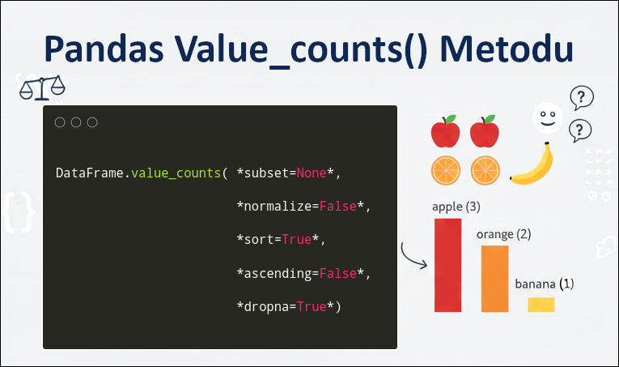

Title: Pandas - value_counts
Date: 2025-06-15 15:50
Modified: 2025-11-15 22:56
Category: Pandas
Tags: Python, Pandas, value_counts, value, counts, Kütüphane, Modül, Fonksiyon
Author: Mustafa Halil

# `value_counts()` Metodu

Veri çerçevemizde sütun bazında **verinin kaç kez tekrar ettiğini** (kaç adet bulunduğunu) öğrenmek için `value_counts()` metodunu kullanabiliriz. 
`value_counts` metodu, veri frekansını (sıklığını) içeren bir **Seri** döndürün. Excel ve Libre Ofis Calc uygulamalarındaki <u>Yinelenenleri Kaldır (Remove Duplicates)</u> komutuna benzer bir işlev ile sütundaki benzersiz tüm değerleri içeren bir seri oluşturur ve bu serideki değerlerin veri çerçevesinde sütun temelli olarak **kaçar adet bulunduğunu (frekansını)** hesaplar / döndürür.



## Sözdizimi:

```python
DataFrame.value_counts( *subset=None*, 
                        *normalize=False*, 
                        *sort=True*, 
                        *ascending=False*, 
                        *dropna=True*)
```

## Parametreler

**subset :** Etiket veya etiket listesi. İsteğe bağlıdır, yani belirtmek şart değil.  

*Benzersiz kombinasyonları sayarken kullanılacak **sütunları** tanımlar.*

**normalize :** Bool değer alır, varsayılan değer: **False**  

*True (Doğru) olarak ayarlandığında, Frekans değeri yerine **oranları** döndürür.*

**sort :** Bool değer alır, varsayılan değer: **True**

*True (Doğru) olarak ayarlandığında sonuç <u>frekanslara göre</u> sıralanır. False olduğunda DataFrame <u>sütun değerlerine göre</u> sıralayın.*

**ascending :** Bool değer alır, varsayılan değer: **False**

*True (Doğru) olarak ayarlandığında, Artan düzende yani küçükten büyüğe doğru sıralama yapar, sıralamayı ters çevirir.*

**dropna :** Bool değer alır, varsayılan değer: **True**

*True (Doğru) olarak ayarlandığında, **NA** yani boş değerleri içeren satır sayılarını dahil etmeyin anlamına gelir.*

> value_counts() Metodu Pandas'a, 1.3.0 sürümüne eklendi.

## Not

Döndürülen Seri, giriş sütunu başına bir düzeyi olan, ancak tek bir etiket için bir Dizini (çoklu olmayan) olan bir multiındex'e sahip olacaktır. Varsayılan olarak, herhangi bir NA değeri içeren satırlar sonuçtan çıkarılır. Varsayılan olarak, ortaya çıkan Seri azalan sırada olacaktır, böylece ilk öğe en sık görülen satır olur.

## Örnekler

Basit bir Veri Çerçevesi oluşturalım ve içeriğini görüntüleyelim. 

```python
>>> df = pd.DataFrame({'num_legs': [2, 4, 4, 6],
...                    'num_wings': [2, 0, 0, 0]},
...                   index=['falcon', 'dog', 'cat', 'ant'])
>>> df
        num_legs  num_wings
falcon         2          2
dog            4          0
cat            4          0
ant            6          0
```

`value_counts()` metodunu ve parametrelerini yukarıda oluşturduğumuz veri çerçevesi üzerinden aşağıdaki örneklerle detaylı olarak inceleyelim.

### value_counts() Metodu

Şimdi `value_counts()` metodunu <u>parametresiz</u> bir şekilde kullanarak **her bir sütundaki** verilerin frekansını görelim.

```python
>>> df.value_counts()
num_legs  num_wings
4         0            2
2         2            1
6         0            1
Name: count, dtype: int64
```

Çıktıyı incelediğimizde görüyoruz ki, her iki sütundaki değerlerin frekansı gösterilirken tam olarak istediğimiz sonucu elde edemiyoruz.  **num_wings** sütununda **0** değeri **3** kez geçmesine rağmen bu değeri **2** ve **1** şeklinde görüntüleniyor. Bunun sebebinin, ilk sütun olan **num_legs** sütununda **3** farklı değer olması olmalı diye düşünüyorum.

### subset Parametresi

`subset` parametresine `"num_wings"` değeri atansa (`subset="num_wings"`) ve **sadece** **num_wings** sütunundaki değerlerin frekansı hesaplansa  aşağıdaki çıktıyı alırız. Sonuç (çıktı) tam istediğimiz gibi. **num_wings** sütununda **0** değerinden **3** tane **2** değerinden **1** tane bulunduğunu görüyoruz.

```python
>>> df.value_counts(subset="num_wings")
num_wings
0    3
2    1
Name: count, dtype: int64
```

İkiden fazla sütuna sahip veri çerçevemiz olsaydı ve bu veri çerçevesinde **birden fazla sütunu seçerek** `subset` parametresini kullanmak isteseydik o zaman, sütun isimlerini **liste içersinde belirtmemiz** gerekirdi. 

Örneğin veri çerçevesine geçici olarak **ağırlık (weight)** bilgisi ekleyelim ve inceleyelim;

```python
>>> df["weight"] = [1500, 5000, 1500, 5 ]
        num_legs  num_wings  weight
falcon         2          2    1500
dog            4          0    5000
cat            4          0    1500
ant            6          0       5
```

Şimdi tüm sütunlar yerine sadece **num_legs** ve **weight** sütunlarını seçerek (`subset` parametremize liste şeklinde veri girerek)  `value_counts` metodumuzu çalıştıralım.

```python
>>> df.value_counts(subset=["num_legs", "weight"])
num_legs  weight
2         1500      1
4         1500      1
          5000      1
6         5         1
Name: count, dtype: int64
```

**NOT:** `subset` parametresi kullanılmadan sadece sütun isimleri yazılarak ta aynı sonucu elde edebiliriz.

Tek sütun ismi yazılarak elde edilen sonuç;

```python
print>>> df.value_counts("weight")
weight
1500    2
5       1
5000    1
Name: count, dtype: int64
```

İki sütun ismi **liste içerisine yazılarak** elde edilen sonuç;

```python
>>> df.value_counts(["num_legs", "weight"])
num_legs  weight
2         1500      1
4         1500      1
          5000      1
6         5         1
Name: count, dtype: int64
```

### sort Parametresi

**sort()** parametresi, **False** olarak ayarlandığında sonuç, <u>frekanslara göre</u> **değil** Veri Çerçevesinin <u>sütun değerlerine göre</u> sıralanır. Çok sütunlu veri çerçevesinde bu parametre kullanıldığında **ilk sütun değerlerine göre sıralama** yapılır.

```python
>>> df.value_counts(sort=False)
num_legs  num_wings
2         2            1
4         0            2
6         0            1
Name: count, dtype: int64
```

### ascending Metodu

 `ascending` parametresine **True** değeri atayarak, sonucun (çıktının) **küçükten büyüğe doğru** sıralanmasını sağlayabiliriz.

```python
>>> df.value_counts(ascending=True)
num_legs  num_wings
2         2            1
6         0            1
4         0            2
Name: count, dtype: int64
```

### normalize parametresi

`normalize` parametresini **True** olarak değiştirerek, sütundaki değerlerin **oranını** belirlemeye çalışalım.

```python
>>> df.value_counts(normalize=True)
num_legs  num_wings
4         0            0.50
2         2            0.25
6         0            0.25
Name: proportion, dtype: float64
```

Yine **num_wings** sütununu ayrı olarak inceleyecek olursak, bu sütuna ait oransal sonucu daha doğru olarak görüntülemiş olacağız.

```python
>>> df.value_counts(subset="num_wings", normalize=True)
num_wings
0    0.75
2    0.25
Name: proportion, dtype: float64
```

Gördüğünüz gibi **num_wings** sütununda **0** değerinin **bulunma (sıklık) oranı 0.75 (%75), 2 değerinin sıklık oranı 0.25 (%25)**'tir.

### dropna Parametresi

**dropna** parametresini incelemek için, içerisinde NA değerleri bulunan yeni bir veri çerçevesi oluşturuyoruz. Veri çerçevesi aşağıda görülmektedir.

```python
>>> df = pd.DataFrame({'first_name': ['John', 'Anne', 'John', 'Beth'],
...                    'middle_name': ['Smith', pd.NA, pd.NA, 'Louise']})
>>> df
  first_name middle_name
0       John       Smith
1       Anne        <NA>
2       John        <NA>
3       Beth      Louise
```

`value_counts()` metodunu çalıştırdığımızda alacağımız çıktı aşağıdaki gibidir. **NA** değerleri görmezden gelinmiştir.

```python
>>> df.value_counts()
first_name  middle_name
Beth        Louise         1
John        Smith          1
Name: count, dtype: int64
```

**Dropna** parametresini **False** olarak ayarlayarak, **NA** değerlerine sahip satırların da sayılmasını sağlayabiliriz.

```python
>>> df.value_counts(dropna=False)
first_name  middle_name
Anne        NaN            1
Beth        Louise         1
John        Smith          1
            NaN            1
Name: count, dtype: int64
```

```python
>>> df.value_counts("first_name")
first_name
John    2
Anne    1
Beth    1
Name: count, dtype: int64
```

Bir de NBA verilerini **gruplayarak**, verilerimizin **kaç kez tekrar ettiğini** hesaplatalım. Vermizi aşağıdadır:

```python
import pandas as pd
nba = pd.read_csv("Veri_Setleri/nba.csv", decimal=".")
print(nba)
```

|     | Name          | Team           | Number | Position | Age  | Height | Weight | College           | Salary    |
| --- | ------------- | -------------- | ------ | -------- | ---- | ------ | ------ | ----------------- | --------- |
| 0   | Avery Bradley | Boston Celtics | 0.0    | PG       | 25.0 | 6-2    | 180.0  | Texas             | 7730337.0 |
| 1   | Jae Crowder   | Boston Celtics | 99.0   | SF       | 25.0 | 6-6    | 235.0  | Marquette         | 6796117.0 |
| 2   | John Holland  | Boston Celtics | 30.0   | SG       | 27.0 | 6-5    | 205.0  | Boston University | NaN       |
| 3   | R.J. Hunter   | Boston Celtics | 28.0   | SG       | 22.0 | 6-5    | 185.0  | Georgia State     | 1148640.0 |
| 4   | Jonas Jerebko | Boston Celtics | 8.0    | PF       | 29.0 | 6-10   | 231.0  | NaN               | 5000000.0 |
| ... | ...           | ...            | ...    | ...      | ...  | ...    | ...    | ...               | ...       |
| 453 | Shelvin Mack  | Utah Jazz      | 8.0    | PG       | 26.0 | 6-3    | 203.0  | Butler            | 2433333.0 |
| 454 | Raul Neto     | Utah Jazz      | 25.0   | PG       | 24.0 | 6-1    | 179.0  | NaN               | 900000.0  |
| 455 | Tibor Pleiss  | Utah Jazz      | 21.0   | C        | 26.0 | 7-3    | 256.0  | NaN               | 2900000.0 |
| 456 | Jeff Withey   | Utah Jazz      | 24.0   | C        | 26.0 | 7-0    | 231.0  | Kansas            | 947276.0  |
| 457 | NaN           | NaN            | NaN    | NaN      | NaN  | NaN    | NaN    | NaN               | NaN       |

458 rows × 9 columns

Veri Çerçevemizi <u>Takım (Team)</u> ismine göre gruplayarak, <u>Yaş (Age) Sütununda</u> **hangi değerden kaç adet veri olduğunu** bulmak istersek, `value_counts()` metodundan yararlanabiliriz.

```python
print(nba.groupby("Team")["Age"].value_counts())
```

```python
Team                Age 
Atlanta Hawks       24.0    4
                    31.0    3
                    27.0    2
                    35.0    2
                    22.0    1
                           ..
Washington Wizards  26.0    1
                    27.0    1
                    29.0    1
                    32.0    1
                    34.0    1
Name: Age, Length: 288, dtype: int64
```

## Kaynak

[pandas.DataFrame.value_counts &#8212; pandas 2.3.0 documentation](https://pandas.pydata.org/docs/reference/api/pandas.DataFrame.value_counts.html#pandas.DataFrame.value_counts)
