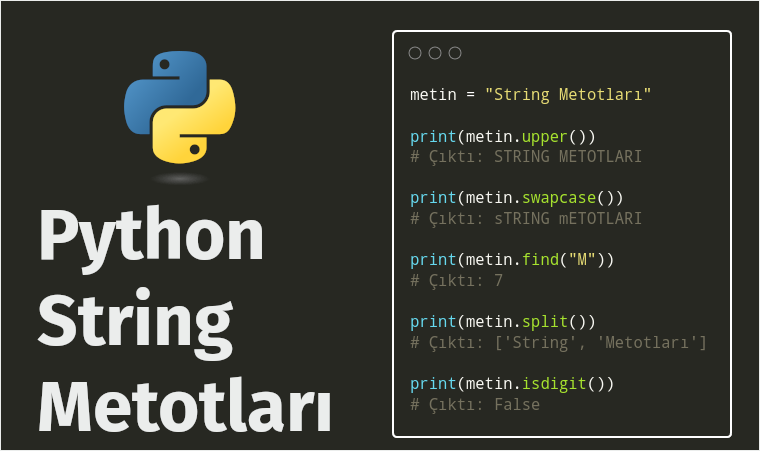

Title: Python - string metotlari
Date: 2025-11-20 21:00
Category: Cesitli
Tags: Python, String, Metot
Author: Mustafa Halil

# String Metotları

Python’da her veri tipinde olduğu gibi stringler için de hazır bir çok metot bulunmaktadır. Bu metotlar sayesinde dizgi, metin (string) tipindeki veriler üzerinde hızlı ve esnek bir şekilde oynayabiliriz.

## String Nedir?

String metotlarını anlatmadan önce kısaca string'in nam-ı diğer dizgi ve metin ifadesinin ne olduğundan kısaca bahsedelim.

Python’da herhangi bir karakter dizisine **string** denir. String, tek bir harften oluşabileceği gibi, içerisinde boşluklar, özel karakterler veya rakamlar da barındırabilir. Python’da string veri tipi `str` ile ifade edilir.  

Python’da string değişkenleri tırnak (‘) karakteri yardımıyla oluşturulur. String oluşturmak için **tek tırnak (`‘ ‘`)** veya **çift tırnak (`" "`)** kullanılabilir. Tek ve çift tırnak ile oluşturulan stringler tek satırda başlar ve biter.

Çok satırlı string oluşturmak için **üç tırnak (`""" """`)** kullanılır.

Python’da değişken ismi belirlerken şu kurallara uyulmalıdır:

- Herhangi bir ön tanımlı kelime (Ör: Python’ın `upper` ya da `print`fonksiyonu) ismi kullanılamaz.
- Değişken ismi rakam ile başlayamaz.
- Alt tire (_) dışında bir özel karakter kullanılamaz.
- Boşluk içeremez.

Bu kurallardan herhangi birini ihlal ettiğiniz durumlarda **“SyntaxError”** hatası ile karşılaşacaksınız.

## Karakter dönüşüm metotları

Veri girişi sırasında girilen metin değerlerinin sabit bir formatta bulunmaması çok yaygın bir durumdur. Bazı değerler tümüyle büyük harf içerirken, bazı değerlerin sadece ilk harfleri büyük olabilir.

Karakter dönüşüm metotları sayesinde string değişkenine ait değerleri sabit bir biçime dönüştürebilirsiniz.

| **String Metodu** | **İşlevi**                                                                                                                         | **Kullanım örneği**                             |
| ----------------- | ---------------------------------------------------------------------------------------------------------------------------------- | ----------------------------------------------- |
| capitalize()      | **String’in ilk karakterini** büyük harfe çevirir.                                                                                 | ornek.capitalize()                              |
| lower()           | **String’in tüm karakterlerini** küçük harfe çevirir.                                                                              | ornek.lower()                                   |
| upper()           | **String’in tüm karakterlerini** büyük harfe çevirir.                                                                              | ornek.upper()                                   |
| casefold()        | lower() metodundan da agresif bir şekilde **tüm karakterleri** küçük harfe çevirir. İngilizce dışındaki diller için kullanışlıdır. | ornek.casefold()                                |
| swapcase()        | Büyük olan karakterleri küçük, küçük olan karakterleri büyük harfe çevirir.                                                        | ornek.swapcase()                                |
| title()           | String’de bulunan **tüm kelimelerin ilk karakterini** büyük harfe                                                                  | ornek.title()                                   |
| replace()         | String’de bulunan herhangi bir karakteri, verilen başka bir karakter ile değiştirir.                                               | ornek.replace(“eski karakter”, “yeni karakter”) |

## Arama metotları

Arama metotları ile metin değerleri içerisinde bir metin arayabilirsiniz. Kullandığınız fonksiyona göre “`True, False`” gibi mantıksal bir değer, indeks veya adet değeri gibi sayısal bir değer elde edebilirsiniz.

| **String Metodu** | **İşlevi**                                                                                                                                                                        | **Kullanım örneği**              |
| ----------------- | --------------------------------------------------------------------------------------------------------------------------------------------------------------------------------- | -------------------------------- |
| startswith()      | String belirli bir değer ile **başlıyorsa**, `TRUE` değeri üretir.                                                                                                                | ornek.startswith(“aranan değer”) |
| endswith()        | String belirli bir değer ile **bitiyorsa**, `TRUE` değeri üretir.                                                                                                                 | ornek.endswith(“aranan değer”)   |
| find()            | String içerisinde aranan değer **bulunduğunda, ilk indeks değeri** döndürülür, bulunmadığında ise `-1` değeri üretir.                                                             | ornek.find(“aranan değer”)       |
| rfind()           | Aramaya sağdan başlanır, String içerisinde aranan değer **bulunduğunda, bulunan en yüksek indeks değeri** (sağdaki ilk değer) döndürülür,  bulunmadığında ise `-1` değeri üretir. | ornek.rfind(“aranan değer”)      |
| index()           | Verilen string ifade içinde arama yapar ve **bulduğu ilk indeks numarasını** döndürür. Eğer bulamazsa find metodundan farklı olarak geriye `-1` değerini döndürür.                | ornek.index(“aranan değer”)      |
| count()           | String’de bulunan herhangi bir değerin, **kaç adet bulunduğunu** gösterir.                                                                                                        | ornek.count(“aranan değer”)      |

## String oluşturma metotları

Bazı değişkenlerde, gözleme dair birden fazla değer bulunabilir. 
Örnek olarak adres satırında, ilçe değerinin yanı sıra mahalle değeri de aynı değişkende bulunuyor olabilir (Ör: Altunizade Mah. Üsküdar). Bu tarz durumlarda metinleri belirli kurallara göre parçalayarak yeni stringler oluşturmak isteyebilirsiniz. String oluşturma metotları, metin değerleri belirli bir ayırıcıya göre bölerek yeni stringler oluşturur.

| **String Metodu** | **İşlevi**                                                                                                                                                                                                                                                                                              | **Kullanım örneği**                      |
| ----------------- | ------------------------------------------------------------------------------------------------------------------------------------------------------------------------------------------------------------------------------------------------------------------------------------------------------- | ---------------------------------------- |
| split()           | String’i belirli bir ayırıcı yardımı ile **böler** ve yeni bir **liste üretir**. `sep` ve `maxsplit` adında 2 parametre alır. `maxsplit` parametresi, birden fazla bölme gerçekleşeceği zamanlarda en fazla kaç adet bölünme işlemi olacağını belirler.                                                 | ornek.split(“ayırıcı”, maxsplit değeri)  |
| rsplit()          | String’i belirli bir ayırıcı yardımı ile **böler** ve yeni bir liste üretir. Split’ten farklı olarak `maxsplit` parametresi girildiğinde bölmeye sağ uçtan başlar.                                                                                                                                      | ornek.rsplit(“ayırıcı”, maxsplit değeri) |
| splitlines()      | String’i satır sınırlarından `(\n, \r` vs.) **böler** ve yeni bir **liste üretir**.                                                                                                                                                                                                                     | ornek.splitlines()                       |
| partition()       | String’i belirli bir ayırıcı yardımı ile **böler** ve 3 elemanlı bir **demet (tuple) üretir.** Sırasıyla bu elemanlar: (Ayırıcıdan önceki değerler, ayırıcı ve ayırıcıdan sonraki değerler) Eğer ayırıcı değer string’de bulunmazsa, 3 elemanlı demet şu şekilde oluşur: (String, boş değer, boş değer) | ornek.partition()                        |
| rpartition()      | String’i belirli bir ayırıcı yardımı ile **böler** ve 3 elemanlı bir **demet (tuple) üretir**. partition()’ın aksine bölme işlemine sağdan başlar.                                                                                                                                                      | ornek.rpartition()                       |
| join()            | Bir ayırıcı yardımı ile **stringleri birbirine bağlar.**                                                                                                                                                                                                                                                | ayirici.join(ornek)                      |

## Sorgulama metotları

Sorgulama metotları ile string değişkeninin barındırdığı karakterlerin sayısal veya alfabetik değerlerden mi oluştuğunu, boşluk veya özel bir karakter içerip içermediğini sorgulayabilirsiniz. 
Sorgulama metotları yanıt olarak “`True, False`” mantıksal değerlerini üretir.

| **String Metodu** | **İşlevi**                                                                                                                                                                  | **Kullanım örneği**  |
| ----------------- | --------------------------------------------------------------------------------------------------------------------------------------------------------------------------- | -------------------- |
| isalnum()         | String, en az bir karakterden oluşuyor ve tüm karakterler alfanümerik (**harf veya rakam**) değerlerden oluşuyorsa, `TRUE` değeri üretir.                                   | ornek.isalnum()      |
| isalpha()         | String, en az bir karakterden oluşuyor ve tüm karakterler alfabetik (**harf**) değerlerden oluşuyorsa, `TRUE` değeri üretir.                                                | ornek.isalpha()      |
| isdecimal()       | String, en az bir karakterden oluşuyor ve tüm karakterler **ondalık değerlerden** oluşuyorsa, `TRUE` değeri üretir.                                                         | ornek.isdecimal()    |
| isdigit()         | String, en az bir karakterden oluşuyor ve tüm karakterler **rakamlardan** oluşuyorsa, `TRUE` değeri üretir.                                                                 | ornek.isdigit()      |
| isidentifier()    | String, Python’da bulunan bir [tanımlayıcı (identifier)](https://docs.python.org/3/reference/lexical_analysis.html#identifiers) kelimeden oluşuyorsa, `TRUE` değeri üretir. | ornek.isidentifier() |
| islower()         | String, en az bir karakterden oluşuyor ve **tüm karakterler küçük harflerden oluşuyorsa**, `TRUE` değeri üretir.                                                            | ornek.islower()      |
| isupper()         | String, en az bir karakterden oluşuyor ve **tüm karakterler büyük harflerden oluşuyorsa**, `TRUE` değeri üretir.                                                            | ornek.isupper()      |
| isspace()         | String’de bulunan **tüm karakterler boşluk** ise, `TRUE` değeri üretir.                                                                                                     | ornek.isspace()      |
| istitle()         | String, en az bir karakterden oluşuyor ve **tüm kelimelerin ilk harfi büyük** harflerden oluşuyorsa, `TRUE` değeri üretir.                                                  | ornek.istitle()      |
| isnumeric()       | String, en az bir karakterden oluşuyor ve tüm karakterler nümerik (**rakam, ondalık sayı, unicode değerler vs.**) karakterlerden oluşuyorsa, `TRUE` değeri üretir.          | ornek.isnumeric()    |
| isprintable()     | String, en az bir karakterden oluşuyor ve tüm karakterler yazdırılabilir (**harf, sembol, rakam, nokta, boşluk vs.**) karakterlerden oluşuyorsa, `TRUE` değeri üretir.      | ornek.isprintable()  |

## Kırpma metotları

Metnin başında, sonunda veya her iki ucunda bulunabilen boşlukları Kırpma metotları ile giderebiliriz.

| **String Metodu** | **İşlevi**                                                                                                        | **Kullanım örneği** |
| ----------------- | ----------------------------------------------------------------------------------------------------------------- | ------------------- |
| strip()           | **String’in başındaki ve sonundaki** boşluk veya kullanıcı tarafından verilen belirli bir karakteri **temizler**. | ornek.strip()       |
| lstrip()          | String’in **başındaki** boşluk veya kullanıcı tarafından verilen belirli bir karakteri **temizler**.              | ornek.lstrip()      |
| rstrip()          | String’in **sonundaki** boşluk veya kullanıcı tarafından verilen belirli bir karakteri **temizler**.              | ornek.rstrip()      |

## Hizalama metotları

Metin değişkenlerini belirli bir biçimde ortalamak, sola veya sağa yaslamak için hizalama metotları kullanılır. Hizalama için boşluk değeri kullanılabileceği gibi tercihe göre farklı bir karakter de kullanılabilir.

| **String Metodu** | **İşlevi**                                                                                                                                                                | **Kullanım örneği**                         |
| ----------------- | ------------------------------------------------------------------------------------------------------------------------------------------------------------------------- | ------------------------------------------- |
| center()          | String’i belirtilen değer kadar boşluk veya tercihen herhangi bir karakter ile **ortalar**. Belirtilen değer dizenin uzunluğundan kısa ise değişiklik yapılmaz.           | ornek.center(sayi, tercihi karakter değeri) |
| ljust()           | String’i belirtilen değer kadar boşluk veya tercihen herhangi bir karakter ile **sola doğru yaslar**. Belirtilen değer dizenin uzunluğundan kısa ise değişiklik yapılmaz. | ornek.ljust(sayi, tercihi karakter değeri)  |
| rjust()           | String’i belirtilen değer kadar boşluk veya tercihen herhangi bir karakter ile **sağa doğru yaslar**. Belirtilen değer dizenin uzunluğundan kısa ise değişiklik yapılmaz. | ornek.rjust(sayi, tercihi karakter değeri)  |

## Kaynak:

* [Python&#039;da Stringler: String Metotları ve İşlemleri](https://ravenfo.com/2021/02/21/pythonda-string-metotlari/)
